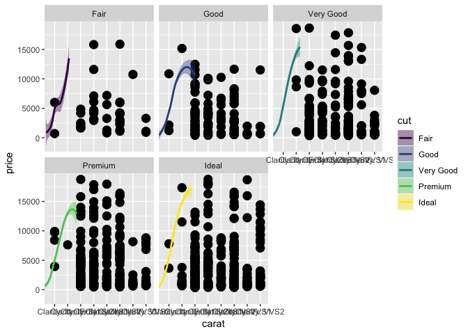

This is an [R Markdown](http://rmarkdown.rstudio.com) Notebook. When you execute code within the notebook, the results appear beneath the code. 

Try executing this chunk by clicking the *Run* button within the chunk or by placing your cursor inside it and pressing *Cmd+Shift+Enter*. 


```r
plot(cars)
```

<!-- -->

Add a new chunk by clicking the *Insert Chunk* button on the toolbar or by pressing *Cmd+Option+I*.

When you save the notebook, an HTML file containing the code and output will be saved alongside it (click the *Preview* button or press *Cmd+Shift+K* to preview the HTML file). 

The preview shows you a rendered HTML copy of the contents of the editor. Consequently, unlike *Knit*, *Preview* does not run any R code chunks. Instead, the output of the chunk when it was last run in the editor is displayed.

```r
library(ggplot2)

set.seed(100)
d <- diamonds[sample(nrow(diamonds), 1000), ]

p <- ggplot(data = d, aes(x = carat, y = price)) +
  geom_point(aes(paste("Clarity:", clarity)), size = 4) +
  geom_smooth(aes(colour = cut, fill = cut)) + facet_wrap(~ cut)
p
```

```
## `geom_smooth()` using method = 'loess' and formula 'y ~ x'
```

<!-- -->


```r
library(plotly)
```

```
## 
## Attaching package: 'plotly'
```

```
## The following object is masked from 'package:ggplot2':
## 
##     last_plot
```

```
## The following object is masked from 'package:stats':
## 
##     filter
```

```
## The following object is masked from 'package:graphics':
## 
##     layout
```

```r
a <- ggplotly(p)
```

```
## `geom_smooth()` using method = 'loess' and formula 'y ~ x'
```

```r
a
```

<!--html_preserve--><div id="htmlwidget-121c9fab5d2e067d98f4" style="width:672px;height:480px;" class="plotly html-widget"></div>
<script type="application/json" data-for="htmlwidget-121c9fab5d2e067d98f4">{"x":{"data":[{"x":[4,4,5,4,4,3,3,6,6,4,8,5,5,4,6,4,8,6,1,6,8,6,4,3,6,1,5,6,6,3,6,6,5,3,6,4,3,7,3,4],"y":[15827,4158,7186,7098,3105,2339,4849,1332,2368,11600,922,1280,810,4704,4229,4496,3288,6041,6002,2306,1089,1107,2930,4181,3033,701,5633,3992,4107,1642,15888,5950,3276,1697,2854,3136,1840,10752,2493,6108],"text":["paste(\"Clarity:\", clarity): Clarity: SI2<br />carat: Clarity: SI2<br />price: 15827","paste(\"Clarity:\", clarity): Clarity: SI2<br />carat: Clarity: SI2<br />price:  4158","paste(\"Clarity:\", clarity): Clarity: VS1<br />carat: Clarity: VS1<br />price:  7186","paste(\"Clarity:\", clarity): Clarity: SI2<br />carat: Clarity: SI2<br />price:  7098","paste(\"Clarity:\", clarity): Clarity: SI2<br />carat: Clarity: SI2<br />price:  3105","paste(\"Clarity:\", clarity): Clarity: SI1<br />carat: Clarity: SI1<br />price:  2339","paste(\"Clarity:\", clarity): Clarity: SI1<br />carat: Clarity: SI1<br />price:  4849","paste(\"Clarity:\", clarity): Clarity: VS2<br />carat: Clarity: VS2<br />price:  1332","paste(\"Clarity:\", clarity): Clarity: VS2<br />carat: Clarity: VS2<br />price:  2368","paste(\"Clarity:\", clarity): Clarity: SI2<br />carat: Clarity: SI2<br />price: 11600","paste(\"Clarity:\", clarity): Clarity: VVS2<br />carat: Clarity: VVS2<br />price:   922","paste(\"Clarity:\", clarity): Clarity: VS1<br />carat: Clarity: VS1<br />price:  1280","paste(\"Clarity:\", clarity): Clarity: VS1<br />carat: Clarity: VS1<br />price:   810","paste(\"Clarity:\", clarity): Clarity: SI2<br />carat: Clarity: SI2<br />price:  4704","paste(\"Clarity:\", clarity): Clarity: VS2<br />carat: Clarity: VS2<br />price:  4229","paste(\"Clarity:\", clarity): Clarity: SI2<br />carat: Clarity: SI2<br />price:  4496","paste(\"Clarity:\", clarity): Clarity: VVS2<br />carat: Clarity: VVS2<br />price:  3288","paste(\"Clarity:\", clarity): Clarity: VS2<br />carat: Clarity: VS2<br />price:  6041","paste(\"Clarity:\", clarity): Clarity: I1<br />carat: Clarity: I1<br />price:  6002","paste(\"Clarity:\", clarity): Clarity: VS2<br />carat: Clarity: VS2<br />price:  2306","paste(\"Clarity:\", clarity): Clarity: VVS2<br />carat: Clarity: VVS2<br />price:  1089","paste(\"Clarity:\", clarity): Clarity: VS2<br />carat: Clarity: VS2<br />price:  1107","paste(\"Clarity:\", clarity): Clarity: SI2<br />carat: Clarity: SI2<br />price:  2930","paste(\"Clarity:\", clarity): Clarity: SI1<br />carat: Clarity: SI1<br />price:  4181","paste(\"Clarity:\", clarity): Clarity: VS2<br />carat: Clarity: VS2<br />price:  3033","paste(\"Clarity:\", clarity): Clarity: I1<br />carat: Clarity: I1<br />price:   701","paste(\"Clarity:\", clarity): Clarity: VS1<br />carat: Clarity: VS1<br />price:  5633","paste(\"Clarity:\", clarity): Clarity: VS2<br />carat: Clarity: VS2<br />price:  3992","paste(\"Clarity:\", clarity): Clarity: VS2<br />carat: Clarity: VS2<br />price:  4107","paste(\"Clarity:\", clarity): Clarity: SI1<br />carat: Clarity: SI1<br />price:  1642","paste(\"Clarity:\", clarity): Clarity: VS2<br />carat: Clarity: VS2<br />price: 15888","paste(\"Clarity:\", clarity): Clarity: VS2<br />carat: Clarity: VS2<br />price:  5950","paste(\"Clarity:\", clarity): Clarity: VS1<br />carat: Clarity: VS1<br />price:  3276","paste(\"Clarity:\", clarity): Clarity: SI1<br />carat: Clarity: SI1<br />price:  1697","paste(\"Clarity:\", clarity): Clarity: VS2<br />carat: Clarity: VS2<br />price:  2854","paste(\"Clarity:\", clarity): Clarity: SI2<br />carat: Clarity: SI2<br />price:  3136","paste(\"Clarity:\", clarity): Clarity: SI1<br />carat: Clarity: SI1<br />price:  1840","paste(\"Clarity:\", clarity): Clarity: VVS1<br />carat: Clarity: VVS1<br />price: 10752","paste(\"Clarity:\", clarity): Clarity: SI1<br />carat: Clarity: SI1<br />price:  2493","paste(\"Clarity:\", clarity): Clarity: SI2<br />carat: Clarity: SI2<br />price:  6108"],"type":"scatter","mode":"markers","marker":{"autocolorscale":false,"color":"rgba(0,0,0,1)","opacity":1,"size":15.1181102362205,"symbol":"circle","line":{"width":1.88976377952756,"color":"rgba(0,0,0,1)"}},"hoveron":"points","showlegend":false,"xaxis":"x","yaxis":"y","hoverinfo":"text","frame":null},{"x":[3,4,6,5,4,4,5,3,8,4,7,5,4,5,8,5,6,6,3,2,6,4,8,7,6,4,4,4,3,3,4,3,3,3,8,6,6,6,3,3,3,3,3,3,4,4,8,6,4,8,6,6,3,3,6,3,3,5,3,6,6,3,3,3,6,3,4,6,3,3,6,1,6,7,4,4,4,5,5,6,3,1,6,6,4,6,5,1,4,3,3,5,6,7,3,3,5,5],"y":[10696,798,4093,10256,1060,4864,558,2974,11519,2382,801,6407,4052,807,1917,3471,3140,11640,3992,15164,6982,3470,684,638,603,2363,1935,3897,9069,739,7208,653,9193,1220,1895,8316,1333,5756,5927,7738,5825,11560,421,3880,2430,1816,1875,1294,4312,684,976,6389,1363,1605,5864,4692,2150,1846,1224,744,2699,4355,8580,2821,515,4312,9833,2633,2494,2035,2822,1210,8146,492,10084,4191,3991,6713,721,2599,722,2143,713,7476,408,2813,4129,10863,5787,3465,5821,5588,1715,1966,12467,1840,3163,2795],"text":["paste(\"Clarity:\", clarity): Clarity: SI1<br />carat: Clarity: SI1<br />price: 10696","paste(\"Clarity:\", clarity): Clarity: SI2<br />carat: Clarity: SI2<br />price:   798","paste(\"Clarity:\", clarity): Clarity: VS2<br />carat: Clarity: VS2<br />price:  4093","paste(\"Clarity:\", clarity): Clarity: VS1<br />carat: Clarity: VS1<br />price: 10256","paste(\"Clarity:\", clarity): Clarity: SI2<br />carat: Clarity: SI2<br />price:  1060","paste(\"Clarity:\", clarity): Clarity: SI2<br />carat: Clarity: SI2<br />price:  4864","paste(\"Clarity:\", clarity): Clarity: VS1<br />carat: Clarity: VS1<br />price:   558","paste(\"Clarity:\", clarity): Clarity: SI1<br />carat: Clarity: SI1<br />price:  2974","paste(\"Clarity:\", clarity): Clarity: VVS2<br />carat: Clarity: VVS2<br />price: 11519","paste(\"Clarity:\", clarity): Clarity: SI2<br />carat: Clarity: SI2<br />price:  2382","paste(\"Clarity:\", clarity): Clarity: VVS1<br />carat: Clarity: VVS1<br />price:   801","paste(\"Clarity:\", clarity): Clarity: VS1<br />carat: Clarity: VS1<br />price:  6407","paste(\"Clarity:\", clarity): Clarity: SI2<br />carat: Clarity: SI2<br />price:  4052","paste(\"Clarity:\", clarity): Clarity: VS1<br />carat: Clarity: VS1<br />price:   807","paste(\"Clarity:\", clarity): Clarity: VVS2<br />carat: Clarity: VVS2<br />price:  1917","paste(\"Clarity:\", clarity): Clarity: VS1<br />carat: Clarity: VS1<br />price:  3471","paste(\"Clarity:\", clarity): Clarity: VS2<br />carat: Clarity: VS2<br />price:  3140","paste(\"Clarity:\", clarity): Clarity: VS2<br />carat: Clarity: VS2<br />price: 11640","paste(\"Clarity:\", clarity): Clarity: SI1<br />carat: Clarity: SI1<br />price:  3992","paste(\"Clarity:\", clarity): Clarity: IF<br />carat: Clarity: IF<br />price: 15164","paste(\"Clarity:\", clarity): Clarity: VS2<br />carat: Clarity: VS2<br />price:  6982","paste(\"Clarity:\", clarity): Clarity: SI2<br />carat: Clarity: SI2<br />price:  3470","paste(\"Clarity:\", clarity): Clarity: VVS2<br />carat: Clarity: VVS2<br />price:   684","paste(\"Clarity:\", clarity): Clarity: VVS1<br />carat: Clarity: VVS1<br />price:   638","paste(\"Clarity:\", clarity): Clarity: VS2<br />carat: Clarity: VS2<br />price:   603","paste(\"Clarity:\", clarity): Clarity: SI2<br />carat: Clarity: SI2<br />price:  2363","paste(\"Clarity:\", clarity): Clarity: SI2<br />carat: Clarity: SI2<br />price:  1935","paste(\"Clarity:\", clarity): Clarity: SI2<br />carat: Clarity: SI2<br />price:  3897","paste(\"Clarity:\", clarity): Clarity: SI1<br />carat: Clarity: SI1<br />price:  9069","paste(\"Clarity:\", clarity): Clarity: SI1<br />carat: Clarity: SI1<br />price:   739","paste(\"Clarity:\", clarity): Clarity: SI2<br />carat: Clarity: SI2<br />price:  7208","paste(\"Clarity:\", clarity): Clarity: SI1<br />carat: Clarity: SI1<br />price:   653","paste(\"Clarity:\", clarity): Clarity: SI1<br />carat: Clarity: SI1<br />price:  9193","paste(\"Clarity:\", clarity): Clarity: SI1<br />carat: Clarity: SI1<br />price:  1220","paste(\"Clarity:\", clarity): Clarity: VVS2<br />carat: Clarity: VVS2<br />price:  1895","paste(\"Clarity:\", clarity): Clarity: VS2<br />carat: Clarity: VS2<br />price:  8316","paste(\"Clarity:\", clarity): Clarity: VS2<br />carat: Clarity: VS2<br />price:  1333","paste(\"Clarity:\", clarity): Clarity: VS2<br />carat: Clarity: VS2<br />price:  5756","paste(\"Clarity:\", clarity): Clarity: SI1<br />carat: Clarity: SI1<br />price:  5927","paste(\"Clarity:\", clarity): Clarity: SI1<br />carat: Clarity: SI1<br />price:  7738","paste(\"Clarity:\", clarity): Clarity: SI1<br />carat: Clarity: SI1<br />price:  5825","paste(\"Clarity:\", clarity): Clarity: SI1<br />carat: Clarity: SI1<br />price: 11560","paste(\"Clarity:\", clarity): Clarity: SI1<br />carat: Clarity: SI1<br />price:   421","paste(\"Clarity:\", clarity): Clarity: SI1<br />carat: Clarity: SI1<br />price:  3880","paste(\"Clarity:\", clarity): Clarity: SI2<br />carat: Clarity: SI2<br />price:  2430","paste(\"Clarity:\", clarity): Clarity: SI2<br />carat: Clarity: SI2<br />price:  1816","paste(\"Clarity:\", clarity): Clarity: VVS2<br />carat: Clarity: VVS2<br />price:  1875","paste(\"Clarity:\", clarity): Clarity: VS2<br />carat: Clarity: VS2<br />price:  1294","paste(\"Clarity:\", clarity): Clarity: SI2<br />carat: Clarity: SI2<br />price:  4312","paste(\"Clarity:\", clarity): Clarity: VVS2<br />carat: Clarity: VVS2<br />price:   684","paste(\"Clarity:\", clarity): Clarity: VS2<br />carat: Clarity: VS2<br />price:   976","paste(\"Clarity:\", clarity): Clarity: VS2<br />carat: Clarity: VS2<br />price:  6389","paste(\"Clarity:\", clarity): Clarity: SI1<br />carat: Clarity: SI1<br />price:  1363","paste(\"Clarity:\", clarity): Clarity: SI1<br />carat: Clarity: SI1<br />price:  1605","paste(\"Clarity:\", clarity): Clarity: VS2<br />carat: Clarity: VS2<br />price:  5864","paste(\"Clarity:\", clarity): Clarity: SI1<br />carat: Clarity: SI1<br />price:  4692","paste(\"Clarity:\", clarity): Clarity: SI1<br />carat: Clarity: SI1<br />price:  2150","paste(\"Clarity:\", clarity): Clarity: VS1<br />carat: Clarity: VS1<br />price:  1846","paste(\"Clarity:\", clarity): Clarity: SI1<br />carat: Clarity: SI1<br />price:  1224","paste(\"Clarity:\", clarity): Clarity: VS2<br />carat: Clarity: VS2<br />price:   744","paste(\"Clarity:\", clarity): Clarity: VS2<br />carat: Clarity: VS2<br />price:  2699","paste(\"Clarity:\", clarity): Clarity: SI1<br />carat: Clarity: SI1<br />price:  4355","paste(\"Clarity:\", clarity): Clarity: SI1<br />carat: Clarity: SI1<br />price:  8580","paste(\"Clarity:\", clarity): Clarity: SI1<br />carat: Clarity: SI1<br />price:  2821","paste(\"Clarity:\", clarity): Clarity: VS2<br />carat: Clarity: VS2<br />price:   515","paste(\"Clarity:\", clarity): Clarity: SI1<br />carat: Clarity: SI1<br />price:  4312","paste(\"Clarity:\", clarity): Clarity: SI2<br />carat: Clarity: SI2<br />price:  9833","paste(\"Clarity:\", clarity): Clarity: VS2<br />carat: Clarity: VS2<br />price:  2633","paste(\"Clarity:\", clarity): Clarity: SI1<br />carat: Clarity: SI1<br />price:  2494","paste(\"Clarity:\", clarity): Clarity: SI1<br />carat: Clarity: SI1<br />price:  2035","paste(\"Clarity:\", clarity): Clarity: VS2<br />carat: Clarity: VS2<br />price:  2822","paste(\"Clarity:\", clarity): Clarity: I1<br />carat: Clarity: I1<br />price:  1210","paste(\"Clarity:\", clarity): Clarity: VS2<br />carat: Clarity: VS2<br />price:  8146","paste(\"Clarity:\", clarity): Clarity: VVS1<br />carat: Clarity: VVS1<br />price:   492","paste(\"Clarity:\", clarity): Clarity: SI2<br />carat: Clarity: SI2<br />price: 10084","paste(\"Clarity:\", clarity): Clarity: SI2<br />carat: Clarity: SI2<br />price:  4191","paste(\"Clarity:\", clarity): Clarity: SI2<br />carat: Clarity: SI2<br />price:  3991","paste(\"Clarity:\", clarity): Clarity: VS1<br />carat: Clarity: VS1<br />price:  6713","paste(\"Clarity:\", clarity): Clarity: VS1<br />carat: Clarity: VS1<br />price:   721","paste(\"Clarity:\", clarity): Clarity: VS2<br />carat: Clarity: VS2<br />price:  2599","paste(\"Clarity:\", clarity): Clarity: SI1<br />carat: Clarity: SI1<br />price:   722","paste(\"Clarity:\", clarity): Clarity: I1<br />carat: Clarity: I1<br />price:  2143","paste(\"Clarity:\", clarity): Clarity: VS2<br />carat: Clarity: VS2<br />price:   713","paste(\"Clarity:\", clarity): Clarity: VS2<br />carat: Clarity: VS2<br />price:  7476","paste(\"Clarity:\", clarity): Clarity: SI2<br />carat: Clarity: SI2<br />price:   408","paste(\"Clarity:\", clarity): Clarity: VS2<br />carat: Clarity: VS2<br />price:  2813","paste(\"Clarity:\", clarity): Clarity: VS1<br />carat: Clarity: VS1<br />price:  4129","paste(\"Clarity:\", clarity): Clarity: I1<br />carat: Clarity: I1<br />price: 10863","paste(\"Clarity:\", clarity): Clarity: SI2<br />carat: Clarity: SI2<br />price:  5787","paste(\"Clarity:\", clarity): Clarity: SI1<br />carat: Clarity: SI1<br />price:  3465","paste(\"Clarity:\", clarity): Clarity: SI1<br />carat: Clarity: SI1<br />price:  5821","paste(\"Clarity:\", clarity): Clarity: VS1<br />carat: Clarity: VS1<br />price:  5588","paste(\"Clarity:\", clarity): Clarity: VS2<br />carat: Clarity: VS2<br />price:  1715","paste(\"Clarity:\", clarity): Clarity: VVS1<br />carat: Clarity: VVS1<br />price:  1966","paste(\"Clarity:\", clarity): Clarity: SI1<br />carat: Clarity: SI1<br />price: 12467","paste(\"Clarity:\", clarity): Clarity: SI1<br />carat: Clarity: SI1<br />price:  1840","paste(\"Clarity:\", clarity): Clarity: VS1<br />carat: Clarity: VS1<br />price:  3163","paste(\"Clarity:\", clarity): Clarity: VS1<br />carat: Clarity: VS1<br />price:  2795"],"type":"scatter","mode":"markers","marker":{"autocolorscale":false,"color":"rgba(0,0,0,1)","opacity":1,"size":15.1181102362205,"symbol":"circle","line":{"width":1.88976377952756,"color":"rgba(0,0,0,1)"}},"hoveron":"points","showlegend":false,"xaxis":"x2","yaxis":"y","hoverinfo":"text","frame":null},{"x":[3,5,7,6,6,8,8,8,8,8,3,3,7,3,3,4,6,5,3,7,5,6,3,3,4,8,4,4,4,5,4,6,6,6,5,5,6,6,4,2,3,3,6,4,8,4,3,6,3,5,4,4,8,7,6,6,4,7,6,3,7,4,6,7,8,6,5,7,5,6,6,7,4,5,6,3,4,3,8,3,6,6,3,8,3,5,3,7,3,6,5,3,3,3,4,6,8,3,4,6,6,3,5,5,3,6,6,3,6,5,8,6,5,6,3,5,5,6,4,7,4,6,8,6,4,6,7,8,6,7,6,6,8,3,6,3,3,6,8,3,3,3,6,2,3,4,5,3,6,3,2,6,6,3,3,8,4,4,7,5,8,7,8,3,3,4,6,4,8,5,6,6,5,4,7,6,3,6,6,8,3,8,6,6,3,7,8,8,6,8,3,6,5,2,5,3,7,7,3,6,6,5,3,6,6,5,8,3,4,3,6,3,3,3,6,4,3,4],"y":[6630,565,15334,8520,9586,925,8055,684,844,2656,526,4849,5588,5456,1746,1632,13102,453,754,8008,9178,579,3014,1237,2740,958,2493,2840,683,3603,2693,1755,1090,2036,17425,458,1665,1446,4465,1014,499,1580,13001,4704,620,11502,904,1574,1369,3488,1132,7888,465,1107,2337,6432,1234,485,6047,904,9139,4826,505,2042,2041,2873,544,878,883,889,1825,709,9781,647,2667,18630,9556,1079,752,2913,7826,2922,5430,3043,1068,2389,755,7861,9573,5353,1667,553,3724,2633,5052,576,2450,1408,9513,15675,17837,3986,1981,5557,1356,755,7176,5082,6540,9586,625,6956,2421,352,449,489,1410,1389,480,694,5280,2779,526,6632,633,13945,1080,575,2429,620,5294,1662,810,12224,1408,2592,1122,3567,907,4140,2346,2583,1647,18552,2039,3006,473,1777,3664,2147,8650,1351,793,694,6549,2400,7392,2104,779,5226,485,13312,759,6704,1232,4327,1597,4154,3799,11584,2068,1445,7333,523,7507,827,1006,2928,463,613,9895,1078,1065,5766,2333,1979,1075,664,1337,2302,489,1072,14433,9820,640,353,1111,808,9278,835,13818,544,1400,655,1080,810,505,1944,2042,4315,6593,4594,1106,2579,5940,1154,1399,5362],"text":["paste(\"Clarity:\", clarity): Clarity: SI1<br />carat: Clarity: SI1<br />price:  6630","paste(\"Clarity:\", clarity): Clarity: VS1<br />carat: Clarity: VS1<br />price:   565","paste(\"Clarity:\", clarity): Clarity: VVS1<br />carat: Clarity: VVS1<br />price: 15334","paste(\"Clarity:\", clarity): Clarity: VS2<br />carat: Clarity: VS2<br />price:  8520","paste(\"Clarity:\", clarity): Clarity: VS2<br />carat: Clarity: VS2<br />price:  9586","paste(\"Clarity:\", clarity): Clarity: VVS2<br />carat: Clarity: VVS2<br />price:   925","paste(\"Clarity:\", clarity): Clarity: VVS2<br />carat: Clarity: VVS2<br />price:  8055","paste(\"Clarity:\", clarity): Clarity: VVS2<br />carat: Clarity: VVS2<br />price:   684","paste(\"Clarity:\", clarity): Clarity: VVS2<br />carat: Clarity: VVS2<br />price:   844","paste(\"Clarity:\", clarity): Clarity: VVS2<br />carat: Clarity: VVS2<br />price:  2656","paste(\"Clarity:\", clarity): Clarity: SI1<br />carat: Clarity: SI1<br />price:   526","paste(\"Clarity:\", clarity): Clarity: SI1<br />carat: Clarity: SI1<br />price:  4849","paste(\"Clarity:\", clarity): Clarity: VVS1<br />carat: Clarity: VVS1<br />price:  5588","paste(\"Clarity:\", clarity): Clarity: SI1<br />carat: Clarity: SI1<br />price:  5456","paste(\"Clarity:\", clarity): Clarity: SI1<br />carat: Clarity: SI1<br />price:  1746","paste(\"Clarity:\", clarity): Clarity: SI2<br />carat: Clarity: SI2<br />price:  1632","paste(\"Clarity:\", clarity): Clarity: VS2<br />carat: Clarity: VS2<br />price: 13102","paste(\"Clarity:\", clarity): Clarity: VS1<br />carat: Clarity: VS1<br />price:   453","paste(\"Clarity:\", clarity): Clarity: SI1<br />carat: Clarity: SI1<br />price:   754","paste(\"Clarity:\", clarity): Clarity: VVS1<br />carat: Clarity: VVS1<br />price:  8008","paste(\"Clarity:\", clarity): Clarity: VS1<br />carat: Clarity: VS1<br />price:  9178","paste(\"Clarity:\", clarity): Clarity: VS2<br />carat: Clarity: VS2<br />price:   579","paste(\"Clarity:\", clarity): Clarity: SI1<br />carat: Clarity: SI1<br />price:  3014","paste(\"Clarity:\", clarity): Clarity: SI1<br />carat: Clarity: SI1<br />price:  1237","paste(\"Clarity:\", clarity): Clarity: SI2<br />carat: Clarity: SI2<br />price:  2740","paste(\"Clarity:\", clarity): Clarity: VVS2<br />carat: Clarity: VVS2<br />price:   958","paste(\"Clarity:\", clarity): Clarity: SI2<br />carat: Clarity: SI2<br />price:  2493","paste(\"Clarity:\", clarity): Clarity: SI2<br />carat: Clarity: SI2<br />price:  2840","paste(\"Clarity:\", clarity): Clarity: SI2<br />carat: Clarity: SI2<br />price:   683","paste(\"Clarity:\", clarity): Clarity: VS1<br />carat: Clarity: VS1<br />price:  3603","paste(\"Clarity:\", clarity): Clarity: SI2<br />carat: Clarity: SI2<br />price:  2693","paste(\"Clarity:\", clarity): Clarity: VS2<br />carat: Clarity: VS2<br />price:  1755","paste(\"Clarity:\", clarity): Clarity: VS2<br />carat: Clarity: VS2<br />price:  1090","paste(\"Clarity:\", clarity): Clarity: VS2<br />carat: Clarity: VS2<br />price:  2036","paste(\"Clarity:\", clarity): Clarity: VS1<br />carat: Clarity: VS1<br />price: 17425","paste(\"Clarity:\", clarity): Clarity: VS1<br />carat: Clarity: VS1<br />price:   458","paste(\"Clarity:\", clarity): Clarity: VS2<br />carat: Clarity: VS2<br />price:  1665","paste(\"Clarity:\", clarity): Clarity: VS2<br />carat: Clarity: VS2<br />price:  1446","paste(\"Clarity:\", clarity): Clarity: SI2<br />carat: Clarity: SI2<br />price:  4465","paste(\"Clarity:\", clarity): Clarity: IF<br />carat: Clarity: IF<br />price:  1014","paste(\"Clarity:\", clarity): Clarity: SI1<br />carat: Clarity: SI1<br />price:   499","paste(\"Clarity:\", clarity): Clarity: SI1<br />carat: Clarity: SI1<br />price:  1580","paste(\"Clarity:\", clarity): Clarity: VS2<br />carat: Clarity: VS2<br />price: 13001","paste(\"Clarity:\", clarity): Clarity: SI2<br />carat: Clarity: SI2<br />price:  4704","paste(\"Clarity:\", clarity): Clarity: VVS2<br />carat: Clarity: VVS2<br />price:   620","paste(\"Clarity:\", clarity): Clarity: SI2<br />carat: Clarity: SI2<br />price: 11502","paste(\"Clarity:\", clarity): Clarity: SI1<br />carat: Clarity: SI1<br />price:   904","paste(\"Clarity:\", clarity): Clarity: VS2<br />carat: Clarity: VS2<br />price:  1574","paste(\"Clarity:\", clarity): Clarity: SI1<br />carat: Clarity: SI1<br />price:  1369","paste(\"Clarity:\", clarity): Clarity: VS1<br />carat: Clarity: VS1<br />price:  3488","paste(\"Clarity:\", clarity): Clarity: SI2<br />carat: Clarity: SI2<br />price:  1132","paste(\"Clarity:\", clarity): Clarity: SI2<br />carat: Clarity: SI2<br />price:  7888","paste(\"Clarity:\", clarity): Clarity: VVS2<br />carat: Clarity: VVS2<br />price:   465","paste(\"Clarity:\", clarity): Clarity: VVS1<br />carat: Clarity: VVS1<br />price:  1107","paste(\"Clarity:\", clarity): Clarity: VS2<br />carat: Clarity: VS2<br />price:  2337","paste(\"Clarity:\", clarity): Clarity: VS2<br />carat: Clarity: VS2<br />price:  6432","paste(\"Clarity:\", clarity): Clarity: SI2<br />carat: Clarity: SI2<br />price:  1234","paste(\"Clarity:\", clarity): Clarity: VVS1<br />carat: Clarity: VVS1<br />price:   485","paste(\"Clarity:\", clarity): Clarity: VS2<br />carat: Clarity: VS2<br />price:  6047","paste(\"Clarity:\", clarity): Clarity: SI1<br />carat: Clarity: SI1<br />price:   904","paste(\"Clarity:\", clarity): Clarity: VVS1<br />carat: Clarity: VVS1<br />price:  9139","paste(\"Clarity:\", clarity): Clarity: SI2<br />carat: Clarity: SI2<br />price:  4826","paste(\"Clarity:\", clarity): Clarity: VS2<br />carat: Clarity: VS2<br />price:   505","paste(\"Clarity:\", clarity): Clarity: VVS1<br />carat: Clarity: VVS1<br />price:  2042","paste(\"Clarity:\", clarity): Clarity: VVS2<br />carat: Clarity: VVS2<br />price:  2041","paste(\"Clarity:\", clarity): Clarity: VS2<br />carat: Clarity: VS2<br />price:  2873","paste(\"Clarity:\", clarity): Clarity: VS1<br />carat: Clarity: VS1<br />price:   544","paste(\"Clarity:\", clarity): Clarity: VVS1<br />carat: Clarity: VVS1<br />price:   878","paste(\"Clarity:\", clarity): Clarity: VS1<br />carat: Clarity: VS1<br />price:   883","paste(\"Clarity:\", clarity): Clarity: VS2<br />carat: Clarity: VS2<br />price:   889","paste(\"Clarity:\", clarity): Clarity: VS2<br />carat: Clarity: VS2<br />price:  1825","paste(\"Clarity:\", clarity): Clarity: VVS1<br />carat: Clarity: VVS1<br />price:   709","paste(\"Clarity:\", clarity): Clarity: SI2<br />carat: Clarity: SI2<br />price:  9781","paste(\"Clarity:\", clarity): Clarity: VS1<br />carat: Clarity: VS1<br />price:   647","paste(\"Clarity:\", clarity): Clarity: VS2<br />carat: Clarity: VS2<br />price:  2667","paste(\"Clarity:\", clarity): Clarity: SI1<br />carat: Clarity: SI1<br />price: 18630","paste(\"Clarity:\", clarity): Clarity: SI2<br />carat: Clarity: SI2<br />price:  9556","paste(\"Clarity:\", clarity): Clarity: SI1<br />carat: Clarity: SI1<br />price:  1079","paste(\"Clarity:\", clarity): Clarity: VVS2<br />carat: Clarity: VVS2<br />price:   752","paste(\"Clarity:\", clarity): Clarity: SI1<br />carat: Clarity: SI1<br />price:  2913","paste(\"Clarity:\", clarity): Clarity: VS2<br />carat: Clarity: VS2<br />price:  7826","paste(\"Clarity:\", clarity): Clarity: VS2<br />carat: Clarity: VS2<br />price:  2922","paste(\"Clarity:\", clarity): Clarity: SI1<br />carat: Clarity: SI1<br />price:  5430","paste(\"Clarity:\", clarity): Clarity: VVS2<br />carat: Clarity: VVS2<br />price:  3043","paste(\"Clarity:\", clarity): Clarity: SI1<br />carat: Clarity: SI1<br />price:  1068","paste(\"Clarity:\", clarity): Clarity: VS1<br />carat: Clarity: VS1<br />price:  2389","paste(\"Clarity:\", clarity): Clarity: SI1<br />carat: Clarity: SI1<br />price:   755","paste(\"Clarity:\", clarity): Clarity: VVS1<br />carat: Clarity: VVS1<br />price:  7861","paste(\"Clarity:\", clarity): Clarity: SI1<br />carat: Clarity: SI1<br />price:  9573","paste(\"Clarity:\", clarity): Clarity: VS2<br />carat: Clarity: VS2<br />price:  5353","paste(\"Clarity:\", clarity): Clarity: VS1<br />carat: Clarity: VS1<br />price:  1667","paste(\"Clarity:\", clarity): Clarity: SI1<br />carat: Clarity: SI1<br />price:   553","paste(\"Clarity:\", clarity): Clarity: SI1<br />carat: Clarity: SI1<br />price:  3724","paste(\"Clarity:\", clarity): Clarity: SI1<br />carat: Clarity: SI1<br />price:  2633","paste(\"Clarity:\", clarity): Clarity: SI2<br />carat: Clarity: SI2<br />price:  5052","paste(\"Clarity:\", clarity): Clarity: VS2<br />carat: Clarity: VS2<br />price:   576","paste(\"Clarity:\", clarity): Clarity: VVS2<br />carat: Clarity: VVS2<br />price:  2450","paste(\"Clarity:\", clarity): Clarity: SI1<br />carat: Clarity: SI1<br />price:  1408","paste(\"Clarity:\", clarity): Clarity: SI2<br />carat: Clarity: SI2<br />price:  9513","paste(\"Clarity:\", clarity): Clarity: VS2<br />carat: Clarity: VS2<br />price: 15675","paste(\"Clarity:\", clarity): Clarity: VS2<br />carat: Clarity: VS2<br />price: 17837","paste(\"Clarity:\", clarity): Clarity: SI1<br />carat: Clarity: SI1<br />price:  3986","paste(\"Clarity:\", clarity): Clarity: VS1<br />carat: Clarity: VS1<br />price:  1981","paste(\"Clarity:\", clarity): Clarity: VS1<br />carat: Clarity: VS1<br />price:  5557","paste(\"Clarity:\", clarity): Clarity: SI1<br />carat: Clarity: SI1<br />price:  1356","paste(\"Clarity:\", clarity): Clarity: VS2<br />carat: Clarity: VS2<br />price:   755","paste(\"Clarity:\", clarity): Clarity: VS2<br />carat: Clarity: VS2<br />price:  7176","paste(\"Clarity:\", clarity): Clarity: SI1<br />carat: Clarity: SI1<br />price:  5082","paste(\"Clarity:\", clarity): Clarity: VS2<br />carat: Clarity: VS2<br />price:  6540","paste(\"Clarity:\", clarity): Clarity: VS1<br />carat: Clarity: VS1<br />price:  9586","paste(\"Clarity:\", clarity): Clarity: VVS2<br />carat: Clarity: VVS2<br />price:   625","paste(\"Clarity:\", clarity): Clarity: VS2<br />carat: Clarity: VS2<br />price:  6956","paste(\"Clarity:\", clarity): Clarity: VS1<br />carat: Clarity: VS1<br />price:  2421","paste(\"Clarity:\", clarity): Clarity: VS2<br />carat: Clarity: VS2<br />price:   352","paste(\"Clarity:\", clarity): Clarity: SI1<br />carat: Clarity: SI1<br />price:   449","paste(\"Clarity:\", clarity): Clarity: VS1<br />carat: Clarity: VS1<br />price:   489","paste(\"Clarity:\", clarity): Clarity: VS1<br />carat: Clarity: VS1<br />price:  1410","paste(\"Clarity:\", clarity): Clarity: VS2<br />carat: Clarity: VS2<br />price:  1389","paste(\"Clarity:\", clarity): Clarity: SI2<br />carat: Clarity: SI2<br />price:   480","paste(\"Clarity:\", clarity): Clarity: VVS1<br />carat: Clarity: VVS1<br />price:   694","paste(\"Clarity:\", clarity): Clarity: SI2<br />carat: Clarity: SI2<br />price:  5280","paste(\"Clarity:\", clarity): Clarity: VS2<br />carat: Clarity: VS2<br />price:  2779","paste(\"Clarity:\", clarity): Clarity: VVS2<br />carat: Clarity: VVS2<br />price:   526","paste(\"Clarity:\", clarity): Clarity: VS2<br />carat: Clarity: VS2<br />price:  6632","paste(\"Clarity:\", clarity): Clarity: SI2<br />carat: Clarity: SI2<br />price:   633","paste(\"Clarity:\", clarity): Clarity: VS2<br />carat: Clarity: VS2<br />price: 13945","paste(\"Clarity:\", clarity): Clarity: VVS1<br />carat: Clarity: VVS1<br />price:  1080","paste(\"Clarity:\", clarity): Clarity: VVS2<br />carat: Clarity: VVS2<br />price:   575","paste(\"Clarity:\", clarity): Clarity: VS2<br />carat: Clarity: VS2<br />price:  2429","paste(\"Clarity:\", clarity): Clarity: VVS1<br />carat: Clarity: VVS1<br />price:   620","paste(\"Clarity:\", clarity): Clarity: VS2<br />carat: Clarity: VS2<br />price:  5294","paste(\"Clarity:\", clarity): Clarity: VS2<br />carat: Clarity: VS2<br />price:  1662","paste(\"Clarity:\", clarity): Clarity: VVS2<br />carat: Clarity: VVS2<br />price:   810","paste(\"Clarity:\", clarity): Clarity: SI1<br />carat: Clarity: SI1<br />price: 12224","paste(\"Clarity:\", clarity): Clarity: VS2<br />carat: Clarity: VS2<br />price:  1408","paste(\"Clarity:\", clarity): Clarity: SI1<br />carat: Clarity: SI1<br />price:  2592","paste(\"Clarity:\", clarity): Clarity: SI1<br />carat: Clarity: SI1<br />price:  1122","paste(\"Clarity:\", clarity): Clarity: VS2<br />carat: Clarity: VS2<br />price:  3567","paste(\"Clarity:\", clarity): Clarity: VVS2<br />carat: Clarity: VVS2<br />price:   907","paste(\"Clarity:\", clarity): Clarity: SI1<br />carat: Clarity: SI1<br />price:  4140","paste(\"Clarity:\", clarity): Clarity: SI1<br />carat: Clarity: SI1<br />price:  2346","paste(\"Clarity:\", clarity): Clarity: SI1<br />carat: Clarity: SI1<br />price:  2583","paste(\"Clarity:\", clarity): Clarity: VS2<br />carat: Clarity: VS2<br />price:  1647","paste(\"Clarity:\", clarity): Clarity: IF<br />carat: Clarity: IF<br />price: 18552","paste(\"Clarity:\", clarity): Clarity: SI1<br />carat: Clarity: SI1<br />price:  2039","paste(\"Clarity:\", clarity): Clarity: SI2<br />carat: Clarity: SI2<br />price:  3006","paste(\"Clarity:\", clarity): Clarity: VS1<br />carat: Clarity: VS1<br />price:   473","paste(\"Clarity:\", clarity): Clarity: SI1<br />carat: Clarity: SI1<br />price:  1777","paste(\"Clarity:\", clarity): Clarity: VS2<br />carat: Clarity: VS2<br />price:  3664","paste(\"Clarity:\", clarity): Clarity: SI1<br />carat: Clarity: SI1<br />price:  2147","paste(\"Clarity:\", clarity): Clarity: IF<br />carat: Clarity: IF<br />price:  8650","paste(\"Clarity:\", clarity): Clarity: VS2<br />carat: Clarity: VS2<br />price:  1351","paste(\"Clarity:\", clarity): Clarity: VS2<br />carat: Clarity: VS2<br />price:   793","paste(\"Clarity:\", clarity): Clarity: SI1<br />carat: Clarity: SI1<br />price:   694","paste(\"Clarity:\", clarity): Clarity: SI1<br />carat: Clarity: SI1<br />price:  6549","paste(\"Clarity:\", clarity): Clarity: VVS2<br />carat: Clarity: VVS2<br />price:  2400","paste(\"Clarity:\", clarity): Clarity: SI2<br />carat: Clarity: SI2<br />price:  7392","paste(\"Clarity:\", clarity): Clarity: SI2<br />carat: Clarity: SI2<br />price:  2104","paste(\"Clarity:\", clarity): Clarity: VVS1<br />carat: Clarity: VVS1<br />price:   779","paste(\"Clarity:\", clarity): Clarity: VS1<br />carat: Clarity: VS1<br />price:  5226","paste(\"Clarity:\", clarity): Clarity: VVS2<br />carat: Clarity: VVS2<br />price:   485","paste(\"Clarity:\", clarity): Clarity: VVS1<br />carat: Clarity: VVS1<br />price: 13312","paste(\"Clarity:\", clarity): Clarity: VVS2<br />carat: Clarity: VVS2<br />price:   759","paste(\"Clarity:\", clarity): Clarity: SI1<br />carat: Clarity: SI1<br />price:  6704","paste(\"Clarity:\", clarity): Clarity: SI1<br />carat: Clarity: SI1<br />price:  1232","paste(\"Clarity:\", clarity): Clarity: SI2<br />carat: Clarity: SI2<br />price:  4327","paste(\"Clarity:\", clarity): Clarity: VS2<br />carat: Clarity: VS2<br />price:  1597","paste(\"Clarity:\", clarity): Clarity: SI2<br />carat: Clarity: SI2<br />price:  4154","paste(\"Clarity:\", clarity): Clarity: VVS2<br />carat: Clarity: VVS2<br />price:  3799","paste(\"Clarity:\", clarity): Clarity: VS1<br />carat: Clarity: VS1<br />price: 11584","paste(\"Clarity:\", clarity): Clarity: VS2<br />carat: Clarity: VS2<br />price:  2068","paste(\"Clarity:\", clarity): Clarity: VS2<br />carat: Clarity: VS2<br />price:  1445","paste(\"Clarity:\", clarity): Clarity: VS1<br />carat: Clarity: VS1<br />price:  7333","paste(\"Clarity:\", clarity): Clarity: SI2<br />carat: Clarity: SI2<br />price:   523","paste(\"Clarity:\", clarity): Clarity: VVS1<br />carat: Clarity: VVS1<br />price:  7507","paste(\"Clarity:\", clarity): Clarity: VS2<br />carat: Clarity: VS2<br />price:   827","paste(\"Clarity:\", clarity): Clarity: SI1<br />carat: Clarity: SI1<br />price:  1006","paste(\"Clarity:\", clarity): Clarity: VS2<br />carat: Clarity: VS2<br />price:  2928","paste(\"Clarity:\", clarity): Clarity: VS2<br />carat: Clarity: VS2<br />price:   463","paste(\"Clarity:\", clarity): Clarity: VVS2<br />carat: Clarity: VVS2<br />price:   613","paste(\"Clarity:\", clarity): Clarity: SI1<br />carat: Clarity: SI1<br />price:  9895","paste(\"Clarity:\", clarity): Clarity: VVS2<br />carat: Clarity: VVS2<br />price:  1078","paste(\"Clarity:\", clarity): Clarity: VS2<br />carat: Clarity: VS2<br />price:  1065","paste(\"Clarity:\", clarity): Clarity: VS2<br />carat: Clarity: VS2<br />price:  5766","paste(\"Clarity:\", clarity): Clarity: SI1<br />carat: Clarity: SI1<br />price:  2333","paste(\"Clarity:\", clarity): Clarity: VVS1<br />carat: Clarity: VVS1<br />price:  1979","paste(\"Clarity:\", clarity): Clarity: VVS2<br />carat: Clarity: VVS2<br />price:  1075","paste(\"Clarity:\", clarity): Clarity: VVS2<br />carat: Clarity: VVS2<br />price:   664","paste(\"Clarity:\", clarity): Clarity: VS2<br />carat: Clarity: VS2<br />price:  1337","paste(\"Clarity:\", clarity): Clarity: VVS2<br />carat: Clarity: VVS2<br />price:  2302","paste(\"Clarity:\", clarity): Clarity: SI1<br />carat: Clarity: SI1<br />price:   489","paste(\"Clarity:\", clarity): Clarity: VS2<br />carat: Clarity: VS2<br />price:  1072","paste(\"Clarity:\", clarity): Clarity: VS1<br />carat: Clarity: VS1<br />price: 14433","paste(\"Clarity:\", clarity): Clarity: IF<br />carat: Clarity: IF<br />price:  9820","paste(\"Clarity:\", clarity): Clarity: VS1<br />carat: Clarity: VS1<br />price:   640","paste(\"Clarity:\", clarity): Clarity: SI1<br />carat: Clarity: SI1<br />price:   353","paste(\"Clarity:\", clarity): Clarity: VVS1<br />carat: Clarity: VVS1<br />price:  1111","paste(\"Clarity:\", clarity): Clarity: VVS1<br />carat: Clarity: VVS1<br />price:   808","paste(\"Clarity:\", clarity): Clarity: SI1<br />carat: Clarity: SI1<br />price:  9278","paste(\"Clarity:\", clarity): Clarity: VS2<br />carat: Clarity: VS2<br />price:   835","paste(\"Clarity:\", clarity): Clarity: VS2<br />carat: Clarity: VS2<br />price: 13818","paste(\"Clarity:\", clarity): Clarity: VS1<br />carat: Clarity: VS1<br />price:   544","paste(\"Clarity:\", clarity): Clarity: SI1<br />carat: Clarity: SI1<br />price:  1400","paste(\"Clarity:\", clarity): Clarity: VS2<br />carat: Clarity: VS2<br />price:   655","paste(\"Clarity:\", clarity): Clarity: VS2<br />carat: Clarity: VS2<br />price:  1080","paste(\"Clarity:\", clarity): Clarity: VS1<br />carat: Clarity: VS1<br />price:   810","paste(\"Clarity:\", clarity): Clarity: VVS2<br />carat: Clarity: VVS2<br />price:   505","paste(\"Clarity:\", clarity): Clarity: SI1<br />carat: Clarity: SI1<br />price:  1944","paste(\"Clarity:\", clarity): Clarity: SI2<br />carat: Clarity: SI2<br />price:  2042","paste(\"Clarity:\", clarity): Clarity: SI1<br />carat: Clarity: SI1<br />price:  4315","paste(\"Clarity:\", clarity): Clarity: VS2<br />carat: Clarity: VS2<br />price:  6593","paste(\"Clarity:\", clarity): Clarity: SI1<br />carat: Clarity: SI1<br />price:  4594","paste(\"Clarity:\", clarity): Clarity: SI1<br />carat: Clarity: SI1<br />price:  1106","paste(\"Clarity:\", clarity): Clarity: SI1<br />carat: Clarity: SI1<br />price:  2579","paste(\"Clarity:\", clarity): Clarity: VS2<br />carat: Clarity: VS2<br />price:  5940","paste(\"Clarity:\", clarity): Clarity: SI2<br />carat: Clarity: SI2<br />price:  1154","paste(\"Clarity:\", clarity): Clarity: SI1<br />carat: Clarity: SI1<br />price:  1399","paste(\"Clarity:\", clarity): Clarity: SI2<br />carat: Clarity: SI2<br />price:  5362"],"type":"scatter","mode":"markers","marker":{"autocolorscale":false,"color":"rgba(0,0,0,1)","opacity":1,"size":15.1181102362205,"symbol":"circle","line":{"width":1.88976377952756,"color":"rgba(0,0,0,1)"}},"hoveron":"points","showlegend":false,"xaxis":"x3","yaxis":"y","hoverinfo":"text","frame":null},{"x":[4,3,6,3,4,3,4,8,8,6,4,4,5,6,5,3,6,3,3,8,6,4,5,3,3,3,3,6,4,4,3,3,6,4,6,6,4,4,4,3,3,5,5,6,3,3,4,5,4,4,8,1,3,8,5,8,3,3,4,5,4,8,4,5,5,5,4,4,6,7,3,4,6,8,4,3,3,8,6,5,4,3,4,6,6,6,6,3,5,3,1,3,6,6,6,6,3,4,5,3,5,4,6,6,3,7,3,8,6,6,8,3,8,6,3,6,5,6,5,5,3,6,6,1,3,7,3,6,5,3,3,6,4,4,6,6,3,4,7,4,3,3,5,6,4,5,6,4,7,5,5,6,4,4,3,6,7,7,5,3,4,4,4,6,5,5,6,6,4,4,6,6,6,5,3,3,4,7,3,8,3,6,5,6,4,2,5,8,4,3,3,4,3,3,5,4,5,3,6,3,1,3,4,3,8,5,7,8,4,6,3,4,3,3,8,4,4,6,8,3,3,4,3,8,6,6,6,5,6,4,3,5,3,6,5,4,6,3,3,3,3,6,3,3,3,4,6],"y":[13912,1443,702,1132,6031,2201,4654,776,878,2405,12140,8001,1079,6471,1079,4980,12308,8102,739,1415,2443,9494,2999,3841,5338,756,13367,932,4078,2167,4232,4525,14833,4456,7056,6220,1036,540,477,3911,2415,608,8416,7541,5078,12851,3084,734,5841,6387,706,8419,1668,827,9541,8810,2311,5087,1028,6479,2364,6843,4170,7351,1996,1143,5723,4974,1107,905,15801,12631,16390,816,17014,4578,5433,8602,4958,506,855,13256,2564,700,6425,9055,8877,4229,5773,992,9905,4816,2443,6363,5988,1662,855,4395,17936,4817,2326,3388,6468,723,18735,1241,803,2012,844,1694,8003,9017,7592,2633,772,5322,12529,15908,844,746,2777,2623,4958,3942,5058,1636,780,471,6989,2730,4916,9301,1982,1015,1781,5699,900,537,1080,2354,13995,810,2203,2369,4372,603,4321,867,620,1209,10245,6838,4061,13867,6851,15987,936,8154,1832,9926,13199,4022,2815,872,1035,1010,2578,6471,4278,1579,7553,11815,7244,14447,5925,2777,1890,956,3780,2999,830,911,5980,6169,523,7621,5549,684,6048,3312,5197,3175,4316,4354,1715,2927,4303,571,1041,1698,9727,1912,10055,12492,740,4579,2513,1010,3861,10662,647,14948,1610,5640,1013,5671,2169,5346,963,4435,552,855,1443,3084,5395,3199,720,15109,1580,1013,641,596,4740,990,1624,6342,6048,1728,1340,2020,631,9471,675,6566,624,17841,1546],"text":["paste(\"Clarity:\", clarity): Clarity: SI2<br />carat: Clarity: SI2<br />price: 13912","paste(\"Clarity:\", clarity): Clarity: SI1<br />carat: Clarity: SI1<br />price:  1443","paste(\"Clarity:\", clarity): Clarity: VS2<br />carat: Clarity: VS2<br />price:   702","paste(\"Clarity:\", clarity): Clarity: SI1<br />carat: Clarity: SI1<br />price:  1132","paste(\"Clarity:\", clarity): Clarity: SI2<br />carat: Clarity: SI2<br />price:  6031","paste(\"Clarity:\", clarity): Clarity: SI1<br />carat: Clarity: SI1<br />price:  2201","paste(\"Clarity:\", clarity): Clarity: SI2<br />carat: Clarity: SI2<br />price:  4654","paste(\"Clarity:\", clarity): Clarity: VVS2<br />carat: Clarity: VVS2<br />price:   776","paste(\"Clarity:\", clarity): Clarity: VVS2<br />carat: Clarity: VVS2<br />price:   878","paste(\"Clarity:\", clarity): Clarity: VS2<br />carat: Clarity: VS2<br />price:  2405","paste(\"Clarity:\", clarity): Clarity: SI2<br />carat: Clarity: SI2<br />price: 12140","paste(\"Clarity:\", clarity): Clarity: SI2<br />carat: Clarity: SI2<br />price:  8001","paste(\"Clarity:\", clarity): Clarity: VS1<br />carat: Clarity: VS1<br />price:  1079","paste(\"Clarity:\", clarity): Clarity: VS2<br />carat: Clarity: VS2<br />price:  6471","paste(\"Clarity:\", clarity): Clarity: VS1<br />carat: Clarity: VS1<br />price:  1079","paste(\"Clarity:\", clarity): Clarity: SI1<br />carat: Clarity: SI1<br />price:  4980","paste(\"Clarity:\", clarity): Clarity: VS2<br />carat: Clarity: VS2<br />price: 12308","paste(\"Clarity:\", clarity): Clarity: SI1<br />carat: Clarity: SI1<br />price:  8102","paste(\"Clarity:\", clarity): Clarity: SI1<br />carat: Clarity: SI1<br />price:   739","paste(\"Clarity:\", clarity): Clarity: VVS2<br />carat: Clarity: VVS2<br />price:  1415","paste(\"Clarity:\", clarity): Clarity: VS2<br />carat: Clarity: VS2<br />price:  2443","paste(\"Clarity:\", clarity): Clarity: SI2<br />carat: Clarity: SI2<br />price:  9494","paste(\"Clarity:\", clarity): Clarity: VS1<br />carat: Clarity: VS1<br />price:  2999","paste(\"Clarity:\", clarity): Clarity: SI1<br />carat: Clarity: SI1<br />price:  3841","paste(\"Clarity:\", clarity): Clarity: SI1<br />carat: Clarity: SI1<br />price:  5338","paste(\"Clarity:\", clarity): Clarity: SI1<br />carat: Clarity: SI1<br />price:   756","paste(\"Clarity:\", clarity): Clarity: SI1<br />carat: Clarity: SI1<br />price: 13367","paste(\"Clarity:\", clarity): Clarity: VS2<br />carat: Clarity: VS2<br />price:   932","paste(\"Clarity:\", clarity): Clarity: SI2<br />carat: Clarity: SI2<br />price:  4078","paste(\"Clarity:\", clarity): Clarity: SI2<br />carat: Clarity: SI2<br />price:  2167","paste(\"Clarity:\", clarity): Clarity: SI1<br />carat: Clarity: SI1<br />price:  4232","paste(\"Clarity:\", clarity): Clarity: SI1<br />carat: Clarity: SI1<br />price:  4525","paste(\"Clarity:\", clarity): Clarity: VS2<br />carat: Clarity: VS2<br />price: 14833","paste(\"Clarity:\", clarity): Clarity: SI2<br />carat: Clarity: SI2<br />price:  4456","paste(\"Clarity:\", clarity): Clarity: VS2<br />carat: Clarity: VS2<br />price:  7056","paste(\"Clarity:\", clarity): Clarity: VS2<br />carat: Clarity: VS2<br />price:  6220","paste(\"Clarity:\", clarity): Clarity: SI2<br />carat: Clarity: SI2<br />price:  1036","paste(\"Clarity:\", clarity): Clarity: SI2<br />carat: Clarity: SI2<br />price:   540","paste(\"Clarity:\", clarity): Clarity: SI2<br />carat: Clarity: SI2<br />price:   477","paste(\"Clarity:\", clarity): Clarity: SI1<br />carat: Clarity: SI1<br />price:  3911","paste(\"Clarity:\", clarity): Clarity: SI1<br />carat: Clarity: SI1<br />price:  2415","paste(\"Clarity:\", clarity): Clarity: VS1<br />carat: Clarity: VS1<br />price:   608","paste(\"Clarity:\", clarity): Clarity: VS1<br />carat: Clarity: VS1<br />price:  8416","paste(\"Clarity:\", clarity): Clarity: VS2<br />carat: Clarity: VS2<br />price:  7541","paste(\"Clarity:\", clarity): Clarity: SI1<br />carat: Clarity: SI1<br />price:  5078","paste(\"Clarity:\", clarity): Clarity: SI1<br />carat: Clarity: SI1<br />price: 12851","paste(\"Clarity:\", clarity): Clarity: SI2<br />carat: Clarity: SI2<br />price:  3084","paste(\"Clarity:\", clarity): Clarity: VS1<br />carat: Clarity: VS1<br />price:   734","paste(\"Clarity:\", clarity): Clarity: SI2<br />carat: Clarity: SI2<br />price:  5841","paste(\"Clarity:\", clarity): Clarity: SI2<br />carat: Clarity: SI2<br />price:  6387","paste(\"Clarity:\", clarity): Clarity: VVS2<br />carat: Clarity: VVS2<br />price:   706","paste(\"Clarity:\", clarity): Clarity: I1<br />carat: Clarity: I1<br />price:  8419","paste(\"Clarity:\", clarity): Clarity: SI1<br />carat: Clarity: SI1<br />price:  1668","paste(\"Clarity:\", clarity): Clarity: VVS2<br />carat: Clarity: VVS2<br />price:   827","paste(\"Clarity:\", clarity): Clarity: VS1<br />carat: Clarity: VS1<br />price:  9541","paste(\"Clarity:\", clarity): Clarity: VVS2<br />carat: Clarity: VVS2<br />price:  8810","paste(\"Clarity:\", clarity): Clarity: SI1<br />carat: Clarity: SI1<br />price:  2311","paste(\"Clarity:\", clarity): Clarity: SI1<br />carat: Clarity: SI1<br />price:  5087","paste(\"Clarity:\", clarity): Clarity: SI2<br />carat: Clarity: SI2<br />price:  1028","paste(\"Clarity:\", clarity): Clarity: VS1<br />carat: Clarity: VS1<br />price:  6479","paste(\"Clarity:\", clarity): Clarity: SI2<br />carat: Clarity: SI2<br />price:  2364","paste(\"Clarity:\", clarity): Clarity: VVS2<br />carat: Clarity: VVS2<br />price:  6843","paste(\"Clarity:\", clarity): Clarity: SI2<br />carat: Clarity: SI2<br />price:  4170","paste(\"Clarity:\", clarity): Clarity: VS1<br />carat: Clarity: VS1<br />price:  7351","paste(\"Clarity:\", clarity): Clarity: VS1<br />carat: Clarity: VS1<br />price:  1996","paste(\"Clarity:\", clarity): Clarity: VS1<br />carat: Clarity: VS1<br />price:  1143","paste(\"Clarity:\", clarity): Clarity: SI2<br />carat: Clarity: SI2<br />price:  5723","paste(\"Clarity:\", clarity): Clarity: SI2<br />carat: Clarity: SI2<br />price:  4974","paste(\"Clarity:\", clarity): Clarity: VS2<br />carat: Clarity: VS2<br />price:  1107","paste(\"Clarity:\", clarity): Clarity: VVS1<br />carat: Clarity: VVS1<br />price:   905","paste(\"Clarity:\", clarity): Clarity: SI1<br />carat: Clarity: SI1<br />price: 15801","paste(\"Clarity:\", clarity): Clarity: SI2<br />carat: Clarity: SI2<br />price: 12631","paste(\"Clarity:\", clarity): Clarity: VS2<br />carat: Clarity: VS2<br />price: 16390","paste(\"Clarity:\", clarity): Clarity: VVS2<br />carat: Clarity: VVS2<br />price:   816","paste(\"Clarity:\", clarity): Clarity: SI2<br />carat: Clarity: SI2<br />price: 17014","paste(\"Clarity:\", clarity): Clarity: SI1<br />carat: Clarity: SI1<br />price:  4578","paste(\"Clarity:\", clarity): Clarity: SI1<br />carat: Clarity: SI1<br />price:  5433","paste(\"Clarity:\", clarity): Clarity: VVS2<br />carat: Clarity: VVS2<br />price:  8602","paste(\"Clarity:\", clarity): Clarity: VS2<br />carat: Clarity: VS2<br />price:  4958","paste(\"Clarity:\", clarity): Clarity: VS1<br />carat: Clarity: VS1<br />price:   506","paste(\"Clarity:\", clarity): Clarity: SI2<br />carat: Clarity: SI2<br />price:   855","paste(\"Clarity:\", clarity): Clarity: SI1<br />carat: Clarity: SI1<br />price: 13256","paste(\"Clarity:\", clarity): Clarity: SI2<br />carat: Clarity: SI2<br />price:  2564","paste(\"Clarity:\", clarity): Clarity: VS2<br />carat: Clarity: VS2<br />price:   700","paste(\"Clarity:\", clarity): Clarity: VS2<br />carat: Clarity: VS2<br />price:  6425","paste(\"Clarity:\", clarity): Clarity: VS2<br />carat: Clarity: VS2<br />price:  9055","paste(\"Clarity:\", clarity): Clarity: VS2<br />carat: Clarity: VS2<br />price:  8877","paste(\"Clarity:\", clarity): Clarity: SI1<br />carat: Clarity: SI1<br />price:  4229","paste(\"Clarity:\", clarity): Clarity: VS1<br />carat: Clarity: VS1<br />price:  5773","paste(\"Clarity:\", clarity): Clarity: SI1<br />carat: Clarity: SI1<br />price:   992","paste(\"Clarity:\", clarity): Clarity: I1<br />carat: Clarity: I1<br />price:  9905","paste(\"Clarity:\", clarity): Clarity: SI1<br />carat: Clarity: SI1<br />price:  4816","paste(\"Clarity:\", clarity): Clarity: VS2<br />carat: Clarity: VS2<br />price:  2443","paste(\"Clarity:\", clarity): Clarity: VS2<br />carat: Clarity: VS2<br />price:  6363","paste(\"Clarity:\", clarity): Clarity: VS2<br />carat: Clarity: VS2<br />price:  5988","paste(\"Clarity:\", clarity): Clarity: VS2<br />carat: Clarity: VS2<br />price:  1662","paste(\"Clarity:\", clarity): Clarity: SI1<br />carat: Clarity: SI1<br />price:   855","paste(\"Clarity:\", clarity): Clarity: SI2<br />carat: Clarity: SI2<br />price:  4395","paste(\"Clarity:\", clarity): Clarity: VS1<br />carat: Clarity: VS1<br />price: 17936","paste(\"Clarity:\", clarity): Clarity: SI1<br />carat: Clarity: SI1<br />price:  4817","paste(\"Clarity:\", clarity): Clarity: VS1<br />carat: Clarity: VS1<br />price:  2326","paste(\"Clarity:\", clarity): Clarity: SI2<br />carat: Clarity: SI2<br />price:  3388","paste(\"Clarity:\", clarity): Clarity: VS2<br />carat: Clarity: VS2<br />price:  6468","paste(\"Clarity:\", clarity): Clarity: VS2<br />carat: Clarity: VS2<br />price:   723","paste(\"Clarity:\", clarity): Clarity: SI1<br />carat: Clarity: SI1<br />price: 18735","paste(\"Clarity:\", clarity): Clarity: VVS1<br />carat: Clarity: VVS1<br />price:  1241","paste(\"Clarity:\", clarity): Clarity: SI1<br />carat: Clarity: SI1<br />price:   803","paste(\"Clarity:\", clarity): Clarity: VVS2<br />carat: Clarity: VVS2<br />price:  2012","paste(\"Clarity:\", clarity): Clarity: VS2<br />carat: Clarity: VS2<br />price:   844","paste(\"Clarity:\", clarity): Clarity: VS2<br />carat: Clarity: VS2<br />price:  1694","paste(\"Clarity:\", clarity): Clarity: VVS2<br />carat: Clarity: VVS2<br />price:  8003","paste(\"Clarity:\", clarity): Clarity: SI1<br />carat: Clarity: SI1<br />price:  9017","paste(\"Clarity:\", clarity): Clarity: VVS2<br />carat: Clarity: VVS2<br />price:  7592","paste(\"Clarity:\", clarity): Clarity: VS2<br />carat: Clarity: VS2<br />price:  2633","paste(\"Clarity:\", clarity): Clarity: SI1<br />carat: Clarity: SI1<br />price:   772","paste(\"Clarity:\", clarity): Clarity: VS2<br />carat: Clarity: VS2<br />price:  5322","paste(\"Clarity:\", clarity): Clarity: VS1<br />carat: Clarity: VS1<br />price: 12529","paste(\"Clarity:\", clarity): Clarity: VS2<br />carat: Clarity: VS2<br />price: 15908","paste(\"Clarity:\", clarity): Clarity: VS1<br />carat: Clarity: VS1<br />price:   844","paste(\"Clarity:\", clarity): Clarity: VS1<br />carat: Clarity: VS1<br />price:   746","paste(\"Clarity:\", clarity): Clarity: SI1<br />carat: Clarity: SI1<br />price:  2777","paste(\"Clarity:\", clarity): Clarity: VS2<br />carat: Clarity: VS2<br />price:  2623","paste(\"Clarity:\", clarity): Clarity: VS2<br />carat: Clarity: VS2<br />price:  4958","paste(\"Clarity:\", clarity): Clarity: I1<br />carat: Clarity: I1<br />price:  3942","paste(\"Clarity:\", clarity): Clarity: SI1<br />carat: Clarity: SI1<br />price:  5058","paste(\"Clarity:\", clarity): Clarity: VVS1<br />carat: Clarity: VVS1<br />price:  1636","paste(\"Clarity:\", clarity): Clarity: SI1<br />carat: Clarity: SI1<br />price:   780","paste(\"Clarity:\", clarity): Clarity: VS2<br />carat: Clarity: VS2<br />price:   471","paste(\"Clarity:\", clarity): Clarity: VS1<br />carat: Clarity: VS1<br />price:  6989","paste(\"Clarity:\", clarity): Clarity: SI1<br />carat: Clarity: SI1<br />price:  2730","paste(\"Clarity:\", clarity): Clarity: SI1<br />carat: Clarity: SI1<br />price:  4916","paste(\"Clarity:\", clarity): Clarity: VS2<br />carat: Clarity: VS2<br />price:  9301","paste(\"Clarity:\", clarity): Clarity: SI2<br />carat: Clarity: SI2<br />price:  1982","paste(\"Clarity:\", clarity): Clarity: SI2<br />carat: Clarity: SI2<br />price:  1015","paste(\"Clarity:\", clarity): Clarity: VS2<br />carat: Clarity: VS2<br />price:  1781","paste(\"Clarity:\", clarity): Clarity: VS2<br />carat: Clarity: VS2<br />price:  5699","paste(\"Clarity:\", clarity): Clarity: SI1<br />carat: Clarity: SI1<br />price:   900","paste(\"Clarity:\", clarity): Clarity: SI2<br />carat: Clarity: SI2<br />price:   537","paste(\"Clarity:\", clarity): Clarity: VVS1<br />carat: Clarity: VVS1<br />price:  1080","paste(\"Clarity:\", clarity): Clarity: SI2<br />carat: Clarity: SI2<br />price:  2354","paste(\"Clarity:\", clarity): Clarity: SI1<br />carat: Clarity: SI1<br />price: 13995","paste(\"Clarity:\", clarity): Clarity: SI1<br />carat: Clarity: SI1<br />price:   810","paste(\"Clarity:\", clarity): Clarity: VS1<br />carat: Clarity: VS1<br />price:  2203","paste(\"Clarity:\", clarity): Clarity: VS2<br />carat: Clarity: VS2<br />price:  2369","paste(\"Clarity:\", clarity): Clarity: SI2<br />carat: Clarity: SI2<br />price:  4372","paste(\"Clarity:\", clarity): Clarity: VS1<br />carat: Clarity: VS1<br />price:   603","paste(\"Clarity:\", clarity): Clarity: VS2<br />carat: Clarity: VS2<br />price:  4321","paste(\"Clarity:\", clarity): Clarity: SI2<br />carat: Clarity: SI2<br />price:   867","paste(\"Clarity:\", clarity): Clarity: VVS1<br />carat: Clarity: VVS1<br />price:   620","paste(\"Clarity:\", clarity): Clarity: VS1<br />carat: Clarity: VS1<br />price:  1209","paste(\"Clarity:\", clarity): Clarity: VS1<br />carat: Clarity: VS1<br />price: 10245","paste(\"Clarity:\", clarity): Clarity: VS2<br />carat: Clarity: VS2<br />price:  6838","paste(\"Clarity:\", clarity): Clarity: SI2<br />carat: Clarity: SI2<br />price:  4061","paste(\"Clarity:\", clarity): Clarity: SI2<br />carat: Clarity: SI2<br />price: 13867","paste(\"Clarity:\", clarity): Clarity: SI1<br />carat: Clarity: SI1<br />price:  6851","paste(\"Clarity:\", clarity): Clarity: VS2<br />carat: Clarity: VS2<br />price: 15987","paste(\"Clarity:\", clarity): Clarity: VVS1<br />carat: Clarity: VVS1<br />price:   936","paste(\"Clarity:\", clarity): Clarity: VVS1<br />carat: Clarity: VVS1<br />price:  8154","paste(\"Clarity:\", clarity): Clarity: VS1<br />carat: Clarity: VS1<br />price:  1832","paste(\"Clarity:\", clarity): Clarity: SI1<br />carat: Clarity: SI1<br />price:  9926","paste(\"Clarity:\", clarity): Clarity: SI2<br />carat: Clarity: SI2<br />price: 13199","paste(\"Clarity:\", clarity): Clarity: SI2<br />carat: Clarity: SI2<br />price:  4022","paste(\"Clarity:\", clarity): Clarity: SI2<br />carat: Clarity: SI2<br />price:  2815","paste(\"Clarity:\", clarity): Clarity: VS2<br />carat: Clarity: VS2<br />price:   872","paste(\"Clarity:\", clarity): Clarity: VS1<br />carat: Clarity: VS1<br />price:  1035","paste(\"Clarity:\", clarity): Clarity: VS1<br />carat: Clarity: VS1<br />price:  1010","paste(\"Clarity:\", clarity): Clarity: VS2<br />carat: Clarity: VS2<br />price:  2578","paste(\"Clarity:\", clarity): Clarity: VS2<br />carat: Clarity: VS2<br />price:  6471","paste(\"Clarity:\", clarity): Clarity: SI2<br />carat: Clarity: SI2<br />price:  4278","paste(\"Clarity:\", clarity): Clarity: SI2<br />carat: Clarity: SI2<br />price:  1579","paste(\"Clarity:\", clarity): Clarity: VS2<br />carat: Clarity: VS2<br />price:  7553","paste(\"Clarity:\", clarity): Clarity: VS2<br />carat: Clarity: VS2<br />price: 11815","paste(\"Clarity:\", clarity): Clarity: VS2<br />carat: Clarity: VS2<br />price:  7244","paste(\"Clarity:\", clarity): Clarity: VS1<br />carat: Clarity: VS1<br />price: 14447","paste(\"Clarity:\", clarity): Clarity: SI1<br />carat: Clarity: SI1<br />price:  5925","paste(\"Clarity:\", clarity): Clarity: SI1<br />carat: Clarity: SI1<br />price:  2777","paste(\"Clarity:\", clarity): Clarity: SI2<br />carat: Clarity: SI2<br />price:  1890","paste(\"Clarity:\", clarity): Clarity: VVS1<br />carat: Clarity: VVS1<br />price:   956","paste(\"Clarity:\", clarity): Clarity: SI1<br />carat: Clarity: SI1<br />price:  3780","paste(\"Clarity:\", clarity): Clarity: VVS2<br />carat: Clarity: VVS2<br />price:  2999","paste(\"Clarity:\", clarity): Clarity: SI1<br />carat: Clarity: SI1<br />price:   830","paste(\"Clarity:\", clarity): Clarity: VS2<br />carat: Clarity: VS2<br />price:   911","paste(\"Clarity:\", clarity): Clarity: VS1<br />carat: Clarity: VS1<br />price:  5980","paste(\"Clarity:\", clarity): Clarity: VS2<br />carat: Clarity: VS2<br />price:  6169","paste(\"Clarity:\", clarity): Clarity: SI2<br />carat: Clarity: SI2<br />price:   523","paste(\"Clarity:\", clarity): Clarity: IF<br />carat: Clarity: IF<br />price:  7621","paste(\"Clarity:\", clarity): Clarity: VS1<br />carat: Clarity: VS1<br />price:  5549","paste(\"Clarity:\", clarity): Clarity: VVS2<br />carat: Clarity: VVS2<br />price:   684","paste(\"Clarity:\", clarity): Clarity: SI2<br />carat: Clarity: SI2<br />price:  6048","paste(\"Clarity:\", clarity): Clarity: SI1<br />carat: Clarity: SI1<br />price:  3312","paste(\"Clarity:\", clarity): Clarity: SI1<br />carat: Clarity: SI1<br />price:  5197","paste(\"Clarity:\", clarity): Clarity: SI2<br />carat: Clarity: SI2<br />price:  3175","paste(\"Clarity:\", clarity): Clarity: SI1<br />carat: Clarity: SI1<br />price:  4316","paste(\"Clarity:\", clarity): Clarity: SI1<br />carat: Clarity: SI1<br />price:  4354","paste(\"Clarity:\", clarity): Clarity: VS1<br />carat: Clarity: VS1<br />price:  1715","paste(\"Clarity:\", clarity): Clarity: SI2<br />carat: Clarity: SI2<br />price:  2927","paste(\"Clarity:\", clarity): Clarity: VS1<br />carat: Clarity: VS1<br />price:  4303","paste(\"Clarity:\", clarity): Clarity: SI1<br />carat: Clarity: SI1<br />price:   571","paste(\"Clarity:\", clarity): Clarity: VS2<br />carat: Clarity: VS2<br />price:  1041","paste(\"Clarity:\", clarity): Clarity: SI1<br />carat: Clarity: SI1<br />price:  1698","paste(\"Clarity:\", clarity): Clarity: I1<br />carat: Clarity: I1<br />price:  9727","paste(\"Clarity:\", clarity): Clarity: SI1<br />carat: Clarity: SI1<br />price:  1912","paste(\"Clarity:\", clarity): Clarity: SI2<br />carat: Clarity: SI2<br />price: 10055","paste(\"Clarity:\", clarity): Clarity: SI1<br />carat: Clarity: SI1<br />price: 12492","paste(\"Clarity:\", clarity): Clarity: VVS2<br />carat: Clarity: VVS2<br />price:   740","paste(\"Clarity:\", clarity): Clarity: VS1<br />carat: Clarity: VS1<br />price:  4579","paste(\"Clarity:\", clarity): Clarity: VVS1<br />carat: Clarity: VVS1<br />price:  2513","paste(\"Clarity:\", clarity): Clarity: VVS2<br />carat: Clarity: VVS2<br />price:  1010","paste(\"Clarity:\", clarity): Clarity: SI2<br />carat: Clarity: SI2<br />price:  3861","paste(\"Clarity:\", clarity): Clarity: VS2<br />carat: Clarity: VS2<br />price: 10662","paste(\"Clarity:\", clarity): Clarity: SI1<br />carat: Clarity: SI1<br />price:   647","paste(\"Clarity:\", clarity): Clarity: SI2<br />carat: Clarity: SI2<br />price: 14948","paste(\"Clarity:\", clarity): Clarity: SI1<br />carat: Clarity: SI1<br />price:  1610","paste(\"Clarity:\", clarity): Clarity: SI1<br />carat: Clarity: SI1<br />price:  5640","paste(\"Clarity:\", clarity): Clarity: VVS2<br />carat: Clarity: VVS2<br />price:  1013","paste(\"Clarity:\", clarity): Clarity: SI2<br />carat: Clarity: SI2<br />price:  5671","paste(\"Clarity:\", clarity): Clarity: SI2<br />carat: Clarity: SI2<br />price:  2169","paste(\"Clarity:\", clarity): Clarity: VS2<br />carat: Clarity: VS2<br />price:  5346","paste(\"Clarity:\", clarity): Clarity: VVS2<br />carat: Clarity: VVS2<br />price:   963","paste(\"Clarity:\", clarity): Clarity: SI1<br />carat: Clarity: SI1<br />price:  4435","paste(\"Clarity:\", clarity): Clarity: SI1<br />carat: Clarity: SI1<br />price:   552","paste(\"Clarity:\", clarity): Clarity: SI2<br />carat: Clarity: SI2<br />price:   855","paste(\"Clarity:\", clarity): Clarity: SI1<br />carat: Clarity: SI1<br />price:  1443","paste(\"Clarity:\", clarity): Clarity: VVS2<br />carat: Clarity: VVS2<br />price:  3084","paste(\"Clarity:\", clarity): Clarity: VS2<br />carat: Clarity: VS2<br />price:  5395","paste(\"Clarity:\", clarity): Clarity: VS2<br />carat: Clarity: VS2<br />price:  3199","paste(\"Clarity:\", clarity): Clarity: VS2<br />carat: Clarity: VS2<br />price:   720","paste(\"Clarity:\", clarity): Clarity: VS1<br />carat: Clarity: VS1<br />price: 15109","paste(\"Clarity:\", clarity): Clarity: VS2<br />carat: Clarity: VS2<br />price:  1580","paste(\"Clarity:\", clarity): Clarity: SI2<br />carat: Clarity: SI2<br />price:  1013","paste(\"Clarity:\", clarity): Clarity: SI1<br />carat: Clarity: SI1<br />price:   641","paste(\"Clarity:\", clarity): Clarity: VS1<br />carat: Clarity: VS1<br />price:   596","paste(\"Clarity:\", clarity): Clarity: SI1<br />carat: Clarity: SI1<br />price:  4740","paste(\"Clarity:\", clarity): Clarity: VS2<br />carat: Clarity: VS2<br />price:   990","paste(\"Clarity:\", clarity): Clarity: VS1<br />carat: Clarity: VS1<br />price:  1624","paste(\"Clarity:\", clarity): Clarity: SI2<br />carat: Clarity: SI2<br />price:  6342","paste(\"Clarity:\", clarity): Clarity: VS2<br />carat: Clarity: VS2<br />price:  6048","paste(\"Clarity:\", clarity): Clarity: SI1<br />carat: Clarity: SI1<br />price:  1728","paste(\"Clarity:\", clarity): Clarity: SI1<br />carat: Clarity: SI1<br />price:  1340","paste(\"Clarity:\", clarity): Clarity: SI1<br />carat: Clarity: SI1<br />price:  2020","paste(\"Clarity:\", clarity): Clarity: SI1<br />carat: Clarity: SI1<br />price:   631","paste(\"Clarity:\", clarity): Clarity: VS2<br />carat: Clarity: VS2<br />price:  9471","paste(\"Clarity:\", clarity): Clarity: SI1<br />carat: Clarity: SI1<br />price:   675","paste(\"Clarity:\", clarity): Clarity: SI1<br />carat: Clarity: SI1<br />price:  6566","paste(\"Clarity:\", clarity): Clarity: SI1<br />carat: Clarity: SI1<br />price:   624","paste(\"Clarity:\", clarity): Clarity: SI2<br />carat: Clarity: SI2<br />price: 17841","paste(\"Clarity:\", clarity): Clarity: VS2<br />carat: Clarity: VS2<br />price:  1546"],"type":"scatter","mode":"markers","marker":{"autocolorscale":false,"color":"rgba(0,0,0,1)","opacity":1,"size":15.1181102362205,"symbol":"circle","line":{"width":1.88976377952756,"color":"rgba(0,0,0,1)"}},"hoveron":"points","showlegend":false,"xaxis":"x","yaxis":"y2","hoverinfo":"text","frame":null},{"x":[3,3,4,7,8,6,6,3,6,7,4,7,3,7,5,6,4,8,2,5,6,3,6,4,7,3,6,6,8,4,5,3,3,4,6,8,6,4,6,5,3,8,8,8,4,8,8,3,5,6,5,2,4,7,3,3,8,7,8,6,7,1,4,6,6,3,6,6,6,3,5,3,3,5,6,3,8,6,4,3,8,6,2,3,6,6,4,5,7,5,3,6,6,4,7,7,5,7,5,2,6,2,7,6,8,6,6,8,2,6,1,6,7,4,7,3,5,6,5,8,2,3,6,6,6,5,3,3,6,3,8,7,3,3,3,5,8,7,8,3,4,3,3,3,8,5,3,6,4,8,4,6,4,6,6,2,6,3,3,5,6,3,3,6,3,6,3,6,5,3,8,8,8,2,3,4,6,7,4,7,8,2,5,4,4,6,6,6,2,3,8,3,5,5,3,5,5,6,6,7,4,6,3,5,6,6,5,3,5,5,7,6,6,6,2,6,5,6,5,8,6,2,3,5,6,6,6,6,6,3,6,3,8,3,8,6,6,4,7,6,6,8,4,3,8,6,3,6,4,8,6,3,4,5,4,6,5,4,3,8,8,4,4,5,6,4,2,8,3,6,3,4,6,6,8,6,8,3,8,4,5,5,2,5,8,3,5,4,3,6,4,8,5,8,6,5,3,5,3,3,3,8,4,2,7,3,6,6,4,5,7,7,3,7,3,4,8,4,4,5,2,5,6,3,3,5,5,6,6,6,6,3,6,6,4,4,8,3,6,6,5,4,5,2,3,6,8,4,5,6,5,5,3,6,6,8,5,2,8,6,3,2,8,7,3,5,4,6,6,5,8,6,6,8,2,5,3,6,6,2,3,3,2,8,3,6,7,6,2,3,8,7,4,5,6,6,5],"y":[5656,709,4544,838,1875,6076,1196,4919,8001,975,1020,687,4559,1235,1872,706,7693,2374,984,1916,1261,1607,16059,1270,530,4956,6612,7179,599,5964,598,788,596,13498,942,12841,12155,983,7113,743,2458,907,834,1243,3729,2125,2591,3107,602,2030,2025,652,3142,1000,1637,5361,2093,1656,9294,14182,764,7802,2386,707,16570,2872,14111,3159,844,3674,580,1065,3170,1452,1306,2903,988,734,3697,1742,10454,765,886,4089,1641,2657,4880,4039,789,1304,2062,6855,1834,10698,607,789,899,3537,8442,992,908,1018,3363,6048,8509,1662,1678,816,1318,6944,3665,2358,1107,935,1069,4543,936,7453,8648,721,943,4465,4172,854,7147,6499,1163,707,1689,2326,816,15968,2499,783,2308,8303,791,1207,661,2642,631,1286,2731,5751,684,753,11525,587,14502,1125,4541,857,4479,5317,1041,946,1163,13171,4916,5765,1591,363,9317,878,7145,2265,8770,723,647,1027,647,8020,11415,1368,481,4371,605,2145,2393,1004,839,1114,2132,16290,3090,1882,4458,1690,871,7761,895,5337,1079,918,1057,2075,8796,8251,493,2720,2637,3613,3253,3281,2650,7930,8422,7109,3863,8299,1211,449,2974,14844,11511,421,1065,900,825,2353,942,1580,414,3750,12100,1743,1676,863,1819,1705,1656,1368,2519,715,14429,9060,1746,18124,730,1087,466,10568,1340,5496,938,7564,885,807,1100,2158,6648,3738,596,745,4101,2010,470,6277,1782,9334,3007,4969,8580,6630,1909,4209,921,7091,5274,1243,3933,4796,776,3122,1071,1963,11530,1101,633,4897,2032,8133,921,1980,10129,5407,3306,876,475,613,522,963,1928,13661,7179,2039,945,8774,2821,1019,2777,731,3588,3774,3625,1789,942,15819,898,771,2015,1179,499,12230,475,408,1914,18756,5405,8678,985,775,523,6557,12616,6918,1965,1604,3172,1811,3217,3075,4043,495,17989,876,1304,7423,1919,7900,631,439,790,1276,447,1729,642,12883,3136,1767,3478,5766,773,489,1721,3191,1890,17329,1163,1919,560,873,625,559,6180,1448,17801,14199,706,645,707,400,7220,2242,2383,2526,3167,1038,2442,891,1728,1611,2352,646,5714,1727,945,765,863,5586,2587,18682,449,1656,579,1651,2930],"text":["paste(\"Clarity:\", clarity): Clarity: SI1<br />carat: Clarity: SI1<br />price:  5656","paste(\"Clarity:\", clarity): Clarity: SI1<br />carat: Clarity: SI1<br />price:   709","paste(\"Clarity:\", clarity): Clarity: SI2<br />carat: Clarity: SI2<br />price:  4544","paste(\"Clarity:\", clarity): Clarity: VVS1<br />carat: Clarity: VVS1<br />price:   838","paste(\"Clarity:\", clarity): Clarity: VVS2<br />carat: Clarity: VVS2<br />price:  1875","paste(\"Clarity:\", clarity): Clarity: VS2<br />carat: Clarity: VS2<br />price:  6076","paste(\"Clarity:\", clarity): Clarity: VS2<br />carat: Clarity: VS2<br />price:  1196","paste(\"Clarity:\", clarity): Clarity: SI1<br />carat: Clarity: SI1<br />price:  4919","paste(\"Clarity:\", clarity): Clarity: VS2<br />carat: Clarity: VS2<br />price:  8001","paste(\"Clarity:\", clarity): Clarity: VVS1<br />carat: Clarity: VVS1<br />price:   975","paste(\"Clarity:\", clarity): Clarity: SI2<br />carat: Clarity: SI2<br />price:  1020","paste(\"Clarity:\", clarity): Clarity: VVS1<br />carat: Clarity: VVS1<br />price:   687","paste(\"Clarity:\", clarity): Clarity: SI1<br />carat: Clarity: SI1<br />price:  4559","paste(\"Clarity:\", clarity): Clarity: VVS1<br />carat: Clarity: VVS1<br />price:  1235","paste(\"Clarity:\", clarity): Clarity: VS1<br />carat: Clarity: VS1<br />price:  1872","paste(\"Clarity:\", clarity): Clarity: VS2<br />carat: Clarity: VS2<br />price:   706","paste(\"Clarity:\", clarity): Clarity: SI2<br />carat: Clarity: SI2<br />price:  7693","paste(\"Clarity:\", clarity): Clarity: VVS2<br />carat: Clarity: VVS2<br />price:  2374","paste(\"Clarity:\", clarity): Clarity: IF<br />carat: Clarity: IF<br />price:   984","paste(\"Clarity:\", clarity): Clarity: VS1<br />carat: Clarity: VS1<br />price:  1916","paste(\"Clarity:\", clarity): Clarity: VS2<br />carat: Clarity: VS2<br />price:  1261","paste(\"Clarity:\", clarity): Clarity: SI1<br />carat: Clarity: SI1<br />price:  1607","paste(\"Clarity:\", clarity): Clarity: VS2<br />carat: Clarity: VS2<br />price: 16059","paste(\"Clarity:\", clarity): Clarity: SI2<br />carat: Clarity: SI2<br />price:  1270","paste(\"Clarity:\", clarity): Clarity: VVS1<br />carat: Clarity: VVS1<br />price:   530","paste(\"Clarity:\", clarity): Clarity: SI1<br />carat: Clarity: SI1<br />price:  4956","paste(\"Clarity:\", clarity): Clarity: VS2<br />carat: Clarity: VS2<br />price:  6612","paste(\"Clarity:\", clarity): Clarity: VS2<br />carat: Clarity: VS2<br />price:  7179","paste(\"Clarity:\", clarity): Clarity: VVS2<br />carat: Clarity: VVS2<br />price:   599","paste(\"Clarity:\", clarity): Clarity: SI2<br />carat: Clarity: SI2<br />price:  5964","paste(\"Clarity:\", clarity): Clarity: VS1<br />carat: Clarity: VS1<br />price:   598","paste(\"Clarity:\", clarity): Clarity: SI1<br />carat: Clarity: SI1<br />price:   788","paste(\"Clarity:\", clarity): Clarity: SI1<br />carat: Clarity: SI1<br />price:   596","paste(\"Clarity:\", clarity): Clarity: SI2<br />carat: Clarity: SI2<br />price: 13498","paste(\"Clarity:\", clarity): Clarity: VS2<br />carat: Clarity: VS2<br />price:   942","paste(\"Clarity:\", clarity): Clarity: VVS2<br />carat: Clarity: VVS2<br />price: 12841","paste(\"Clarity:\", clarity): Clarity: VS2<br />carat: Clarity: VS2<br />price: 12155","paste(\"Clarity:\", clarity): Clarity: SI2<br />carat: Clarity: SI2<br />price:   983","paste(\"Clarity:\", clarity): Clarity: VS2<br />carat: Clarity: VS2<br />price:  7113","paste(\"Clarity:\", clarity): Clarity: VS1<br />carat: Clarity: VS1<br />price:   743","paste(\"Clarity:\", clarity): Clarity: SI1<br />carat: Clarity: SI1<br />price:  2458","paste(\"Clarity:\", clarity): Clarity: VVS2<br />carat: Clarity: VVS2<br />price:   907","paste(\"Clarity:\", clarity): Clarity: VVS2<br />carat: Clarity: VVS2<br />price:   834","paste(\"Clarity:\", clarity): Clarity: VVS2<br />carat: Clarity: VVS2<br />price:  1243","paste(\"Clarity:\", clarity): Clarity: SI2<br />carat: Clarity: SI2<br />price:  3729","paste(\"Clarity:\", clarity): Clarity: VVS2<br />carat: Clarity: VVS2<br />price:  2125","paste(\"Clarity:\", clarity): Clarity: VVS2<br />carat: Clarity: VVS2<br />price:  2591","paste(\"Clarity:\", clarity): Clarity: SI1<br />carat: Clarity: SI1<br />price:  3107","paste(\"Clarity:\", clarity): Clarity: VS1<br />carat: Clarity: VS1<br />price:   602","paste(\"Clarity:\", clarity): Clarity: VS2<br />carat: Clarity: VS2<br />price:  2030","paste(\"Clarity:\", clarity): Clarity: VS1<br />carat: Clarity: VS1<br />price:  2025","paste(\"Clarity:\", clarity): Clarity: IF<br />carat: Clarity: IF<br />price:   652","paste(\"Clarity:\", clarity): Clarity: SI2<br />carat: Clarity: SI2<br />price:  3142","paste(\"Clarity:\", clarity): Clarity: VVS1<br />carat: Clarity: VVS1<br />price:  1000","paste(\"Clarity:\", clarity): Clarity: SI1<br />carat: Clarity: SI1<br />price:  1637","paste(\"Clarity:\", clarity): Clarity: SI1<br />carat: Clarity: SI1<br />price:  5361","paste(\"Clarity:\", clarity): Clarity: VVS2<br />carat: Clarity: VVS2<br />price:  2093","paste(\"Clarity:\", clarity): Clarity: VVS1<br />carat: Clarity: VVS1<br />price:  1656","paste(\"Clarity:\", clarity): Clarity: VVS2<br />carat: Clarity: VVS2<br />price:  9294","paste(\"Clarity:\", clarity): Clarity: VS2<br />carat: Clarity: VS2<br />price: 14182","paste(\"Clarity:\", clarity): Clarity: VVS1<br />carat: Clarity: VVS1<br />price:   764","paste(\"Clarity:\", clarity): Clarity: I1<br />carat: Clarity: I1<br />price:  7802","paste(\"Clarity:\", clarity): Clarity: SI2<br />carat: Clarity: SI2<br />price:  2386","paste(\"Clarity:\", clarity): Clarity: VS2<br />carat: Clarity: VS2<br />price:   707","paste(\"Clarity:\", clarity): Clarity: VS2<br />carat: Clarity: VS2<br />price: 16570","paste(\"Clarity:\", clarity): Clarity: SI1<br />carat: Clarity: SI1<br />price:  2872","paste(\"Clarity:\", clarity): Clarity: VS2<br />carat: Clarity: VS2<br />price: 14111","paste(\"Clarity:\", clarity): Clarity: VS2<br />carat: Clarity: VS2<br />price:  3159","paste(\"Clarity:\", clarity): Clarity: VS2<br />carat: Clarity: VS2<br />price:   844","paste(\"Clarity:\", clarity): Clarity: SI1<br />carat: Clarity: SI1<br />price:  3674","paste(\"Clarity:\", clarity): Clarity: VS1<br />carat: Clarity: VS1<br />price:   580","paste(\"Clarity:\", clarity): Clarity: SI1<br />carat: Clarity: SI1<br />price:  1065","paste(\"Clarity:\", clarity): Clarity: SI1<br />carat: Clarity: SI1<br />price:  3170","paste(\"Clarity:\", clarity): Clarity: VS1<br />carat: Clarity: VS1<br />price:  1452","paste(\"Clarity:\", clarity): Clarity: VS2<br />carat: Clarity: VS2<br />price:  1306","paste(\"Clarity:\", clarity): Clarity: SI1<br />carat: Clarity: SI1<br />price:  2903","paste(\"Clarity:\", clarity): Clarity: VVS2<br />carat: Clarity: VVS2<br />price:   988","paste(\"Clarity:\", clarity): Clarity: VS2<br />carat: Clarity: VS2<br />price:   734","paste(\"Clarity:\", clarity): Clarity: SI2<br />carat: Clarity: SI2<br />price:  3697","paste(\"Clarity:\", clarity): Clarity: SI1<br />carat: Clarity: SI1<br />price:  1742","paste(\"Clarity:\", clarity): Clarity: VVS2<br />carat: Clarity: VVS2<br />price: 10454","paste(\"Clarity:\", clarity): Clarity: VS2<br />carat: Clarity: VS2<br />price:   765","paste(\"Clarity:\", clarity): Clarity: IF<br />carat: Clarity: IF<br />price:   886","paste(\"Clarity:\", clarity): Clarity: SI1<br />carat: Clarity: SI1<br />price:  4089","paste(\"Clarity:\", clarity): Clarity: VS2<br />carat: Clarity: VS2<br />price:  1641","paste(\"Clarity:\", clarity): Clarity: VS2<br />carat: Clarity: VS2<br />price:  2657","paste(\"Clarity:\", clarity): Clarity: SI2<br />carat: Clarity: SI2<br />price:  4880","paste(\"Clarity:\", clarity): Clarity: VS1<br />carat: Clarity: VS1<br />price:  4039","paste(\"Clarity:\", clarity): Clarity: VVS1<br />carat: Clarity: VVS1<br />price:   789","paste(\"Clarity:\", clarity): Clarity: VS1<br />carat: Clarity: VS1<br />price:  1304","paste(\"Clarity:\", clarity): Clarity: SI1<br />carat: Clarity: SI1<br />price:  2062","paste(\"Clarity:\", clarity): Clarity: VS2<br />carat: Clarity: VS2<br />price:  6855","paste(\"Clarity:\", clarity): Clarity: VS2<br />carat: Clarity: VS2<br />price:  1834","paste(\"Clarity:\", clarity): Clarity: SI2<br />carat: Clarity: SI2<br />price: 10698","paste(\"Clarity:\", clarity): Clarity: VVS1<br />carat: Clarity: VVS1<br />price:   607","paste(\"Clarity:\", clarity): Clarity: VVS1<br />carat: Clarity: VVS1<br />price:   789","paste(\"Clarity:\", clarity): Clarity: VS1<br />carat: Clarity: VS1<br />price:   899","paste(\"Clarity:\", clarity): Clarity: VVS1<br />carat: Clarity: VVS1<br />price:  3537","paste(\"Clarity:\", clarity): Clarity: VS1<br />carat: Clarity: VS1<br />price:  8442","paste(\"Clarity:\", clarity): Clarity: IF<br />carat: Clarity: IF<br />price:   992","paste(\"Clarity:\", clarity): Clarity: VS2<br />carat: Clarity: VS2<br />price:   908","paste(\"Clarity:\", clarity): Clarity: IF<br />carat: Clarity: IF<br />price:  1018","paste(\"Clarity:\", clarity): Clarity: VVS1<br />carat: Clarity: VVS1<br />price:  3363","paste(\"Clarity:\", clarity): Clarity: VS2<br />carat: Clarity: VS2<br />price:  6048","paste(\"Clarity:\", clarity): Clarity: VVS2<br />carat: Clarity: VVS2<br />price:  8509","paste(\"Clarity:\", clarity): Clarity: VS2<br />carat: Clarity: VS2<br />price:  1662","paste(\"Clarity:\", clarity): Clarity: VS2<br />carat: Clarity: VS2<br />price:  1678","paste(\"Clarity:\", clarity): Clarity: VVS2<br />carat: Clarity: VVS2<br />price:   816","paste(\"Clarity:\", clarity): Clarity: IF<br />carat: Clarity: IF<br />price:  1318","paste(\"Clarity:\", clarity): Clarity: VS2<br />carat: Clarity: VS2<br />price:  6944","paste(\"Clarity:\", clarity): Clarity: I1<br />carat: Clarity: I1<br />price:  3665","paste(\"Clarity:\", clarity): Clarity: VS2<br />carat: Clarity: VS2<br />price:  2358","paste(\"Clarity:\", clarity): Clarity: VVS1<br />carat: Clarity: VVS1<br />price:  1107","paste(\"Clarity:\", clarity): Clarity: SI2<br />carat: Clarity: SI2<br />price:   935","paste(\"Clarity:\", clarity): Clarity: VVS1<br />carat: Clarity: VVS1<br />price:  1069","paste(\"Clarity:\", clarity): Clarity: SI1<br />carat: Clarity: SI1<br />price:  4543","paste(\"Clarity:\", clarity): Clarity: VS1<br />carat: Clarity: VS1<br />price:   936","paste(\"Clarity:\", clarity): Clarity: VS2<br />carat: Clarity: VS2<br />price:  7453","paste(\"Clarity:\", clarity): Clarity: VS1<br />carat: Clarity: VS1<br />price:  8648","paste(\"Clarity:\", clarity): Clarity: VVS2<br />carat: Clarity: VVS2<br />price:   721","paste(\"Clarity:\", clarity): Clarity: IF<br />carat: Clarity: IF<br />price:   943","paste(\"Clarity:\", clarity): Clarity: SI1<br />carat: Clarity: SI1<br />price:  4465","paste(\"Clarity:\", clarity): Clarity: VS2<br />carat: Clarity: VS2<br />price:  4172","paste(\"Clarity:\", clarity): Clarity: VS2<br />carat: Clarity: VS2<br />price:   854","paste(\"Clarity:\", clarity): Clarity: VS2<br />carat: Clarity: VS2<br />price:  7147","paste(\"Clarity:\", clarity): Clarity: VS1<br />carat: Clarity: VS1<br />price:  6499","paste(\"Clarity:\", clarity): Clarity: SI1<br />carat: Clarity: SI1<br />price:  1163","paste(\"Clarity:\", clarity): Clarity: SI1<br />carat: Clarity: SI1<br />price:   707","paste(\"Clarity:\", clarity): Clarity: VS2<br />carat: Clarity: VS2<br />price:  1689","paste(\"Clarity:\", clarity): Clarity: SI1<br />carat: Clarity: SI1<br />price:  2326","paste(\"Clarity:\", clarity): Clarity: VVS2<br />carat: Clarity: VVS2<br />price:   816","paste(\"Clarity:\", clarity): Clarity: VVS1<br />carat: Clarity: VVS1<br />price: 15968","paste(\"Clarity:\", clarity): Clarity: SI1<br />carat: Clarity: SI1<br />price:  2499","paste(\"Clarity:\", clarity): Clarity: SI1<br />carat: Clarity: SI1<br />price:   783","paste(\"Clarity:\", clarity): Clarity: SI1<br />carat: Clarity: SI1<br />price:  2308","paste(\"Clarity:\", clarity): Clarity: VS1<br />carat: Clarity: VS1<br />price:  8303","paste(\"Clarity:\", clarity): Clarity: VVS2<br />carat: Clarity: VVS2<br />price:   791","paste(\"Clarity:\", clarity): Clarity: VVS1<br />carat: Clarity: VVS1<br />price:  1207","paste(\"Clarity:\", clarity): Clarity: VVS2<br />carat: Clarity: VVS2<br />price:   661","paste(\"Clarity:\", clarity): Clarity: SI1<br />carat: Clarity: SI1<br />price:  2642","paste(\"Clarity:\", clarity): Clarity: SI2<br />carat: Clarity: SI2<br />price:   631","paste(\"Clarity:\", clarity): Clarity: SI1<br />carat: Clarity: SI1<br />price:  1286","paste(\"Clarity:\", clarity): Clarity: SI1<br />carat: Clarity: SI1<br />price:  2731","paste(\"Clarity:\", clarity): Clarity: SI1<br />carat: Clarity: SI1<br />price:  5751","paste(\"Clarity:\", clarity): Clarity: VVS2<br />carat: Clarity: VVS2<br />price:   684","paste(\"Clarity:\", clarity): Clarity: VS1<br />carat: Clarity: VS1<br />price:   753","paste(\"Clarity:\", clarity): Clarity: SI1<br />carat: Clarity: SI1<br />price: 11525","paste(\"Clarity:\", clarity): Clarity: VS2<br />carat: Clarity: VS2<br />price:   587","paste(\"Clarity:\", clarity): Clarity: SI2<br />carat: Clarity: SI2<br />price: 14502","paste(\"Clarity:\", clarity): Clarity: VVS2<br />carat: Clarity: VVS2<br />price:  1125","paste(\"Clarity:\", clarity): Clarity: SI2<br />carat: Clarity: SI2<br />price:  4541","paste(\"Clarity:\", clarity): Clarity: VS2<br />carat: Clarity: VS2<br />price:   857","paste(\"Clarity:\", clarity): Clarity: SI2<br />carat: Clarity: SI2<br />price:  4479","paste(\"Clarity:\", clarity): Clarity: VS2<br />carat: Clarity: VS2<br />price:  5317","paste(\"Clarity:\", clarity): Clarity: VS2<br />carat: Clarity: VS2<br />price:  1041","paste(\"Clarity:\", clarity): Clarity: IF<br />carat: Clarity: IF<br />price:   946","paste(\"Clarity:\", clarity): Clarity: VS2<br />carat: Clarity: VS2<br />price:  1163","paste(\"Clarity:\", clarity): Clarity: SI1<br />carat: Clarity: SI1<br />price: 13171","paste(\"Clarity:\", clarity): Clarity: SI1<br />carat: Clarity: SI1<br />price:  4916","paste(\"Clarity:\", clarity): Clarity: VS1<br />carat: Clarity: VS1<br />price:  5765","paste(\"Clarity:\", clarity): Clarity: VS2<br />carat: Clarity: VS2<br />price:  1591","paste(\"Clarity:\", clarity): Clarity: SI1<br />carat: Clarity: SI1<br />price:   363","paste(\"Clarity:\", clarity): Clarity: SI1<br />carat: Clarity: SI1<br />price:  9317","paste(\"Clarity:\", clarity): Clarity: VS2<br />carat: Clarity: VS2<br />price:   878","paste(\"Clarity:\", clarity): Clarity: SI1<br />carat: Clarity: SI1<br />price:  7145","paste(\"Clarity:\", clarity): Clarity: VS2<br />carat: Clarity: VS2<br />price:  2265","paste(\"Clarity:\", clarity): Clarity: SI1<br />carat: Clarity: SI1<br />price:  8770","paste(\"Clarity:\", clarity): Clarity: VS2<br />carat: Clarity: VS2<br />price:   723","paste(\"Clarity:\", clarity): Clarity: VS1<br />carat: Clarity: VS1<br />price:   647","paste(\"Clarity:\", clarity): Clarity: SI1<br />carat: Clarity: SI1<br />price:  1027","paste(\"Clarity:\", clarity): Clarity: VVS2<br />carat: Clarity: VVS2<br />price:   647","paste(\"Clarity:\", clarity): Clarity: VVS2<br />carat: Clarity: VVS2<br />price:  8020","paste(\"Clarity:\", clarity): Clarity: VVS2<br />carat: Clarity: VVS2<br />price: 11415","paste(\"Clarity:\", clarity): Clarity: IF<br />carat: Clarity: IF<br />price:  1368","paste(\"Clarity:\", clarity): Clarity: SI1<br />carat: Clarity: SI1<br />price:   481","paste(\"Clarity:\", clarity): Clarity: SI2<br />carat: Clarity: SI2<br />price:  4371","paste(\"Clarity:\", clarity): Clarity: VS2<br />carat: Clarity: VS2<br />price:   605","paste(\"Clarity:\", clarity): Clarity: VVS1<br />carat: Clarity: VVS1<br />price:  2145","paste(\"Clarity:\", clarity): Clarity: SI2<br />carat: Clarity: SI2<br />price:  2393","paste(\"Clarity:\", clarity): Clarity: VVS1<br />carat: Clarity: VVS1<br />price:  1004","paste(\"Clarity:\", clarity): Clarity: VVS2<br />carat: Clarity: VVS2<br />price:   839","paste(\"Clarity:\", clarity): Clarity: IF<br />carat: Clarity: IF<br />price:  1114","paste(\"Clarity:\", clarity): Clarity: VS1<br />carat: Clarity: VS1<br />price:  2132","paste(\"Clarity:\", clarity): Clarity: SI2<br />carat: Clarity: SI2<br />price: 16290","paste(\"Clarity:\", clarity): Clarity: SI2<br />carat: Clarity: SI2<br />price:  3090","paste(\"Clarity:\", clarity): Clarity: VS2<br />carat: Clarity: VS2<br />price:  1882","paste(\"Clarity:\", clarity): Clarity: VS2<br />carat: Clarity: VS2<br />price:  4458","paste(\"Clarity:\", clarity): Clarity: VS2<br />carat: Clarity: VS2<br />price:  1690","paste(\"Clarity:\", clarity): Clarity: IF<br />carat: Clarity: IF<br />price:   871","paste(\"Clarity:\", clarity): Clarity: SI1<br />carat: Clarity: SI1<br />price:  7761","paste(\"Clarity:\", clarity): Clarity: VVS2<br />carat: Clarity: VVS2<br />price:   895","paste(\"Clarity:\", clarity): Clarity: SI1<br />carat: Clarity: SI1<br />price:  5337","paste(\"Clarity:\", clarity): Clarity: VS1<br />carat: Clarity: VS1<br />price:  1079","paste(\"Clarity:\", clarity): Clarity: VS1<br />carat: Clarity: VS1<br />price:   918","paste(\"Clarity:\", clarity): Clarity: SI1<br />carat: Clarity: SI1<br />price:  1057","paste(\"Clarity:\", clarity): Clarity: VS1<br />carat: Clarity: VS1<br />price:  2075","paste(\"Clarity:\", clarity): Clarity: VS1<br />carat: Clarity: VS1<br />price:  8796","paste(\"Clarity:\", clarity): Clarity: VS2<br />carat: Clarity: VS2<br />price:  8251","paste(\"Clarity:\", clarity): Clarity: VS2<br />carat: Clarity: VS2<br />price:   493","paste(\"Clarity:\", clarity): Clarity: VVS1<br />carat: Clarity: VVS1<br />price:  2720","paste(\"Clarity:\", clarity): Clarity: SI2<br />carat: Clarity: SI2<br />price:  2637","paste(\"Clarity:\", clarity): Clarity: VS2<br />carat: Clarity: VS2<br />price:  3613","paste(\"Clarity:\", clarity): Clarity: SI1<br />carat: Clarity: SI1<br />price:  3253","paste(\"Clarity:\", clarity): Clarity: VS1<br />carat: Clarity: VS1<br />price:  3281","paste(\"Clarity:\", clarity): Clarity: VS2<br />carat: Clarity: VS2<br />price:  2650","paste(\"Clarity:\", clarity): Clarity: VS2<br />carat: Clarity: VS2<br />price:  7930","paste(\"Clarity:\", clarity): Clarity: VS1<br />carat: Clarity: VS1<br />price:  8422","paste(\"Clarity:\", clarity): Clarity: SI1<br />carat: Clarity: SI1<br />price:  7109","paste(\"Clarity:\", clarity): Clarity: VS1<br />carat: Clarity: VS1<br />price:  3863","paste(\"Clarity:\", clarity): Clarity: VS1<br />carat: Clarity: VS1<br />price:  8299","paste(\"Clarity:\", clarity): Clarity: VVS1<br />carat: Clarity: VVS1<br />price:  1211","paste(\"Clarity:\", clarity): Clarity: VS2<br />carat: Clarity: VS2<br />price:   449","paste(\"Clarity:\", clarity): Clarity: VS2<br />carat: Clarity: VS2<br />price:  2974","paste(\"Clarity:\", clarity): Clarity: VS2<br />carat: Clarity: VS2<br />price: 14844","paste(\"Clarity:\", clarity): Clarity: IF<br />carat: Clarity: IF<br />price: 11511","paste(\"Clarity:\", clarity): Clarity: VS2<br />carat: Clarity: VS2<br />price:   421","paste(\"Clarity:\", clarity): Clarity: VS1<br />carat: Clarity: VS1<br />price:  1065","paste(\"Clarity:\", clarity): Clarity: VS2<br />carat: Clarity: VS2<br />price:   900","paste(\"Clarity:\", clarity): Clarity: VS1<br />carat: Clarity: VS1<br />price:   825","paste(\"Clarity:\", clarity): Clarity: VVS2<br />carat: Clarity: VVS2<br />price:  2353","paste(\"Clarity:\", clarity): Clarity: VS2<br />carat: Clarity: VS2<br />price:   942","paste(\"Clarity:\", clarity): Clarity: IF<br />carat: Clarity: IF<br />price:  1580","paste(\"Clarity:\", clarity): Clarity: SI1<br />carat: Clarity: SI1<br />price:   414","paste(\"Clarity:\", clarity): Clarity: VS1<br />carat: Clarity: VS1<br />price:  3750","paste(\"Clarity:\", clarity): Clarity: VS2<br />carat: Clarity: VS2<br />price: 12100","paste(\"Clarity:\", clarity): Clarity: VS2<br />carat: Clarity: VS2<br />price:  1743","paste(\"Clarity:\", clarity): Clarity: VS2<br />carat: Clarity: VS2<br />price:  1676","paste(\"Clarity:\", clarity): Clarity: VS2<br />carat: Clarity: VS2<br />price:   863","paste(\"Clarity:\", clarity): Clarity: VS2<br />carat: Clarity: VS2<br />price:  1819","paste(\"Clarity:\", clarity): Clarity: SI1<br />carat: Clarity: SI1<br />price:  1705","paste(\"Clarity:\", clarity): Clarity: VS2<br />carat: Clarity: VS2<br />price:  1656","paste(\"Clarity:\", clarity): Clarity: SI1<br />carat: Clarity: SI1<br />price:  1368","paste(\"Clarity:\", clarity): Clarity: VVS2<br />carat: Clarity: VVS2<br />price:  2519","paste(\"Clarity:\", clarity): Clarity: SI1<br />carat: Clarity: SI1<br />price:   715","paste(\"Clarity:\", clarity): Clarity: VVS2<br />carat: Clarity: VVS2<br />price: 14429","paste(\"Clarity:\", clarity): Clarity: VS2<br />carat: Clarity: VS2<br />price:  9060","paste(\"Clarity:\", clarity): Clarity: VS2<br />carat: Clarity: VS2<br />price:  1746","paste(\"Clarity:\", clarity): Clarity: SI2<br />carat: Clarity: SI2<br />price: 18124","paste(\"Clarity:\", clarity): Clarity: VVS1<br />carat: Clarity: VVS1<br />price:   730","paste(\"Clarity:\", clarity): Clarity: VS2<br />carat: Clarity: VS2<br />price:  1087","paste(\"Clarity:\", clarity): Clarity: VS2<br />carat: Clarity: VS2<br />price:   466","paste(\"Clarity:\", clarity): Clarity: VVS2<br />carat: Clarity: VVS2<br />price: 10568","paste(\"Clarity:\", clarity): Clarity: SI2<br />carat: Clarity: SI2<br />price:  1340","paste(\"Clarity:\", clarity): Clarity: SI1<br />carat: Clarity: SI1<br />price:  5496","paste(\"Clarity:\", clarity): Clarity: VVS2<br />carat: Clarity: VVS2<br />price:   938","paste(\"Clarity:\", clarity): Clarity: VS2<br />carat: Clarity: VS2<br />price:  7564","paste(\"Clarity:\", clarity): Clarity: SI1<br />carat: Clarity: SI1<br />price:   885","paste(\"Clarity:\", clarity): Clarity: VS2<br />carat: Clarity: VS2<br />price:   807","paste(\"Clarity:\", clarity): Clarity: SI2<br />carat: Clarity: SI2<br />price:  1100","paste(\"Clarity:\", clarity): Clarity: VVS2<br />carat: Clarity: VVS2<br />price:  2158","paste(\"Clarity:\", clarity): Clarity: VS2<br />carat: Clarity: VS2<br />price:  6648","paste(\"Clarity:\", clarity): Clarity: SI1<br />carat: Clarity: SI1<br />price:  3738","paste(\"Clarity:\", clarity): Clarity: SI2<br />carat: Clarity: SI2<br />price:   596","paste(\"Clarity:\", clarity): Clarity: VS1<br />carat: Clarity: VS1<br />price:   745","paste(\"Clarity:\", clarity): Clarity: SI2<br />carat: Clarity: SI2<br />price:  4101","paste(\"Clarity:\", clarity): Clarity: VS2<br />carat: Clarity: VS2<br />price:  2010","paste(\"Clarity:\", clarity): Clarity: VS1<br />carat: Clarity: VS1<br />price:   470","paste(\"Clarity:\", clarity): Clarity: SI2<br />carat: Clarity: SI2<br />price:  6277","paste(\"Clarity:\", clarity): Clarity: SI1<br />carat: Clarity: SI1<br />price:  1782","paste(\"Clarity:\", clarity): Clarity: VVS2<br />carat: Clarity: VVS2<br />price:  9334","paste(\"Clarity:\", clarity): Clarity: VVS2<br />carat: Clarity: VVS2<br />price:  3007","paste(\"Clarity:\", clarity): Clarity: SI2<br />carat: Clarity: SI2<br />price:  4969","paste(\"Clarity:\", clarity): Clarity: SI2<br />carat: Clarity: SI2<br />price:  8580","paste(\"Clarity:\", clarity): Clarity: VS1<br />carat: Clarity: VS1<br />price:  6630","paste(\"Clarity:\", clarity): Clarity: VS2<br />carat: Clarity: VS2<br />price:  1909","paste(\"Clarity:\", clarity): Clarity: SI2<br />carat: Clarity: SI2<br />price:  4209","paste(\"Clarity:\", clarity): Clarity: IF<br />carat: Clarity: IF<br />price:   921","paste(\"Clarity:\", clarity): Clarity: VVS2<br />carat: Clarity: VVS2<br />price:  7091","paste(\"Clarity:\", clarity): Clarity: SI1<br />carat: Clarity: SI1<br />price:  5274","paste(\"Clarity:\", clarity): Clarity: VS2<br />carat: Clarity: VS2<br />price:  1243","paste(\"Clarity:\", clarity): Clarity: SI1<br />carat: Clarity: SI1<br />price:  3933","paste(\"Clarity:\", clarity): Clarity: SI2<br />carat: Clarity: SI2<br />price:  4796","paste(\"Clarity:\", clarity): Clarity: VS2<br />carat: Clarity: VS2<br />price:   776","paste(\"Clarity:\", clarity): Clarity: VS2<br />carat: Clarity: VS2<br />price:  3122","paste(\"Clarity:\", clarity): Clarity: VVS2<br />carat: Clarity: VVS2<br />price:  1071","paste(\"Clarity:\", clarity): Clarity: VS2<br />carat: Clarity: VS2<br />price:  1963","paste(\"Clarity:\", clarity): Clarity: VVS2<br />carat: Clarity: VVS2<br />price: 11530","paste(\"Clarity:\", clarity): Clarity: SI1<br />carat: Clarity: SI1<br />price:  1101","paste(\"Clarity:\", clarity): Clarity: VVS2<br />carat: Clarity: VVS2<br />price:   633","paste(\"Clarity:\", clarity): Clarity: SI2<br />carat: Clarity: SI2<br />price:  4897","paste(\"Clarity:\", clarity): Clarity: VS1<br />carat: Clarity: VS1<br />price:  2032","paste(\"Clarity:\", clarity): Clarity: VS1<br />carat: Clarity: VS1<br />price:  8133","paste(\"Clarity:\", clarity): Clarity: IF<br />carat: Clarity: IF<br />price:   921","paste(\"Clarity:\", clarity): Clarity: VS1<br />carat: Clarity: VS1<br />price:  1980","paste(\"Clarity:\", clarity): Clarity: VVS2<br />carat: Clarity: VVS2<br />price: 10129","paste(\"Clarity:\", clarity): Clarity: SI1<br />carat: Clarity: SI1<br />price:  5407","paste(\"Clarity:\", clarity): Clarity: VS1<br />carat: Clarity: VS1<br />price:  3306","paste(\"Clarity:\", clarity): Clarity: SI2<br />carat: Clarity: SI2<br />price:   876","paste(\"Clarity:\", clarity): Clarity: SI1<br />carat: Clarity: SI1<br />price:   475","paste(\"Clarity:\", clarity): Clarity: VS2<br />carat: Clarity: VS2<br />price:   613","paste(\"Clarity:\", clarity): Clarity: SI2<br />carat: Clarity: SI2<br />price:   522","paste(\"Clarity:\", clarity): Clarity: VVS2<br />carat: Clarity: VVS2<br />price:   963","paste(\"Clarity:\", clarity): Clarity: VS1<br />carat: Clarity: VS1<br />price:  1928","paste(\"Clarity:\", clarity): Clarity: VVS2<br />carat: Clarity: VVS2<br />price: 13661","paste(\"Clarity:\", clarity): Clarity: VS2<br />carat: Clarity: VS2<br />price:  7179","paste(\"Clarity:\", clarity): Clarity: VS1<br />carat: Clarity: VS1<br />price:  2039","paste(\"Clarity:\", clarity): Clarity: SI1<br />carat: Clarity: SI1<br />price:   945","paste(\"Clarity:\", clarity): Clarity: VS1<br />carat: Clarity: VS1<br />price:  8774","paste(\"Clarity:\", clarity): Clarity: SI1<br />carat: Clarity: SI1<br />price:  2821","paste(\"Clarity:\", clarity): Clarity: SI1<br />carat: Clarity: SI1<br />price:  1019","paste(\"Clarity:\", clarity): Clarity: SI1<br />carat: Clarity: SI1<br />price:  2777","paste(\"Clarity:\", clarity): Clarity: VVS2<br />carat: Clarity: VVS2<br />price:   731","paste(\"Clarity:\", clarity): Clarity: SI2<br />carat: Clarity: SI2<br />price:  3588","paste(\"Clarity:\", clarity): Clarity: IF<br />carat: Clarity: IF<br />price:  3774","paste(\"Clarity:\", clarity): Clarity: VVS1<br />carat: Clarity: VVS1<br />price:  3625","paste(\"Clarity:\", clarity): Clarity: SI1<br />carat: Clarity: SI1<br />price:  1789","paste(\"Clarity:\", clarity): Clarity: VS2<br />carat: Clarity: VS2<br />price:   942","paste(\"Clarity:\", clarity): Clarity: VS2<br />carat: Clarity: VS2<br />price: 15819","paste(\"Clarity:\", clarity): Clarity: SI2<br />carat: Clarity: SI2<br />price:   898","paste(\"Clarity:\", clarity): Clarity: VS1<br />carat: Clarity: VS1<br />price:   771","paste(\"Clarity:\", clarity): Clarity: VVS1<br />carat: Clarity: VVS1<br />price:  2015","paste(\"Clarity:\", clarity): Clarity: VVS1<br />carat: Clarity: VVS1<br />price:  1179","paste(\"Clarity:\", clarity): Clarity: SI1<br />carat: Clarity: SI1<br />price:   499","paste(\"Clarity:\", clarity): Clarity: VVS1<br />carat: Clarity: VVS1<br />price: 12230","paste(\"Clarity:\", clarity): Clarity: SI1<br />carat: Clarity: SI1<br />price:   475","paste(\"Clarity:\", clarity): Clarity: SI2<br />carat: Clarity: SI2<br />price:   408","paste(\"Clarity:\", clarity): Clarity: VVS2<br />carat: Clarity: VVS2<br />price:  1914","paste(\"Clarity:\", clarity): Clarity: SI2<br />carat: Clarity: SI2<br />price: 18756","paste(\"Clarity:\", clarity): Clarity: SI2<br />carat: Clarity: SI2<br />price:  5405","paste(\"Clarity:\", clarity): Clarity: VS1<br />carat: Clarity: VS1<br />price:  8678","paste(\"Clarity:\", clarity): Clarity: IF<br />carat: Clarity: IF<br />price:   985","paste(\"Clarity:\", clarity): Clarity: VS1<br />carat: Clarity: VS1<br />price:   775","paste(\"Clarity:\", clarity): Clarity: VS2<br />carat: Clarity: VS2<br />price:   523","paste(\"Clarity:\", clarity): Clarity: SI1<br />carat: Clarity: SI1<br />price:  6557","paste(\"Clarity:\", clarity): Clarity: SI1<br />carat: Clarity: SI1<br />price: 12616","paste(\"Clarity:\", clarity): Clarity: VS1<br />carat: Clarity: VS1<br />price:  6918","paste(\"Clarity:\", clarity): Clarity: VS1<br />carat: Clarity: VS1<br />price:  1965","paste(\"Clarity:\", clarity): Clarity: VS2<br />carat: Clarity: VS2<br />price:  1604","paste(\"Clarity:\", clarity): Clarity: VS2<br />carat: Clarity: VS2<br />price:  3172","paste(\"Clarity:\", clarity): Clarity: VS2<br />carat: Clarity: VS2<br />price:  1811","paste(\"Clarity:\", clarity): Clarity: VS2<br />carat: Clarity: VS2<br />price:  3217","paste(\"Clarity:\", clarity): Clarity: SI1<br />carat: Clarity: SI1<br />price:  3075","paste(\"Clarity:\", clarity): Clarity: VS2<br />carat: Clarity: VS2<br />price:  4043","paste(\"Clarity:\", clarity): Clarity: VS2<br />carat: Clarity: VS2<br />price:   495","paste(\"Clarity:\", clarity): Clarity: SI2<br />carat: Clarity: SI2<br />price: 17989","paste(\"Clarity:\", clarity): Clarity: SI2<br />carat: Clarity: SI2<br />price:   876","paste(\"Clarity:\", clarity): Clarity: VVS2<br />carat: Clarity: VVS2<br />price:  1304","paste(\"Clarity:\", clarity): Clarity: SI1<br />carat: Clarity: SI1<br />price:  7423","paste(\"Clarity:\", clarity): Clarity: VS2<br />carat: Clarity: VS2<br />price:  1919","paste(\"Clarity:\", clarity): Clarity: VS2<br />carat: Clarity: VS2<br />price:  7900","paste(\"Clarity:\", clarity): Clarity: VS1<br />carat: Clarity: VS1<br />price:   631","paste(\"Clarity:\", clarity): Clarity: SI2<br />carat: Clarity: SI2<br />price:   439","paste(\"Clarity:\", clarity): Clarity: VS1<br />carat: Clarity: VS1<br />price:   790","paste(\"Clarity:\", clarity): Clarity: IF<br />carat: Clarity: IF<br />price:  1276","paste(\"Clarity:\", clarity): Clarity: SI1<br />carat: Clarity: SI1<br />price:   447","paste(\"Clarity:\", clarity): Clarity: VS2<br />carat: Clarity: VS2<br />price:  1729","paste(\"Clarity:\", clarity): Clarity: VVS2<br />carat: Clarity: VVS2<br />price:   642","paste(\"Clarity:\", clarity): Clarity: SI2<br />carat: Clarity: SI2<br />price: 12883","paste(\"Clarity:\", clarity): Clarity: VS1<br />carat: Clarity: VS1<br />price:  3136","paste(\"Clarity:\", clarity): Clarity: VS2<br />carat: Clarity: VS2<br />price:  1767","paste(\"Clarity:\", clarity): Clarity: VS1<br />carat: Clarity: VS1<br />price:  3478","paste(\"Clarity:\", clarity): Clarity: VS1<br />carat: Clarity: VS1<br />price:  5766","paste(\"Clarity:\", clarity): Clarity: SI1<br />carat: Clarity: SI1<br />price:   773","paste(\"Clarity:\", clarity): Clarity: VS2<br />carat: Clarity: VS2<br />price:   489","paste(\"Clarity:\", clarity): Clarity: VS2<br />carat: Clarity: VS2<br />price:  1721","paste(\"Clarity:\", clarity): Clarity: VVS2<br />carat: Clarity: VVS2<br />price:  3191","paste(\"Clarity:\", clarity): Clarity: VS1<br />carat: Clarity: VS1<br />price:  1890","paste(\"Clarity:\", clarity): Clarity: IF<br />carat: Clarity: IF<br />price: 17329","paste(\"Clarity:\", clarity): Clarity: VVS2<br />carat: Clarity: VVS2<br />price:  1163","paste(\"Clarity:\", clarity): Clarity: VS2<br />carat: Clarity: VS2<br />price:  1919","paste(\"Clarity:\", clarity): Clarity: SI1<br />carat: Clarity: SI1<br />price:   560","paste(\"Clarity:\", clarity): Clarity: IF<br />carat: Clarity: IF<br />price:   873","paste(\"Clarity:\", clarity): Clarity: VVS2<br />carat: Clarity: VVS2<br />price:   625","paste(\"Clarity:\", clarity): Clarity: VVS1<br />carat: Clarity: VVS1<br />price:   559","paste(\"Clarity:\", clarity): Clarity: SI1<br />carat: Clarity: SI1<br />price:  6180","paste(\"Clarity:\", clarity): Clarity: VS1<br />carat: Clarity: VS1<br />price:  1448","paste(\"Clarity:\", clarity): Clarity: SI2<br />carat: Clarity: SI2<br />price: 17801","paste(\"Clarity:\", clarity): Clarity: VS2<br />carat: Clarity: VS2<br />price: 14199","paste(\"Clarity:\", clarity): Clarity: VS2<br />carat: Clarity: VS2<br />price:   706","paste(\"Clarity:\", clarity): Clarity: VS1<br />carat: Clarity: VS1<br />price:   645","paste(\"Clarity:\", clarity): Clarity: VVS2<br />carat: Clarity: VVS2<br />price:   707","paste(\"Clarity:\", clarity): Clarity: VS2<br />carat: Clarity: VS2<br />price:   400","paste(\"Clarity:\", clarity): Clarity: VS2<br />carat: Clarity: VS2<br />price:  7220","paste(\"Clarity:\", clarity): Clarity: VVS2<br />carat: Clarity: VVS2<br />price:  2242","paste(\"Clarity:\", clarity): Clarity: IF<br />carat: Clarity: IF<br />price:  2383","paste(\"Clarity:\", clarity): Clarity: VS1<br />carat: Clarity: VS1<br />price:  2526","paste(\"Clarity:\", clarity): Clarity: SI1<br />carat: Clarity: SI1<br />price:  3167","paste(\"Clarity:\", clarity): Clarity: VS2<br />carat: Clarity: VS2<br />price:  1038","paste(\"Clarity:\", clarity): Clarity: VS2<br />carat: Clarity: VS2<br />price:  2442","paste(\"Clarity:\", clarity): Clarity: IF<br />carat: Clarity: IF<br />price:   891","paste(\"Clarity:\", clarity): Clarity: SI1<br />carat: Clarity: SI1<br />price:  1728","paste(\"Clarity:\", clarity): Clarity: SI1<br />carat: Clarity: SI1<br />price:  1611","paste(\"Clarity:\", clarity): Clarity: IF<br />carat: Clarity: IF<br />price:  2352","paste(\"Clarity:\", clarity): Clarity: VVS2<br />carat: Clarity: VVS2<br />price:   646","paste(\"Clarity:\", clarity): Clarity: SI1<br />carat: Clarity: SI1<br />price:  5714","paste(\"Clarity:\", clarity): Clarity: VS2<br />carat: Clarity: VS2<br />price:  1727","paste(\"Clarity:\", clarity): Clarity: VVS1<br />carat: Clarity: VVS1<br />price:   945","paste(\"Clarity:\", clarity): Clarity: VS2<br />carat: Clarity: VS2<br />price:   765","paste(\"Clarity:\", clarity): Clarity: IF<br />carat: Clarity: IF<br />price:   863","paste(\"Clarity:\", clarity): Clarity: SI1<br />carat: Clarity: SI1<br />price:  5586","paste(\"Clarity:\", clarity): Clarity: VVS2<br />carat: Clarity: VVS2<br />price:  2587","paste(\"Clarity:\", clarity): Clarity: VVS1<br />carat: Clarity: VVS1<br />price: 18682","paste(\"Clarity:\", clarity): Clarity: SI2<br />carat: Clarity: SI2<br />price:   449","paste(\"Clarity:\", clarity): Clarity: VS1<br />carat: Clarity: VS1<br />price:  1656","paste(\"Clarity:\", clarity): Clarity: VS2<br />carat: Clarity: VS2<br />price:   579","paste(\"Clarity:\", clarity): Clarity: VS2<br />carat: Clarity: VS2<br />price:  1651","paste(\"Clarity:\", clarity): Clarity: VS1<br />carat: Clarity: VS1<br />price:  2930"],"type":"scatter","mode":"markers","marker":{"autocolorscale":false,"color":"rgba(0,0,0,1)","opacity":1,"size":15.1181102362205,"symbol":"circle","line":{"width":1.88976377952756,"color":"rgba(0,0,0,1)"}},"hoveron":"points","showlegend":false,"xaxis":"x2","yaxis":"y2","hoverinfo":"text","frame":null},{"x":[0.33,0.352405063291139,0.374810126582279,0.397215189873418,0.419620253164557,0.442025316455696,0.464430379746835,0.486835443037975,0.509240506329114,0.531645569620253,0.554050632911392,0.576455696202532,0.598860759493671,0.62126582278481,0.643670886075949,0.666075949367089,0.688481012658228,0.710886075949367,0.733291139240506,0.755696202531646,0.778101265822785,0.800506329113924,0.822911392405063,0.845316455696203,0.867721518987342,0.890126582278481,0.91253164556962,0.934936708860759,0.957341772151899,0.979746835443038,1.00215189873418,1.02455696202532,1.04696202531646,1.06936708860759,1.09177215189873,1.11417721518987,1.13658227848101,1.15898734177215,1.18139240506329,1.20379746835443,1.22620253164557,1.24860759493671,1.27101265822785,1.29341772151899,1.31582278481013,1.33822784810127,1.36063291139241,1.38303797468354,1.40544303797468,1.42784810126582,1.45025316455696,1.4726582278481,1.49506329113924,1.51746835443038,1.53987341772152,1.56227848101266,1.5846835443038,1.60708860759494,1.62949367088608,1.65189873417722,1.67430379746835,1.69670886075949,1.71911392405063,1.74151898734177,1.76392405063291,1.78632911392405,1.80873417721519,1.83113924050633,1.85354430379747,1.87594936708861,1.89835443037975,1.92075949367089,1.94316455696203,1.96556962025316,1.9879746835443,2.01037974683544,2.03278481012658,2.05518987341772,2.07759493670886,2.1],"y":[911.963231155531,919.100115441313,933.757434016943,955.867885864629,985.364169966584,1022.17892918565,1066.31975956429,1117.90351973603,1176.30681608499,1235.80682657573,1296.9229997686,1361.8079314349,1432.61421734595,1511.49445327307,1600.60123498756,1702.08715826074,1818.10481886392,1949.62276270517,2091.50703260778,2245.19444694127,2413.47566574798,2599.1413490702,2804.98215695026,3033.78874943047,3286.52499596271,3556.44347483252,3839.70213176148,4139.92740097335,4433.57433022555,4694.01017630383,4894.78625403051,5044.57670089506,5182.32932276005,5302.30419409168,5399.57323831654,5476.75493011925,5536.46774418444,5581.33015519676,5613.96063784084,5636.97766680129,5652.99971676278,5664.64526240991,5674.53277842732,5685.28073949966,5699.50762031155,5719.83189554762,5748.8720398925,5789.24652803084,5843.57383464726,5914.4724344264,6004.56080205288,6116.45741221134,6252.78073958642,6409.88614705455,6575.21403066348,6748.37460597332,6929.45784926414,7118.55373681598,7315.75224490893,7521.14334982304,7734.81702783837,7956.86325523498,8187.37200829295,8426.43326329233,8674.13699651318,8930.57318423556,9195.83180273955,9470.00282830521,9753.17623721258,10045.4420057417,10346.8901101728,10657.6105267857,10977.6932318606,11307.2282016775,11646.3054125166,11995.0148406578,12353.4464623812,12721.690253967,13099.836191695,13487.9742518455],"text":["cut: Fair<br />cut: Fair<br />carat: 0.3300000<br />price:   911.9632","cut: Fair<br />cut: Fair<br />carat: 0.3524051<br />price:   919.1001","cut: Fair<br />cut: Fair<br />carat: 0.3748101<br />price:   933.7574","cut: Fair<br />cut: Fair<br />carat: 0.3972152<br />price:   955.8679","cut: Fair<br />cut: Fair<br />carat: 0.4196203<br />price:   985.3642","cut: Fair<br />cut: Fair<br />carat: 0.4420253<br />price:  1022.1789","cut: Fair<br />cut: Fair<br />carat: 0.4644304<br />price:  1066.3198","cut: Fair<br />cut: Fair<br />carat: 0.4868354<br />price:  1117.9035","cut: Fair<br />cut: Fair<br />carat: 0.5092405<br />price:  1176.3068","cut: Fair<br />cut: Fair<br />carat: 0.5316456<br />price:  1235.8068","cut: Fair<br />cut: Fair<br />carat: 0.5540506<br />price:  1296.9230","cut: Fair<br />cut: Fair<br />carat: 0.5764557<br />price:  1361.8079","cut: Fair<br />cut: Fair<br />carat: 0.5988608<br />price:  1432.6142","cut: Fair<br />cut: Fair<br />carat: 0.6212658<br />price:  1511.4945","cut: Fair<br />cut: Fair<br />carat: 0.6436709<br />price:  1600.6012","cut: Fair<br />cut: Fair<br />carat: 0.6660759<br />price:  1702.0872","cut: Fair<br />cut: Fair<br />carat: 0.6884810<br />price:  1818.1048","cut: Fair<br />cut: Fair<br />carat: 0.7108861<br />price:  1949.6228","cut: Fair<br />cut: Fair<br />carat: 0.7332911<br />price:  2091.5070","cut: Fair<br />cut: Fair<br />carat: 0.7556962<br />price:  2245.1944","cut: Fair<br />cut: Fair<br />carat: 0.7781013<br />price:  2413.4757","cut: Fair<br />cut: Fair<br />carat: 0.8005063<br />price:  2599.1413","cut: Fair<br />cut: Fair<br />carat: 0.8229114<br />price:  2804.9822","cut: Fair<br />cut: Fair<br />carat: 0.8453165<br />price:  3033.7887","cut: Fair<br />cut: Fair<br />carat: 0.8677215<br />price:  3286.5250","cut: Fair<br />cut: Fair<br />carat: 0.8901266<br />price:  3556.4435","cut: Fair<br />cut: Fair<br />carat: 0.9125316<br />price:  3839.7021","cut: Fair<br />cut: Fair<br />carat: 0.9349367<br />price:  4139.9274","cut: Fair<br />cut: Fair<br />carat: 0.9573418<br />price:  4433.5743","cut: Fair<br />cut: Fair<br />carat: 0.9797468<br />price:  4694.0102","cut: Fair<br />cut: Fair<br />carat: 1.0021519<br />price:  4894.7863","cut: Fair<br />cut: Fair<br />carat: 1.0245570<br />price:  5044.5767","cut: Fair<br />cut: Fair<br />carat: 1.0469620<br />price:  5182.3293","cut: Fair<br />cut: Fair<br />carat: 1.0693671<br />price:  5302.3042","cut: Fair<br />cut: Fair<br />carat: 1.0917722<br />price:  5399.5732","cut: Fair<br />cut: Fair<br />carat: 1.1141772<br />price:  5476.7549","cut: Fair<br />cut: Fair<br />carat: 1.1365823<br />price:  5536.4677","cut: Fair<br />cut: Fair<br />carat: 1.1589873<br />price:  5581.3302","cut: Fair<br />cut: Fair<br />carat: 1.1813924<br />price:  5613.9606","cut: Fair<br />cut: Fair<br />carat: 1.2037975<br />price:  5636.9777","cut: Fair<br />cut: Fair<br />carat: 1.2262025<br />price:  5652.9997","cut: Fair<br />cut: Fair<br />carat: 1.2486076<br />price:  5664.6453","cut: Fair<br />cut: Fair<br />carat: 1.2710127<br />price:  5674.5328","cut: Fair<br />cut: Fair<br />carat: 1.2934177<br />price:  5685.2807","cut: Fair<br />cut: Fair<br />carat: 1.3158228<br />price:  5699.5076","cut: Fair<br />cut: Fair<br />carat: 1.3382278<br />price:  5719.8319","cut: Fair<br />cut: Fair<br />carat: 1.3606329<br />price:  5748.8720","cut: Fair<br />cut: Fair<br />carat: 1.3830380<br />price:  5789.2465","cut: Fair<br />cut: Fair<br />carat: 1.4054430<br />price:  5843.5738","cut: Fair<br />cut: Fair<br />carat: 1.4278481<br />price:  5914.4724","cut: Fair<br />cut: Fair<br />carat: 1.4502532<br />price:  6004.5608","cut: Fair<br />cut: Fair<br />carat: 1.4726582<br />price:  6116.4574","cut: Fair<br />cut: Fair<br />carat: 1.4950633<br />price:  6252.7807","cut: Fair<br />cut: Fair<br />carat: 1.5174684<br />price:  6409.8861","cut: Fair<br />cut: Fair<br />carat: 1.5398734<br />price:  6575.2140","cut: Fair<br />cut: Fair<br />carat: 1.5622785<br />price:  6748.3746","cut: Fair<br />cut: Fair<br />carat: 1.5846835<br />price:  6929.4578","cut: Fair<br />cut: Fair<br />carat: 1.6070886<br />price:  7118.5537","cut: Fair<br />cut: Fair<br />carat: 1.6294937<br />price:  7315.7522","cut: Fair<br />cut: Fair<br />carat: 1.6518987<br />price:  7521.1433","cut: Fair<br />cut: Fair<br />carat: 1.6743038<br />price:  7734.8170","cut: Fair<br />cut: Fair<br />carat: 1.6967089<br />price:  7956.8633","cut: Fair<br />cut: Fair<br />carat: 1.7191139<br />price:  8187.3720","cut: Fair<br />cut: Fair<br />carat: 1.7415190<br />price:  8426.4333","cut: Fair<br />cut: Fair<br />carat: 1.7639241<br />price:  8674.1370","cut: Fair<br />cut: Fair<br />carat: 1.7863291<br />price:  8930.5732","cut: Fair<br />cut: Fair<br />carat: 1.8087342<br />price:  9195.8318","cut: Fair<br />cut: Fair<br />carat: 1.8311392<br />price:  9470.0028","cut: Fair<br />cut: Fair<br />carat: 1.8535443<br />price:  9753.1762","cut: Fair<br />cut: Fair<br />carat: 1.8759494<br />price: 10045.4420","cut: Fair<br />cut: Fair<br />carat: 1.8983544<br />price: 10346.8901","cut: Fair<br />cut: Fair<br />carat: 1.9207595<br />price: 10657.6105","cut: Fair<br />cut: Fair<br />carat: 1.9431646<br />price: 10977.6932","cut: Fair<br />cut: Fair<br />carat: 1.9655696<br />price: 11307.2282","cut: Fair<br />cut: Fair<br />carat: 1.9879747<br />price: 11646.3054","cut: Fair<br />cut: Fair<br />carat: 2.0103797<br />price: 11995.0148","cut: Fair<br />cut: Fair<br />carat: 2.0327848<br />price: 12353.4465","cut: Fair<br />cut: Fair<br />carat: 2.0551899<br />price: 12721.6903","cut: Fair<br />cut: Fair<br />carat: 2.0775949<br />price: 13099.8362","cut: Fair<br />cut: Fair<br />carat: 2.1000000<br />price: 13487.9743"],"type":"scatter","mode":"lines","name":"Fair","line":{"width":3.77952755905512,"color":"rgba(68,1,84,1)","dash":"solid"},"hoveron":"points","legendgroup":"Fair","showlegend":true,"xaxis":"x","yaxis":"y","hoverinfo":"text","frame":null},{"x":[0.24,0.274936708860759,0.309873417721519,0.344810126582278,0.379746835443038,0.414683544303797,0.449620253164557,0.484556962025316,0.519493670886076,0.554430379746835,0.589367088607595,0.624303797468354,0.659240506329114,0.694177215189873,0.729113924050633,0.764050632911392,0.798987341772152,0.833924050632911,0.868860759493671,0.90379746835443,0.93873417721519,0.973670886075949,1.00860759493671,1.04354430379747,1.07848101265823,1.11341772151899,1.14835443037975,1.18329113924051,1.21822784810127,1.25316455696203,1.28810126582278,1.32303797468354,1.3579746835443,1.39291139240506,1.42784810126582,1.46278481012658,1.49772151898734,1.5326582278481,1.56759493670886,1.60253164556962,1.63746835443038,1.67240506329114,1.7073417721519,1.74227848101266,1.77721518987342,1.81215189873418,1.84708860759494,1.8820253164557,1.91696202531646,1.95189873417721,1.98683544303797,2.02177215189873,2.05670886075949,2.09164556962025,2.12658227848101,2.16151898734177,2.19645569620253,2.23139240506329,2.26632911392405,2.30126582278481,2.33620253164557,2.37113924050633,2.40607594936709,2.44101265822785,2.47594936708861,2.51088607594937,2.54582278481013,2.58075949367089,2.61569620253165,2.6506329113924,2.68556962025316,2.72050632911392,2.75544303797468,2.79037974683544,2.8253164556962,2.86025316455696,2.89518987341772,2.93012658227848,2.96506329113924,3],"y":[396.40132902975,503.021140416058,615.763964111913,734.273278285221,858.192561103888,986.62039212771,1119.92172837523,1259.67749027031,1406.85242427429,1552.5851220642,1698.10805274199,1849.47499310488,2012.7397199501,2193.95601007486,2390.39167988383,2596.98719258933,2827.70345258817,3084.72402547066,3360.14028993459,3645.74265104367,3933.32151386162,4214.66728345214,4482.3423338618,4750.13646228371,5033.00569427493,5340.35009905919,5677.24124179395,6035.71983930847,6408.99901880314,6790.43022624128,7173.36490758621,7551.15450880125,7917.15047584971,8264.70425469493,8587.16729130022,8877.89103162889,9130.22692164428,9354.34396978448,9569.33208528313,9775.26481594724,9972.13856067209,10159.9497183529,10338.694687885,10508.3698681635,10668.9716580839,10820.4964565412,10962.9406624309,11096.3006746481,11220.5728920881,11335.7537136462,11441.8395382176,11538.8267646976,11626.7117919814,11705.4910189644,11775.1608445417,11835.7176676087,11887.1578870605,11929.4779017926,11962.6741107,11986.7429126781,12001.6807066222,12007.4838914274,12004.1488659891,11991.6720292026,11970.049779963,11939.2785171656,11899.3546397058,11850.2745464787,11792.0346363797,11724.6313083039,11648.0609611467,11562.3199938033,11467.4048051689,11363.3117941389,11250.0373596085,11127.5779004729,10995.9298156274,10855.0895039673,10705.0533643879,10545.8177957843],"text":["cut: Good<br />cut: Good<br />carat: 0.2400000<br />price:   396.4013","cut: Good<br />cut: Good<br />carat: 0.2749367<br />price:   503.0211","cut: Good<br />cut: Good<br />carat: 0.3098734<br />price:   615.7640","cut: Good<br />cut: Good<br />carat: 0.3448101<br />price:   734.2733","cut: Good<br />cut: Good<br />carat: 0.3797468<br />price:   858.1926","cut: Good<br />cut: Good<br />carat: 0.4146835<br />price:   986.6204","cut: Good<br />cut: Good<br />carat: 0.4496203<br />price:  1119.9217","cut: Good<br />cut: Good<br />carat: 0.4845570<br />price:  1259.6775","cut: Good<br />cut: Good<br />carat: 0.5194937<br />price:  1406.8524","cut: Good<br />cut: Good<br />carat: 0.5544304<br />price:  1552.5851","cut: Good<br />cut: Good<br />carat: 0.5893671<br />price:  1698.1081","cut: Good<br />cut: Good<br />carat: 0.6243038<br />price:  1849.4750","cut: Good<br />cut: Good<br />carat: 0.6592405<br />price:  2012.7397","cut: Good<br />cut: Good<br />carat: 0.6941772<br />price:  2193.9560","cut: Good<br />cut: Good<br />carat: 0.7291139<br />price:  2390.3917","cut: Good<br />cut: Good<br />carat: 0.7640506<br />price:  2596.9872","cut: Good<br />cut: Good<br />carat: 0.7989873<br />price:  2827.7035","cut: Good<br />cut: Good<br />carat: 0.8339241<br />price:  3084.7240","cut: Good<br />cut: Good<br />carat: 0.8688608<br />price:  3360.1403","cut: Good<br />cut: Good<br />carat: 0.9037975<br />price:  3645.7427","cut: Good<br />cut: Good<br />carat: 0.9387342<br />price:  3933.3215","cut: Good<br />cut: Good<br />carat: 0.9736709<br />price:  4214.6673","cut: Good<br />cut: Good<br />carat: 1.0086076<br />price:  4482.3423","cut: Good<br />cut: Good<br />carat: 1.0435443<br />price:  4750.1365","cut: Good<br />cut: Good<br />carat: 1.0784810<br />price:  5033.0057","cut: Good<br />cut: Good<br />carat: 1.1134177<br />price:  5340.3501","cut: Good<br />cut: Good<br />carat: 1.1483544<br />price:  5677.2412","cut: Good<br />cut: Good<br />carat: 1.1832911<br />price:  6035.7198","cut: Good<br />cut: Good<br />carat: 1.2182278<br />price:  6408.9990","cut: Good<br />cut: Good<br />carat: 1.2531646<br />price:  6790.4302","cut: Good<br />cut: Good<br />carat: 1.2881013<br />price:  7173.3649","cut: Good<br />cut: Good<br />carat: 1.3230380<br />price:  7551.1545","cut: Good<br />cut: Good<br />carat: 1.3579747<br />price:  7917.1505","cut: Good<br />cut: Good<br />carat: 1.3929114<br />price:  8264.7043","cut: Good<br />cut: Good<br />carat: 1.4278481<br />price:  8587.1673","cut: Good<br />cut: Good<br />carat: 1.4627848<br />price:  8877.8910","cut: Good<br />cut: Good<br />carat: 1.4977215<br />price:  9130.2269","cut: Good<br />cut: Good<br />carat: 1.5326582<br />price:  9354.3440","cut: Good<br />cut: Good<br />carat: 1.5675949<br />price:  9569.3321","cut: Good<br />cut: Good<br />carat: 1.6025316<br />price:  9775.2648","cut: Good<br />cut: Good<br />carat: 1.6374684<br />price:  9972.1386","cut: Good<br />cut: Good<br />carat: 1.6724051<br />price: 10159.9497","cut: Good<br />cut: Good<br />carat: 1.7073418<br />price: 10338.6947","cut: Good<br />cut: Good<br />carat: 1.7422785<br />price: 10508.3699","cut: Good<br />cut: Good<br />carat: 1.7772152<br />price: 10668.9717","cut: Good<br />cut: Good<br />carat: 1.8121519<br />price: 10820.4965","cut: Good<br />cut: Good<br />carat: 1.8470886<br />price: 10962.9407","cut: Good<br />cut: Good<br />carat: 1.8820253<br />price: 11096.3007","cut: Good<br />cut: Good<br />carat: 1.9169620<br />price: 11220.5729","cut: Good<br />cut: Good<br />carat: 1.9518987<br />price: 11335.7537","cut: Good<br />cut: Good<br />carat: 1.9868354<br />price: 11441.8395","cut: Good<br />cut: Good<br />carat: 2.0217722<br />price: 11538.8268","cut: Good<br />cut: Good<br />carat: 2.0567089<br />price: 11626.7118","cut: Good<br />cut: Good<br />carat: 2.0916456<br />price: 11705.4910","cut: Good<br />cut: Good<br />carat: 2.1265823<br />price: 11775.1608","cut: Good<br />cut: Good<br />carat: 2.1615190<br />price: 11835.7177","cut: Good<br />cut: Good<br />carat: 2.1964557<br />price: 11887.1579","cut: Good<br />cut: Good<br />carat: 2.2313924<br />price: 11929.4779","cut: Good<br />cut: Good<br />carat: 2.2663291<br />price: 11962.6741","cut: Good<br />cut: Good<br />carat: 2.3012658<br />price: 11986.7429","cut: Good<br />cut: Good<br />carat: 2.3362025<br />price: 12001.6807","cut: Good<br />cut: Good<br />carat: 2.3711392<br />price: 12007.4839","cut: Good<br />cut: Good<br />carat: 2.4060759<br />price: 12004.1489","cut: Good<br />cut: Good<br />carat: 2.4410127<br />price: 11991.6720","cut: Good<br />cut: Good<br />carat: 2.4759494<br />price: 11970.0498","cut: Good<br />cut: Good<br />carat: 2.5108861<br />price: 11939.2785","cut: Good<br />cut: Good<br />carat: 2.5458228<br />price: 11899.3546","cut: Good<br />cut: Good<br />carat: 2.5807595<br />price: 11850.2745","cut: Good<br />cut: Good<br />carat: 2.6156962<br />price: 11792.0346","cut: Good<br />cut: Good<br />carat: 2.6506329<br />price: 11724.6313","cut: Good<br />cut: Good<br />carat: 2.6855696<br />price: 11648.0610","cut: Good<br />cut: Good<br />carat: 2.7205063<br />price: 11562.3200","cut: Good<br />cut: Good<br />carat: 2.7554430<br />price: 11467.4048","cut: Good<br />cut: Good<br />carat: 2.7903797<br />price: 11363.3118","cut: Good<br />cut: Good<br />carat: 2.8253165<br />price: 11250.0374","cut: Good<br />cut: Good<br />carat: 2.8602532<br />price: 11127.5779","cut: Good<br />cut: Good<br />carat: 2.8951899<br />price: 10995.9298","cut: Good<br />cut: Good<br />carat: 2.9301266<br />price: 10855.0895","cut: Good<br />cut: Good<br />carat: 2.9650633<br />price: 10705.0534","cut: Good<br />cut: Good<br />carat: 3.0000000<br />price: 10545.8178"],"type":"scatter","mode":"lines","name":"Good","line":{"width":3.77952755905512,"color":"rgba(59,82,139,1)","dash":"solid"},"hoveron":"points","legendgroup":"Good","showlegend":true,"xaxis":"x2","yaxis":"y","hoverinfo":"text","frame":null},{"x":[0.23,0.256075949367089,0.282151898734177,0.308227848101266,0.334303797468354,0.360379746835443,0.386455696202532,0.41253164556962,0.438607594936709,0.464683544303797,0.490759493670886,0.516835443037975,0.542911392405063,0.568987341772152,0.595063291139241,0.621139240506329,0.647215189873418,0.673291139240506,0.699367088607595,0.725443037974684,0.751518987341772,0.777594936708861,0.803670886075949,0.829746835443038,0.855822784810127,0.881898734177215,0.907974683544304,0.934050632911392,0.960126582278481,0.98620253164557,1.01227848101266,1.03835443037975,1.06443037974684,1.09050632911392,1.11658227848101,1.1426582278481,1.16873417721519,1.19481012658228,1.22088607594937,1.24696202531646,1.27303797468354,1.29911392405063,1.32518987341772,1.35126582278481,1.3773417721519,1.40341772151899,1.42949367088608,1.45556962025316,1.48164556962025,1.50772151898734,1.53379746835443,1.55987341772152,1.58594936708861,1.6120253164557,1.63810126582278,1.66417721518987,1.69025316455696,1.71632911392405,1.74240506329114,1.76848101265823,1.79455696202532,1.8206329113924,1.84670886075949,1.87278481012658,1.89886075949367,1.92493670886076,1.95101265822785,1.97708860759494,2.00316455696203,2.02924050632911,2.0553164556962,2.08139240506329,2.10746835443038,2.13354430379747,2.15962025316456,2.18569620253165,2.21177215189873,2.23784810126582,2.26392405063291,2.29],"y":[443.723147425091,493.97508201266,551.136934641141,615.912729937987,688.013941889914,767.040504011806,852.764575276647,945.568311908944,1045.93585036434,1153.14330192626,1266.45010515104,1385.40554952636,1514.11854066457,1650.71884411418,1790.6977606584,1928.44565724455,2064.3107937511,2206.54272377128,2363.52807606295,2543.65347938402,2755.28172731365,2996.59498440943,3258.74834597976,3537.21816729757,3827.48080363576,4125.01261026726,4425.28994246498,4723.78915550184,5015.98660465075,5297.35864518464,5563.49313549968,5827.43696191896,6099.61455117366,6378.735696585,6663.5101914742,6952.64782916246,7244.858402971,7538.85170622105,7833.3375322338,8127.02567433049,8418.61148171202,8705.78532806523,8987.53089869676,9263.82769783861,9534.65522972276,9799.99299858122,10059.820508646,10314.117264149,10562.8627693224,10806.036528398,11043.6180456079,11275.5868251841,11501.9223713586,11722.6041883633,11937.6117804303,12146.9246517915,12350.522306679,12548.3842493248,12740.4899839608,12926.819014819,13107.3508461315,13282.0649821302,13450.9409270471,13613.9581851143,13771.0962605637,13922.3346576273,14067.6528805371,14207.0304335251,14340.4468208232,14467.8815466636,14589.3141152782,14704.724030899,14814.0907977579,14917.3939200871,15014.6129021184,15105.7272480838,15190.7164622155,15269.5600487452,15342.2375119052,15408.7283559273],"text":["cut: Very Good<br />cut: Very Good<br />carat: 0.2300000<br />price:   443.7231","cut: Very Good<br />cut: Very Good<br />carat: 0.2560759<br />price:   493.9751","cut: Very Good<br />cut: Very Good<br />carat: 0.2821519<br />price:   551.1369","cut: Very Good<br />cut: Very Good<br />carat: 0.3082278<br />price:   615.9127","cut: Very Good<br />cut: Very Good<br />carat: 0.3343038<br />price:   688.0139","cut: Very Good<br />cut: Very Good<br />carat: 0.3603797<br />price:   767.0405","cut: Very Good<br />cut: Very Good<br />carat: 0.3864557<br />price:   852.7646","cut: Very Good<br />cut: Very Good<br />carat: 0.4125316<br />price:   945.5683","cut: Very Good<br />cut: Very Good<br />carat: 0.4386076<br />price:  1045.9359","cut: Very Good<br />cut: Very Good<br />carat: 0.4646835<br />price:  1153.1433","cut: Very Good<br />cut: Very Good<br />carat: 0.4907595<br />price:  1266.4501","cut: Very Good<br />cut: Very Good<br />carat: 0.5168354<br />price:  1385.4055","cut: Very Good<br />cut: Very Good<br />carat: 0.5429114<br />price:  1514.1185","cut: Very Good<br />cut: Very Good<br />carat: 0.5689873<br />price:  1650.7188","cut: Very Good<br />cut: Very Good<br />carat: 0.5950633<br />price:  1790.6978","cut: Very Good<br />cut: Very Good<br />carat: 0.6211392<br />price:  1928.4457","cut: Very Good<br />cut: Very Good<br />carat: 0.6472152<br />price:  2064.3108","cut: Very Good<br />cut: Very Good<br />carat: 0.6732911<br />price:  2206.5427","cut: Very Good<br />cut: Very Good<br />carat: 0.6993671<br />price:  2363.5281","cut: Very Good<br />cut: Very Good<br />carat: 0.7254430<br />price:  2543.6535","cut: Very Good<br />cut: Very Good<br />carat: 0.7515190<br />price:  2755.2817","cut: Very Good<br />cut: Very Good<br />carat: 0.7775949<br />price:  2996.5950","cut: Very Good<br />cut: Very Good<br />carat: 0.8036709<br />price:  3258.7483","cut: Very Good<br />cut: Very Good<br />carat: 0.8297468<br />price:  3537.2182","cut: Very Good<br />cut: Very Good<br />carat: 0.8558228<br />price:  3827.4808","cut: Very Good<br />cut: Very Good<br />carat: 0.8818987<br />price:  4125.0126","cut: Very Good<br />cut: Very Good<br />carat: 0.9079747<br />price:  4425.2899","cut: Very Good<br />cut: Very Good<br />carat: 0.9340506<br />price:  4723.7892","cut: Very Good<br />cut: Very Good<br />carat: 0.9601266<br />price:  5015.9866","cut: Very Good<br />cut: Very Good<br />carat: 0.9862025<br />price:  5297.3586","cut: Very Good<br />cut: Very Good<br />carat: 1.0122785<br />price:  5563.4931","cut: Very Good<br />cut: Very Good<br />carat: 1.0383544<br />price:  5827.4370","cut: Very Good<br />cut: Very Good<br />carat: 1.0644304<br />price:  6099.6146","cut: Very Good<br />cut: Very Good<br />carat: 1.0905063<br />price:  6378.7357","cut: Very Good<br />cut: Very Good<br />carat: 1.1165823<br />price:  6663.5102","cut: Very Good<br />cut: Very Good<br />carat: 1.1426582<br />price:  6952.6478","cut: Very Good<br />cut: Very Good<br />carat: 1.1687342<br />price:  7244.8584","cut: Very Good<br />cut: Very Good<br />carat: 1.1948101<br />price:  7538.8517","cut: Very Good<br />cut: Very Good<br />carat: 1.2208861<br />price:  7833.3375","cut: Very Good<br />cut: Very Good<br />carat: 1.2469620<br />price:  8127.0257","cut: Very Good<br />cut: Very Good<br />carat: 1.2730380<br />price:  8418.6115","cut: Very Good<br />cut: Very Good<br />carat: 1.2991139<br />price:  8705.7853","cut: Very Good<br />cut: Very Good<br />carat: 1.3251899<br />price:  8987.5309","cut: Very Good<br />cut: Very Good<br />carat: 1.3512658<br />price:  9263.8277","cut: Very Good<br />cut: Very Good<br />carat: 1.3773418<br />price:  9534.6552","cut: Very Good<br />cut: Very Good<br />carat: 1.4034177<br />price:  9799.9930","cut: Very Good<br />cut: Very Good<br />carat: 1.4294937<br />price: 10059.8205","cut: Very Good<br />cut: Very Good<br />carat: 1.4555696<br />price: 10314.1173","cut: Very Good<br />cut: Very Good<br />carat: 1.4816456<br />price: 10562.8628","cut: Very Good<br />cut: Very Good<br />carat: 1.5077215<br />price: 10806.0365","cut: Very Good<br />cut: Very Good<br />carat: 1.5337975<br />price: 11043.6180","cut: Very Good<br />cut: Very Good<br />carat: 1.5598734<br />price: 11275.5868","cut: Very Good<br />cut: Very Good<br />carat: 1.5859494<br />price: 11501.9224","cut: Very Good<br />cut: Very Good<br />carat: 1.6120253<br />price: 11722.6042","cut: Very Good<br />cut: Very Good<br />carat: 1.6381013<br />price: 11937.6118","cut: Very Good<br />cut: Very Good<br />carat: 1.6641772<br />price: 12146.9247","cut: Very Good<br />cut: Very Good<br />carat: 1.6902532<br />price: 12350.5223","cut: Very Good<br />cut: Very Good<br />carat: 1.7163291<br />price: 12548.3842","cut: Very Good<br />cut: Very Good<br />carat: 1.7424051<br />price: 12740.4900","cut: Very Good<br />cut: Very Good<br />carat: 1.7684810<br />price: 12926.8190","cut: Very Good<br />cut: Very Good<br />carat: 1.7945570<br />price: 13107.3508","cut: Very Good<br />cut: Very Good<br />carat: 1.8206329<br />price: 13282.0650","cut: Very Good<br />cut: Very Good<br />carat: 1.8467089<br />price: 13450.9409","cut: Very Good<br />cut: Very Good<br />carat: 1.8727848<br />price: 13613.9582","cut: Very Good<br />cut: Very Good<br />carat: 1.8988608<br />price: 13771.0963","cut: Very Good<br />cut: Very Good<br />carat: 1.9249367<br />price: 13922.3347","cut: Very Good<br />cut: Very Good<br />carat: 1.9510127<br />price: 14067.6529","cut: Very Good<br />cut: Very Good<br />carat: 1.9770886<br />price: 14207.0304","cut: Very Good<br />cut: Very Good<br />carat: 2.0031646<br />price: 14340.4468","cut: Very Good<br />cut: Very Good<br />carat: 2.0292405<br />price: 14467.8815","cut: Very Good<br />cut: Very Good<br />carat: 2.0553165<br />price: 14589.3141","cut: Very Good<br />cut: Very Good<br />carat: 2.0813924<br />price: 14704.7240","cut: Very Good<br />cut: Very Good<br />carat: 2.1074684<br />price: 14814.0908","cut: Very Good<br />cut: Very Good<br />carat: 2.1335443<br />price: 14917.3939","cut: Very Good<br />cut: Very Good<br />carat: 2.1596203<br />price: 15014.6129","cut: Very Good<br />cut: Very Good<br />carat: 2.1856962<br />price: 15105.7272","cut: Very Good<br />cut: Very Good<br />carat: 2.2117722<br />price: 15190.7165","cut: Very Good<br />cut: Very Good<br />carat: 2.2378481<br />price: 15269.5600","cut: Very Good<br />cut: Very Good<br />carat: 2.2639241<br />price: 15342.2375","cut: Very Good<br />cut: Very Good<br />carat: 2.2900000<br />price: 15408.7284"],"type":"scatter","mode":"lines","name":"Very Good","line":{"width":3.77952755905512,"color":"rgba(33,144,140,1)","dash":"solid"},"hoveron":"points","legendgroup":"Very Good","showlegend":true,"xaxis":"x3","yaxis":"y","hoverinfo":"text","frame":null},{"x":[0.25,0.280759493670886,0.311518987341772,0.342278481012658,0.373037974683544,0.40379746835443,0.434556962025316,0.465316455696203,0.496075949367089,0.526835443037975,0.557594936708861,0.588354430379747,0.619113924050633,0.649873417721519,0.680632911392405,0.711392405063291,0.742151898734177,0.772911392405063,0.803670886075949,0.834430379746836,0.865189873417722,0.895949367088608,0.926708860759494,0.95746835443038,0.988227848101266,1.01898734177215,1.04974683544304,1.08050632911392,1.11126582278481,1.1420253164557,1.17278481012658,1.20354430379747,1.23430379746835,1.26506329113924,1.29582278481013,1.32658227848101,1.3573417721519,1.38810126582278,1.41886075949367,1.44962025316456,1.48037974683544,1.51113924050633,1.54189873417722,1.5726582278481,1.60341772151899,1.63417721518987,1.66493670886076,1.69569620253165,1.72645569620253,1.75721518987342,1.7879746835443,1.81873417721519,1.84949367088608,1.88025316455696,1.91101265822785,1.94177215189873,1.97253164556962,2.00329113924051,2.03405063291139,2.06481012658228,2.09556962025316,2.12632911392405,2.15708860759494,2.18784810126582,2.21860759493671,2.2493670886076,2.28012658227848,2.31088607594937,2.34164556962025,2.37240506329114,2.40316455696203,2.43392405063291,2.4646835443038,2.49544303797468,2.52620253164557,2.55696202531646,2.58772151898734,2.61848101265823,2.64924050632911,2.68],"y":[626.035937109598,672.042787867329,729.163613210681,795.530411654495,871.912451922674,959.315935395818,1058.44080209414,1168.048256224,1285.58157972514,1412.43951327144,1550.11455180885,1700.09919028333,1863.88592364082,2042.96724682728,2238.84065823703,2463.31337157324,2719.63439643111,2997.89299768838,3288.17844022278,3580.57998891205,3865.18690863391,4132.0884642661,4387.86779220495,4651.25519720886,4915.73934002463,5174.43827001556,5428.01739504067,5684.35105002093,5946.13549203013,6216.04964142556,6493.43622392646,6775.86755504451,7062.47565886201,7352.39255946127,7644.7502809246,7938.6808473343,8233.31628277267,8527.78861132202,8821.22985706465,9112.77204408286,9401.54719645897,9686.68733827527,9967.32449361407,10242.5752008693,10509.3305974375,10765.6924278665,11011.6062010433,11247.017425855,11471.8716111884,11686.1142659307,11889.6908989688,12082.5470191897,12264.6281354804,12435.8797567279,12596.2473918192,12745.6765496413,12884.1127390813,13011.501469026,13127.7882483625,13232.9185859779,13326.837990759,13409.491971593,13480.8260373667,13540.7856969673,13589.3164592816,13626.3638331967,13651.8733275997,13665.7904513774,13668.0607134169,13658.6296226052,13637.4426878293,13604.4454179762,13559.5833219329,13502.8019085864,13434.0466868237,13353.2631655317,13260.3968535975,13155.3932599082,13038.1978933506,12908.7562628117],"text":["cut: Premium<br />cut: Premium<br />carat: 0.2500000<br />price:   626.0359","cut: Premium<br />cut: Premium<br />carat: 0.2807595<br />price:   672.0428","cut: Premium<br />cut: Premium<br />carat: 0.3115190<br />price:   729.1636","cut: Premium<br />cut: Premium<br />carat: 0.3422785<br />price:   795.5304","cut: Premium<br />cut: Premium<br />carat: 0.3730380<br />price:   871.9125","cut: Premium<br />cut: Premium<br />carat: 0.4037975<br />price:   959.3159","cut: Premium<br />cut: Premium<br />carat: 0.4345570<br />price:  1058.4408","cut: Premium<br />cut: Premium<br />carat: 0.4653165<br />price:  1168.0483","cut: Premium<br />cut: Premium<br />carat: 0.4960759<br />price:  1285.5816","cut: Premium<br />cut: Premium<br />carat: 0.5268354<br />price:  1412.4395","cut: Premium<br />cut: Premium<br />carat: 0.5575949<br />price:  1550.1146","cut: Premium<br />cut: Premium<br />carat: 0.5883544<br />price:  1700.0992","cut: Premium<br />cut: Premium<br />carat: 0.6191139<br />price:  1863.8859","cut: Premium<br />cut: Premium<br />carat: 0.6498734<br />price:  2042.9672","cut: Premium<br />cut: Premium<br />carat: 0.6806329<br />price:  2238.8407","cut: Premium<br />cut: Premium<br />carat: 0.7113924<br />price:  2463.3134","cut: Premium<br />cut: Premium<br />carat: 0.7421519<br />price:  2719.6344","cut: Premium<br />cut: Premium<br />carat: 0.7729114<br />price:  2997.8930","cut: Premium<br />cut: Premium<br />carat: 0.8036709<br />price:  3288.1784","cut: Premium<br />cut: Premium<br />carat: 0.8344304<br />price:  3580.5800","cut: Premium<br />cut: Premium<br />carat: 0.8651899<br />price:  3865.1869","cut: Premium<br />cut: Premium<br />carat: 0.8959494<br />price:  4132.0885","cut: Premium<br />cut: Premium<br />carat: 0.9267089<br />price:  4387.8678","cut: Premium<br />cut: Premium<br />carat: 0.9574684<br />price:  4651.2552","cut: Premium<br />cut: Premium<br />carat: 0.9882278<br />price:  4915.7393","cut: Premium<br />cut: Premium<br />carat: 1.0189873<br />price:  5174.4383","cut: Premium<br />cut: Premium<br />carat: 1.0497468<br />price:  5428.0174","cut: Premium<br />cut: Premium<br />carat: 1.0805063<br />price:  5684.3511","cut: Premium<br />cut: Premium<br />carat: 1.1112658<br />price:  5946.1355","cut: Premium<br />cut: Premium<br />carat: 1.1420253<br />price:  6216.0496","cut: Premium<br />cut: Premium<br />carat: 1.1727848<br />price:  6493.4362","cut: Premium<br />cut: Premium<br />carat: 1.2035443<br />price:  6775.8676","cut: Premium<br />cut: Premium<br />carat: 1.2343038<br />price:  7062.4757","cut: Premium<br />cut: Premium<br />carat: 1.2650633<br />price:  7352.3926","cut: Premium<br />cut: Premium<br />carat: 1.2958228<br />price:  7644.7503","cut: Premium<br />cut: Premium<br />carat: 1.3265823<br />price:  7938.6808","cut: Premium<br />cut: Premium<br />carat: 1.3573418<br />price:  8233.3163","cut: Premium<br />cut: Premium<br />carat: 1.3881013<br />price:  8527.7886","cut: Premium<br />cut: Premium<br />carat: 1.4188608<br />price:  8821.2299","cut: Premium<br />cut: Premium<br />carat: 1.4496203<br />price:  9112.7720","cut: Premium<br />cut: Premium<br />carat: 1.4803797<br />price:  9401.5472","cut: Premium<br />cut: Premium<br />carat: 1.5111392<br />price:  9686.6873","cut: Premium<br />cut: Premium<br />carat: 1.5418987<br />price:  9967.3245","cut: Premium<br />cut: Premium<br />carat: 1.5726582<br />price: 10242.5752","cut: Premium<br />cut: Premium<br />carat: 1.6034177<br />price: 10509.3306","cut: Premium<br />cut: Premium<br />carat: 1.6341772<br />price: 10765.6924","cut: Premium<br />cut: Premium<br />carat: 1.6649367<br />price: 11011.6062","cut: Premium<br />cut: Premium<br />carat: 1.6956962<br />price: 11247.0174","cut: Premium<br />cut: Premium<br />carat: 1.7264557<br />price: 11471.8716","cut: Premium<br />cut: Premium<br />carat: 1.7572152<br />price: 11686.1143","cut: Premium<br />cut: Premium<br />carat: 1.7879747<br />price: 11889.6909","cut: Premium<br />cut: Premium<br />carat: 1.8187342<br />price: 12082.5470","cut: Premium<br />cut: Premium<br />carat: 1.8494937<br />price: 12264.6281","cut: Premium<br />cut: Premium<br />carat: 1.8802532<br />price: 12435.8798","cut: Premium<br />cut: Premium<br />carat: 1.9110127<br />price: 12596.2474","cut: Premium<br />cut: Premium<br />carat: 1.9417722<br />price: 12745.6765","cut: Premium<br />cut: Premium<br />carat: 1.9725316<br />price: 12884.1127","cut: Premium<br />cut: Premium<br />carat: 2.0032911<br />price: 13011.5015","cut: Premium<br />cut: Premium<br />carat: 2.0340506<br />price: 13127.7882","cut: Premium<br />cut: Premium<br />carat: 2.0648101<br />price: 13232.9186","cut: Premium<br />cut: Premium<br />carat: 2.0955696<br />price: 13326.8380","cut: Premium<br />cut: Premium<br />carat: 2.1263291<br />price: 13409.4920","cut: Premium<br />cut: Premium<br />carat: 2.1570886<br />price: 13480.8260","cut: Premium<br />cut: Premium<br />carat: 2.1878481<br />price: 13540.7857","cut: Premium<br />cut: Premium<br />carat: 2.2186076<br />price: 13589.3165","cut: Premium<br />cut: Premium<br />carat: 2.2493671<br />price: 13626.3638","cut: Premium<br />cut: Premium<br />carat: 2.2801266<br />price: 13651.8733","cut: Premium<br />cut: Premium<br />carat: 2.3108861<br />price: 13665.7905","cut: Premium<br />cut: Premium<br />carat: 2.3416456<br />price: 13668.0607","cut: Premium<br />cut: Premium<br />carat: 2.3724051<br />price: 13658.6296","cut: Premium<br />cut: Premium<br />carat: 2.4031646<br />price: 13637.4427","cut: Premium<br />cut: Premium<br />carat: 2.4339241<br />price: 13604.4454","cut: Premium<br />cut: Premium<br />carat: 2.4646835<br />price: 13559.5833","cut: Premium<br />cut: Premium<br />carat: 2.4954430<br />price: 13502.8019","cut: Premium<br />cut: Premium<br />carat: 2.5262025<br />price: 13434.0467","cut: Premium<br />cut: Premium<br />carat: 2.5569620<br />price: 13353.2632","cut: Premium<br />cut: Premium<br />carat: 2.5877215<br />price: 13260.3969","cut: Premium<br />cut: Premium<br />carat: 2.6184810<br />price: 13155.3933","cut: Premium<br />cut: Premium<br />carat: 2.6492405<br />price: 13038.1979","cut: Premium<br />cut: Premium<br />carat: 2.6800000<br />price: 12908.7563"],"type":"scatter","mode":"lines","name":"Premium","line":{"width":3.77952755905512,"color":"rgba(93,200,99,1)","dash":"solid"},"hoveron":"points","legendgroup":"Premium","showlegend":true,"xaxis":"x","yaxis":"y2","hoverinfo":"text","frame":null},{"x":[0.23,0.261518987341772,0.293037974683544,0.324556962025316,0.356075949367089,0.387594936708861,0.419113924050633,0.450632911392405,0.482151898734177,0.513670886075949,0.545189873417722,0.576708860759494,0.608227848101266,0.639746835443038,0.67126582278481,0.702784810126582,0.734303797468355,0.765822784810127,0.797341772151899,0.828860759493671,0.860379746835443,0.891898734177215,0.923417721518987,0.95493670886076,0.986455696202532,1.0179746835443,1.04949367088608,1.08101265822785,1.11253164556962,1.14405063291139,1.17556962025316,1.20708860759494,1.23860759493671,1.27012658227848,1.30164556962025,1.33316455696203,1.3646835443038,1.39620253164557,1.42772151898734,1.45924050632911,1.49075949367089,1.52227848101266,1.55379746835443,1.5853164556962,1.61683544303797,1.64835443037975,1.67987341772152,1.71139240506329,1.74291139240506,1.77443037974684,1.80594936708861,1.83746835443038,1.86898734177215,1.90050632911392,1.9320253164557,1.96354430379747,1.99506329113924,2.02658227848101,2.05810126582279,2.08962025316456,2.12113924050633,2.1526582278481,2.18417721518987,2.21569620253165,2.24721518987342,2.27873417721519,2.31025316455696,2.34177215189873,2.37329113924051,2.40481012658228,2.43632911392405,2.46784810126582,2.4993670886076,2.53088607594937,2.56240506329114,2.59392405063291,2.62544303797468,2.65696202531646,2.68848101265823,2.72],"y":[492.25333973907,568.938562071422,656.182223036074,754.740758775784,863.944687222503,983.602810161825,1113.88980835956,1254.38626020442,1404.66511429594,1565.09411274192,1737.54666608614,1915.18154436968,2099.93332577399,2294.31433152472,2500.78698004422,2721.81368975485,2959.22785473947,3209.93800238543,3472.83688606885,3747.58930966512,4033.86007704962,4331.31399209775,4639.61585868491,4958.43048068647,5287.42266197783,5626.49046676155,5979.44745354911,6344.96768604502,6719.38194249999,7099.02100116474,7480.21564028997,7859.29663812639,8232.10895628317,8596.54418685346,8952.63161479095,9300.41083071376,9639.92142524,9971.20298898778,10294.2951125752,10609.2373866205,10916.0694017416,11214.8307485567,11505.5610176839,11788.2997997414,12063.0866853472,12329.9612651195,12588.9631296763,12840.1318696359,13083.5070756162,13319.1283382355,13547.0352481118,13767.2673958632,13979.8643721079,14184.865767464,14382.3111725496,14572.2401779827,14754.6923743816,14929.7073523644,15097.324702549,15257.5840155538,15410.5248819967,15556.1868924959,15694.6096376695,15825.8327081356,15949.8956945123,16066.8381874178,16176.6997774702,16279.5200552875,16375.3386114879,16464.1950366896,16546.1289215105,16621.1798565689,16689.3874324828,16750.7912398704,16805.4308693498,16853.345911539,16894.5759570563,16929.1605965196,16957.1394205472,16978.5520197572],"text":["cut: Ideal<br />cut: Ideal<br />carat: 0.2300000<br />price:   492.2533","cut: Ideal<br />cut: Ideal<br />carat: 0.2615190<br />price:   568.9386","cut: Ideal<br />cut: Ideal<br />carat: 0.2930380<br />price:   656.1822","cut: Ideal<br />cut: Ideal<br />carat: 0.3245570<br />price:   754.7408","cut: Ideal<br />cut: Ideal<br />carat: 0.3560759<br />price:   863.9447","cut: Ideal<br />cut: Ideal<br />carat: 0.3875949<br />price:   983.6028","cut: Ideal<br />cut: Ideal<br />carat: 0.4191139<br />price:  1113.8898","cut: Ideal<br />cut: Ideal<br />carat: 0.4506329<br />price:  1254.3863","cut: Ideal<br />cut: Ideal<br />carat: 0.4821519<br />price:  1404.6651","cut: Ideal<br />cut: Ideal<br />carat: 0.5136709<br />price:  1565.0941","cut: Ideal<br />cut: Ideal<br />carat: 0.5451899<br />price:  1737.5467","cut: Ideal<br />cut: Ideal<br />carat: 0.5767089<br />price:  1915.1815","cut: Ideal<br />cut: Ideal<br />carat: 0.6082278<br />price:  2099.9333","cut: Ideal<br />cut: Ideal<br />carat: 0.6397468<br />price:  2294.3143","cut: Ideal<br />cut: Ideal<br />carat: 0.6712658<br />price:  2500.7870","cut: Ideal<br />cut: Ideal<br />carat: 0.7027848<br />price:  2721.8137","cut: Ideal<br />cut: Ideal<br />carat: 0.7343038<br />price:  2959.2279","cut: Ideal<br />cut: Ideal<br />carat: 0.7658228<br />price:  3209.9380","cut: Ideal<br />cut: Ideal<br />carat: 0.7973418<br />price:  3472.8369","cut: Ideal<br />cut: Ideal<br />carat: 0.8288608<br />price:  3747.5893","cut: Ideal<br />cut: Ideal<br />carat: 0.8603797<br />price:  4033.8601","cut: Ideal<br />cut: Ideal<br />carat: 0.8918987<br />price:  4331.3140","cut: Ideal<br />cut: Ideal<br />carat: 0.9234177<br />price:  4639.6159","cut: Ideal<br />cut: Ideal<br />carat: 0.9549367<br />price:  4958.4305","cut: Ideal<br />cut: Ideal<br />carat: 0.9864557<br />price:  5287.4227","cut: Ideal<br />cut: Ideal<br />carat: 1.0179747<br />price:  5626.4905","cut: Ideal<br />cut: Ideal<br />carat: 1.0494937<br />price:  5979.4475","cut: Ideal<br />cut: Ideal<br />carat: 1.0810127<br />price:  6344.9677","cut: Ideal<br />cut: Ideal<br />carat: 1.1125316<br />price:  6719.3819","cut: Ideal<br />cut: Ideal<br />carat: 1.1440506<br />price:  7099.0210","cut: Ideal<br />cut: Ideal<br />carat: 1.1755696<br />price:  7480.2156","cut: Ideal<br />cut: Ideal<br />carat: 1.2070886<br />price:  7859.2966","cut: Ideal<br />cut: Ideal<br />carat: 1.2386076<br />price:  8232.1090","cut: Ideal<br />cut: Ideal<br />carat: 1.2701266<br />price:  8596.5442","cut: Ideal<br />cut: Ideal<br />carat: 1.3016456<br />price:  8952.6316","cut: Ideal<br />cut: Ideal<br />carat: 1.3331646<br />price:  9300.4108","cut: Ideal<br />cut: Ideal<br />carat: 1.3646835<br />price:  9639.9214","cut: Ideal<br />cut: Ideal<br />carat: 1.3962025<br />price:  9971.2030","cut: Ideal<br />cut: Ideal<br />carat: 1.4277215<br />price: 10294.2951","cut: Ideal<br />cut: Ideal<br />carat: 1.4592405<br />price: 10609.2374","cut: Ideal<br />cut: Ideal<br />carat: 1.4907595<br />price: 10916.0694","cut: Ideal<br />cut: Ideal<br />carat: 1.5222785<br />price: 11214.8307","cut: Ideal<br />cut: Ideal<br />carat: 1.5537975<br />price: 11505.5610","cut: Ideal<br />cut: Ideal<br />carat: 1.5853165<br />price: 11788.2998","cut: Ideal<br />cut: Ideal<br />carat: 1.6168354<br />price: 12063.0867","cut: Ideal<br />cut: Ideal<br />carat: 1.6483544<br />price: 12329.9613","cut: Ideal<br />cut: Ideal<br />carat: 1.6798734<br />price: 12588.9631","cut: Ideal<br />cut: Ideal<br />carat: 1.7113924<br />price: 12840.1319","cut: Ideal<br />cut: Ideal<br />carat: 1.7429114<br />price: 13083.5071","cut: Ideal<br />cut: Ideal<br />carat: 1.7744304<br />price: 13319.1283","cut: Ideal<br />cut: Ideal<br />carat: 1.8059494<br />price: 13547.0352","cut: Ideal<br />cut: Ideal<br />carat: 1.8374684<br />price: 13767.2674","cut: Ideal<br />cut: Ideal<br />carat: 1.8689873<br />price: 13979.8644","cut: Ideal<br />cut: Ideal<br />carat: 1.9005063<br />price: 14184.8658","cut: Ideal<br />cut: Ideal<br />carat: 1.9320253<br />price: 14382.3112","cut: Ideal<br />cut: Ideal<br />carat: 1.9635443<br />price: 14572.2402","cut: Ideal<br />cut: Ideal<br />carat: 1.9950633<br />price: 14754.6924","cut: Ideal<br />cut: Ideal<br />carat: 2.0265823<br />price: 14929.7074","cut: Ideal<br />cut: Ideal<br />carat: 2.0581013<br />price: 15097.3247","cut: Ideal<br />cut: Ideal<br />carat: 2.0896203<br />price: 15257.5840","cut: Ideal<br />cut: Ideal<br />carat: 2.1211392<br />price: 15410.5249","cut: Ideal<br />cut: Ideal<br />carat: 2.1526582<br />price: 15556.1869","cut: Ideal<br />cut: Ideal<br />carat: 2.1841772<br />price: 15694.6096","cut: Ideal<br />cut: Ideal<br />carat: 2.2156962<br />price: 15825.8327","cut: Ideal<br />cut: Ideal<br />carat: 2.2472152<br />price: 15949.8957","cut: Ideal<br />cut: Ideal<br />carat: 2.2787342<br />price: 16066.8382","cut: Ideal<br />cut: Ideal<br />carat: 2.3102532<br />price: 16176.6998","cut: Ideal<br />cut: Ideal<br />carat: 2.3417722<br />price: 16279.5201","cut: Ideal<br />cut: Ideal<br />carat: 2.3732911<br />price: 16375.3386","cut: Ideal<br />cut: Ideal<br />carat: 2.4048101<br />price: 16464.1950","cut: Ideal<br />cut: Ideal<br />carat: 2.4363291<br />price: 16546.1289","cut: Ideal<br />cut: Ideal<br />carat: 2.4678481<br />price: 16621.1799","cut: Ideal<br />cut: Ideal<br />carat: 2.4993671<br />price: 16689.3874","cut: Ideal<br />cut: Ideal<br />carat: 2.5308861<br />price: 16750.7912","cut: Ideal<br />cut: Ideal<br />carat: 2.5624051<br />price: 16805.4309","cut: Ideal<br />cut: Ideal<br />carat: 2.5939241<br />price: 16853.3459","cut: Ideal<br />cut: Ideal<br />carat: 2.6254430<br />price: 16894.5760","cut: Ideal<br />cut: Ideal<br />carat: 2.6569620<br />price: 16929.1606","cut: Ideal<br />cut: Ideal<br />carat: 2.6884810<br />price: 16957.1394","cut: Ideal<br />cut: Ideal<br />carat: 2.7200000<br />price: 16978.5520"],"type":"scatter","mode":"lines","name":"Ideal","line":{"width":3.77952755905512,"color":"rgba(253,231,37,1)","dash":"solid"},"hoveron":"points","legendgroup":"Ideal","showlegend":true,"xaxis":"x2","yaxis":"y2","hoverinfo":"text","frame":null},{"x":[0.33,0.352405063291139,0.374810126582279,0.397215189873418,0.419620253164557,0.442025316455696,0.464430379746835,0.486835443037975,0.509240506329114,0.531645569620253,0.554050632911392,0.576455696202532,0.598860759493671,0.62126582278481,0.643670886075949,0.666075949367089,0.688481012658228,0.710886075949367,0.733291139240506,0.755696202531646,0.778101265822785,0.800506329113924,0.822911392405063,0.845316455696203,0.867721518987342,0.890126582278481,0.91253164556962,0.934936708860759,0.957341772151899,0.979746835443038,1.00215189873418,1.02455696202532,1.04696202531646,1.06936708860759,1.09177215189873,1.11417721518987,1.13658227848101,1.15898734177215,1.18139240506329,1.20379746835443,1.22620253164557,1.24860759493671,1.27101265822785,1.29341772151899,1.31582278481013,1.33822784810127,1.36063291139241,1.38303797468354,1.40544303797468,1.42784810126582,1.45025316455696,1.4726582278481,1.49506329113924,1.51746835443038,1.53987341772152,1.56227848101266,1.5846835443038,1.60708860759494,1.62949367088608,1.65189873417722,1.67430379746835,1.69670886075949,1.71911392405063,1.74151898734177,1.76392405063291,1.78632911392405,1.80873417721519,1.83113924050633,1.85354430379747,1.87594936708861,1.89835443037975,1.92075949367089,1.94316455696203,1.96556962025316,1.9879746835443,2.01037974683544,2.03278481012658,2.05518987341772,2.07759493670886,2.1,2.1,2.07759493670886,2.05518987341772,2.03278481012658,2.01037974683544,1.9879746835443,1.96556962025316,1.94316455696203,1.92075949367089,1.89835443037975,1.87594936708861,1.85354430379747,1.83113924050633,1.80873417721519,1.78632911392405,1.76392405063291,1.74151898734177,1.71911392405063,1.69670886075949,1.67430379746835,1.65189873417722,1.62949367088608,1.60708860759494,1.5846835443038,1.56227848101266,1.53987341772152,1.51746835443038,1.49506329113924,1.4726582278481,1.45025316455696,1.42784810126582,1.40544303797468,1.38303797468354,1.36063291139241,1.33822784810127,1.31582278481013,1.29341772151899,1.27101265822785,1.24860759493671,1.22620253164557,1.20379746835443,1.18139240506329,1.15898734177215,1.13658227848101,1.11417721518987,1.09177215189873,1.06936708860759,1.04696202531646,1.02455696202532,1.00215189873418,0.979746835443038,0.957341772151899,0.934936708860759,0.91253164556962,0.890126582278481,0.867721518987342,0.845316455696203,0.822911392405063,0.800506329113924,0.778101265822785,0.755696202531646,0.733291139240506,0.710886075949367,0.688481012658228,0.666075949367089,0.643670886075949,0.62126582278481,0.598860759493671,0.576455696202532,0.554050632911392,0.531645569620253,0.509240506329114,0.486835443037975,0.464430379746835,0.442025316455696,0.419620253164557,0.397215189873418,0.374810126582279,0.352405063291139,0.33,0.33],"y":[-1416.33257743319,-1098.13435940905,-819.28130865551,-584.554287732097,-396.806199960506,-254.897493377127,-153.084283203981,-83.3488436571633,-35.7191994475229,3.70449279896297,44.0101760352829,88.8431901467438,139.875512013853,198.939040430405,269.27775474471,356.02276795754,466.025845326697,609.819496090878,802.111649814397,1026.06369339728,1262.18738257712,1500.67225225149,1747.05921545305,2019.70911911848,2320.48584369733,2615.73806153183,2941.05796093218,3264.96836553367,3542.859090743,3758.24878050114,3911.11404894879,4022.52872530793,4124.63655699891,4215.82984331407,4293.86169265212,4359.43103762673,4412.62246563684,4453.18697432512,4480.79892689127,4495.3249823563,4497.10317429694,4487.19614280137,4467.56408224459,4441.11375895462,4411.61735278409,4383.53619168541,4361.80502371006,4351.62585582744,4358.29842305408,4387.09234392001,4443.15176772844,4531.41666265025,4656.54207954712,4813.24179302635,4982.23639082957,5162.67957724203,5354.40527246211,5557.18828695879,5770.73460707591,5994.66990218661,6228.52637091543,6471.72832648808,6723.57739015232,6983.23886981275,7249.73186490689,7521.92677244606,7798.554889061,8078.23513923851,8359.52178252921,8640.97349108506,8921.2384112554,9199.14319143615,9473.76945692335,9744.50191982244,10011.0390569892,10273.3674263792,10531.7095776495,10786.45961694,11038.1193590631,11287.2437023037,15688.7048013874,15161.553024327,14656.920890994,14175.1833471129,13716.6622549364,13281.571768044,12869.9544835327,12481.6170067978,12116.0778621352,11772.5418090901,11449.9105203984,11146.830691896,10861.7705173719,10593.1087164181,10339.2195960251,10098.5421281195,9869.6276567719,9651.16662643358,9441.99818398188,9241.1076847613,9047.61679745947,8860.76988274194,8679.91918667318,8504.51042606616,8334.06963470462,8168.1916704974,8006.53050108276,7849.01939962573,7701.49816177244,7565.96983637732,7441.85252493278,7328.84924624044,7226.86720023424,7135.93905607494,7056.12759940982,6987.397887839,6929.4477200447,6881.50147461006,6842.09438201845,6808.89625922861,6778.63035124629,6747.12234879041,6709.47333606841,6660.31302273205,6594.07882261176,6505.28478398096,6388.7785448693,6240.02208852119,6066.6246764822,5878.45845911223,5629.77157210653,5324.2895697081,5014.88643641302,4738.34630259078,4497.14888813322,4252.56414822809,4047.86837974247,3862.90509844747,3697.6104458889,3564.76394891884,3464.32520048527,3380.90241540116,3289.42602931947,3170.18379240114,3048.15154856394,2931.92471523041,2824.04986611574,2725.35292267805,2634.77267272306,2549.83582350191,2467.90916035249,2388.3328316175,2319.15588312922,2285.72380233255,2299.25535174842,2367.53453989367,2496.29005946136,2686.79617668939,2936.33459029168,3240.25903974425,-1416.33257743319],"text":["cut: Fair<br />cut: Fair<br />carat: 0.3300000<br />price:   911.9632","cut: Fair<br />cut: Fair<br />carat: 0.3524051<br />price:   919.1001","cut: Fair<br />cut: Fair<br />carat: 0.3748101<br />price:   933.7574","cut: Fair<br />cut: Fair<br />carat: 0.3972152<br />price:   955.8679","cut: Fair<br />cut: Fair<br />carat: 0.4196203<br />price:   985.3642","cut: Fair<br />cut: Fair<br />carat: 0.4420253<br />price:  1022.1789","cut: Fair<br />cut: Fair<br />carat: 0.4644304<br />price:  1066.3198","cut: Fair<br />cut: Fair<br />carat: 0.4868354<br />price:  1117.9035","cut: Fair<br />cut: Fair<br />carat: 0.5092405<br />price:  1176.3068","cut: Fair<br />cut: Fair<br />carat: 0.5316456<br />price:  1235.8068","cut: Fair<br />cut: Fair<br />carat: 0.5540506<br />price:  1296.9230","cut: Fair<br />cut: Fair<br />carat: 0.5764557<br />price:  1361.8079","cut: Fair<br />cut: Fair<br />carat: 0.5988608<br />price:  1432.6142","cut: Fair<br />cut: Fair<br />carat: 0.6212658<br />price:  1511.4945","cut: Fair<br />cut: Fair<br />carat: 0.6436709<br />price:  1600.6012","cut: Fair<br />cut: Fair<br />carat: 0.6660759<br />price:  1702.0872","cut: Fair<br />cut: Fair<br />carat: 0.6884810<br />price:  1818.1048","cut: Fair<br />cut: Fair<br />carat: 0.7108861<br />price:  1949.6228","cut: Fair<br />cut: Fair<br />carat: 0.7332911<br />price:  2091.5070","cut: Fair<br />cut: Fair<br />carat: 0.7556962<br />price:  2245.1944","cut: Fair<br />cut: Fair<br />carat: 0.7781013<br />price:  2413.4757","cut: Fair<br />cut: Fair<br />carat: 0.8005063<br />price:  2599.1413","cut: Fair<br />cut: Fair<br />carat: 0.8229114<br />price:  2804.9822","cut: Fair<br />cut: Fair<br />carat: 0.8453165<br />price:  3033.7887","cut: Fair<br />cut: Fair<br />carat: 0.8677215<br />price:  3286.5250","cut: Fair<br />cut: Fair<br />carat: 0.8901266<br />price:  3556.4435","cut: Fair<br />cut: Fair<br />carat: 0.9125316<br />price:  3839.7021","cut: Fair<br />cut: Fair<br />carat: 0.9349367<br />price:  4139.9274","cut: Fair<br />cut: Fair<br />carat: 0.9573418<br />price:  4433.5743","cut: Fair<br />cut: Fair<br />carat: 0.9797468<br />price:  4694.0102","cut: Fair<br />cut: Fair<br />carat: 1.0021519<br />price:  4894.7863","cut: Fair<br />cut: Fair<br />carat: 1.0245570<br />price:  5044.5767","cut: Fair<br />cut: Fair<br />carat: 1.0469620<br />price:  5182.3293","cut: Fair<br />cut: Fair<br />carat: 1.0693671<br />price:  5302.3042","cut: Fair<br />cut: Fair<br />carat: 1.0917722<br />price:  5399.5732","cut: Fair<br />cut: Fair<br />carat: 1.1141772<br />price:  5476.7549","cut: Fair<br />cut: Fair<br />carat: 1.1365823<br />price:  5536.4677","cut: Fair<br />cut: Fair<br />carat: 1.1589873<br />price:  5581.3302","cut: Fair<br />cut: Fair<br />carat: 1.1813924<br />price:  5613.9606","cut: Fair<br />cut: Fair<br />carat: 1.2037975<br />price:  5636.9777","cut: Fair<br />cut: Fair<br />carat: 1.2262025<br />price:  5652.9997","cut: Fair<br />cut: Fair<br />carat: 1.2486076<br />price:  5664.6453","cut: Fair<br />cut: Fair<br />carat: 1.2710127<br />price:  5674.5328","cut: Fair<br />cut: Fair<br />carat: 1.2934177<br />price:  5685.2807","cut: Fair<br />cut: Fair<br />carat: 1.3158228<br />price:  5699.5076","cut: Fair<br />cut: Fair<br />carat: 1.3382278<br />price:  5719.8319","cut: Fair<br />cut: Fair<br />carat: 1.3606329<br />price:  5748.8720","cut: Fair<br />cut: Fair<br />carat: 1.3830380<br />price:  5789.2465","cut: Fair<br />cut: Fair<br />carat: 1.4054430<br />price:  5843.5738","cut: Fair<br />cut: Fair<br />carat: 1.4278481<br />price:  5914.4724","cut: Fair<br />cut: Fair<br />carat: 1.4502532<br />price:  6004.5608","cut: Fair<br />cut: Fair<br />carat: 1.4726582<br />price:  6116.4574","cut: Fair<br />cut: Fair<br />carat: 1.4950633<br />price:  6252.7807","cut: Fair<br />cut: Fair<br />carat: 1.5174684<br />price:  6409.8861","cut: Fair<br />cut: Fair<br />carat: 1.5398734<br />price:  6575.2140","cut: Fair<br />cut: Fair<br />carat: 1.5622785<br />price:  6748.3746","cut: Fair<br />cut: Fair<br />carat: 1.5846835<br />price:  6929.4578","cut: Fair<br />cut: Fair<br />carat: 1.6070886<br />price:  7118.5537","cut: Fair<br />cut: Fair<br />carat: 1.6294937<br />price:  7315.7522","cut: Fair<br />cut: Fair<br />carat: 1.6518987<br />price:  7521.1433","cut: Fair<br />cut: Fair<br />carat: 1.6743038<br />price:  7734.8170","cut: Fair<br />cut: Fair<br />carat: 1.6967089<br />price:  7956.8633","cut: Fair<br />cut: Fair<br />carat: 1.7191139<br />price:  8187.3720","cut: Fair<br />cut: Fair<br />carat: 1.7415190<br />price:  8426.4333","cut: Fair<br />cut: Fair<br />carat: 1.7639241<br />price:  8674.1370","cut: Fair<br />cut: Fair<br />carat: 1.7863291<br />price:  8930.5732","cut: Fair<br />cut: Fair<br />carat: 1.8087342<br />price:  9195.8318","cut: Fair<br />cut: Fair<br />carat: 1.8311392<br />price:  9470.0028","cut: Fair<br />cut: Fair<br />carat: 1.8535443<br />price:  9753.1762","cut: Fair<br />cut: Fair<br />carat: 1.8759494<br />price: 10045.4420","cut: Fair<br />cut: Fair<br />carat: 1.8983544<br />price: 10346.8901","cut: Fair<br />cut: Fair<br />carat: 1.9207595<br />price: 10657.6105","cut: Fair<br />cut: Fair<br />carat: 1.9431646<br />price: 10977.6932","cut: Fair<br />cut: Fair<br />carat: 1.9655696<br />price: 11307.2282","cut: Fair<br />cut: Fair<br />carat: 1.9879747<br />price: 11646.3054","cut: Fair<br />cut: Fair<br />carat: 2.0103797<br />price: 11995.0148","cut: Fair<br />cut: Fair<br />carat: 2.0327848<br />price: 12353.4465","cut: Fair<br />cut: Fair<br />carat: 2.0551899<br />price: 12721.6903","cut: Fair<br />cut: Fair<br />carat: 2.0775949<br />price: 13099.8362","cut: Fair<br />cut: Fair<br />carat: 2.1000000<br />price: 13487.9743","cut: Fair<br />cut: Fair<br />carat: 2.1000000<br />price: 13487.9743","cut: Fair<br />cut: Fair<br />carat: 2.0775949<br />price: 13099.8362","cut: Fair<br />cut: Fair<br />carat: 2.0551899<br />price: 12721.6903","cut: Fair<br />cut: Fair<br />carat: 2.0327848<br />price: 12353.4465","cut: Fair<br />cut: Fair<br />carat: 2.0103797<br />price: 11995.0148","cut: Fair<br />cut: Fair<br />carat: 1.9879747<br />price: 11646.3054","cut: Fair<br />cut: Fair<br />carat: 1.9655696<br />price: 11307.2282","cut: Fair<br />cut: Fair<br />carat: 1.9431646<br />price: 10977.6932","cut: Fair<br />cut: Fair<br />carat: 1.9207595<br />price: 10657.6105","cut: Fair<br />cut: Fair<br />carat: 1.8983544<br />price: 10346.8901","cut: Fair<br />cut: Fair<br />carat: 1.8759494<br />price: 10045.4420","cut: Fair<br />cut: Fair<br />carat: 1.8535443<br />price:  9753.1762","cut: Fair<br />cut: Fair<br />carat: 1.8311392<br />price:  9470.0028","cut: Fair<br />cut: Fair<br />carat: 1.8087342<br />price:  9195.8318","cut: Fair<br />cut: Fair<br />carat: 1.7863291<br />price:  8930.5732","cut: Fair<br />cut: Fair<br />carat: 1.7639241<br />price:  8674.1370","cut: Fair<br />cut: Fair<br />carat: 1.7415190<br />price:  8426.4333","cut: Fair<br />cut: Fair<br />carat: 1.7191139<br />price:  8187.3720","cut: Fair<br />cut: Fair<br />carat: 1.6967089<br />price:  7956.8633","cut: Fair<br />cut: Fair<br />carat: 1.6743038<br />price:  7734.8170","cut: Fair<br />cut: Fair<br />carat: 1.6518987<br />price:  7521.1433","cut: Fair<br />cut: Fair<br />carat: 1.6294937<br />price:  7315.7522","cut: Fair<br />cut: Fair<br />carat: 1.6070886<br />price:  7118.5537","cut: Fair<br />cut: Fair<br />carat: 1.5846835<br />price:  6929.4578","cut: Fair<br />cut: Fair<br />carat: 1.5622785<br />price:  6748.3746","cut: Fair<br />cut: Fair<br />carat: 1.5398734<br />price:  6575.2140","cut: Fair<br />cut: Fair<br />carat: 1.5174684<br />price:  6409.8861","cut: Fair<br />cut: Fair<br />carat: 1.4950633<br />price:  6252.7807","cut: Fair<br />cut: Fair<br />carat: 1.4726582<br />price:  6116.4574","cut: Fair<br />cut: Fair<br />carat: 1.4502532<br />price:  6004.5608","cut: Fair<br />cut: Fair<br />carat: 1.4278481<br />price:  5914.4724","cut: Fair<br />cut: Fair<br />carat: 1.4054430<br />price:  5843.5738","cut: Fair<br />cut: Fair<br />carat: 1.3830380<br />price:  5789.2465","cut: Fair<br />cut: Fair<br />carat: 1.3606329<br />price:  5748.8720","cut: Fair<br />cut: Fair<br />carat: 1.3382278<br />price:  5719.8319","cut: Fair<br />cut: Fair<br />carat: 1.3158228<br />price:  5699.5076","cut: Fair<br />cut: Fair<br />carat: 1.2934177<br />price:  5685.2807","cut: Fair<br />cut: Fair<br />carat: 1.2710127<br />price:  5674.5328","cut: Fair<br />cut: Fair<br />carat: 1.2486076<br />price:  5664.6453","cut: Fair<br />cut: Fair<br />carat: 1.2262025<br />price:  5652.9997","cut: Fair<br />cut: Fair<br />carat: 1.2037975<br />price:  5636.9777","cut: Fair<br />cut: Fair<br />carat: 1.1813924<br />price:  5613.9606","cut: Fair<br />cut: Fair<br />carat: 1.1589873<br />price:  5581.3302","cut: Fair<br />cut: Fair<br />carat: 1.1365823<br />price:  5536.4677","cut: Fair<br />cut: Fair<br />carat: 1.1141772<br />price:  5476.7549","cut: Fair<br />cut: Fair<br />carat: 1.0917722<br />price:  5399.5732","cut: Fair<br />cut: Fair<br />carat: 1.0693671<br />price:  5302.3042","cut: Fair<br />cut: Fair<br />carat: 1.0469620<br />price:  5182.3293","cut: Fair<br />cut: Fair<br />carat: 1.0245570<br />price:  5044.5767","cut: Fair<br />cut: Fair<br />carat: 1.0021519<br />price:  4894.7863","cut: Fair<br />cut: Fair<br />carat: 0.9797468<br />price:  4694.0102","cut: Fair<br />cut: Fair<br />carat: 0.9573418<br />price:  4433.5743","cut: Fair<br />cut: Fair<br />carat: 0.9349367<br />price:  4139.9274","cut: Fair<br />cut: Fair<br />carat: 0.9125316<br />price:  3839.7021","cut: Fair<br />cut: Fair<br />carat: 0.8901266<br />price:  3556.4435","cut: Fair<br />cut: Fair<br />carat: 0.8677215<br />price:  3286.5250","cut: Fair<br />cut: Fair<br />carat: 0.8453165<br />price:  3033.7887","cut: Fair<br />cut: Fair<br />carat: 0.8229114<br />price:  2804.9822","cut: Fair<br />cut: Fair<br />carat: 0.8005063<br />price:  2599.1413","cut: Fair<br />cut: Fair<br />carat: 0.7781013<br />price:  2413.4757","cut: Fair<br />cut: Fair<br />carat: 0.7556962<br />price:  2245.1944","cut: Fair<br />cut: Fair<br />carat: 0.7332911<br />price:  2091.5070","cut: Fair<br />cut: Fair<br />carat: 0.7108861<br />price:  1949.6228","cut: Fair<br />cut: Fair<br />carat: 0.6884810<br />price:  1818.1048","cut: Fair<br />cut: Fair<br />carat: 0.6660759<br />price:  1702.0872","cut: Fair<br />cut: Fair<br />carat: 0.6436709<br />price:  1600.6012","cut: Fair<br />cut: Fair<br />carat: 0.6212658<br />price:  1511.4945","cut: Fair<br />cut: Fair<br />carat: 0.5988608<br />price:  1432.6142","cut: Fair<br />cut: Fair<br />carat: 0.5764557<br />price:  1361.8079","cut: Fair<br />cut: Fair<br />carat: 0.5540506<br />price:  1296.9230","cut: Fair<br />cut: Fair<br />carat: 0.5316456<br />price:  1235.8068","cut: Fair<br />cut: Fair<br />carat: 0.5092405<br />price:  1176.3068","cut: Fair<br />cut: Fair<br />carat: 0.4868354<br />price:  1117.9035","cut: Fair<br />cut: Fair<br />carat: 0.4644304<br />price:  1066.3198","cut: Fair<br />cut: Fair<br />carat: 0.4420253<br />price:  1022.1789","cut: Fair<br />cut: Fair<br />carat: 0.4196203<br />price:   985.3642","cut: Fair<br />cut: Fair<br />carat: 0.3972152<br />price:   955.8679","cut: Fair<br />cut: Fair<br />carat: 0.3748101<br />price:   933.7574","cut: Fair<br />cut: Fair<br />carat: 0.3524051<br />price:   919.1001","cut: Fair<br />cut: Fair<br />carat: 0.3300000<br />price:   911.9632","cut: Fair<br />cut: Fair<br />carat: 0.3300000<br />price:   911.9632"],"type":"scatter","mode":"lines","line":{"width":3.77952755905512,"color":"transparent","dash":"solid"},"fill":"toself","fillcolor":"rgba(68,1,84,0.4)","hoveron":"points","hoverinfo":"x+y","name":"Fair","legendgroup":"Fair","showlegend":false,"xaxis":"x","yaxis":"y","frame":null},{"x":[0.24,0.274936708860759,0.309873417721519,0.344810126582278,0.379746835443038,0.414683544303797,0.449620253164557,0.484556962025316,0.519493670886076,0.554430379746835,0.589367088607595,0.624303797468354,0.659240506329114,0.694177215189873,0.729113924050633,0.764050632911392,0.798987341772152,0.833924050632911,0.868860759493671,0.90379746835443,0.93873417721519,0.973670886075949,1.00860759493671,1.04354430379747,1.07848101265823,1.11341772151899,1.14835443037975,1.18329113924051,1.21822784810127,1.25316455696203,1.28810126582278,1.32303797468354,1.3579746835443,1.39291139240506,1.42784810126582,1.46278481012658,1.49772151898734,1.5326582278481,1.56759493670886,1.60253164556962,1.63746835443038,1.67240506329114,1.7073417721519,1.74227848101266,1.77721518987342,1.81215189873418,1.84708860759494,1.8820253164557,1.91696202531646,1.95189873417721,1.98683544303797,2.02177215189873,2.05670886075949,2.09164556962025,2.12658227848101,2.16151898734177,2.19645569620253,2.23139240506329,2.26632911392405,2.30126582278481,2.33620253164557,2.37113924050633,2.40607594936709,2.44101265822785,2.47594936708861,2.51088607594937,2.54582278481013,2.58075949367089,2.61569620253165,2.6506329113924,2.68556962025316,2.72050632911392,2.75544303797468,2.79037974683544,2.8253164556962,2.86025316455696,2.89518987341772,2.93012658227848,2.96506329113924,3,3,3,2.96506329113924,2.93012658227848,2.89518987341772,2.86025316455696,2.8253164556962,2.79037974683544,2.75544303797468,2.72050632911392,2.68556962025316,2.6506329113924,2.61569620253165,2.58075949367089,2.54582278481013,2.51088607594937,2.47594936708861,2.44101265822785,2.40607594936709,2.37113924050633,2.33620253164557,2.30126582278481,2.26632911392405,2.23139240506329,2.19645569620253,2.16151898734177,2.12658227848101,2.09164556962025,2.05670886075949,2.02177215189873,1.98683544303797,1.95189873417721,1.91696202531646,1.8820253164557,1.84708860759494,1.81215189873418,1.77721518987342,1.74227848101266,1.7073417721519,1.67240506329114,1.63746835443038,1.60253164556962,1.56759493670886,1.5326582278481,1.49772151898734,1.46278481012658,1.42784810126582,1.39291139240506,1.3579746835443,1.32303797468354,1.28810126582278,1.25316455696203,1.21822784810127,1.18329113924051,1.14835443037975,1.11341772151899,1.07848101265823,1.04354430379747,1.00860759493671,0.973670886075949,0.93873417721519,0.90379746835443,0.868860759493671,0.833924050632911,0.798987341772152,0.764050632911392,0.729113924050633,0.694177215189873,0.659240506329114,0.624303797468354,0.589367088607595,0.554430379746835,0.519493670886076,0.484556962025316,0.449620253164557,0.414683544303797,0.379746835443038,0.344810126582278,0.309873417721519,0.274936708860759,0.24,0.24],"y":[-492.665865587157,-220.295715906746,25.1424567824298,238.971610597357,419.908757729276,573.297080100339,709.931739798433,840.357713383776,972.865590233208,1112.12737394162,1255.71531389513,1400.69687343405,1551.91640973774,1723.56162336351,1922.30007748886,2127.17798880582,2365.44458537276,2646.87075626779,2941.07626598342,3222.6958185136,3485.00749485544,3738.04727761059,3994.73761014607,4261.50123285884,4536.89046656578,4833.82181485033,5168.52786576625,5532.51113145637,5915.98374474515,6309.23467967666,6702.81013078967,7087.89249870455,7456.61131199457,7802.13227039856,8118.40704278311,8399.5988819384,8639.30502210037,8845.47871432335,9036.59240324123,9214.89217551794,9382.07583720222,9539.38959518652,9687.70655436942,9827.60999957416,9959.46377517046,10083.4662888343,10199.6901166387,10308.1105044638,10408.6258386089,10501.0725355232,10585.236190132,10660.8603343165,10727.6537923789,10785.297348453,10833.4502288841,10871.756724329,10899.8531146927,10917.3749077987,10923.9642619929,10919.27734343,10902.9912845978,10874.8103751855,10834.4711374173,10781.7460133874,10716.4455088282,10638.4187747861,10547.552741481,10443.7700258397,10327.025902295,10197.304651614,10054.6155895666,9898.98903651309,9730.4724327633,9549.12674403141,9355.02324486671,9148.24072061408,8928.86309230557,8696.97744378162,8452.67241485462,8196.03691645571,8196.03691645571,12895.5986751129,12957.4343139211,13013.201564153,13062.9965389493,13106.9150803317,13145.0514743502,13177.4968442464,13204.3371775745,13225.6509510934,13241.5063327268,13251.9579649938,13257.0433704643,13256.7790671177,13251.1565379306,13240.1382595452,13223.6540510977,13201.5980450177,13173.8265945609,13140.1574076693,13100.3701286465,13054.2084819262,13001.3839594071,12941.5808957865,12874.4626594284,12799.6786108884,12716.8714601993,12625.6846894758,12525.769791584,12416.7931950786,12298.4428863031,12170.4348917692,12032.5199455673,11884.4908448324,11726.1912082231,11557.5266242482,11378.4795409973,11189.1297367529,10989.6828214005,10780.5098415193,10562.2012841419,10335.6374563765,10102.071767325,9863.2092252456,9621.14882118819,9356.18318131939,9055.92753981733,8727.27623899131,8377.68963970485,8014.41651889795,7643.91968438275,7271.6257728059,6902.01429286113,6538.92854716058,6185.95461782166,5846.87838326805,5529.12092198408,5238.77169170858,4969.94705757753,4691.28728929369,4381.6355328678,4068.78948357375,3779.20431388576,3522.57729467353,3289.96231980358,3066.79639637283,2858.48328227881,2664.35039678621,2473.56303016246,2298.2531127757,2140.50079158885,1993.04287018678,1840.83925831538,1678.99726715684,1529.91171695204,1399.94370415508,1296.4763644785,1229.57494597308,1206.3854714414,1226.33799673886,1285.46852364666,-492.665865587157],"text":["cut: Good<br />cut: Good<br />carat: 0.2400000<br />price:   396.4013","cut: Good<br />cut: Good<br />carat: 0.2749367<br />price:   503.0211","cut: Good<br />cut: Good<br />carat: 0.3098734<br />price:   615.7640","cut: Good<br />cut: Good<br />carat: 0.3448101<br />price:   734.2733","cut: Good<br />cut: Good<br />carat: 0.3797468<br />price:   858.1926","cut: Good<br />cut: Good<br />carat: 0.4146835<br />price:   986.6204","cut: Good<br />cut: Good<br />carat: 0.4496203<br />price:  1119.9217","cut: Good<br />cut: Good<br />carat: 0.4845570<br />price:  1259.6775","cut: Good<br />cut: Good<br />carat: 0.5194937<br />price:  1406.8524","cut: Good<br />cut: Good<br />carat: 0.5544304<br />price:  1552.5851","cut: Good<br />cut: Good<br />carat: 0.5893671<br />price:  1698.1081","cut: Good<br />cut: Good<br />carat: 0.6243038<br />price:  1849.4750","cut: Good<br />cut: Good<br />carat: 0.6592405<br />price:  2012.7397","cut: Good<br />cut: Good<br />carat: 0.6941772<br />price:  2193.9560","cut: Good<br />cut: Good<br />carat: 0.7291139<br />price:  2390.3917","cut: Good<br />cut: Good<br />carat: 0.7640506<br />price:  2596.9872","cut: Good<br />cut: Good<br />carat: 0.7989873<br />price:  2827.7035","cut: Good<br />cut: Good<br />carat: 0.8339241<br />price:  3084.7240","cut: Good<br />cut: Good<br />carat: 0.8688608<br />price:  3360.1403","cut: Good<br />cut: Good<br />carat: 0.9037975<br />price:  3645.7427","cut: Good<br />cut: Good<br />carat: 0.9387342<br />price:  3933.3215","cut: Good<br />cut: Good<br />carat: 0.9736709<br />price:  4214.6673","cut: Good<br />cut: Good<br />carat: 1.0086076<br />price:  4482.3423","cut: Good<br />cut: Good<br />carat: 1.0435443<br />price:  4750.1365","cut: Good<br />cut: Good<br />carat: 1.0784810<br />price:  5033.0057","cut: Good<br />cut: Good<br />carat: 1.1134177<br />price:  5340.3501","cut: Good<br />cut: Good<br />carat: 1.1483544<br />price:  5677.2412","cut: Good<br />cut: Good<br />carat: 1.1832911<br />price:  6035.7198","cut: Good<br />cut: Good<br />carat: 1.2182278<br />price:  6408.9990","cut: Good<br />cut: Good<br />carat: 1.2531646<br />price:  6790.4302","cut: Good<br />cut: Good<br />carat: 1.2881013<br />price:  7173.3649","cut: Good<br />cut: Good<br />carat: 1.3230380<br />price:  7551.1545","cut: Good<br />cut: Good<br />carat: 1.3579747<br />price:  7917.1505","cut: Good<br />cut: Good<br />carat: 1.3929114<br />price:  8264.7043","cut: Good<br />cut: Good<br />carat: 1.4278481<br />price:  8587.1673","cut: Good<br />cut: Good<br />carat: 1.4627848<br />price:  8877.8910","cut: Good<br />cut: Good<br />carat: 1.4977215<br />price:  9130.2269","cut: Good<br />cut: Good<br />carat: 1.5326582<br />price:  9354.3440","cut: Good<br />cut: Good<br />carat: 1.5675949<br />price:  9569.3321","cut: Good<br />cut: Good<br />carat: 1.6025316<br />price:  9775.2648","cut: Good<br />cut: Good<br />carat: 1.6374684<br />price:  9972.1386","cut: Good<br />cut: Good<br />carat: 1.6724051<br />price: 10159.9497","cut: Good<br />cut: Good<br />carat: 1.7073418<br />price: 10338.6947","cut: Good<br />cut: Good<br />carat: 1.7422785<br />price: 10508.3699","cut: Good<br />cut: Good<br />carat: 1.7772152<br />price: 10668.9717","cut: Good<br />cut: Good<br />carat: 1.8121519<br />price: 10820.4965","cut: Good<br />cut: Good<br />carat: 1.8470886<br />price: 10962.9407","cut: Good<br />cut: Good<br />carat: 1.8820253<br />price: 11096.3007","cut: Good<br />cut: Good<br />carat: 1.9169620<br />price: 11220.5729","cut: Good<br />cut: Good<br />carat: 1.9518987<br />price: 11335.7537","cut: Good<br />cut: Good<br />carat: 1.9868354<br />price: 11441.8395","cut: Good<br />cut: Good<br />carat: 2.0217722<br />price: 11538.8268","cut: Good<br />cut: Good<br />carat: 2.0567089<br />price: 11626.7118","cut: Good<br />cut: Good<br />carat: 2.0916456<br />price: 11705.4910","cut: Good<br />cut: Good<br />carat: 2.1265823<br />price: 11775.1608","cut: Good<br />cut: Good<br />carat: 2.1615190<br />price: 11835.7177","cut: Good<br />cut: Good<br />carat: 2.1964557<br />price: 11887.1579","cut: Good<br />cut: Good<br />carat: 2.2313924<br />price: 11929.4779","cut: Good<br />cut: Good<br />carat: 2.2663291<br />price: 11962.6741","cut: Good<br />cut: Good<br />carat: 2.3012658<br />price: 11986.7429","cut: Good<br />cut: Good<br />carat: 2.3362025<br />price: 12001.6807","cut: Good<br />cut: Good<br />carat: 2.3711392<br />price: 12007.4839","cut: Good<br />cut: Good<br />carat: 2.4060759<br />price: 12004.1489","cut: Good<br />cut: Good<br />carat: 2.4410127<br />price: 11991.6720","cut: Good<br />cut: Good<br />carat: 2.4759494<br />price: 11970.0498","cut: Good<br />cut: Good<br />carat: 2.5108861<br />price: 11939.2785","cut: Good<br />cut: Good<br />carat: 2.5458228<br />price: 11899.3546","cut: Good<br />cut: Good<br />carat: 2.5807595<br />price: 11850.2745","cut: Good<br />cut: Good<br />carat: 2.6156962<br />price: 11792.0346","cut: Good<br />cut: Good<br />carat: 2.6506329<br />price: 11724.6313","cut: Good<br />cut: Good<br />carat: 2.6855696<br />price: 11648.0610","cut: Good<br />cut: Good<br />carat: 2.7205063<br />price: 11562.3200","cut: Good<br />cut: Good<br />carat: 2.7554430<br />price: 11467.4048","cut: Good<br />cut: Good<br />carat: 2.7903797<br />price: 11363.3118","cut: Good<br />cut: Good<br />carat: 2.8253165<br />price: 11250.0374","cut: Good<br />cut: Good<br />carat: 2.8602532<br />price: 11127.5779","cut: Good<br />cut: Good<br />carat: 2.8951899<br />price: 10995.9298","cut: Good<br />cut: Good<br />carat: 2.9301266<br />price: 10855.0895","cut: Good<br />cut: Good<br />carat: 2.9650633<br />price: 10705.0534","cut: Good<br />cut: Good<br />carat: 3.0000000<br />price: 10545.8178","cut: Good<br />cut: Good<br />carat: 3.0000000<br />price: 10545.8178","cut: Good<br />cut: Good<br />carat: 3.0000000<br />price: 10545.8178","cut: Good<br />cut: Good<br />carat: 2.9650633<br />price: 10705.0534","cut: Good<br />cut: Good<br />carat: 2.9301266<br />price: 10855.0895","cut: Good<br />cut: Good<br />carat: 2.8951899<br />price: 10995.9298","cut: Good<br />cut: Good<br />carat: 2.8602532<br />price: 11127.5779","cut: Good<br />cut: Good<br />carat: 2.8253165<br />price: 11250.0374","cut: Good<br />cut: Good<br />carat: 2.7903797<br />price: 11363.3118","cut: Good<br />cut: Good<br />carat: 2.7554430<br />price: 11467.4048","cut: Good<br />cut: Good<br />carat: 2.7205063<br />price: 11562.3200","cut: Good<br />cut: Good<br />carat: 2.6855696<br />price: 11648.0610","cut: Good<br />cut: Good<br />carat: 2.6506329<br />price: 11724.6313","cut: Good<br />cut: Good<br />carat: 2.6156962<br />price: 11792.0346","cut: Good<br />cut: Good<br />carat: 2.5807595<br />price: 11850.2745","cut: Good<br />cut: Good<br />carat: 2.5458228<br />price: 11899.3546","cut: Good<br />cut: Good<br />carat: 2.5108861<br />price: 11939.2785","cut: Good<br />cut: Good<br />carat: 2.4759494<br />price: 11970.0498","cut: Good<br />cut: Good<br />carat: 2.4410127<br />price: 11991.6720","cut: Good<br />cut: Good<br />carat: 2.4060759<br />price: 12004.1489","cut: Good<br />cut: Good<br />carat: 2.3711392<br />price: 12007.4839","cut: Good<br />cut: Good<br />carat: 2.3362025<br />price: 12001.6807","cut: Good<br />cut: Good<br />carat: 2.3012658<br />price: 11986.7429","cut: Good<br />cut: Good<br />carat: 2.2663291<br />price: 11962.6741","cut: Good<br />cut: Good<br />carat: 2.2313924<br />price: 11929.4779","cut: Good<br />cut: Good<br />carat: 2.1964557<br />price: 11887.1579","cut: Good<br />cut: Good<br />carat: 2.1615190<br />price: 11835.7177","cut: Good<br />cut: Good<br />carat: 2.1265823<br />price: 11775.1608","cut: Good<br />cut: Good<br />carat: 2.0916456<br />price: 11705.4910","cut: Good<br />cut: Good<br />carat: 2.0567089<br />price: 11626.7118","cut: Good<br />cut: Good<br />carat: 2.0217722<br />price: 11538.8268","cut: Good<br />cut: Good<br />carat: 1.9868354<br />price: 11441.8395","cut: Good<br />cut: Good<br />carat: 1.9518987<br />price: 11335.7537","cut: Good<br />cut: Good<br />carat: 1.9169620<br />price: 11220.5729","cut: Good<br />cut: Good<br />carat: 1.8820253<br />price: 11096.3007","cut: Good<br />cut: Good<br />carat: 1.8470886<br />price: 10962.9407","cut: Good<br />cut: Good<br />carat: 1.8121519<br />price: 10820.4965","cut: Good<br />cut: Good<br />carat: 1.7772152<br />price: 10668.9717","cut: Good<br />cut: Good<br />carat: 1.7422785<br />price: 10508.3699","cut: Good<br />cut: Good<br />carat: 1.7073418<br />price: 10338.6947","cut: Good<br />cut: Good<br />carat: 1.6724051<br />price: 10159.9497","cut: Good<br />cut: Good<br />carat: 1.6374684<br />price:  9972.1386","cut: Good<br />cut: Good<br />carat: 1.6025316<br />price:  9775.2648","cut: Good<br />cut: Good<br />carat: 1.5675949<br />price:  9569.3321","cut: Good<br />cut: Good<br />carat: 1.5326582<br />price:  9354.3440","cut: Good<br />cut: Good<br />carat: 1.4977215<br />price:  9130.2269","cut: Good<br />cut: Good<br />carat: 1.4627848<br />price:  8877.8910","cut: Good<br />cut: Good<br />carat: 1.4278481<br />price:  8587.1673","cut: Good<br />cut: Good<br />carat: 1.3929114<br />price:  8264.7043","cut: Good<br />cut: Good<br />carat: 1.3579747<br />price:  7917.1505","cut: Good<br />cut: Good<br />carat: 1.3230380<br />price:  7551.1545","cut: Good<br />cut: Good<br />carat: 1.2881013<br />price:  7173.3649","cut: Good<br />cut: Good<br />carat: 1.2531646<br />price:  6790.4302","cut: Good<br />cut: Good<br />carat: 1.2182278<br />price:  6408.9990","cut: Good<br />cut: Good<br />carat: 1.1832911<br />price:  6035.7198","cut: Good<br />cut: Good<br />carat: 1.1483544<br />price:  5677.2412","cut: Good<br />cut: Good<br />carat: 1.1134177<br />price:  5340.3501","cut: Good<br />cut: Good<br />carat: 1.0784810<br />price:  5033.0057","cut: Good<br />cut: Good<br />carat: 1.0435443<br />price:  4750.1365","cut: Good<br />cut: Good<br />carat: 1.0086076<br />price:  4482.3423","cut: Good<br />cut: Good<br />carat: 0.9736709<br />price:  4214.6673","cut: Good<br />cut: Good<br />carat: 0.9387342<br />price:  3933.3215","cut: Good<br />cut: Good<br />carat: 0.9037975<br />price:  3645.7427","cut: Good<br />cut: Good<br />carat: 0.8688608<br />price:  3360.1403","cut: Good<br />cut: Good<br />carat: 0.8339241<br />price:  3084.7240","cut: Good<br />cut: Good<br />carat: 0.7989873<br />price:  2827.7035","cut: Good<br />cut: Good<br />carat: 0.7640506<br />price:  2596.9872","cut: Good<br />cut: Good<br />carat: 0.7291139<br />price:  2390.3917","cut: Good<br />cut: Good<br />carat: 0.6941772<br />price:  2193.9560","cut: Good<br />cut: Good<br />carat: 0.6592405<br />price:  2012.7397","cut: Good<br />cut: Good<br />carat: 0.6243038<br />price:  1849.4750","cut: Good<br />cut: Good<br />carat: 0.5893671<br />price:  1698.1081","cut: Good<br />cut: Good<br />carat: 0.5544304<br />price:  1552.5851","cut: Good<br />cut: Good<br />carat: 0.5194937<br />price:  1406.8524","cut: Good<br />cut: Good<br />carat: 0.4845570<br />price:  1259.6775","cut: Good<br />cut: Good<br />carat: 0.4496203<br />price:  1119.9217","cut: Good<br />cut: Good<br />carat: 0.4146835<br />price:   986.6204","cut: Good<br />cut: Good<br />carat: 0.3797468<br />price:   858.1926","cut: Good<br />cut: Good<br />carat: 0.3448101<br />price:   734.2733","cut: Good<br />cut: Good<br />carat: 0.3098734<br />price:   615.7640","cut: Good<br />cut: Good<br />carat: 0.2749367<br />price:   503.0211","cut: Good<br />cut: Good<br />carat: 0.2400000<br />price:   396.4013","cut: Good<br />cut: Good<br />carat: 0.2400000<br />price:   396.4013"],"type":"scatter","mode":"lines","line":{"width":3.77952755905512,"color":"transparent","dash":"solid"},"fill":"toself","fillcolor":"rgba(59,82,139,0.4)","hoveron":"points","hoverinfo":"x+y","name":"Good","legendgroup":"Good","showlegend":false,"xaxis":"x2","yaxis":"y","frame":null},{"x":[0.23,0.256075949367089,0.282151898734177,0.308227848101266,0.334303797468354,0.360379746835443,0.386455696202532,0.41253164556962,0.438607594936709,0.464683544303797,0.490759493670886,0.516835443037975,0.542911392405063,0.568987341772152,0.595063291139241,0.621139240506329,0.647215189873418,0.673291139240506,0.699367088607595,0.725443037974684,0.751518987341772,0.777594936708861,0.803670886075949,0.829746835443038,0.855822784810127,0.881898734177215,0.907974683544304,0.934050632911392,0.960126582278481,0.98620253164557,1.01227848101266,1.03835443037975,1.06443037974684,1.09050632911392,1.11658227848101,1.1426582278481,1.16873417721519,1.19481012658228,1.22088607594937,1.24696202531646,1.27303797468354,1.29911392405063,1.32518987341772,1.35126582278481,1.3773417721519,1.40341772151899,1.42949367088608,1.45556962025316,1.48164556962025,1.50772151898734,1.53379746835443,1.55987341772152,1.58594936708861,1.6120253164557,1.63810126582278,1.66417721518987,1.69025316455696,1.71632911392405,1.74240506329114,1.76848101265823,1.79455696202532,1.8206329113924,1.84670886075949,1.87278481012658,1.89886075949367,1.92493670886076,1.95101265822785,1.97708860759494,2.00316455696203,2.02924050632911,2.0553164556962,2.08139240506329,2.10746835443038,2.13354430379747,2.15962025316456,2.18569620253165,2.21177215189873,2.23784810126582,2.26392405063291,2.29,2.29,2.26392405063291,2.23784810126582,2.21177215189873,2.18569620253165,2.15962025316456,2.13354430379747,2.10746835443038,2.08139240506329,2.0553164556962,2.02924050632911,2.00316455696203,1.97708860759494,1.95101265822785,1.92493670886076,1.89886075949367,1.87278481012658,1.84670886075949,1.8206329113924,1.79455696202532,1.76848101265823,1.74240506329114,1.71632911392405,1.69025316455696,1.66417721518987,1.63810126582278,1.6120253164557,1.58594936708861,1.55987341772152,1.53379746835443,1.50772151898734,1.48164556962025,1.45556962025316,1.42949367088608,1.40341772151899,1.3773417721519,1.35126582278481,1.32518987341772,1.29911392405063,1.27303797468354,1.24696202531646,1.22088607594937,1.19481012658228,1.16873417721519,1.1426582278481,1.11658227848101,1.09050632911392,1.06443037974684,1.03835443037975,1.01227848101266,0.98620253164557,0.960126582278481,0.934050632911392,0.907974683544304,0.881898734177215,0.855822784810127,0.829746835443038,0.803670886075949,0.777594936708861,0.751518987341772,0.725443037974684,0.699367088607595,0.673291139240506,0.647215189873418,0.621139240506329,0.595063291139241,0.568987341772152,0.542911392405063,0.516835443037975,0.490759493670886,0.464683544303797,0.438607594936709,0.41253164556962,0.386455696202532,0.360379746835443,0.334303797468354,0.308227848101266,0.282151898734177,0.256075949367089,0.23,0.23],"y":[-189.492632087689,-26.0953282062432,123.887215030249,258.036574517436,374.922493139612,475.079872920341,562.887328266061,646.783017996138,735.075531363279,830.44467105195,933.794116580585,1045.8027632832,1172.19010735683,1305.19187332876,1441.80250451681,1583.5539027145,1722.14548748711,1856.4643743468,1994.64910103347,2153.92446374463,2355.19380536491,2599.66373223674,2872.18234163427,3163.98457502097,3466.2932019637,3771.11660943091,4072.17364695732,4365.46390647573,4649.02223028356,4921.98498454391,5183.57771604954,5446.13755849319,5717.75810689631,5996.54460891672,6280.72597924833,6568.72018178717,6859.16491712779,7150.90873238652,7442.96222503736,7734.41353521578,8024.28491131128,8309.27341012274,8587.84666046809,8860.23427499259,9126.60306173388,9387.05747376503,9641.6418942495,9890.34393328284,10133.0982738257,10369.7909056499,10600.2638036871,10824.3202344769,11041.7309102049,11252.2411538881,11455.5790971851,11651.4647237502,11839.619336336,12019.7748240348,12191.6820009331,12355.1173242828,12509.8874839243,12655.8316426687,12792.8214242106,12920.759011926,13039.5738847629,13149.2187606902,13249.6652638933,13340.8997177932,13422.9193320068,13495.7289274648,13559.3382463077,13613.7598263741,13659.0073810847,13695.0946079115,13722.0343454955,13739.8380049417,13748.515210524,13748.0735960944,13738.51871422,13719.8540246098,17097.6026872447,16945.9563095903,16791.0465013961,16632.9177139069,16471.6164912259,16307.1914587412,16139.6932322627,15969.1742144312,15795.6882354238,15619.2899842487,15440.0341658625,15257.9743096397,15073.1611492569,14885.6404971808,14695.4505545643,14502.6186363645,14307.1573583026,14109.0604298837,13908.2983215918,13704.8142083387,13498.5207053553,13289.2979669884,13076.9936746148,12861.4252770221,12642.3845798329,12419.6444636754,12192.9672228385,11962.1138325122,11726.8534158913,11486.9722875288,11242.2821511461,10992.6272648191,10737.8905950152,10477.9991230424,10212.9285233974,9942.70739771164,9667.42112068462,9387.21513692544,9102.29724600773,8812.93805211276,8519.63781344519,8223.71283943024,7926.79468005558,7630.55188881421,7336.57547653774,7046.29440370007,6760.92678425329,6481.47099545102,6208.73636534474,5943.40855494982,5672.73230582537,5382.95097901795,5082.11440452795,4778.40623797264,4478.90861110361,4188.66840530782,3910.45175957416,3645.31435032525,3393.52623658212,3155.3696492624,2933.38249502342,2732.40705109244,2556.62107319575,2406.47610001509,2273.3374117746,2139.5930168,1996.2458148996,1856.04697397232,1725.00833576953,1599.10609372149,1475.84193280058,1356.7961693654,1244.35360582175,1142.64182228723,1059.00113510327,1001.10539064022,973.788885358538,978.386654252033,1014.04549223156,1076.93892693787,-189.492632087689],"text":["cut: Very Good<br />cut: Very Good<br />carat: 0.2300000<br />price:   443.7231","cut: Very Good<br />cut: Very Good<br />carat: 0.2560759<br />price:   493.9751","cut: Very Good<br />cut: Very Good<br />carat: 0.2821519<br />price:   551.1369","cut: Very Good<br />cut: Very Good<br />carat: 0.3082278<br />price:   615.9127","cut: Very Good<br />cut: Very Good<br />carat: 0.3343038<br />price:   688.0139","cut: Very Good<br />cut: Very Good<br />carat: 0.3603797<br />price:   767.0405","cut: Very Good<br />cut: Very Good<br />carat: 0.3864557<br />price:   852.7646","cut: Very Good<br />cut: Very Good<br />carat: 0.4125316<br />price:   945.5683","cut: Very Good<br />cut: Very Good<br />carat: 0.4386076<br />price:  1045.9359","cut: Very Good<br />cut: Very Good<br />carat: 0.4646835<br />price:  1153.1433","cut: Very Good<br />cut: Very Good<br />carat: 0.4907595<br />price:  1266.4501","cut: Very Good<br />cut: Very Good<br />carat: 0.5168354<br />price:  1385.4055","cut: Very Good<br />cut: Very Good<br />carat: 0.5429114<br />price:  1514.1185","cut: Very Good<br />cut: Very Good<br />carat: 0.5689873<br />price:  1650.7188","cut: Very Good<br />cut: Very Good<br />carat: 0.5950633<br />price:  1790.6978","cut: Very Good<br />cut: Very Good<br />carat: 0.6211392<br />price:  1928.4457","cut: Very Good<br />cut: Very Good<br />carat: 0.6472152<br />price:  2064.3108","cut: Very Good<br />cut: Very Good<br />carat: 0.6732911<br />price:  2206.5427","cut: Very Good<br />cut: Very Good<br />carat: 0.6993671<br />price:  2363.5281","cut: Very Good<br />cut: Very Good<br />carat: 0.7254430<br />price:  2543.6535","cut: Very Good<br />cut: Very Good<br />carat: 0.7515190<br />price:  2755.2817","cut: Very Good<br />cut: Very Good<br />carat: 0.7775949<br />price:  2996.5950","cut: Very Good<br />cut: Very Good<br />carat: 0.8036709<br />price:  3258.7483","cut: Very Good<br />cut: Very Good<br />carat: 0.8297468<br />price:  3537.2182","cut: Very Good<br />cut: Very Good<br />carat: 0.8558228<br />price:  3827.4808","cut: Very Good<br />cut: Very Good<br />carat: 0.8818987<br />price:  4125.0126","cut: Very Good<br />cut: Very Good<br />carat: 0.9079747<br />price:  4425.2899","cut: Very Good<br />cut: Very Good<br />carat: 0.9340506<br />price:  4723.7892","cut: Very Good<br />cut: Very Good<br />carat: 0.9601266<br />price:  5015.9866","cut: Very Good<br />cut: Very Good<br />carat: 0.9862025<br />price:  5297.3586","cut: Very Good<br />cut: Very Good<br />carat: 1.0122785<br />price:  5563.4931","cut: Very Good<br />cut: Very Good<br />carat: 1.0383544<br />price:  5827.4370","cut: Very Good<br />cut: Very Good<br />carat: 1.0644304<br />price:  6099.6146","cut: Very Good<br />cut: Very Good<br />carat: 1.0905063<br />price:  6378.7357","cut: Very Good<br />cut: Very Good<br />carat: 1.1165823<br />price:  6663.5102","cut: Very Good<br />cut: Very Good<br />carat: 1.1426582<br />price:  6952.6478","cut: Very Good<br />cut: Very Good<br />carat: 1.1687342<br />price:  7244.8584","cut: Very Good<br />cut: Very Good<br />carat: 1.1948101<br />price:  7538.8517","cut: Very Good<br />cut: Very Good<br />carat: 1.2208861<br />price:  7833.3375","cut: Very Good<br />cut: Very Good<br />carat: 1.2469620<br />price:  8127.0257","cut: Very Good<br />cut: Very Good<br />carat: 1.2730380<br />price:  8418.6115","cut: Very Good<br />cut: Very Good<br />carat: 1.2991139<br />price:  8705.7853","cut: Very Good<br />cut: Very Good<br />carat: 1.3251899<br />price:  8987.5309","cut: Very Good<br />cut: Very Good<br />carat: 1.3512658<br />price:  9263.8277","cut: Very Good<br />cut: Very Good<br />carat: 1.3773418<br />price:  9534.6552","cut: Very Good<br />cut: Very Good<br />carat: 1.4034177<br />price:  9799.9930","cut: Very Good<br />cut: Very Good<br />carat: 1.4294937<br />price: 10059.8205","cut: Very Good<br />cut: Very Good<br />carat: 1.4555696<br />price: 10314.1173","cut: Very Good<br />cut: Very Good<br />carat: 1.4816456<br />price: 10562.8628","cut: Very Good<br />cut: Very Good<br />carat: 1.5077215<br />price: 10806.0365","cut: Very Good<br />cut: Very Good<br />carat: 1.5337975<br />price: 11043.6180","cut: Very Good<br />cut: Very Good<br />carat: 1.5598734<br />price: 11275.5868","cut: Very Good<br />cut: Very Good<br />carat: 1.5859494<br />price: 11501.9224","cut: Very Good<br />cut: Very Good<br />carat: 1.6120253<br />price: 11722.6042","cut: Very Good<br />cut: Very Good<br />carat: 1.6381013<br />price: 11937.6118","cut: Very Good<br />cut: Very Good<br />carat: 1.6641772<br />price: 12146.9247","cut: Very Good<br />cut: Very Good<br />carat: 1.6902532<br />price: 12350.5223","cut: Very Good<br />cut: Very Good<br />carat: 1.7163291<br />price: 12548.3842","cut: Very Good<br />cut: Very Good<br />carat: 1.7424051<br />price: 12740.4900","cut: Very Good<br />cut: Very Good<br />carat: 1.7684810<br />price: 12926.8190","cut: Very Good<br />cut: Very Good<br />carat: 1.7945570<br />price: 13107.3508","cut: Very Good<br />cut: Very Good<br />carat: 1.8206329<br />price: 13282.0650","cut: Very Good<br />cut: Very Good<br />carat: 1.8467089<br />price: 13450.9409","cut: Very Good<br />cut: Very Good<br />carat: 1.8727848<br />price: 13613.9582","cut: Very Good<br />cut: Very Good<br />carat: 1.8988608<br />price: 13771.0963","cut: Very Good<br />cut: Very Good<br />carat: 1.9249367<br />price: 13922.3347","cut: Very Good<br />cut: Very Good<br />carat: 1.9510127<br />price: 14067.6529","cut: Very Good<br />cut: Very Good<br />carat: 1.9770886<br />price: 14207.0304","cut: Very Good<br />cut: Very Good<br />carat: 2.0031646<br />price: 14340.4468","cut: Very Good<br />cut: Very Good<br />carat: 2.0292405<br />price: 14467.8815","cut: Very Good<br />cut: Very Good<br />carat: 2.0553165<br />price: 14589.3141","cut: Very Good<br />cut: Very Good<br />carat: 2.0813924<br />price: 14704.7240","cut: Very Good<br />cut: Very Good<br />carat: 2.1074684<br />price: 14814.0908","cut: Very Good<br />cut: Very Good<br />carat: 2.1335443<br />price: 14917.3939","cut: Very Good<br />cut: Very Good<br />carat: 2.1596203<br />price: 15014.6129","cut: Very Good<br />cut: Very Good<br />carat: 2.1856962<br />price: 15105.7272","cut: Very Good<br />cut: Very Good<br />carat: 2.2117722<br />price: 15190.7165","cut: Very Good<br />cut: Very Good<br />carat: 2.2378481<br />price: 15269.5600","cut: Very Good<br />cut: Very Good<br />carat: 2.2639241<br />price: 15342.2375","cut: Very Good<br />cut: Very Good<br />carat: 2.2900000<br />price: 15408.7284","cut: Very Good<br />cut: Very Good<br />carat: 2.2900000<br />price: 15408.7284","cut: Very Good<br />cut: Very Good<br />carat: 2.2639241<br />price: 15342.2375","cut: Very Good<br />cut: Very Good<br />carat: 2.2378481<br />price: 15269.5600","cut: Very Good<br />cut: Very Good<br />carat: 2.2117722<br />price: 15190.7165","cut: Very Good<br />cut: Very Good<br />carat: 2.1856962<br />price: 15105.7272","cut: Very Good<br />cut: Very Good<br />carat: 2.1596203<br />price: 15014.6129","cut: Very Good<br />cut: Very Good<br />carat: 2.1335443<br />price: 14917.3939","cut: Very Good<br />cut: Very Good<br />carat: 2.1074684<br />price: 14814.0908","cut: Very Good<br />cut: Very Good<br />carat: 2.0813924<br />price: 14704.7240","cut: Very Good<br />cut: Very Good<br />carat: 2.0553165<br />price: 14589.3141","cut: Very Good<br />cut: Very Good<br />carat: 2.0292405<br />price: 14467.8815","cut: Very Good<br />cut: Very Good<br />carat: 2.0031646<br />price: 14340.4468","cut: Very Good<br />cut: Very Good<br />carat: 1.9770886<br />price: 14207.0304","cut: Very Good<br />cut: Very Good<br />carat: 1.9510127<br />price: 14067.6529","cut: Very Good<br />cut: Very Good<br />carat: 1.9249367<br />price: 13922.3347","cut: Very Good<br />cut: Very Good<br />carat: 1.8988608<br />price: 13771.0963","cut: Very Good<br />cut: Very Good<br />carat: 1.8727848<br />price: 13613.9582","cut: Very Good<br />cut: Very Good<br />carat: 1.8467089<br />price: 13450.9409","cut: Very Good<br />cut: Very Good<br />carat: 1.8206329<br />price: 13282.0650","cut: Very Good<br />cut: Very Good<br />carat: 1.7945570<br />price: 13107.3508","cut: Very Good<br />cut: Very Good<br />carat: 1.7684810<br />price: 12926.8190","cut: Very Good<br />cut: Very Good<br />carat: 1.7424051<br />price: 12740.4900","cut: Very Good<br />cut: Very Good<br />carat: 1.7163291<br />price: 12548.3842","cut: Very Good<br />cut: Very Good<br />carat: 1.6902532<br />price: 12350.5223","cut: Very Good<br />cut: Very Good<br />carat: 1.6641772<br />price: 12146.9247","cut: Very Good<br />cut: Very Good<br />carat: 1.6381013<br />price: 11937.6118","cut: Very Good<br />cut: Very Good<br />carat: 1.6120253<br />price: 11722.6042","cut: Very Good<br />cut: Very Good<br />carat: 1.5859494<br />price: 11501.9224","cut: Very Good<br />cut: Very Good<br />carat: 1.5598734<br />price: 11275.5868","cut: Very Good<br />cut: Very Good<br />carat: 1.5337975<br />price: 11043.6180","cut: Very Good<br />cut: Very Good<br />carat: 1.5077215<br />price: 10806.0365","cut: Very Good<br />cut: Very Good<br />carat: 1.4816456<br />price: 10562.8628","cut: Very Good<br />cut: Very Good<br />carat: 1.4555696<br />price: 10314.1173","cut: Very Good<br />cut: Very Good<br />carat: 1.4294937<br />price: 10059.8205","cut: Very Good<br />cut: Very Good<br />carat: 1.4034177<br />price:  9799.9930","cut: Very Good<br />cut: Very Good<br />carat: 1.3773418<br />price:  9534.6552","cut: Very Good<br />cut: Very Good<br />carat: 1.3512658<br />price:  9263.8277","cut: Very Good<br />cut: Very Good<br />carat: 1.3251899<br />price:  8987.5309","cut: Very Good<br />cut: Very Good<br />carat: 1.2991139<br />price:  8705.7853","cut: Very Good<br />cut: Very Good<br />carat: 1.2730380<br />price:  8418.6115","cut: Very Good<br />cut: Very Good<br />carat: 1.2469620<br />price:  8127.0257","cut: Very Good<br />cut: Very Good<br />carat: 1.2208861<br />price:  7833.3375","cut: Very Good<br />cut: Very Good<br />carat: 1.1948101<br />price:  7538.8517","cut: Very Good<br />cut: Very Good<br />carat: 1.1687342<br />price:  7244.8584","cut: Very Good<br />cut: Very Good<br />carat: 1.1426582<br />price:  6952.6478","cut: Very Good<br />cut: Very Good<br />carat: 1.1165823<br />price:  6663.5102","cut: Very Good<br />cut: Very Good<br />carat: 1.0905063<br />price:  6378.7357","cut: Very Good<br />cut: Very Good<br />carat: 1.0644304<br />price:  6099.6146","cut: Very Good<br />cut: Very Good<br />carat: 1.0383544<br />price:  5827.4370","cut: Very Good<br />cut: Very Good<br />carat: 1.0122785<br />price:  5563.4931","cut: Very Good<br />cut: Very Good<br />carat: 0.9862025<br />price:  5297.3586","cut: Very Good<br />cut: Very Good<br />carat: 0.9601266<br />price:  5015.9866","cut: Very Good<br />cut: Very Good<br />carat: 0.9340506<br />price:  4723.7892","cut: Very Good<br />cut: Very Good<br />carat: 0.9079747<br />price:  4425.2899","cut: Very Good<br />cut: Very Good<br />carat: 0.8818987<br />price:  4125.0126","cut: Very Good<br />cut: Very Good<br />carat: 0.8558228<br />price:  3827.4808","cut: Very Good<br />cut: Very Good<br />carat: 0.8297468<br />price:  3537.2182","cut: Very Good<br />cut: Very Good<br />carat: 0.8036709<br />price:  3258.7483","cut: Very Good<br />cut: Very Good<br />carat: 0.7775949<br />price:  2996.5950","cut: Very Good<br />cut: Very Good<br />carat: 0.7515190<br />price:  2755.2817","cut: Very Good<br />cut: Very Good<br />carat: 0.7254430<br />price:  2543.6535","cut: Very Good<br />cut: Very Good<br />carat: 0.6993671<br />price:  2363.5281","cut: Very Good<br />cut: Very Good<br />carat: 0.6732911<br />price:  2206.5427","cut: Very Good<br />cut: Very Good<br />carat: 0.6472152<br />price:  2064.3108","cut: Very Good<br />cut: Very Good<br />carat: 0.6211392<br />price:  1928.4457","cut: Very Good<br />cut: Very Good<br />carat: 0.5950633<br />price:  1790.6978","cut: Very Good<br />cut: Very Good<br />carat: 0.5689873<br />price:  1650.7188","cut: Very Good<br />cut: Very Good<br />carat: 0.5429114<br />price:  1514.1185","cut: Very Good<br />cut: Very Good<br />carat: 0.5168354<br />price:  1385.4055","cut: Very Good<br />cut: Very Good<br />carat: 0.4907595<br />price:  1266.4501","cut: Very Good<br />cut: Very Good<br />carat: 0.4646835<br />price:  1153.1433","cut: Very Good<br />cut: Very Good<br />carat: 0.4386076<br />price:  1045.9359","cut: Very Good<br />cut: Very Good<br />carat: 0.4125316<br />price:   945.5683","cut: Very Good<br />cut: Very Good<br />carat: 0.3864557<br />price:   852.7646","cut: Very Good<br />cut: Very Good<br />carat: 0.3603797<br />price:   767.0405","cut: Very Good<br />cut: Very Good<br />carat: 0.3343038<br />price:   688.0139","cut: Very Good<br />cut: Very Good<br />carat: 0.3082278<br />price:   615.9127","cut: Very Good<br />cut: Very Good<br />carat: 0.2821519<br />price:   551.1369","cut: Very Good<br />cut: Very Good<br />carat: 0.2560759<br />price:   493.9751","cut: Very Good<br />cut: Very Good<br />carat: 0.2300000<br />price:   443.7231","cut: Very Good<br />cut: Very Good<br />carat: 0.2300000<br />price:   443.7231"],"type":"scatter","mode":"lines","line":{"width":3.77952755905512,"color":"transparent","dash":"solid"},"fill":"toself","fillcolor":"rgba(33,144,140,0.4)","hoveron":"points","hoverinfo":"x+y","name":"Very Good","legendgroup":"Very Good","showlegend":false,"xaxis":"x3","yaxis":"y","frame":null},{"x":[0.25,0.280759493670886,0.311518987341772,0.342278481012658,0.373037974683544,0.40379746835443,0.434556962025316,0.465316455696203,0.496075949367089,0.526835443037975,0.557594936708861,0.588354430379747,0.619113924050633,0.649873417721519,0.680632911392405,0.711392405063291,0.742151898734177,0.772911392405063,0.803670886075949,0.834430379746836,0.865189873417722,0.895949367088608,0.926708860759494,0.95746835443038,0.988227848101266,1.01898734177215,1.04974683544304,1.08050632911392,1.11126582278481,1.1420253164557,1.17278481012658,1.20354430379747,1.23430379746835,1.26506329113924,1.29582278481013,1.32658227848101,1.3573417721519,1.38810126582278,1.41886075949367,1.44962025316456,1.48037974683544,1.51113924050633,1.54189873417722,1.5726582278481,1.60341772151899,1.63417721518987,1.66493670886076,1.69569620253165,1.72645569620253,1.75721518987342,1.7879746835443,1.81873417721519,1.84949367088608,1.88025316455696,1.91101265822785,1.94177215189873,1.97253164556962,2.00329113924051,2.03405063291139,2.06481012658228,2.09556962025316,2.12632911392405,2.15708860759494,2.18784810126582,2.21860759493671,2.2493670886076,2.28012658227848,2.31088607594937,2.34164556962025,2.37240506329114,2.40316455696203,2.43392405063291,2.4646835443038,2.49544303797468,2.52620253164557,2.55696202531646,2.58772151898734,2.61848101265823,2.64924050632911,2.68,2.68,2.64924050632911,2.61848101265823,2.58772151898734,2.55696202531646,2.52620253164557,2.49544303797468,2.4646835443038,2.43392405063291,2.40316455696203,2.37240506329114,2.34164556962025,2.31088607594937,2.28012658227848,2.2493670886076,2.21860759493671,2.18784810126582,2.15708860759494,2.12632911392405,2.09556962025316,2.06481012658228,2.03405063291139,2.00329113924051,1.97253164556962,1.94177215189873,1.91101265822785,1.88025316455696,1.84949367088608,1.81873417721519,1.7879746835443,1.75721518987342,1.72645569620253,1.69569620253165,1.66493670886076,1.63417721518987,1.60341772151899,1.5726582278481,1.54189873417722,1.51113924050633,1.48037974683544,1.44962025316456,1.41886075949367,1.38810126582278,1.3573417721519,1.32658227848101,1.29582278481013,1.26506329113924,1.23430379746835,1.20354430379747,1.17278481012658,1.1420253164557,1.11126582278481,1.08050632911392,1.04974683544304,1.01898734177215,0.988227848101266,0.95746835443038,0.926708860759494,0.895949367088608,0.865189873417722,0.834430379746836,0.803670886075949,0.772911392405063,0.742151898734177,0.711392405063291,0.680632911392405,0.649873417721519,0.619113924050633,0.588354430379747,0.557594936708861,0.526835443037975,0.496075949367089,0.465316455696203,0.434556962025316,0.40379746835443,0.373037974683544,0.342278481012658,0.311518987341772,0.280759493670886,0.25,0.25],"y":[-15.7416925012918,145.76072628342,296.983194446063,432.226309070359,550.955425756746,654.956671936703,749.837446264389,843.294809336124,941.67569441683,1048.97792686876,1167.27857355082,1298.50488747265,1445.25384128075,1610.946883067,1799.58286185891,2029.97363341651,2303.6202531513,2600.56971772093,2903.19506462399,3199.56807106047,3484.52413912583,3756.8966510497,4032.29962799925,4319.06575361954,4593.30966065093,4850.95740579663,5103.20048273896,5356.40694183039,5613.20278825942,5878.87447434773,6153.75219971555,6433.86667197549,6717.65938330048,7003.68660566248,7290.70417586242,7577.72134350256,7864.01535667398,8149.10692862674,8432.70615383821,8714.64292273121,8994.79369196199,9273.01005229597,9549.0472883216,9822.45796086153,10088.5557665598,10344.1449998529,10589.0659620065,10823.0978159303,11045.9598134836,11257.3142624819,11456.7721675936,11643.9024359935,11818.2451868367,11979.3289845801,12126.6908087098,12259.8965506622,12378.5592088352,12482.352096145,12571.0153455887,12644.3554679132,12702.2391213335,12744.5831205744,12771.3428785671,12782.5010890452,12778.0578182001,12758.0225435213,12722.4082053836,12671.2270561367,12604.4879698331,12522.194859037,12424.3458842371,12310.9332018125,12181.9430583197,12037.3560926872,11877.147750701,11701.2887482595,11509.7455429266,11302.4807893213,11079.453764662,10840.6207578441,14976.8917677794,14996.9420220391,15008.305730495,15011.0481642685,15005.237582804,14990.9456229463,14968.2477244856,14937.2235855461,14897.9576341399,14850.5394914215,14795.0643861735,14731.6334570007,14660.3538466181,14581.3384498158,14494.7051228722,14400.5751003631,14299.0703048894,14190.3091961663,14074.4008226116,13951.4368601846,13821.4817040426,13684.5611511364,13540.650841907,13389.6662693274,13231.4565486205,13065.8039749286,12892.4305288757,12711.0110841241,12521.1916023859,12322.609630344,12114.9142693795,11897.7834088932,11670.9370357796,11434.1464400802,11187.23985588,10930.1054283151,10662.692440877,10385.6016989065,10100.3646242546,9808.30070095595,9510.9011654345,9209.75356029108,8906.47029401729,8602.61720887136,8299.64035116604,7998.79638598679,7701.09851326007,7407.29193442354,7117.86843811352,6833.12024813736,6553.22480850339,6279.06819580083,6012.29515821148,5752.83430734237,5497.91913423448,5238.16901939834,4983.44464079818,4743.43595641065,4507.2802774825,4245.84967814198,3961.59190676362,3673.16181582157,3395.21627765583,3135.64853971093,2896.65310972997,2678.09845461515,2474.98761058756,2282.51800600089,2101.69349309401,1932.95053006688,1775.90109967411,1629.48746503344,1492.80170311187,1367.04415792389,1263.67519885493,1192.8694780886,1158.83451423863,1161.3440319753,1198.32484945124,1267.81356672049,-15.7416925012918],"text":["cut: Premium<br />cut: Premium<br />carat: 0.2500000<br />price:   626.0359","cut: Premium<br />cut: Premium<br />carat: 0.2807595<br />price:   672.0428","cut: Premium<br />cut: Premium<br />carat: 0.3115190<br />price:   729.1636","cut: Premium<br />cut: Premium<br />carat: 0.3422785<br />price:   795.5304","cut: Premium<br />cut: Premium<br />carat: 0.3730380<br />price:   871.9125","cut: Premium<br />cut: Premium<br />carat: 0.4037975<br />price:   959.3159","cut: Premium<br />cut: Premium<br />carat: 0.4345570<br />price:  1058.4408","cut: Premium<br />cut: Premium<br />carat: 0.4653165<br />price:  1168.0483","cut: Premium<br />cut: Premium<br />carat: 0.4960759<br />price:  1285.5816","cut: Premium<br />cut: Premium<br />carat: 0.5268354<br />price:  1412.4395","cut: Premium<br />cut: Premium<br />carat: 0.5575949<br />price:  1550.1146","cut: Premium<br />cut: Premium<br />carat: 0.5883544<br />price:  1700.0992","cut: Premium<br />cut: Premium<br />carat: 0.6191139<br />price:  1863.8859","cut: Premium<br />cut: Premium<br />carat: 0.6498734<br />price:  2042.9672","cut: Premium<br />cut: Premium<br />carat: 0.6806329<br />price:  2238.8407","cut: Premium<br />cut: Premium<br />carat: 0.7113924<br />price:  2463.3134","cut: Premium<br />cut: Premium<br />carat: 0.7421519<br />price:  2719.6344","cut: Premium<br />cut: Premium<br />carat: 0.7729114<br />price:  2997.8930","cut: Premium<br />cut: Premium<br />carat: 0.8036709<br />price:  3288.1784","cut: Premium<br />cut: Premium<br />carat: 0.8344304<br />price:  3580.5800","cut: Premium<br />cut: Premium<br />carat: 0.8651899<br />price:  3865.1869","cut: Premium<br />cut: Premium<br />carat: 0.8959494<br />price:  4132.0885","cut: Premium<br />cut: Premium<br />carat: 0.9267089<br />price:  4387.8678","cut: Premium<br />cut: Premium<br />carat: 0.9574684<br />price:  4651.2552","cut: Premium<br />cut: Premium<br />carat: 0.9882278<br />price:  4915.7393","cut: Premium<br />cut: Premium<br />carat: 1.0189873<br />price:  5174.4383","cut: Premium<br />cut: Premium<br />carat: 1.0497468<br />price:  5428.0174","cut: Premium<br />cut: Premium<br />carat: 1.0805063<br />price:  5684.3511","cut: Premium<br />cut: Premium<br />carat: 1.1112658<br />price:  5946.1355","cut: Premium<br />cut: Premium<br />carat: 1.1420253<br />price:  6216.0496","cut: Premium<br />cut: Premium<br />carat: 1.1727848<br />price:  6493.4362","cut: Premium<br />cut: Premium<br />carat: 1.2035443<br />price:  6775.8676","cut: Premium<br />cut: Premium<br />carat: 1.2343038<br />price:  7062.4757","cut: Premium<br />cut: Premium<br />carat: 1.2650633<br />price:  7352.3926","cut: Premium<br />cut: Premium<br />carat: 1.2958228<br />price:  7644.7503","cut: Premium<br />cut: Premium<br />carat: 1.3265823<br />price:  7938.6808","cut: Premium<br />cut: Premium<br />carat: 1.3573418<br />price:  8233.3163","cut: Premium<br />cut: Premium<br />carat: 1.3881013<br />price:  8527.7886","cut: Premium<br />cut: Premium<br />carat: 1.4188608<br />price:  8821.2299","cut: Premium<br />cut: Premium<br />carat: 1.4496203<br />price:  9112.7720","cut: Premium<br />cut: Premium<br />carat: 1.4803797<br />price:  9401.5472","cut: Premium<br />cut: Premium<br />carat: 1.5111392<br />price:  9686.6873","cut: Premium<br />cut: Premium<br />carat: 1.5418987<br />price:  9967.3245","cut: Premium<br />cut: Premium<br />carat: 1.5726582<br />price: 10242.5752","cut: Premium<br />cut: Premium<br />carat: 1.6034177<br />price: 10509.3306","cut: Premium<br />cut: Premium<br />carat: 1.6341772<br />price: 10765.6924","cut: Premium<br />cut: Premium<br />carat: 1.6649367<br />price: 11011.6062","cut: Premium<br />cut: Premium<br />carat: 1.6956962<br />price: 11247.0174","cut: Premium<br />cut: Premium<br />carat: 1.7264557<br />price: 11471.8716","cut: Premium<br />cut: Premium<br />carat: 1.7572152<br />price: 11686.1143","cut: Premium<br />cut: Premium<br />carat: 1.7879747<br />price: 11889.6909","cut: Premium<br />cut: Premium<br />carat: 1.8187342<br />price: 12082.5470","cut: Premium<br />cut: Premium<br />carat: 1.8494937<br />price: 12264.6281","cut: Premium<br />cut: Premium<br />carat: 1.8802532<br />price: 12435.8798","cut: Premium<br />cut: Premium<br />carat: 1.9110127<br />price: 12596.2474","cut: Premium<br />cut: Premium<br />carat: 1.9417722<br />price: 12745.6765","cut: Premium<br />cut: Premium<br />carat: 1.9725316<br />price: 12884.1127","cut: Premium<br />cut: Premium<br />carat: 2.0032911<br />price: 13011.5015","cut: Premium<br />cut: Premium<br />carat: 2.0340506<br />price: 13127.7882","cut: Premium<br />cut: Premium<br />carat: 2.0648101<br />price: 13232.9186","cut: Premium<br />cut: Premium<br />carat: 2.0955696<br />price: 13326.8380","cut: Premium<br />cut: Premium<br />carat: 2.1263291<br />price: 13409.4920","cut: Premium<br />cut: Premium<br />carat: 2.1570886<br />price: 13480.8260","cut: Premium<br />cut: Premium<br />carat: 2.1878481<br />price: 13540.7857","cut: Premium<br />cut: Premium<br />carat: 2.2186076<br />price: 13589.3165","cut: Premium<br />cut: Premium<br />carat: 2.2493671<br />price: 13626.3638","cut: Premium<br />cut: Premium<br />carat: 2.2801266<br />price: 13651.8733","cut: Premium<br />cut: Premium<br />carat: 2.3108861<br />price: 13665.7905","cut: Premium<br />cut: Premium<br />carat: 2.3416456<br />price: 13668.0607","cut: Premium<br />cut: Premium<br />carat: 2.3724051<br />price: 13658.6296","cut: Premium<br />cut: Premium<br />carat: 2.4031646<br />price: 13637.4427","cut: Premium<br />cut: Premium<br />carat: 2.4339241<br />price: 13604.4454","cut: Premium<br />cut: Premium<br />carat: 2.4646835<br />price: 13559.5833","cut: Premium<br />cut: Premium<br />carat: 2.4954430<br />price: 13502.8019","cut: Premium<br />cut: Premium<br />carat: 2.5262025<br />price: 13434.0467","cut: Premium<br />cut: Premium<br />carat: 2.5569620<br />price: 13353.2632","cut: Premium<br />cut: Premium<br />carat: 2.5877215<br />price: 13260.3969","cut: Premium<br />cut: Premium<br />carat: 2.6184810<br />price: 13155.3933","cut: Premium<br />cut: Premium<br />carat: 2.6492405<br />price: 13038.1979","cut: Premium<br />cut: Premium<br />carat: 2.6800000<br />price: 12908.7563","cut: Premium<br />cut: Premium<br />carat: 2.6800000<br />price: 12908.7563","cut: Premium<br />cut: Premium<br />carat: 2.6492405<br />price: 13038.1979","cut: Premium<br />cut: Premium<br />carat: 2.6184810<br />price: 13155.3933","cut: Premium<br />cut: Premium<br />carat: 2.5877215<br />price: 13260.3969","cut: Premium<br />cut: Premium<br />carat: 2.5569620<br />price: 13353.2632","cut: Premium<br />cut: Premium<br />carat: 2.5262025<br />price: 13434.0467","cut: Premium<br />cut: Premium<br />carat: 2.4954430<br />price: 13502.8019","cut: Premium<br />cut: Premium<br />carat: 2.4646835<br />price: 13559.5833","cut: Premium<br />cut: Premium<br />carat: 2.4339241<br />price: 13604.4454","cut: Premium<br />cut: Premium<br />carat: 2.4031646<br />price: 13637.4427","cut: Premium<br />cut: Premium<br />carat: 2.3724051<br />price: 13658.6296","cut: Premium<br />cut: Premium<br />carat: 2.3416456<br />price: 13668.0607","cut: Premium<br />cut: Premium<br />carat: 2.3108861<br />price: 13665.7905","cut: Premium<br />cut: Premium<br />carat: 2.2801266<br />price: 13651.8733","cut: Premium<br />cut: Premium<br />carat: 2.2493671<br />price: 13626.3638","cut: Premium<br />cut: Premium<br />carat: 2.2186076<br />price: 13589.3165","cut: Premium<br />cut: Premium<br />carat: 2.1878481<br />price: 13540.7857","cut: Premium<br />cut: Premium<br />carat: 2.1570886<br />price: 13480.8260","cut: Premium<br />cut: Premium<br />carat: 2.1263291<br />price: 13409.4920","cut: Premium<br />cut: Premium<br />carat: 2.0955696<br />price: 13326.8380","cut: Premium<br />cut: Premium<br />carat: 2.0648101<br />price: 13232.9186","cut: Premium<br />cut: Premium<br />carat: 2.0340506<br />price: 13127.7882","cut: Premium<br />cut: Premium<br />carat: 2.0032911<br />price: 13011.5015","cut: Premium<br />cut: Premium<br />carat: 1.9725316<br />price: 12884.1127","cut: Premium<br />cut: Premium<br />carat: 1.9417722<br />price: 12745.6765","cut: Premium<br />cut: Premium<br />carat: 1.9110127<br />price: 12596.2474","cut: Premium<br />cut: Premium<br />carat: 1.8802532<br />price: 12435.8798","cut: Premium<br />cut: Premium<br />carat: 1.8494937<br />price: 12264.6281","cut: Premium<br />cut: Premium<br />carat: 1.8187342<br />price: 12082.5470","cut: Premium<br />cut: Premium<br />carat: 1.7879747<br />price: 11889.6909","cut: Premium<br />cut: Premium<br />carat: 1.7572152<br />price: 11686.1143","cut: Premium<br />cut: Premium<br />carat: 1.7264557<br />price: 11471.8716","cut: Premium<br />cut: Premium<br />carat: 1.6956962<br />price: 11247.0174","cut: Premium<br />cut: Premium<br />carat: 1.6649367<br />price: 11011.6062","cut: Premium<br />cut: Premium<br />carat: 1.6341772<br />price: 10765.6924","cut: Premium<br />cut: Premium<br />carat: 1.6034177<br />price: 10509.3306","cut: Premium<br />cut: Premium<br />carat: 1.5726582<br />price: 10242.5752","cut: Premium<br />cut: Premium<br />carat: 1.5418987<br />price:  9967.3245","cut: Premium<br />cut: Premium<br />carat: 1.5111392<br />price:  9686.6873","cut: Premium<br />cut: Premium<br />carat: 1.4803797<br />price:  9401.5472","cut: Premium<br />cut: Premium<br />carat: 1.4496203<br />price:  9112.7720","cut: Premium<br />cut: Premium<br />carat: 1.4188608<br />price:  8821.2299","cut: Premium<br />cut: Premium<br />carat: 1.3881013<br />price:  8527.7886","cut: Premium<br />cut: Premium<br />carat: 1.3573418<br />price:  8233.3163","cut: Premium<br />cut: Premium<br />carat: 1.3265823<br />price:  7938.6808","cut: Premium<br />cut: Premium<br />carat: 1.2958228<br />price:  7644.7503","cut: Premium<br />cut: Premium<br />carat: 1.2650633<br />price:  7352.3926","cut: Premium<br />cut: Premium<br />carat: 1.2343038<br />price:  7062.4757","cut: Premium<br />cut: Premium<br />carat: 1.2035443<br />price:  6775.8676","cut: Premium<br />cut: Premium<br />carat: 1.1727848<br />price:  6493.4362","cut: Premium<br />cut: Premium<br />carat: 1.1420253<br />price:  6216.0496","cut: Premium<br />cut: Premium<br />carat: 1.1112658<br />price:  5946.1355","cut: Premium<br />cut: Premium<br />carat: 1.0805063<br />price:  5684.3511","cut: Premium<br />cut: Premium<br />carat: 1.0497468<br />price:  5428.0174","cut: Premium<br />cut: Premium<br />carat: 1.0189873<br />price:  5174.4383","cut: Premium<br />cut: Premium<br />carat: 0.9882278<br />price:  4915.7393","cut: Premium<br />cut: Premium<br />carat: 0.9574684<br />price:  4651.2552","cut: Premium<br />cut: Premium<br />carat: 0.9267089<br />price:  4387.8678","cut: Premium<br />cut: Premium<br />carat: 0.8959494<br />price:  4132.0885","cut: Premium<br />cut: Premium<br />carat: 0.8651899<br />price:  3865.1869","cut: Premium<br />cut: Premium<br />carat: 0.8344304<br />price:  3580.5800","cut: Premium<br />cut: Premium<br />carat: 0.8036709<br />price:  3288.1784","cut: Premium<br />cut: Premium<br />carat: 0.7729114<br />price:  2997.8930","cut: Premium<br />cut: Premium<br />carat: 0.7421519<br />price:  2719.6344","cut: Premium<br />cut: Premium<br />carat: 0.7113924<br />price:  2463.3134","cut: Premium<br />cut: Premium<br />carat: 0.6806329<br />price:  2238.8407","cut: Premium<br />cut: Premium<br />carat: 0.6498734<br />price:  2042.9672","cut: Premium<br />cut: Premium<br />carat: 0.6191139<br />price:  1863.8859","cut: Premium<br />cut: Premium<br />carat: 0.5883544<br />price:  1700.0992","cut: Premium<br />cut: Premium<br />carat: 0.5575949<br />price:  1550.1146","cut: Premium<br />cut: Premium<br />carat: 0.5268354<br />price:  1412.4395","cut: Premium<br />cut: Premium<br />carat: 0.4960759<br />price:  1285.5816","cut: Premium<br />cut: Premium<br />carat: 0.4653165<br />price:  1168.0483","cut: Premium<br />cut: Premium<br />carat: 0.4345570<br />price:  1058.4408","cut: Premium<br />cut: Premium<br />carat: 0.4037975<br />price:   959.3159","cut: Premium<br />cut: Premium<br />carat: 0.3730380<br />price:   871.9125","cut: Premium<br />cut: Premium<br />carat: 0.3422785<br />price:   795.5304","cut: Premium<br />cut: Premium<br />carat: 0.3115190<br />price:   729.1636","cut: Premium<br />cut: Premium<br />carat: 0.2807595<br />price:   672.0428","cut: Premium<br />cut: Premium<br />carat: 0.2500000<br />price:   626.0359","cut: Premium<br />cut: Premium<br />carat: 0.2500000<br />price:   626.0359"],"type":"scatter","mode":"lines","line":{"width":3.77952755905512,"color":"transparent","dash":"solid"},"fill":"toself","fillcolor":"rgba(93,200,99,0.4)","hoveron":"points","hoverinfo":"x+y","name":"Premium","legendgroup":"Premium","showlegend":false,"xaxis":"x","yaxis":"y2","frame":null},{"x":[0.23,0.261518987341772,0.293037974683544,0.324556962025316,0.356075949367089,0.387594936708861,0.419113924050633,0.450632911392405,0.482151898734177,0.513670886075949,0.545189873417722,0.576708860759494,0.608227848101266,0.639746835443038,0.67126582278481,0.702784810126582,0.734303797468355,0.765822784810127,0.797341772151899,0.828860759493671,0.860379746835443,0.891898734177215,0.923417721518987,0.95493670886076,0.986455696202532,1.0179746835443,1.04949367088608,1.08101265822785,1.11253164556962,1.14405063291139,1.17556962025316,1.20708860759494,1.23860759493671,1.27012658227848,1.30164556962025,1.33316455696203,1.3646835443038,1.39620253164557,1.42772151898734,1.45924050632911,1.49075949367089,1.52227848101266,1.55379746835443,1.5853164556962,1.61683544303797,1.64835443037975,1.67987341772152,1.71139240506329,1.74291139240506,1.77443037974684,1.80594936708861,1.83746835443038,1.86898734177215,1.90050632911392,1.9320253164557,1.96354430379747,1.99506329113924,2.02658227848101,2.05810126582279,2.08962025316456,2.12113924050633,2.1526582278481,2.18417721518987,2.21569620253165,2.24721518987342,2.27873417721519,2.31025316455696,2.34177215189873,2.37329113924051,2.40481012658228,2.43632911392405,2.46784810126582,2.4993670886076,2.53088607594937,2.56240506329114,2.59392405063291,2.62544303797468,2.65696202531646,2.68848101265823,2.72,2.72,2.68848101265823,2.65696202531646,2.62544303797468,2.59392405063291,2.56240506329114,2.53088607594937,2.4993670886076,2.46784810126582,2.43632911392405,2.40481012658228,2.37329113924051,2.34177215189873,2.31025316455696,2.27873417721519,2.24721518987342,2.21569620253165,2.18417721518987,2.1526582278481,2.12113924050633,2.08962025316456,2.05810126582279,2.02658227848101,1.99506329113924,1.96354430379747,1.9320253164557,1.90050632911392,1.86898734177215,1.83746835443038,1.80594936708861,1.77443037974684,1.74291139240506,1.71139240506329,1.67987341772152,1.64835443037975,1.61683544303797,1.5853164556962,1.55379746835443,1.52227848101266,1.49075949367089,1.45924050632911,1.42772151898734,1.39620253164557,1.3646835443038,1.33316455696203,1.30164556962025,1.27012658227848,1.23860759493671,1.20708860759494,1.17556962025316,1.14405063291139,1.11253164556962,1.08101265822785,1.04949367088608,1.0179746835443,0.986455696202532,0.95493670886076,0.923417721518987,0.891898734177215,0.860379746835443,0.828860759493671,0.797341772151899,0.765822784810127,0.734303797468355,0.702784810126582,0.67126582278481,0.639746835443038,0.608227848101266,0.576708860759494,0.545189873417722,0.513670886075949,0.482151898734177,0.450632911392405,0.419113924050633,0.387594936708861,0.356075949367089,0.324556962025316,0.293037974683544,0.261518987341772,0.23,0.23],"y":[16.3595908677289,199.358823337769,371.052799803545,527.719262776692,666.172665215911,789.666201597358,909.299546556358,1034.53241422061,1170.74113709428,1321.27605042123,1488.3419187536,1667.65029243206,1855.50273625537,2040.95477831794,2225.66500632283,2424.17759586816,2652.40527558045,2904.91694842938,3175.9512589934,3461.2124788698,3756.6201766688,4059.25280836248,4368.19350682009,4684.70626070075,5011.49720120808,5351.53393652593,5707.22787117831,6075.22503359038,6451.13299070403,6831.11443822099,7211.78003489015,7589.86154319067,7960.23090539911,8319.64555238777,8668.78057435426,9008.25915659876,9338.60849031501,9660.25656118914,9973.53954454494,10278.7136242064,10575.9674711972,10865.4335340462,11147.1974812966,11421.3057614932,11687.7715238943,11946.5792371093,12197.6883508494,12441.0363194359,12676.5412678946,12904.1045402895,13123.6133256459,13334.9435065927,13537.9628168715,13732.5343254813,13918.5201905978,14095.7855530554,14264.2023781811,14423.6530182337,14574.0332650496,14715.2546968473,14847.2461892912,14969.9545461239,15083.3442921839,15187.3967454103,15282.1085334762,15367.4897410162,15443.561867655,15510.3557522537,15567.9095835454,15616.2670794835,15655.4758828589,15685.5861923144,15706.6496269196,15718.7183086187,15721.8441389725,15716.0782432407,15701.4705545958,15678.0695129536,15645.9218556514,15605.0724803809,18352.0315591335,18268.3569854431,18180.2516800857,18087.6813595167,17990.6135798373,17889.017599727,17782.8641711221,17672.1252380461,17556.7735208234,17436.7819601621,17312.1229938956,17182.7676394305,17048.6843583213,16909.8376872854,16766.1866338195,16617.6828555484,16464.2686708609,16305.8749831551,16142.4192388679,15973.8035747021,15799.9133342602,15620.6161400485,15435.761686495,15245.1823705822,15048.6948029101,14846.1021545013,14637.1972094467,14421.7659273443,14199.5912851338,13970.4571705777,13734.1521361814,13490.4728833378,13239.2274198359,12980.2379085033,12713.3432931297,12438.4018468001,12155.2938379896,11863.9245540712,11564.2279630672,11256.1713322859,10939.7611490345,10615.0506806055,10282.1494167864,9941.23436016499,9592.56250482875,9236.48265522764,8873.44282131915,8503.98700716724,8128.73173306211,7748.65124568978,7366.92756410848,6987.63089429595,6614.71033849966,6251.6670359199,5901.44699699717,5563.34812274758,5232.15470067218,4911.03821054972,4603.37517583303,4311.09997743044,4033.96614046043,3769.72251314431,3514.95905634149,3266.05043389849,3019.44978364155,2775.90895376562,2547.6738847315,2344.3639152926,2162.7127963073,1986.75141341868,1808.91217506261,1638.58909149759,1474.24010618823,1318.48007016276,1177.53941872629,1061.71670922909,981.762254774876,941.311646268604,938.518300805075,968.14708861041,16.3595908677289],"text":["cut: Ideal<br />cut: Ideal<br />carat: 0.2300000<br />price:   492.2533","cut: Ideal<br />cut: Ideal<br />carat: 0.2615190<br />price:   568.9386","cut: Ideal<br />cut: Ideal<br />carat: 0.2930380<br />price:   656.1822","cut: Ideal<br />cut: Ideal<br />carat: 0.3245570<br />price:   754.7408","cut: Ideal<br />cut: Ideal<br />carat: 0.3560759<br />price:   863.9447","cut: Ideal<br />cut: Ideal<br />carat: 0.3875949<br />price:   983.6028","cut: Ideal<br />cut: Ideal<br />carat: 0.4191139<br />price:  1113.8898","cut: Ideal<br />cut: Ideal<br />carat: 0.4506329<br />price:  1254.3863","cut: Ideal<br />cut: Ideal<br />carat: 0.4821519<br />price:  1404.6651","cut: Ideal<br />cut: Ideal<br />carat: 0.5136709<br />price:  1565.0941","cut: Ideal<br />cut: Ideal<br />carat: 0.5451899<br />price:  1737.5467","cut: Ideal<br />cut: Ideal<br />carat: 0.5767089<br />price:  1915.1815","cut: Ideal<br />cut: Ideal<br />carat: 0.6082278<br />price:  2099.9333","cut: Ideal<br />cut: Ideal<br />carat: 0.6397468<br />price:  2294.3143","cut: Ideal<br />cut: Ideal<br />carat: 0.6712658<br />price:  2500.7870","cut: Ideal<br />cut: Ideal<br />carat: 0.7027848<br />price:  2721.8137","cut: Ideal<br />cut: Ideal<br />carat: 0.7343038<br />price:  2959.2279","cut: Ideal<br />cut: Ideal<br />carat: 0.7658228<br />price:  3209.9380","cut: Ideal<br />cut: Ideal<br />carat: 0.7973418<br />price:  3472.8369","cut: Ideal<br />cut: Ideal<br />carat: 0.8288608<br />price:  3747.5893","cut: Ideal<br />cut: Ideal<br />carat: 0.8603797<br />price:  4033.8601","cut: Ideal<br />cut: Ideal<br />carat: 0.8918987<br />price:  4331.3140","cut: Ideal<br />cut: Ideal<br />carat: 0.9234177<br />price:  4639.6159","cut: Ideal<br />cut: Ideal<br />carat: 0.9549367<br />price:  4958.4305","cut: Ideal<br />cut: Ideal<br />carat: 0.9864557<br />price:  5287.4227","cut: Ideal<br />cut: Ideal<br />carat: 1.0179747<br />price:  5626.4905","cut: Ideal<br />cut: Ideal<br />carat: 1.0494937<br />price:  5979.4475","cut: Ideal<br />cut: Ideal<br />carat: 1.0810127<br />price:  6344.9677","cut: Ideal<br />cut: Ideal<br />carat: 1.1125316<br />price:  6719.3819","cut: Ideal<br />cut: Ideal<br />carat: 1.1440506<br />price:  7099.0210","cut: Ideal<br />cut: Ideal<br />carat: 1.1755696<br />price:  7480.2156","cut: Ideal<br />cut: Ideal<br />carat: 1.2070886<br />price:  7859.2966","cut: Ideal<br />cut: Ideal<br />carat: 1.2386076<br />price:  8232.1090","cut: Ideal<br />cut: Ideal<br />carat: 1.2701266<br />price:  8596.5442","cut: Ideal<br />cut: Ideal<br />carat: 1.3016456<br />price:  8952.6316","cut: Ideal<br />cut: Ideal<br />carat: 1.3331646<br />price:  9300.4108","cut: Ideal<br />cut: Ideal<br />carat: 1.3646835<br />price:  9639.9214","cut: Ideal<br />cut: Ideal<br />carat: 1.3962025<br />price:  9971.2030","cut: Ideal<br />cut: Ideal<br />carat: 1.4277215<br />price: 10294.2951","cut: Ideal<br />cut: Ideal<br />carat: 1.4592405<br />price: 10609.2374","cut: Ideal<br />cut: Ideal<br />carat: 1.4907595<br />price: 10916.0694","cut: Ideal<br />cut: Ideal<br />carat: 1.5222785<br />price: 11214.8307","cut: Ideal<br />cut: Ideal<br />carat: 1.5537975<br />price: 11505.5610","cut: Ideal<br />cut: Ideal<br />carat: 1.5853165<br />price: 11788.2998","cut: Ideal<br />cut: Ideal<br />carat: 1.6168354<br />price: 12063.0867","cut: Ideal<br />cut: Ideal<br />carat: 1.6483544<br />price: 12329.9613","cut: Ideal<br />cut: Ideal<br />carat: 1.6798734<br />price: 12588.9631","cut: Ideal<br />cut: Ideal<br />carat: 1.7113924<br />price: 12840.1319","cut: Ideal<br />cut: Ideal<br />carat: 1.7429114<br />price: 13083.5071","cut: Ideal<br />cut: Ideal<br />carat: 1.7744304<br />price: 13319.1283","cut: Ideal<br />cut: Ideal<br />carat: 1.8059494<br />price: 13547.0352","cut: Ideal<br />cut: Ideal<br />carat: 1.8374684<br />price: 13767.2674","cut: Ideal<br />cut: Ideal<br />carat: 1.8689873<br />price: 13979.8644","cut: Ideal<br />cut: Ideal<br />carat: 1.9005063<br />price: 14184.8658","cut: Ideal<br />cut: Ideal<br />carat: 1.9320253<br />price: 14382.3112","cut: Ideal<br />cut: Ideal<br />carat: 1.9635443<br />price: 14572.2402","cut: Ideal<br />cut: Ideal<br />carat: 1.9950633<br />price: 14754.6924","cut: Ideal<br />cut: Ideal<br />carat: 2.0265823<br />price: 14929.7074","cut: Ideal<br />cut: Ideal<br />carat: 2.0581013<br />price: 15097.3247","cut: Ideal<br />cut: Ideal<br />carat: 2.0896203<br />price: 15257.5840","cut: Ideal<br />cut: Ideal<br />carat: 2.1211392<br />price: 15410.5249","cut: Ideal<br />cut: Ideal<br />carat: 2.1526582<br />price: 15556.1869","cut: Ideal<br />cut: Ideal<br />carat: 2.1841772<br />price: 15694.6096","cut: Ideal<br />cut: Ideal<br />carat: 2.2156962<br />price: 15825.8327","cut: Ideal<br />cut: Ideal<br />carat: 2.2472152<br />price: 15949.8957","cut: Ideal<br />cut: Ideal<br />carat: 2.2787342<br />price: 16066.8382","cut: Ideal<br />cut: Ideal<br />carat: 2.3102532<br />price: 16176.6998","cut: Ideal<br />cut: Ideal<br />carat: 2.3417722<br />price: 16279.5201","cut: Ideal<br />cut: Ideal<br />carat: 2.3732911<br />price: 16375.3386","cut: Ideal<br />cut: Ideal<br />carat: 2.4048101<br />price: 16464.1950","cut: Ideal<br />cut: Ideal<br />carat: 2.4363291<br />price: 16546.1289","cut: Ideal<br />cut: Ideal<br />carat: 2.4678481<br />price: 16621.1799","cut: Ideal<br />cut: Ideal<br />carat: 2.4993671<br />price: 16689.3874","cut: Ideal<br />cut: Ideal<br />carat: 2.5308861<br />price: 16750.7912","cut: Ideal<br />cut: Ideal<br />carat: 2.5624051<br />price: 16805.4309","cut: Ideal<br />cut: Ideal<br />carat: 2.5939241<br />price: 16853.3459","cut: Ideal<br />cut: Ideal<br />carat: 2.6254430<br />price: 16894.5760","cut: Ideal<br />cut: Ideal<br />carat: 2.6569620<br />price: 16929.1606","cut: Ideal<br />cut: Ideal<br />carat: 2.6884810<br />price: 16957.1394","cut: Ideal<br />cut: Ideal<br />carat: 2.7200000<br />price: 16978.5520","cut: Ideal<br />cut: Ideal<br />carat: 2.7200000<br />price: 16978.5520","cut: Ideal<br />cut: Ideal<br />carat: 2.6884810<br />price: 16957.1394","cut: Ideal<br />cut: Ideal<br />carat: 2.6569620<br />price: 16929.1606","cut: Ideal<br />cut: Ideal<br />carat: 2.6254430<br />price: 16894.5760","cut: Ideal<br />cut: Ideal<br />carat: 2.5939241<br />price: 16853.3459","cut: Ideal<br />cut: Ideal<br />carat: 2.5624051<br />price: 16805.4309","cut: Ideal<br />cut: Ideal<br />carat: 2.5308861<br />price: 16750.7912","cut: Ideal<br />cut: Ideal<br />carat: 2.4993671<br />price: 16689.3874","cut: Ideal<br />cut: Ideal<br />carat: 2.4678481<br />price: 16621.1799","cut: Ideal<br />cut: Ideal<br />carat: 2.4363291<br />price: 16546.1289","cut: Ideal<br />cut: Ideal<br />carat: 2.4048101<br />price: 16464.1950","cut: Ideal<br />cut: Ideal<br />carat: 2.3732911<br />price: 16375.3386","cut: Ideal<br />cut: Ideal<br />carat: 2.3417722<br />price: 16279.5201","cut: Ideal<br />cut: Ideal<br />carat: 2.3102532<br />price: 16176.6998","cut: Ideal<br />cut: Ideal<br />carat: 2.2787342<br />price: 16066.8382","cut: Ideal<br />cut: Ideal<br />carat: 2.2472152<br />price: 15949.8957","cut: Ideal<br />cut: Ideal<br />carat: 2.2156962<br />price: 15825.8327","cut: Ideal<br />cut: Ideal<br />carat: 2.1841772<br />price: 15694.6096","cut: Ideal<br />cut: Ideal<br />carat: 2.1526582<br />price: 15556.1869","cut: Ideal<br />cut: Ideal<br />carat: 2.1211392<br />price: 15410.5249","cut: Ideal<br />cut: Ideal<br />carat: 2.0896203<br />price: 15257.5840","cut: Ideal<br />cut: Ideal<br />carat: 2.0581013<br />price: 15097.3247","cut: Ideal<br />cut: Ideal<br />carat: 2.0265823<br />price: 14929.7074","cut: Ideal<br />cut: Ideal<br />carat: 1.9950633<br />price: 14754.6924","cut: Ideal<br />cut: Ideal<br />carat: 1.9635443<br />price: 14572.2402","cut: Ideal<br />cut: Ideal<br />carat: 1.9320253<br />price: 14382.3112","cut: Ideal<br />cut: Ideal<br />carat: 1.9005063<br />price: 14184.8658","cut: Ideal<br />cut: Ideal<br />carat: 1.8689873<br />price: 13979.8644","cut: Ideal<br />cut: Ideal<br />carat: 1.8374684<br />price: 13767.2674","cut: Ideal<br />cut: Ideal<br />carat: 1.8059494<br />price: 13547.0352","cut: Ideal<br />cut: Ideal<br />carat: 1.7744304<br />price: 13319.1283","cut: Ideal<br />cut: Ideal<br />carat: 1.7429114<br />price: 13083.5071","cut: Ideal<br />cut: Ideal<br />carat: 1.7113924<br />price: 12840.1319","cut: Ideal<br />cut: Ideal<br />carat: 1.6798734<br />price: 12588.9631","cut: Ideal<br />cut: Ideal<br />carat: 1.6483544<br />price: 12329.9613","cut: Ideal<br />cut: Ideal<br />carat: 1.6168354<br />price: 12063.0867","cut: Ideal<br />cut: Ideal<br />carat: 1.5853165<br />price: 11788.2998","cut: Ideal<br />cut: Ideal<br />carat: 1.5537975<br />price: 11505.5610","cut: Ideal<br />cut: Ideal<br />carat: 1.5222785<br />price: 11214.8307","cut: Ideal<br />cut: Ideal<br />carat: 1.4907595<br />price: 10916.0694","cut: Ideal<br />cut: Ideal<br />carat: 1.4592405<br />price: 10609.2374","cut: Ideal<br />cut: Ideal<br />carat: 1.4277215<br />price: 10294.2951","cut: Ideal<br />cut: Ideal<br />carat: 1.3962025<br />price:  9971.2030","cut: Ideal<br />cut: Ideal<br />carat: 1.3646835<br />price:  9639.9214","cut: Ideal<br />cut: Ideal<br />carat: 1.3331646<br />price:  9300.4108","cut: Ideal<br />cut: Ideal<br />carat: 1.3016456<br />price:  8952.6316","cut: Ideal<br />cut: Ideal<br />carat: 1.2701266<br />price:  8596.5442","cut: Ideal<br />cut: Ideal<br />carat: 1.2386076<br />price:  8232.1090","cut: Ideal<br />cut: Ideal<br />carat: 1.2070886<br />price:  7859.2966","cut: Ideal<br />cut: Ideal<br />carat: 1.1755696<br />price:  7480.2156","cut: Ideal<br />cut: Ideal<br />carat: 1.1440506<br />price:  7099.0210","cut: Ideal<br />cut: Ideal<br />carat: 1.1125316<br />price:  6719.3819","cut: Ideal<br />cut: Ideal<br />carat: 1.0810127<br />price:  6344.9677","cut: Ideal<br />cut: Ideal<br />carat: 1.0494937<br />price:  5979.4475","cut: Ideal<br />cut: Ideal<br />carat: 1.0179747<br />price:  5626.4905","cut: Ideal<br />cut: Ideal<br />carat: 0.9864557<br />price:  5287.4227","cut: Ideal<br />cut: Ideal<br />carat: 0.9549367<br />price:  4958.4305","cut: Ideal<br />cut: Ideal<br />carat: 0.9234177<br />price:  4639.6159","cut: Ideal<br />cut: Ideal<br />carat: 0.8918987<br />price:  4331.3140","cut: Ideal<br />cut: Ideal<br />carat: 0.8603797<br />price:  4033.8601","cut: Ideal<br />cut: Ideal<br />carat: 0.8288608<br />price:  3747.5893","cut: Ideal<br />cut: Ideal<br />carat: 0.7973418<br />price:  3472.8369","cut: Ideal<br />cut: Ideal<br />carat: 0.7658228<br />price:  3209.9380","cut: Ideal<br />cut: Ideal<br />carat: 0.7343038<br />price:  2959.2279","cut: Ideal<br />cut: Ideal<br />carat: 0.7027848<br />price:  2721.8137","cut: Ideal<br />cut: Ideal<br />carat: 0.6712658<br />price:  2500.7870","cut: Ideal<br />cut: Ideal<br />carat: 0.6397468<br />price:  2294.3143","cut: Ideal<br />cut: Ideal<br />carat: 0.6082278<br />price:  2099.9333","cut: Ideal<br />cut: Ideal<br />carat: 0.5767089<br />price:  1915.1815","cut: Ideal<br />cut: Ideal<br />carat: 0.5451899<br />price:  1737.5467","cut: Ideal<br />cut: Ideal<br />carat: 0.5136709<br />price:  1565.0941","cut: Ideal<br />cut: Ideal<br />carat: 0.4821519<br />price:  1404.6651","cut: Ideal<br />cut: Ideal<br />carat: 0.4506329<br />price:  1254.3863","cut: Ideal<br />cut: Ideal<br />carat: 0.4191139<br />price:  1113.8898","cut: Ideal<br />cut: Ideal<br />carat: 0.3875949<br />price:   983.6028","cut: Ideal<br />cut: Ideal<br />carat: 0.3560759<br />price:   863.9447","cut: Ideal<br />cut: Ideal<br />carat: 0.3245570<br />price:   754.7408","cut: Ideal<br />cut: Ideal<br />carat: 0.2930380<br />price:   656.1822","cut: Ideal<br />cut: Ideal<br />carat: 0.2615190<br />price:   568.9386","cut: Ideal<br />cut: Ideal<br />carat: 0.2300000<br />price:   492.2533","cut: Ideal<br />cut: Ideal<br />carat: 0.2300000<br />price:   492.2533"],"type":"scatter","mode":"lines","line":{"width":3.77952755905512,"color":"transparent","dash":"solid"},"fill":"toself","fillcolor":"rgba(253,231,37,0.4)","hoveron":"points","hoverinfo":"x+y","name":"Ideal","legendgroup":"Ideal","showlegend":false,"xaxis":"x2","yaxis":"y2","frame":null}],"layout":{"margin":{"t":37.9178082191781,"r":7.30593607305936,"b":40.1826484018265,"l":54.7945205479452},"plot_bgcolor":"rgba(235,235,235,1)","paper_bgcolor":"rgba(255,255,255,1)","font":{"color":"rgba(0,0,0,1)","family":"","size":14.6118721461187},"xaxis":{"domain":[0,0.322461404653185],"automargin":true,"type":"linear","autorange":false,"range":[0.23,8.6],"tickmode":"array","ticktext":["Clarity: I1","Clarity: IF","Clarity: SI1","Clarity: SI2","Clarity: VS1","Clarity: VS2","Clarity: VVS1","Clarity: VVS2"],"tickvals":[1,2,3,4,5,6,7,8],"categoryorder":"array","categoryarray":["Clarity: I1","Clarity: IF","Clarity: SI1","Clarity: SI2","Clarity: VS1","Clarity: VS2","Clarity: VVS1","Clarity: VVS2"],"nticks":null,"ticks":"outside","tickcolor":"rgba(51,51,51,1)","ticklen":3.65296803652968,"tickwidth":0.66417600664176,"showticklabels":true,"tickfont":{"color":"rgba(77,77,77,1)","family":"","size":11.689497716895},"tickangle":-0,"showline":false,"linecolor":null,"linewidth":0,"showgrid":true,"gridcolor":"rgba(255,255,255,1)","gridwidth":0.66417600664176,"zeroline":false,"anchor":"y2","title":"","hoverformat":".2f"},"annotations":[{"text":"carat","x":0.5,"y":-0.0471841704718417,"showarrow":false,"ax":0,"ay":0,"font":{"color":"rgba(0,0,0,1)","family":"","size":14.6118721461187},"xref":"paper","yref":"paper","textangle":-0,"xanchor":"center","yanchor":"top","annotationType":"axis"},{"text":"price","x":-0.0597956077408132,"y":0.5,"showarrow":false,"ax":0,"ay":0,"font":{"color":"rgba(0,0,0,1)","family":"","size":14.6118721461187},"xref":"paper","yref":"paper","textangle":-90,"xanchor":"right","yanchor":"center","annotationType":"axis"},{"text":"Fair","x":0.161230702326593,"y":1,"showarrow":false,"ax":0,"ay":0,"font":{"color":"rgba(26,26,26,1)","family":"","size":11.689497716895},"xref":"paper","yref":"paper","textangle":-0,"xanchor":"center","yanchor":"bottom"},{"text":"Good","x":0.5,"y":1,"showarrow":false,"ax":0,"ay":0,"font":{"color":"rgba(26,26,26,1)","family":"","size":11.689497716895},"xref":"paper","yref":"paper","textangle":-0,"xanchor":"center","yanchor":"bottom"},{"text":"Very Good","x":0.838769297673407,"y":1,"showarrow":false,"ax":0,"ay":0,"font":{"color":"rgba(26,26,26,1)","family":"","size":11.689497716895},"xref":"paper","yref":"paper","textangle":-0,"xanchor":"center","yanchor":"bottom"},{"text":"Premium","x":0.161230702326593,"y":0.460426179604262,"showarrow":false,"ax":0,"ay":0,"font":{"color":"rgba(26,26,26,1)","family":"","size":11.689497716895},"xref":"paper","yref":"paper","textangle":-0,"xanchor":"center","yanchor":"bottom"},{"text":"Ideal","x":0.5,"y":0.460426179604262,"showarrow":false,"ax":0,"ay":0,"font":{"color":"rgba(26,26,26,1)","family":"","size":11.689497716895},"xref":"paper","yref":"paper","textangle":-0,"xanchor":"center","yanchor":"bottom"},{"text":"cut","x":1.02,"y":1,"showarrow":false,"ax":0,"ay":0,"font":{"color":"rgba(0,0,0,1)","family":"","size":14.6118721461187},"xref":"paper","yref":"paper","textangle":-0,"xanchor":"left","yanchor":"bottom","legendTitle":true}],"yaxis":{"domain":[0.539573820395738,1],"automargin":true,"type":"linear","autorange":false,"range":[-2424.94920630485,19764.6166288717],"tickmode":"array","ticktext":["0","5000","10000","15000"],"tickvals":[0,5000,10000,15000],"categoryorder":"array","categoryarray":["0","5000","10000","15000"],"nticks":null,"ticks":"outside","tickcolor":"rgba(51,51,51,1)","ticklen":3.65296803652968,"tickwidth":0.66417600664176,"showticklabels":true,"tickfont":{"color":"rgba(77,77,77,1)","family":"","size":11.689497716895},"tickangle":-0,"showline":false,"linecolor":null,"linewidth":0,"showgrid":true,"gridcolor":"rgba(255,255,255,1)","gridwidth":0.66417600664176,"zeroline":false,"anchor":"x","title":"","hoverformat":".2f"},"shapes":[{"type":"rect","fillcolor":null,"line":{"color":null,"width":0,"linetype":[]},"yref":"paper","xref":"paper","x0":0,"x1":0.322461404653185,"y0":0.539573820395738,"y1":1},{"type":"rect","fillcolor":"rgba(217,217,217,1)","line":{"color":"transparent","width":0.66417600664176,"linetype":"solid"},"yref":"paper","xref":"paper","x0":0,"x1":0.322461404653185,"y0":0,"y1":23.37899543379,"yanchor":1,"ysizemode":"pixel"},{"type":"rect","fillcolor":null,"line":{"color":null,"width":0,"linetype":[]},"yref":"paper","xref":"paper","x0":0.344205262013481,"x1":0.655794737986519,"y0":0.539573820395738,"y1":1},{"type":"rect","fillcolor":"rgba(217,217,217,1)","line":{"color":"transparent","width":0.66417600664176,"linetype":"solid"},"yref":"paper","xref":"paper","x0":0.344205262013481,"x1":0.655794737986519,"y0":0,"y1":23.37899543379,"yanchor":1,"ysizemode":"pixel"},{"type":"rect","fillcolor":null,"line":{"color":null,"width":0,"linetype":[]},"yref":"paper","xref":"paper","x0":0.677538595346814,"x1":1,"y0":0.539573820395738,"y1":1},{"type":"rect","fillcolor":"rgba(217,217,217,1)","line":{"color":"transparent","width":0.66417600664176,"linetype":"solid"},"yref":"paper","xref":"paper","x0":0.677538595346814,"x1":1,"y0":0,"y1":23.37899543379,"yanchor":1,"ysizemode":"pixel"},{"type":"rect","fillcolor":null,"line":{"color":null,"width":0,"linetype":[]},"yref":"paper","xref":"paper","x0":0,"x1":0.322461404653185,"y0":0,"y1":0.460426179604262},{"type":"rect","fillcolor":"rgba(217,217,217,1)","line":{"color":"transparent","width":0.66417600664176,"linetype":"solid"},"yref":"paper","xref":"paper","x0":0,"x1":0.322461404653185,"y0":0,"y1":23.37899543379,"yanchor":0.460426179604262,"ysizemode":"pixel"},{"type":"rect","fillcolor":null,"line":{"color":null,"width":0,"linetype":[]},"yref":"paper","xref":"paper","x0":0.344205262013481,"x1":0.655794737986519,"y0":0,"y1":0.460426179604262},{"type":"rect","fillcolor":"rgba(217,217,217,1)","line":{"color":"transparent","width":0.66417600664176,"linetype":"solid"},"yref":"paper","xref":"paper","x0":0.344205262013481,"x1":0.655794737986519,"y0":0,"y1":23.37899543379,"yanchor":0.460426179604262,"ysizemode":"pixel"}],"xaxis2":{"type":"linear","autorange":false,"range":[0.23,8.6],"tickmode":"array","ticktext":["Clarity: I1","Clarity: IF","Clarity: SI1","Clarity: SI2","Clarity: VS1","Clarity: VS2","Clarity: VVS1","Clarity: VVS2"],"tickvals":[1,2,3,4,5,6,7,8],"categoryorder":"array","categoryarray":["Clarity: I1","Clarity: IF","Clarity: SI1","Clarity: SI2","Clarity: VS1","Clarity: VS2","Clarity: VVS1","Clarity: VVS2"],"nticks":null,"ticks":"outside","tickcolor":"rgba(51,51,51,1)","ticklen":3.65296803652968,"tickwidth":0.66417600664176,"showticklabels":true,"tickfont":{"color":"rgba(77,77,77,1)","family":"","size":11.689497716895},"tickangle":-0,"showline":false,"linecolor":null,"linewidth":0,"showgrid":true,"domain":[0.344205262013481,0.655794737986519],"gridcolor":"rgba(255,255,255,1)","gridwidth":0.66417600664176,"zeroline":false,"anchor":"y2","title":"","hoverformat":".2f"},"xaxis3":{"type":"linear","autorange":false,"range":[0.23,8.6],"tickmode":"array","ticktext":["Clarity: I1","Clarity: IF","Clarity: SI1","Clarity: SI2","Clarity: VS1","Clarity: VS2","Clarity: VVS1","Clarity: VVS2"],"tickvals":[1,2,3,4,5,6,7,8],"categoryorder":"array","categoryarray":["Clarity: I1","Clarity: IF","Clarity: SI1","Clarity: SI2","Clarity: VS1","Clarity: VS2","Clarity: VVS1","Clarity: VVS2"],"nticks":null,"ticks":"outside","tickcolor":"rgba(51,51,51,1)","ticklen":3.65296803652968,"tickwidth":0.66417600664176,"showticklabels":true,"tickfont":{"color":"rgba(77,77,77,1)","family":"","size":11.689497716895},"tickangle":-0,"showline":false,"linecolor":null,"linewidth":0,"showgrid":true,"domain":[0.677538595346814,1],"gridcolor":"rgba(255,255,255,1)","gridwidth":0.66417600664176,"zeroline":false,"anchor":"y2","title":"","hoverformat":".2f"},"yaxis2":{"type":"linear","autorange":false,"range":[-2424.94920630485,19764.6166288717],"tickmode":"array","ticktext":["0","5000","10000","15000"],"tickvals":[0,5000,10000,15000],"categoryorder":"array","categoryarray":["0","5000","10000","15000"],"nticks":null,"ticks":"outside","tickcolor":"rgba(51,51,51,1)","ticklen":3.65296803652968,"tickwidth":0.66417600664176,"showticklabels":true,"tickfont":{"color":"rgba(77,77,77,1)","family":"","size":11.689497716895},"tickangle":-0,"showline":false,"linecolor":null,"linewidth":0,"showgrid":true,"domain":[0,0.460426179604262],"gridcolor":"rgba(255,255,255,1)","gridwidth":0.66417600664176,"zeroline":false,"anchor":"x","title":"","hoverformat":".2f"},"showlegend":true,"legend":{"bgcolor":"rgba(255,255,255,1)","bordercolor":"transparent","borderwidth":1.88976377952756,"font":{"color":"rgba(0,0,0,1)","family":"","size":11.689497716895},"y":0.913385826771654},"hovermode":"closest","barmode":"relative"},"config":{"doubleClick":"reset","showSendToCloud":false},"source":"A","attrs":{"323164a77814":{"x":{},"x.1":{},"y":{},"type":"scatter"},"32312ebc9cac":{"colour":{},"fill":{},"x":{},"y":{}}},"cur_data":"323164a77814","visdat":{"323164a77814":["function (y) ","x"],"32312ebc9cac":["function (y) ","x"]},"highlight":{"on":"plotly_click","persistent":false,"dynamic":false,"selectize":false,"opacityDim":0.2,"selected":{"opacity":1},"debounce":0},"shinyEvents":["plotly_hover","plotly_click","plotly_selected","plotly_relayout","plotly_brushed","plotly_brushing","plotly_clickannotation","plotly_doubleclick","plotly_deselect","plotly_afterplot"],"base_url":"https://plot.ly"},"evals":[],"jsHooks":[]}</script><!--/html_preserve-->

```r
 htmltools::tagList(list(a))
```

<!--html_preserve--><div id="htmlwidget-5b2dfe07b90b480ea8e6" style="width:100%;height:400px;" class="plotly html-widget"></div>
<script type="application/json" data-for="htmlwidget-5b2dfe07b90b480ea8e6">{"x":{"data":[{"x":[4,4,5,4,4,3,3,6,6,4,8,5,5,4,6,4,8,6,1,6,8,6,4,3,6,1,5,6,6,3,6,6,5,3,6,4,3,7,3,4],"y":[15827,4158,7186,7098,3105,2339,4849,1332,2368,11600,922,1280,810,4704,4229,4496,3288,6041,6002,2306,1089,1107,2930,4181,3033,701,5633,3992,4107,1642,15888,5950,3276,1697,2854,3136,1840,10752,2493,6108],"text":["paste(\"Clarity:\", clarity): Clarity: SI2<br />carat: Clarity: SI2<br />price: 15827","paste(\"Clarity:\", clarity): Clarity: SI2<br />carat: Clarity: SI2<br />price:  4158","paste(\"Clarity:\", clarity): Clarity: VS1<br />carat: Clarity: VS1<br />price:  7186","paste(\"Clarity:\", clarity): Clarity: SI2<br />carat: Clarity: SI2<br />price:  7098","paste(\"Clarity:\", clarity): Clarity: SI2<br />carat: Clarity: SI2<br />price:  3105","paste(\"Clarity:\", clarity): Clarity: SI1<br />carat: Clarity: SI1<br />price:  2339","paste(\"Clarity:\", clarity): Clarity: SI1<br />carat: Clarity: SI1<br />price:  4849","paste(\"Clarity:\", clarity): Clarity: VS2<br />carat: Clarity: VS2<br />price:  1332","paste(\"Clarity:\", clarity): Clarity: VS2<br />carat: Clarity: VS2<br />price:  2368","paste(\"Clarity:\", clarity): Clarity: SI2<br />carat: Clarity: SI2<br />price: 11600","paste(\"Clarity:\", clarity): Clarity: VVS2<br />carat: Clarity: VVS2<br />price:   922","paste(\"Clarity:\", clarity): Clarity: VS1<br />carat: Clarity: VS1<br />price:  1280","paste(\"Clarity:\", clarity): Clarity: VS1<br />carat: Clarity: VS1<br />price:   810","paste(\"Clarity:\", clarity): Clarity: SI2<br />carat: Clarity: SI2<br />price:  4704","paste(\"Clarity:\", clarity): Clarity: VS2<br />carat: Clarity: VS2<br />price:  4229","paste(\"Clarity:\", clarity): Clarity: SI2<br />carat: Clarity: SI2<br />price:  4496","paste(\"Clarity:\", clarity): Clarity: VVS2<br />carat: Clarity: VVS2<br />price:  3288","paste(\"Clarity:\", clarity): Clarity: VS2<br />carat: Clarity: VS2<br />price:  6041","paste(\"Clarity:\", clarity): Clarity: I1<br />carat: Clarity: I1<br />price:  6002","paste(\"Clarity:\", clarity): Clarity: VS2<br />carat: Clarity: VS2<br />price:  2306","paste(\"Clarity:\", clarity): Clarity: VVS2<br />carat: Clarity: VVS2<br />price:  1089","paste(\"Clarity:\", clarity): Clarity: VS2<br />carat: Clarity: VS2<br />price:  1107","paste(\"Clarity:\", clarity): Clarity: SI2<br />carat: Clarity: SI2<br />price:  2930","paste(\"Clarity:\", clarity): Clarity: SI1<br />carat: Clarity: SI1<br />price:  4181","paste(\"Clarity:\", clarity): Clarity: VS2<br />carat: Clarity: VS2<br />price:  3033","paste(\"Clarity:\", clarity): Clarity: I1<br />carat: Clarity: I1<br />price:   701","paste(\"Clarity:\", clarity): Clarity: VS1<br />carat: Clarity: VS1<br />price:  5633","paste(\"Clarity:\", clarity): Clarity: VS2<br />carat: Clarity: VS2<br />price:  3992","paste(\"Clarity:\", clarity): Clarity: VS2<br />carat: Clarity: VS2<br />price:  4107","paste(\"Clarity:\", clarity): Clarity: SI1<br />carat: Clarity: SI1<br />price:  1642","paste(\"Clarity:\", clarity): Clarity: VS2<br />carat: Clarity: VS2<br />price: 15888","paste(\"Clarity:\", clarity): Clarity: VS2<br />carat: Clarity: VS2<br />price:  5950","paste(\"Clarity:\", clarity): Clarity: VS1<br />carat: Clarity: VS1<br />price:  3276","paste(\"Clarity:\", clarity): Clarity: SI1<br />carat: Clarity: SI1<br />price:  1697","paste(\"Clarity:\", clarity): Clarity: VS2<br />carat: Clarity: VS2<br />price:  2854","paste(\"Clarity:\", clarity): Clarity: SI2<br />carat: Clarity: SI2<br />price:  3136","paste(\"Clarity:\", clarity): Clarity: SI1<br />carat: Clarity: SI1<br />price:  1840","paste(\"Clarity:\", clarity): Clarity: VVS1<br />carat: Clarity: VVS1<br />price: 10752","paste(\"Clarity:\", clarity): Clarity: SI1<br />carat: Clarity: SI1<br />price:  2493","paste(\"Clarity:\", clarity): Clarity: SI2<br />carat: Clarity: SI2<br />price:  6108"],"type":"scatter","mode":"markers","marker":{"autocolorscale":false,"color":"rgba(0,0,0,1)","opacity":1,"size":15.1181102362205,"symbol":"circle","line":{"width":1.88976377952756,"color":"rgba(0,0,0,1)"}},"hoveron":"points","showlegend":false,"xaxis":"x","yaxis":"y","hoverinfo":"text","frame":null},{"x":[3,4,6,5,4,4,5,3,8,4,7,5,4,5,8,5,6,6,3,2,6,4,8,7,6,4,4,4,3,3,4,3,3,3,8,6,6,6,3,3,3,3,3,3,4,4,8,6,4,8,6,6,3,3,6,3,3,5,3,6,6,3,3,3,6,3,4,6,3,3,6,1,6,7,4,4,4,5,5,6,3,1,6,6,4,6,5,1,4,3,3,5,6,7,3,3,5,5],"y":[10696,798,4093,10256,1060,4864,558,2974,11519,2382,801,6407,4052,807,1917,3471,3140,11640,3992,15164,6982,3470,684,638,603,2363,1935,3897,9069,739,7208,653,9193,1220,1895,8316,1333,5756,5927,7738,5825,11560,421,3880,2430,1816,1875,1294,4312,684,976,6389,1363,1605,5864,4692,2150,1846,1224,744,2699,4355,8580,2821,515,4312,9833,2633,2494,2035,2822,1210,8146,492,10084,4191,3991,6713,721,2599,722,2143,713,7476,408,2813,4129,10863,5787,3465,5821,5588,1715,1966,12467,1840,3163,2795],"text":["paste(\"Clarity:\", clarity): Clarity: SI1<br />carat: Clarity: SI1<br />price: 10696","paste(\"Clarity:\", clarity): Clarity: SI2<br />carat: Clarity: SI2<br />price:   798","paste(\"Clarity:\", clarity): Clarity: VS2<br />carat: Clarity: VS2<br />price:  4093","paste(\"Clarity:\", clarity): Clarity: VS1<br />carat: Clarity: VS1<br />price: 10256","paste(\"Clarity:\", clarity): Clarity: SI2<br />carat: Clarity: SI2<br />price:  1060","paste(\"Clarity:\", clarity): Clarity: SI2<br />carat: Clarity: SI2<br />price:  4864","paste(\"Clarity:\", clarity): Clarity: VS1<br />carat: Clarity: VS1<br />price:   558","paste(\"Clarity:\", clarity): Clarity: SI1<br />carat: Clarity: SI1<br />price:  2974","paste(\"Clarity:\", clarity): Clarity: VVS2<br />carat: Clarity: VVS2<br />price: 11519","paste(\"Clarity:\", clarity): Clarity: SI2<br />carat: Clarity: SI2<br />price:  2382","paste(\"Clarity:\", clarity): Clarity: VVS1<br />carat: Clarity: VVS1<br />price:   801","paste(\"Clarity:\", clarity): Clarity: VS1<br />carat: Clarity: VS1<br />price:  6407","paste(\"Clarity:\", clarity): Clarity: SI2<br />carat: Clarity: SI2<br />price:  4052","paste(\"Clarity:\", clarity): Clarity: VS1<br />carat: Clarity: VS1<br />price:   807","paste(\"Clarity:\", clarity): Clarity: VVS2<br />carat: Clarity: VVS2<br />price:  1917","paste(\"Clarity:\", clarity): Clarity: VS1<br />carat: Clarity: VS1<br />price:  3471","paste(\"Clarity:\", clarity): Clarity: VS2<br />carat: Clarity: VS2<br />price:  3140","paste(\"Clarity:\", clarity): Clarity: VS2<br />carat: Clarity: VS2<br />price: 11640","paste(\"Clarity:\", clarity): Clarity: SI1<br />carat: Clarity: SI1<br />price:  3992","paste(\"Clarity:\", clarity): Clarity: IF<br />carat: Clarity: IF<br />price: 15164","paste(\"Clarity:\", clarity): Clarity: VS2<br />carat: Clarity: VS2<br />price:  6982","paste(\"Clarity:\", clarity): Clarity: SI2<br />carat: Clarity: SI2<br />price:  3470","paste(\"Clarity:\", clarity): Clarity: VVS2<br />carat: Clarity: VVS2<br />price:   684","paste(\"Clarity:\", clarity): Clarity: VVS1<br />carat: Clarity: VVS1<br />price:   638","paste(\"Clarity:\", clarity): Clarity: VS2<br />carat: Clarity: VS2<br />price:   603","paste(\"Clarity:\", clarity): Clarity: SI2<br />carat: Clarity: SI2<br />price:  2363","paste(\"Clarity:\", clarity): Clarity: SI2<br />carat: Clarity: SI2<br />price:  1935","paste(\"Clarity:\", clarity): Clarity: SI2<br />carat: Clarity: SI2<br />price:  3897","paste(\"Clarity:\", clarity): Clarity: SI1<br />carat: Clarity: SI1<br />price:  9069","paste(\"Clarity:\", clarity): Clarity: SI1<br />carat: Clarity: SI1<br />price:   739","paste(\"Clarity:\", clarity): Clarity: SI2<br />carat: Clarity: SI2<br />price:  7208","paste(\"Clarity:\", clarity): Clarity: SI1<br />carat: Clarity: SI1<br />price:   653","paste(\"Clarity:\", clarity): Clarity: SI1<br />carat: Clarity: SI1<br />price:  9193","paste(\"Clarity:\", clarity): Clarity: SI1<br />carat: Clarity: SI1<br />price:  1220","paste(\"Clarity:\", clarity): Clarity: VVS2<br />carat: Clarity: VVS2<br />price:  1895","paste(\"Clarity:\", clarity): Clarity: VS2<br />carat: Clarity: VS2<br />price:  8316","paste(\"Clarity:\", clarity): Clarity: VS2<br />carat: Clarity: VS2<br />price:  1333","paste(\"Clarity:\", clarity): Clarity: VS2<br />carat: Clarity: VS2<br />price:  5756","paste(\"Clarity:\", clarity): Clarity: SI1<br />carat: Clarity: SI1<br />price:  5927","paste(\"Clarity:\", clarity): Clarity: SI1<br />carat: Clarity: SI1<br />price:  7738","paste(\"Clarity:\", clarity): Clarity: SI1<br />carat: Clarity: SI1<br />price:  5825","paste(\"Clarity:\", clarity): Clarity: SI1<br />carat: Clarity: SI1<br />price: 11560","paste(\"Clarity:\", clarity): Clarity: SI1<br />carat: Clarity: SI1<br />price:   421","paste(\"Clarity:\", clarity): Clarity: SI1<br />carat: Clarity: SI1<br />price:  3880","paste(\"Clarity:\", clarity): Clarity: SI2<br />carat: Clarity: SI2<br />price:  2430","paste(\"Clarity:\", clarity): Clarity: SI2<br />carat: Clarity: SI2<br />price:  1816","paste(\"Clarity:\", clarity): Clarity: VVS2<br />carat: Clarity: VVS2<br />price:  1875","paste(\"Clarity:\", clarity): Clarity: VS2<br />carat: Clarity: VS2<br />price:  1294","paste(\"Clarity:\", clarity): Clarity: SI2<br />carat: Clarity: SI2<br />price:  4312","paste(\"Clarity:\", clarity): Clarity: VVS2<br />carat: Clarity: VVS2<br />price:   684","paste(\"Clarity:\", clarity): Clarity: VS2<br />carat: Clarity: VS2<br />price:   976","paste(\"Clarity:\", clarity): Clarity: VS2<br />carat: Clarity: VS2<br />price:  6389","paste(\"Clarity:\", clarity): Clarity: SI1<br />carat: Clarity: SI1<br />price:  1363","paste(\"Clarity:\", clarity): Clarity: SI1<br />carat: Clarity: SI1<br />price:  1605","paste(\"Clarity:\", clarity): Clarity: VS2<br />carat: Clarity: VS2<br />price:  5864","paste(\"Clarity:\", clarity): Clarity: SI1<br />carat: Clarity: SI1<br />price:  4692","paste(\"Clarity:\", clarity): Clarity: SI1<br />carat: Clarity: SI1<br />price:  2150","paste(\"Clarity:\", clarity): Clarity: VS1<br />carat: Clarity: VS1<br />price:  1846","paste(\"Clarity:\", clarity): Clarity: SI1<br />carat: Clarity: SI1<br />price:  1224","paste(\"Clarity:\", clarity): Clarity: VS2<br />carat: Clarity: VS2<br />price:   744","paste(\"Clarity:\", clarity): Clarity: VS2<br />carat: Clarity: VS2<br />price:  2699","paste(\"Clarity:\", clarity): Clarity: SI1<br />carat: Clarity: SI1<br />price:  4355","paste(\"Clarity:\", clarity): Clarity: SI1<br />carat: Clarity: SI1<br />price:  8580","paste(\"Clarity:\", clarity): Clarity: SI1<br />carat: Clarity: SI1<br />price:  2821","paste(\"Clarity:\", clarity): Clarity: VS2<br />carat: Clarity: VS2<br />price:   515","paste(\"Clarity:\", clarity): Clarity: SI1<br />carat: Clarity: SI1<br />price:  4312","paste(\"Clarity:\", clarity): Clarity: SI2<br />carat: Clarity: SI2<br />price:  9833","paste(\"Clarity:\", clarity): Clarity: VS2<br />carat: Clarity: VS2<br />price:  2633","paste(\"Clarity:\", clarity): Clarity: SI1<br />carat: Clarity: SI1<br />price:  2494","paste(\"Clarity:\", clarity): Clarity: SI1<br />carat: Clarity: SI1<br />price:  2035","paste(\"Clarity:\", clarity): Clarity: VS2<br />carat: Clarity: VS2<br />price:  2822","paste(\"Clarity:\", clarity): Clarity: I1<br />carat: Clarity: I1<br />price:  1210","paste(\"Clarity:\", clarity): Clarity: VS2<br />carat: Clarity: VS2<br />price:  8146","paste(\"Clarity:\", clarity): Clarity: VVS1<br />carat: Clarity: VVS1<br />price:   492","paste(\"Clarity:\", clarity): Clarity: SI2<br />carat: Clarity: SI2<br />price: 10084","paste(\"Clarity:\", clarity): Clarity: SI2<br />carat: Clarity: SI2<br />price:  4191","paste(\"Clarity:\", clarity): Clarity: SI2<br />carat: Clarity: SI2<br />price:  3991","paste(\"Clarity:\", clarity): Clarity: VS1<br />carat: Clarity: VS1<br />price:  6713","paste(\"Clarity:\", clarity): Clarity: VS1<br />carat: Clarity: VS1<br />price:   721","paste(\"Clarity:\", clarity): Clarity: VS2<br />carat: Clarity: VS2<br />price:  2599","paste(\"Clarity:\", clarity): Clarity: SI1<br />carat: Clarity: SI1<br />price:   722","paste(\"Clarity:\", clarity): Clarity: I1<br />carat: Clarity: I1<br />price:  2143","paste(\"Clarity:\", clarity): Clarity: VS2<br />carat: Clarity: VS2<br />price:   713","paste(\"Clarity:\", clarity): Clarity: VS2<br />carat: Clarity: VS2<br />price:  7476","paste(\"Clarity:\", clarity): Clarity: SI2<br />carat: Clarity: SI2<br />price:   408","paste(\"Clarity:\", clarity): Clarity: VS2<br />carat: Clarity: VS2<br />price:  2813","paste(\"Clarity:\", clarity): Clarity: VS1<br />carat: Clarity: VS1<br />price:  4129","paste(\"Clarity:\", clarity): Clarity: I1<br />carat: Clarity: I1<br />price: 10863","paste(\"Clarity:\", clarity): Clarity: SI2<br />carat: Clarity: SI2<br />price:  5787","paste(\"Clarity:\", clarity): Clarity: SI1<br />carat: Clarity: SI1<br />price:  3465","paste(\"Clarity:\", clarity): Clarity: SI1<br />carat: Clarity: SI1<br />price:  5821","paste(\"Clarity:\", clarity): Clarity: VS1<br />carat: Clarity: VS1<br />price:  5588","paste(\"Clarity:\", clarity): Clarity: VS2<br />carat: Clarity: VS2<br />price:  1715","paste(\"Clarity:\", clarity): Clarity: VVS1<br />carat: Clarity: VVS1<br />price:  1966","paste(\"Clarity:\", clarity): Clarity: SI1<br />carat: Clarity: SI1<br />price: 12467","paste(\"Clarity:\", clarity): Clarity: SI1<br />carat: Clarity: SI1<br />price:  1840","paste(\"Clarity:\", clarity): Clarity: VS1<br />carat: Clarity: VS1<br />price:  3163","paste(\"Clarity:\", clarity): Clarity: VS1<br />carat: Clarity: VS1<br />price:  2795"],"type":"scatter","mode":"markers","marker":{"autocolorscale":false,"color":"rgba(0,0,0,1)","opacity":1,"size":15.1181102362205,"symbol":"circle","line":{"width":1.88976377952756,"color":"rgba(0,0,0,1)"}},"hoveron":"points","showlegend":false,"xaxis":"x2","yaxis":"y","hoverinfo":"text","frame":null},{"x":[3,5,7,6,6,8,8,8,8,8,3,3,7,3,3,4,6,5,3,7,5,6,3,3,4,8,4,4,4,5,4,6,6,6,5,5,6,6,4,2,3,3,6,4,8,4,3,6,3,5,4,4,8,7,6,6,4,7,6,3,7,4,6,7,8,6,5,7,5,6,6,7,4,5,6,3,4,3,8,3,6,6,3,8,3,5,3,7,3,6,5,3,3,3,4,6,8,3,4,6,6,3,5,5,3,6,6,3,6,5,8,6,5,6,3,5,5,6,4,7,4,6,8,6,4,6,7,8,6,7,6,6,8,3,6,3,3,6,8,3,3,3,6,2,3,4,5,3,6,3,2,6,6,3,3,8,4,4,7,5,8,7,8,3,3,4,6,4,8,5,6,6,5,4,7,6,3,6,6,8,3,8,6,6,3,7,8,8,6,8,3,6,5,2,5,3,7,7,3,6,6,5,3,6,6,5,8,3,4,3,6,3,3,3,6,4,3,4],"y":[6630,565,15334,8520,9586,925,8055,684,844,2656,526,4849,5588,5456,1746,1632,13102,453,754,8008,9178,579,3014,1237,2740,958,2493,2840,683,3603,2693,1755,1090,2036,17425,458,1665,1446,4465,1014,499,1580,13001,4704,620,11502,904,1574,1369,3488,1132,7888,465,1107,2337,6432,1234,485,6047,904,9139,4826,505,2042,2041,2873,544,878,883,889,1825,709,9781,647,2667,18630,9556,1079,752,2913,7826,2922,5430,3043,1068,2389,755,7861,9573,5353,1667,553,3724,2633,5052,576,2450,1408,9513,15675,17837,3986,1981,5557,1356,755,7176,5082,6540,9586,625,6956,2421,352,449,489,1410,1389,480,694,5280,2779,526,6632,633,13945,1080,575,2429,620,5294,1662,810,12224,1408,2592,1122,3567,907,4140,2346,2583,1647,18552,2039,3006,473,1777,3664,2147,8650,1351,793,694,6549,2400,7392,2104,779,5226,485,13312,759,6704,1232,4327,1597,4154,3799,11584,2068,1445,7333,523,7507,827,1006,2928,463,613,9895,1078,1065,5766,2333,1979,1075,664,1337,2302,489,1072,14433,9820,640,353,1111,808,9278,835,13818,544,1400,655,1080,810,505,1944,2042,4315,6593,4594,1106,2579,5940,1154,1399,5362],"text":["paste(\"Clarity:\", clarity): Clarity: SI1<br />carat: Clarity: SI1<br />price:  6630","paste(\"Clarity:\", clarity): Clarity: VS1<br />carat: Clarity: VS1<br />price:   565","paste(\"Clarity:\", clarity): Clarity: VVS1<br />carat: Clarity: VVS1<br />price: 15334","paste(\"Clarity:\", clarity): Clarity: VS2<br />carat: Clarity: VS2<br />price:  8520","paste(\"Clarity:\", clarity): Clarity: VS2<br />carat: Clarity: VS2<br />price:  9586","paste(\"Clarity:\", clarity): Clarity: VVS2<br />carat: Clarity: VVS2<br />price:   925","paste(\"Clarity:\", clarity): Clarity: VVS2<br />carat: Clarity: VVS2<br />price:  8055","paste(\"Clarity:\", clarity): Clarity: VVS2<br />carat: Clarity: VVS2<br />price:   684","paste(\"Clarity:\", clarity): Clarity: VVS2<br />carat: Clarity: VVS2<br />price:   844","paste(\"Clarity:\", clarity): Clarity: VVS2<br />carat: Clarity: VVS2<br />price:  2656","paste(\"Clarity:\", clarity): Clarity: SI1<br />carat: Clarity: SI1<br />price:   526","paste(\"Clarity:\", clarity): Clarity: SI1<br />carat: Clarity: SI1<br />price:  4849","paste(\"Clarity:\", clarity): Clarity: VVS1<br />carat: Clarity: VVS1<br />price:  5588","paste(\"Clarity:\", clarity): Clarity: SI1<br />carat: Clarity: SI1<br />price:  5456","paste(\"Clarity:\", clarity): Clarity: SI1<br />carat: Clarity: SI1<br />price:  1746","paste(\"Clarity:\", clarity): Clarity: SI2<br />carat: Clarity: SI2<br />price:  1632","paste(\"Clarity:\", clarity): Clarity: VS2<br />carat: Clarity: VS2<br />price: 13102","paste(\"Clarity:\", clarity): Clarity: VS1<br />carat: Clarity: VS1<br />price:   453","paste(\"Clarity:\", clarity): Clarity: SI1<br />carat: Clarity: SI1<br />price:   754","paste(\"Clarity:\", clarity): Clarity: VVS1<br />carat: Clarity: VVS1<br />price:  8008","paste(\"Clarity:\", clarity): Clarity: VS1<br />carat: Clarity: VS1<br />price:  9178","paste(\"Clarity:\", clarity): Clarity: VS2<br />carat: Clarity: VS2<br />price:   579","paste(\"Clarity:\", clarity): Clarity: SI1<br />carat: Clarity: SI1<br />price:  3014","paste(\"Clarity:\", clarity): Clarity: SI1<br />carat: Clarity: SI1<br />price:  1237","paste(\"Clarity:\", clarity): Clarity: SI2<br />carat: Clarity: SI2<br />price:  2740","paste(\"Clarity:\", clarity): Clarity: VVS2<br />carat: Clarity: VVS2<br />price:   958","paste(\"Clarity:\", clarity): Clarity: SI2<br />carat: Clarity: SI2<br />price:  2493","paste(\"Clarity:\", clarity): Clarity: SI2<br />carat: Clarity: SI2<br />price:  2840","paste(\"Clarity:\", clarity): Clarity: SI2<br />carat: Clarity: SI2<br />price:   683","paste(\"Clarity:\", clarity): Clarity: VS1<br />carat: Clarity: VS1<br />price:  3603","paste(\"Clarity:\", clarity): Clarity: SI2<br />carat: Clarity: SI2<br />price:  2693","paste(\"Clarity:\", clarity): Clarity: VS2<br />carat: Clarity: VS2<br />price:  1755","paste(\"Clarity:\", clarity): Clarity: VS2<br />carat: Clarity: VS2<br />price:  1090","paste(\"Clarity:\", clarity): Clarity: VS2<br />carat: Clarity: VS2<br />price:  2036","paste(\"Clarity:\", clarity): Clarity: VS1<br />carat: Clarity: VS1<br />price: 17425","paste(\"Clarity:\", clarity): Clarity: VS1<br />carat: Clarity: VS1<br />price:   458","paste(\"Clarity:\", clarity): Clarity: VS2<br />carat: Clarity: VS2<br />price:  1665","paste(\"Clarity:\", clarity): Clarity: VS2<br />carat: Clarity: VS2<br />price:  1446","paste(\"Clarity:\", clarity): Clarity: SI2<br />carat: Clarity: SI2<br />price:  4465","paste(\"Clarity:\", clarity): Clarity: IF<br />carat: Clarity: IF<br />price:  1014","paste(\"Clarity:\", clarity): Clarity: SI1<br />carat: Clarity: SI1<br />price:   499","paste(\"Clarity:\", clarity): Clarity: SI1<br />carat: Clarity: SI1<br />price:  1580","paste(\"Clarity:\", clarity): Clarity: VS2<br />carat: Clarity: VS2<br />price: 13001","paste(\"Clarity:\", clarity): Clarity: SI2<br />carat: Clarity: SI2<br />price:  4704","paste(\"Clarity:\", clarity): Clarity: VVS2<br />carat: Clarity: VVS2<br />price:   620","paste(\"Clarity:\", clarity): Clarity: SI2<br />carat: Clarity: SI2<br />price: 11502","paste(\"Clarity:\", clarity): Clarity: SI1<br />carat: Clarity: SI1<br />price:   904","paste(\"Clarity:\", clarity): Clarity: VS2<br />carat: Clarity: VS2<br />price:  1574","paste(\"Clarity:\", clarity): Clarity: SI1<br />carat: Clarity: SI1<br />price:  1369","paste(\"Clarity:\", clarity): Clarity: VS1<br />carat: Clarity: VS1<br />price:  3488","paste(\"Clarity:\", clarity): Clarity: SI2<br />carat: Clarity: SI2<br />price:  1132","paste(\"Clarity:\", clarity): Clarity: SI2<br />carat: Clarity: SI2<br />price:  7888","paste(\"Clarity:\", clarity): Clarity: VVS2<br />carat: Clarity: VVS2<br />price:   465","paste(\"Clarity:\", clarity): Clarity: VVS1<br />carat: Clarity: VVS1<br />price:  1107","paste(\"Clarity:\", clarity): Clarity: VS2<br />carat: Clarity: VS2<br />price:  2337","paste(\"Clarity:\", clarity): Clarity: VS2<br />carat: Clarity: VS2<br />price:  6432","paste(\"Clarity:\", clarity): Clarity: SI2<br />carat: Clarity: SI2<br />price:  1234","paste(\"Clarity:\", clarity): Clarity: VVS1<br />carat: Clarity: VVS1<br />price:   485","paste(\"Clarity:\", clarity): Clarity: VS2<br />carat: Clarity: VS2<br />price:  6047","paste(\"Clarity:\", clarity): Clarity: SI1<br />carat: Clarity: SI1<br />price:   904","paste(\"Clarity:\", clarity): Clarity: VVS1<br />carat: Clarity: VVS1<br />price:  9139","paste(\"Clarity:\", clarity): Clarity: SI2<br />carat: Clarity: SI2<br />price:  4826","paste(\"Clarity:\", clarity): Clarity: VS2<br />carat: Clarity: VS2<br />price:   505","paste(\"Clarity:\", clarity): Clarity: VVS1<br />carat: Clarity: VVS1<br />price:  2042","paste(\"Clarity:\", clarity): Clarity: VVS2<br />carat: Clarity: VVS2<br />price:  2041","paste(\"Clarity:\", clarity): Clarity: VS2<br />carat: Clarity: VS2<br />price:  2873","paste(\"Clarity:\", clarity): Clarity: VS1<br />carat: Clarity: VS1<br />price:   544","paste(\"Clarity:\", clarity): Clarity: VVS1<br />carat: Clarity: VVS1<br />price:   878","paste(\"Clarity:\", clarity): Clarity: VS1<br />carat: Clarity: VS1<br />price:   883","paste(\"Clarity:\", clarity): Clarity: VS2<br />carat: Clarity: VS2<br />price:   889","paste(\"Clarity:\", clarity): Clarity: VS2<br />carat: Clarity: VS2<br />price:  1825","paste(\"Clarity:\", clarity): Clarity: VVS1<br />carat: Clarity: VVS1<br />price:   709","paste(\"Clarity:\", clarity): Clarity: SI2<br />carat: Clarity: SI2<br />price:  9781","paste(\"Clarity:\", clarity): Clarity: VS1<br />carat: Clarity: VS1<br />price:   647","paste(\"Clarity:\", clarity): Clarity: VS2<br />carat: Clarity: VS2<br />price:  2667","paste(\"Clarity:\", clarity): Clarity: SI1<br />carat: Clarity: SI1<br />price: 18630","paste(\"Clarity:\", clarity): Clarity: SI2<br />carat: Clarity: SI2<br />price:  9556","paste(\"Clarity:\", clarity): Clarity: SI1<br />carat: Clarity: SI1<br />price:  1079","paste(\"Clarity:\", clarity): Clarity: VVS2<br />carat: Clarity: VVS2<br />price:   752","paste(\"Clarity:\", clarity): Clarity: SI1<br />carat: Clarity: SI1<br />price:  2913","paste(\"Clarity:\", clarity): Clarity: VS2<br />carat: Clarity: VS2<br />price:  7826","paste(\"Clarity:\", clarity): Clarity: VS2<br />carat: Clarity: VS2<br />price:  2922","paste(\"Clarity:\", clarity): Clarity: SI1<br />carat: Clarity: SI1<br />price:  5430","paste(\"Clarity:\", clarity): Clarity: VVS2<br />carat: Clarity: VVS2<br />price:  3043","paste(\"Clarity:\", clarity): Clarity: SI1<br />carat: Clarity: SI1<br />price:  1068","paste(\"Clarity:\", clarity): Clarity: VS1<br />carat: Clarity: VS1<br />price:  2389","paste(\"Clarity:\", clarity): Clarity: SI1<br />carat: Clarity: SI1<br />price:   755","paste(\"Clarity:\", clarity): Clarity: VVS1<br />carat: Clarity: VVS1<br />price:  7861","paste(\"Clarity:\", clarity): Clarity: SI1<br />carat: Clarity: SI1<br />price:  9573","paste(\"Clarity:\", clarity): Clarity: VS2<br />carat: Clarity: VS2<br />price:  5353","paste(\"Clarity:\", clarity): Clarity: VS1<br />carat: Clarity: VS1<br />price:  1667","paste(\"Clarity:\", clarity): Clarity: SI1<br />carat: Clarity: SI1<br />price:   553","paste(\"Clarity:\", clarity): Clarity: SI1<br />carat: Clarity: SI1<br />price:  3724","paste(\"Clarity:\", clarity): Clarity: SI1<br />carat: Clarity: SI1<br />price:  2633","paste(\"Clarity:\", clarity): Clarity: SI2<br />carat: Clarity: SI2<br />price:  5052","paste(\"Clarity:\", clarity): Clarity: VS2<br />carat: Clarity: VS2<br />price:   576","paste(\"Clarity:\", clarity): Clarity: VVS2<br />carat: Clarity: VVS2<br />price:  2450","paste(\"Clarity:\", clarity): Clarity: SI1<br />carat: Clarity: SI1<br />price:  1408","paste(\"Clarity:\", clarity): Clarity: SI2<br />carat: Clarity: SI2<br />price:  9513","paste(\"Clarity:\", clarity): Clarity: VS2<br />carat: Clarity: VS2<br />price: 15675","paste(\"Clarity:\", clarity): Clarity: VS2<br />carat: Clarity: VS2<br />price: 17837","paste(\"Clarity:\", clarity): Clarity: SI1<br />carat: Clarity: SI1<br />price:  3986","paste(\"Clarity:\", clarity): Clarity: VS1<br />carat: Clarity: VS1<br />price:  1981","paste(\"Clarity:\", clarity): Clarity: VS1<br />carat: Clarity: VS1<br />price:  5557","paste(\"Clarity:\", clarity): Clarity: SI1<br />carat: Clarity: SI1<br />price:  1356","paste(\"Clarity:\", clarity): Clarity: VS2<br />carat: Clarity: VS2<br />price:   755","paste(\"Clarity:\", clarity): Clarity: VS2<br />carat: Clarity: VS2<br />price:  7176","paste(\"Clarity:\", clarity): Clarity: SI1<br />carat: Clarity: SI1<br />price:  5082","paste(\"Clarity:\", clarity): Clarity: VS2<br />carat: Clarity: VS2<br />price:  6540","paste(\"Clarity:\", clarity): Clarity: VS1<br />carat: Clarity: VS1<br />price:  9586","paste(\"Clarity:\", clarity): Clarity: VVS2<br />carat: Clarity: VVS2<br />price:   625","paste(\"Clarity:\", clarity): Clarity: VS2<br />carat: Clarity: VS2<br />price:  6956","paste(\"Clarity:\", clarity): Clarity: VS1<br />carat: Clarity: VS1<br />price:  2421","paste(\"Clarity:\", clarity): Clarity: VS2<br />carat: Clarity: VS2<br />price:   352","paste(\"Clarity:\", clarity): Clarity: SI1<br />carat: Clarity: SI1<br />price:   449","paste(\"Clarity:\", clarity): Clarity: VS1<br />carat: Clarity: VS1<br />price:   489","paste(\"Clarity:\", clarity): Clarity: VS1<br />carat: Clarity: VS1<br />price:  1410","paste(\"Clarity:\", clarity): Clarity: VS2<br />carat: Clarity: VS2<br />price:  1389","paste(\"Clarity:\", clarity): Clarity: SI2<br />carat: Clarity: SI2<br />price:   480","paste(\"Clarity:\", clarity): Clarity: VVS1<br />carat: Clarity: VVS1<br />price:   694","paste(\"Clarity:\", clarity): Clarity: SI2<br />carat: Clarity: SI2<br />price:  5280","paste(\"Clarity:\", clarity): Clarity: VS2<br />carat: Clarity: VS2<br />price:  2779","paste(\"Clarity:\", clarity): Clarity: VVS2<br />carat: Clarity: VVS2<br />price:   526","paste(\"Clarity:\", clarity): Clarity: VS2<br />carat: Clarity: VS2<br />price:  6632","paste(\"Clarity:\", clarity): Clarity: SI2<br />carat: Clarity: SI2<br />price:   633","paste(\"Clarity:\", clarity): Clarity: VS2<br />carat: Clarity: VS2<br />price: 13945","paste(\"Clarity:\", clarity): Clarity: VVS1<br />carat: Clarity: VVS1<br />price:  1080","paste(\"Clarity:\", clarity): Clarity: VVS2<br />carat: Clarity: VVS2<br />price:   575","paste(\"Clarity:\", clarity): Clarity: VS2<br />carat: Clarity: VS2<br />price:  2429","paste(\"Clarity:\", clarity): Clarity: VVS1<br />carat: Clarity: VVS1<br />price:   620","paste(\"Clarity:\", clarity): Clarity: VS2<br />carat: Clarity: VS2<br />price:  5294","paste(\"Clarity:\", clarity): Clarity: VS2<br />carat: Clarity: VS2<br />price:  1662","paste(\"Clarity:\", clarity): Clarity: VVS2<br />carat: Clarity: VVS2<br />price:   810","paste(\"Clarity:\", clarity): Clarity: SI1<br />carat: Clarity: SI1<br />price: 12224","paste(\"Clarity:\", clarity): Clarity: VS2<br />carat: Clarity: VS2<br />price:  1408","paste(\"Clarity:\", clarity): Clarity: SI1<br />carat: Clarity: SI1<br />price:  2592","paste(\"Clarity:\", clarity): Clarity: SI1<br />carat: Clarity: SI1<br />price:  1122","paste(\"Clarity:\", clarity): Clarity: VS2<br />carat: Clarity: VS2<br />price:  3567","paste(\"Clarity:\", clarity): Clarity: VVS2<br />carat: Clarity: VVS2<br />price:   907","paste(\"Clarity:\", clarity): Clarity: SI1<br />carat: Clarity: SI1<br />price:  4140","paste(\"Clarity:\", clarity): Clarity: SI1<br />carat: Clarity: SI1<br />price:  2346","paste(\"Clarity:\", clarity): Clarity: SI1<br />carat: Clarity: SI1<br />price:  2583","paste(\"Clarity:\", clarity): Clarity: VS2<br />carat: Clarity: VS2<br />price:  1647","paste(\"Clarity:\", clarity): Clarity: IF<br />carat: Clarity: IF<br />price: 18552","paste(\"Clarity:\", clarity): Clarity: SI1<br />carat: Clarity: SI1<br />price:  2039","paste(\"Clarity:\", clarity): Clarity: SI2<br />carat: Clarity: SI2<br />price:  3006","paste(\"Clarity:\", clarity): Clarity: VS1<br />carat: Clarity: VS1<br />price:   473","paste(\"Clarity:\", clarity): Clarity: SI1<br />carat: Clarity: SI1<br />price:  1777","paste(\"Clarity:\", clarity): Clarity: VS2<br />carat: Clarity: VS2<br />price:  3664","paste(\"Clarity:\", clarity): Clarity: SI1<br />carat: Clarity: SI1<br />price:  2147","paste(\"Clarity:\", clarity): Clarity: IF<br />carat: Clarity: IF<br />price:  8650","paste(\"Clarity:\", clarity): Clarity: VS2<br />carat: Clarity: VS2<br />price:  1351","paste(\"Clarity:\", clarity): Clarity: VS2<br />carat: Clarity: VS2<br />price:   793","paste(\"Clarity:\", clarity): Clarity: SI1<br />carat: Clarity: SI1<br />price:   694","paste(\"Clarity:\", clarity): Clarity: SI1<br />carat: Clarity: SI1<br />price:  6549","paste(\"Clarity:\", clarity): Clarity: VVS2<br />carat: Clarity: VVS2<br />price:  2400","paste(\"Clarity:\", clarity): Clarity: SI2<br />carat: Clarity: SI2<br />price:  7392","paste(\"Clarity:\", clarity): Clarity: SI2<br />carat: Clarity: SI2<br />price:  2104","paste(\"Clarity:\", clarity): Clarity: VVS1<br />carat: Clarity: VVS1<br />price:   779","paste(\"Clarity:\", clarity): Clarity: VS1<br />carat: Clarity: VS1<br />price:  5226","paste(\"Clarity:\", clarity): Clarity: VVS2<br />carat: Clarity: VVS2<br />price:   485","paste(\"Clarity:\", clarity): Clarity: VVS1<br />carat: Clarity: VVS1<br />price: 13312","paste(\"Clarity:\", clarity): Clarity: VVS2<br />carat: Clarity: VVS2<br />price:   759","paste(\"Clarity:\", clarity): Clarity: SI1<br />carat: Clarity: SI1<br />price:  6704","paste(\"Clarity:\", clarity): Clarity: SI1<br />carat: Clarity: SI1<br />price:  1232","paste(\"Clarity:\", clarity): Clarity: SI2<br />carat: Clarity: SI2<br />price:  4327","paste(\"Clarity:\", clarity): Clarity: VS2<br />carat: Clarity: VS2<br />price:  1597","paste(\"Clarity:\", clarity): Clarity: SI2<br />carat: Clarity: SI2<br />price:  4154","paste(\"Clarity:\", clarity): Clarity: VVS2<br />carat: Clarity: VVS2<br />price:  3799","paste(\"Clarity:\", clarity): Clarity: VS1<br />carat: Clarity: VS1<br />price: 11584","paste(\"Clarity:\", clarity): Clarity: VS2<br />carat: Clarity: VS2<br />price:  2068","paste(\"Clarity:\", clarity): Clarity: VS2<br />carat: Clarity: VS2<br />price:  1445","paste(\"Clarity:\", clarity): Clarity: VS1<br />carat: Clarity: VS1<br />price:  7333","paste(\"Clarity:\", clarity): Clarity: SI2<br />carat: Clarity: SI2<br />price:   523","paste(\"Clarity:\", clarity): Clarity: VVS1<br />carat: Clarity: VVS1<br />price:  7507","paste(\"Clarity:\", clarity): Clarity: VS2<br />carat: Clarity: VS2<br />price:   827","paste(\"Clarity:\", clarity): Clarity: SI1<br />carat: Clarity: SI1<br />price:  1006","paste(\"Clarity:\", clarity): Clarity: VS2<br />carat: Clarity: VS2<br />price:  2928","paste(\"Clarity:\", clarity): Clarity: VS2<br />carat: Clarity: VS2<br />price:   463","paste(\"Clarity:\", clarity): Clarity: VVS2<br />carat: Clarity: VVS2<br />price:   613","paste(\"Clarity:\", clarity): Clarity: SI1<br />carat: Clarity: SI1<br />price:  9895","paste(\"Clarity:\", clarity): Clarity: VVS2<br />carat: Clarity: VVS2<br />price:  1078","paste(\"Clarity:\", clarity): Clarity: VS2<br />carat: Clarity: VS2<br />price:  1065","paste(\"Clarity:\", clarity): Clarity: VS2<br />carat: Clarity: VS2<br />price:  5766","paste(\"Clarity:\", clarity): Clarity: SI1<br />carat: Clarity: SI1<br />price:  2333","paste(\"Clarity:\", clarity): Clarity: VVS1<br />carat: Clarity: VVS1<br />price:  1979","paste(\"Clarity:\", clarity): Clarity: VVS2<br />carat: Clarity: VVS2<br />price:  1075","paste(\"Clarity:\", clarity): Clarity: VVS2<br />carat: Clarity: VVS2<br />price:   664","paste(\"Clarity:\", clarity): Clarity: VS2<br />carat: Clarity: VS2<br />price:  1337","paste(\"Clarity:\", clarity): Clarity: VVS2<br />carat: Clarity: VVS2<br />price:  2302","paste(\"Clarity:\", clarity): Clarity: SI1<br />carat: Clarity: SI1<br />price:   489","paste(\"Clarity:\", clarity): Clarity: VS2<br />carat: Clarity: VS2<br />price:  1072","paste(\"Clarity:\", clarity): Clarity: VS1<br />carat: Clarity: VS1<br />price: 14433","paste(\"Clarity:\", clarity): Clarity: IF<br />carat: Clarity: IF<br />price:  9820","paste(\"Clarity:\", clarity): Clarity: VS1<br />carat: Clarity: VS1<br />price:   640","paste(\"Clarity:\", clarity): Clarity: SI1<br />carat: Clarity: SI1<br />price:   353","paste(\"Clarity:\", clarity): Clarity: VVS1<br />carat: Clarity: VVS1<br />price:  1111","paste(\"Clarity:\", clarity): Clarity: VVS1<br />carat: Clarity: VVS1<br />price:   808","paste(\"Clarity:\", clarity): Clarity: SI1<br />carat: Clarity: SI1<br />price:  9278","paste(\"Clarity:\", clarity): Clarity: VS2<br />carat: Clarity: VS2<br />price:   835","paste(\"Clarity:\", clarity): Clarity: VS2<br />carat: Clarity: VS2<br />price: 13818","paste(\"Clarity:\", clarity): Clarity: VS1<br />carat: Clarity: VS1<br />price:   544","paste(\"Clarity:\", clarity): Clarity: SI1<br />carat: Clarity: SI1<br />price:  1400","paste(\"Clarity:\", clarity): Clarity: VS2<br />carat: Clarity: VS2<br />price:   655","paste(\"Clarity:\", clarity): Clarity: VS2<br />carat: Clarity: VS2<br />price:  1080","paste(\"Clarity:\", clarity): Clarity: VS1<br />carat: Clarity: VS1<br />price:   810","paste(\"Clarity:\", clarity): Clarity: VVS2<br />carat: Clarity: VVS2<br />price:   505","paste(\"Clarity:\", clarity): Clarity: SI1<br />carat: Clarity: SI1<br />price:  1944","paste(\"Clarity:\", clarity): Clarity: SI2<br />carat: Clarity: SI2<br />price:  2042","paste(\"Clarity:\", clarity): Clarity: SI1<br />carat: Clarity: SI1<br />price:  4315","paste(\"Clarity:\", clarity): Clarity: VS2<br />carat: Clarity: VS2<br />price:  6593","paste(\"Clarity:\", clarity): Clarity: SI1<br />carat: Clarity: SI1<br />price:  4594","paste(\"Clarity:\", clarity): Clarity: SI1<br />carat: Clarity: SI1<br />price:  1106","paste(\"Clarity:\", clarity): Clarity: SI1<br />carat: Clarity: SI1<br />price:  2579","paste(\"Clarity:\", clarity): Clarity: VS2<br />carat: Clarity: VS2<br />price:  5940","paste(\"Clarity:\", clarity): Clarity: SI2<br />carat: Clarity: SI2<br />price:  1154","paste(\"Clarity:\", clarity): Clarity: SI1<br />carat: Clarity: SI1<br />price:  1399","paste(\"Clarity:\", clarity): Clarity: SI2<br />carat: Clarity: SI2<br />price:  5362"],"type":"scatter","mode":"markers","marker":{"autocolorscale":false,"color":"rgba(0,0,0,1)","opacity":1,"size":15.1181102362205,"symbol":"circle","line":{"width":1.88976377952756,"color":"rgba(0,0,0,1)"}},"hoveron":"points","showlegend":false,"xaxis":"x3","yaxis":"y","hoverinfo":"text","frame":null},{"x":[4,3,6,3,4,3,4,8,8,6,4,4,5,6,5,3,6,3,3,8,6,4,5,3,3,3,3,6,4,4,3,3,6,4,6,6,4,4,4,3,3,5,5,6,3,3,4,5,4,4,8,1,3,8,5,8,3,3,4,5,4,8,4,5,5,5,4,4,6,7,3,4,6,8,4,3,3,8,6,5,4,3,4,6,6,6,6,3,5,3,1,3,6,6,6,6,3,4,5,3,5,4,6,6,3,7,3,8,6,6,8,3,8,6,3,6,5,6,5,5,3,6,6,1,3,7,3,6,5,3,3,6,4,4,6,6,3,4,7,4,3,3,5,6,4,5,6,4,7,5,5,6,4,4,3,6,7,7,5,3,4,4,4,6,5,5,6,6,4,4,6,6,6,5,3,3,4,7,3,8,3,6,5,6,4,2,5,8,4,3,3,4,3,3,5,4,5,3,6,3,1,3,4,3,8,5,7,8,4,6,3,4,3,3,8,4,4,6,8,3,3,4,3,8,6,6,6,5,6,4,3,5,3,6,5,4,6,3,3,3,3,6,3,3,3,4,6],"y":[13912,1443,702,1132,6031,2201,4654,776,878,2405,12140,8001,1079,6471,1079,4980,12308,8102,739,1415,2443,9494,2999,3841,5338,756,13367,932,4078,2167,4232,4525,14833,4456,7056,6220,1036,540,477,3911,2415,608,8416,7541,5078,12851,3084,734,5841,6387,706,8419,1668,827,9541,8810,2311,5087,1028,6479,2364,6843,4170,7351,1996,1143,5723,4974,1107,905,15801,12631,16390,816,17014,4578,5433,8602,4958,506,855,13256,2564,700,6425,9055,8877,4229,5773,992,9905,4816,2443,6363,5988,1662,855,4395,17936,4817,2326,3388,6468,723,18735,1241,803,2012,844,1694,8003,9017,7592,2633,772,5322,12529,15908,844,746,2777,2623,4958,3942,5058,1636,780,471,6989,2730,4916,9301,1982,1015,1781,5699,900,537,1080,2354,13995,810,2203,2369,4372,603,4321,867,620,1209,10245,6838,4061,13867,6851,15987,936,8154,1832,9926,13199,4022,2815,872,1035,1010,2578,6471,4278,1579,7553,11815,7244,14447,5925,2777,1890,956,3780,2999,830,911,5980,6169,523,7621,5549,684,6048,3312,5197,3175,4316,4354,1715,2927,4303,571,1041,1698,9727,1912,10055,12492,740,4579,2513,1010,3861,10662,647,14948,1610,5640,1013,5671,2169,5346,963,4435,552,855,1443,3084,5395,3199,720,15109,1580,1013,641,596,4740,990,1624,6342,6048,1728,1340,2020,631,9471,675,6566,624,17841,1546],"text":["paste(\"Clarity:\", clarity): Clarity: SI2<br />carat: Clarity: SI2<br />price: 13912","paste(\"Clarity:\", clarity): Clarity: SI1<br />carat: Clarity: SI1<br />price:  1443","paste(\"Clarity:\", clarity): Clarity: VS2<br />carat: Clarity: VS2<br />price:   702","paste(\"Clarity:\", clarity): Clarity: SI1<br />carat: Clarity: SI1<br />price:  1132","paste(\"Clarity:\", clarity): Clarity: SI2<br />carat: Clarity: SI2<br />price:  6031","paste(\"Clarity:\", clarity): Clarity: SI1<br />carat: Clarity: SI1<br />price:  2201","paste(\"Clarity:\", clarity): Clarity: SI2<br />carat: Clarity: SI2<br />price:  4654","paste(\"Clarity:\", clarity): Clarity: VVS2<br />carat: Clarity: VVS2<br />price:   776","paste(\"Clarity:\", clarity): Clarity: VVS2<br />carat: Clarity: VVS2<br />price:   878","paste(\"Clarity:\", clarity): Clarity: VS2<br />carat: Clarity: VS2<br />price:  2405","paste(\"Clarity:\", clarity): Clarity: SI2<br />carat: Clarity: SI2<br />price: 12140","paste(\"Clarity:\", clarity): Clarity: SI2<br />carat: Clarity: SI2<br />price:  8001","paste(\"Clarity:\", clarity): Clarity: VS1<br />carat: Clarity: VS1<br />price:  1079","paste(\"Clarity:\", clarity): Clarity: VS2<br />carat: Clarity: VS2<br />price:  6471","paste(\"Clarity:\", clarity): Clarity: VS1<br />carat: Clarity: VS1<br />price:  1079","paste(\"Clarity:\", clarity): Clarity: SI1<br />carat: Clarity: SI1<br />price:  4980","paste(\"Clarity:\", clarity): Clarity: VS2<br />carat: Clarity: VS2<br />price: 12308","paste(\"Clarity:\", clarity): Clarity: SI1<br />carat: Clarity: SI1<br />price:  8102","paste(\"Clarity:\", clarity): Clarity: SI1<br />carat: Clarity: SI1<br />price:   739","paste(\"Clarity:\", clarity): Clarity: VVS2<br />carat: Clarity: VVS2<br />price:  1415","paste(\"Clarity:\", clarity): Clarity: VS2<br />carat: Clarity: VS2<br />price:  2443","paste(\"Clarity:\", clarity): Clarity: SI2<br />carat: Clarity: SI2<br />price:  9494","paste(\"Clarity:\", clarity): Clarity: VS1<br />carat: Clarity: VS1<br />price:  2999","paste(\"Clarity:\", clarity): Clarity: SI1<br />carat: Clarity: SI1<br />price:  3841","paste(\"Clarity:\", clarity): Clarity: SI1<br />carat: Clarity: SI1<br />price:  5338","paste(\"Clarity:\", clarity): Clarity: SI1<br />carat: Clarity: SI1<br />price:   756","paste(\"Clarity:\", clarity): Clarity: SI1<br />carat: Clarity: SI1<br />price: 13367","paste(\"Clarity:\", clarity): Clarity: VS2<br />carat: Clarity: VS2<br />price:   932","paste(\"Clarity:\", clarity): Clarity: SI2<br />carat: Clarity: SI2<br />price:  4078","paste(\"Clarity:\", clarity): Clarity: SI2<br />carat: Clarity: SI2<br />price:  2167","paste(\"Clarity:\", clarity): Clarity: SI1<br />carat: Clarity: SI1<br />price:  4232","paste(\"Clarity:\", clarity): Clarity: SI1<br />carat: Clarity: SI1<br />price:  4525","paste(\"Clarity:\", clarity): Clarity: VS2<br />carat: Clarity: VS2<br />price: 14833","paste(\"Clarity:\", clarity): Clarity: SI2<br />carat: Clarity: SI2<br />price:  4456","paste(\"Clarity:\", clarity): Clarity: VS2<br />carat: Clarity: VS2<br />price:  7056","paste(\"Clarity:\", clarity): Clarity: VS2<br />carat: Clarity: VS2<br />price:  6220","paste(\"Clarity:\", clarity): Clarity: SI2<br />carat: Clarity: SI2<br />price:  1036","paste(\"Clarity:\", clarity): Clarity: SI2<br />carat: Clarity: SI2<br />price:   540","paste(\"Clarity:\", clarity): Clarity: SI2<br />carat: Clarity: SI2<br />price:   477","paste(\"Clarity:\", clarity): Clarity: SI1<br />carat: Clarity: SI1<br />price:  3911","paste(\"Clarity:\", clarity): Clarity: SI1<br />carat: Clarity: SI1<br />price:  2415","paste(\"Clarity:\", clarity): Clarity: VS1<br />carat: Clarity: VS1<br />price:   608","paste(\"Clarity:\", clarity): Clarity: VS1<br />carat: Clarity: VS1<br />price:  8416","paste(\"Clarity:\", clarity): Clarity: VS2<br />carat: Clarity: VS2<br />price:  7541","paste(\"Clarity:\", clarity): Clarity: SI1<br />carat: Clarity: SI1<br />price:  5078","paste(\"Clarity:\", clarity): Clarity: SI1<br />carat: Clarity: SI1<br />price: 12851","paste(\"Clarity:\", clarity): Clarity: SI2<br />carat: Clarity: SI2<br />price:  3084","paste(\"Clarity:\", clarity): Clarity: VS1<br />carat: Clarity: VS1<br />price:   734","paste(\"Clarity:\", clarity): Clarity: SI2<br />carat: Clarity: SI2<br />price:  5841","paste(\"Clarity:\", clarity): Clarity: SI2<br />carat: Clarity: SI2<br />price:  6387","paste(\"Clarity:\", clarity): Clarity: VVS2<br />carat: Clarity: VVS2<br />price:   706","paste(\"Clarity:\", clarity): Clarity: I1<br />carat: Clarity: I1<br />price:  8419","paste(\"Clarity:\", clarity): Clarity: SI1<br />carat: Clarity: SI1<br />price:  1668","paste(\"Clarity:\", clarity): Clarity: VVS2<br />carat: Clarity: VVS2<br />price:   827","paste(\"Clarity:\", clarity): Clarity: VS1<br />carat: Clarity: VS1<br />price:  9541","paste(\"Clarity:\", clarity): Clarity: VVS2<br />carat: Clarity: VVS2<br />price:  8810","paste(\"Clarity:\", clarity): Clarity: SI1<br />carat: Clarity: SI1<br />price:  2311","paste(\"Clarity:\", clarity): Clarity: SI1<br />carat: Clarity: SI1<br />price:  5087","paste(\"Clarity:\", clarity): Clarity: SI2<br />carat: Clarity: SI2<br />price:  1028","paste(\"Clarity:\", clarity): Clarity: VS1<br />carat: Clarity: VS1<br />price:  6479","paste(\"Clarity:\", clarity): Clarity: SI2<br />carat: Clarity: SI2<br />price:  2364","paste(\"Clarity:\", clarity): Clarity: VVS2<br />carat: Clarity: VVS2<br />price:  6843","paste(\"Clarity:\", clarity): Clarity: SI2<br />carat: Clarity: SI2<br />price:  4170","paste(\"Clarity:\", clarity): Clarity: VS1<br />carat: Clarity: VS1<br />price:  7351","paste(\"Clarity:\", clarity): Clarity: VS1<br />carat: Clarity: VS1<br />price:  1996","paste(\"Clarity:\", clarity): Clarity: VS1<br />carat: Clarity: VS1<br />price:  1143","paste(\"Clarity:\", clarity): Clarity: SI2<br />carat: Clarity: SI2<br />price:  5723","paste(\"Clarity:\", clarity): Clarity: SI2<br />carat: Clarity: SI2<br />price:  4974","paste(\"Clarity:\", clarity): Clarity: VS2<br />carat: Clarity: VS2<br />price:  1107","paste(\"Clarity:\", clarity): Clarity: VVS1<br />carat: Clarity: VVS1<br />price:   905","paste(\"Clarity:\", clarity): Clarity: SI1<br />carat: Clarity: SI1<br />price: 15801","paste(\"Clarity:\", clarity): Clarity: SI2<br />carat: Clarity: SI2<br />price: 12631","paste(\"Clarity:\", clarity): Clarity: VS2<br />carat: Clarity: VS2<br />price: 16390","paste(\"Clarity:\", clarity): Clarity: VVS2<br />carat: Clarity: VVS2<br />price:   816","paste(\"Clarity:\", clarity): Clarity: SI2<br />carat: Clarity: SI2<br />price: 17014","paste(\"Clarity:\", clarity): Clarity: SI1<br />carat: Clarity: SI1<br />price:  4578","paste(\"Clarity:\", clarity): Clarity: SI1<br />carat: Clarity: SI1<br />price:  5433","paste(\"Clarity:\", clarity): Clarity: VVS2<br />carat: Clarity: VVS2<br />price:  8602","paste(\"Clarity:\", clarity): Clarity: VS2<br />carat: Clarity: VS2<br />price:  4958","paste(\"Clarity:\", clarity): Clarity: VS1<br />carat: Clarity: VS1<br />price:   506","paste(\"Clarity:\", clarity): Clarity: SI2<br />carat: Clarity: SI2<br />price:   855","paste(\"Clarity:\", clarity): Clarity: SI1<br />carat: Clarity: SI1<br />price: 13256","paste(\"Clarity:\", clarity): Clarity: SI2<br />carat: Clarity: SI2<br />price:  2564","paste(\"Clarity:\", clarity): Clarity: VS2<br />carat: Clarity: VS2<br />price:   700","paste(\"Clarity:\", clarity): Clarity: VS2<br />carat: Clarity: VS2<br />price:  6425","paste(\"Clarity:\", clarity): Clarity: VS2<br />carat: Clarity: VS2<br />price:  9055","paste(\"Clarity:\", clarity): Clarity: VS2<br />carat: Clarity: VS2<br />price:  8877","paste(\"Clarity:\", clarity): Clarity: SI1<br />carat: Clarity: SI1<br />price:  4229","paste(\"Clarity:\", clarity): Clarity: VS1<br />carat: Clarity: VS1<br />price:  5773","paste(\"Clarity:\", clarity): Clarity: SI1<br />carat: Clarity: SI1<br />price:   992","paste(\"Clarity:\", clarity): Clarity: I1<br />carat: Clarity: I1<br />price:  9905","paste(\"Clarity:\", clarity): Clarity: SI1<br />carat: Clarity: SI1<br />price:  4816","paste(\"Clarity:\", clarity): Clarity: VS2<br />carat: Clarity: VS2<br />price:  2443","paste(\"Clarity:\", clarity): Clarity: VS2<br />carat: Clarity: VS2<br />price:  6363","paste(\"Clarity:\", clarity): Clarity: VS2<br />carat: Clarity: VS2<br />price:  5988","paste(\"Clarity:\", clarity): Clarity: VS2<br />carat: Clarity: VS2<br />price:  1662","paste(\"Clarity:\", clarity): Clarity: SI1<br />carat: Clarity: SI1<br />price:   855","paste(\"Clarity:\", clarity): Clarity: SI2<br />carat: Clarity: SI2<br />price:  4395","paste(\"Clarity:\", clarity): Clarity: VS1<br />carat: Clarity: VS1<br />price: 17936","paste(\"Clarity:\", clarity): Clarity: SI1<br />carat: Clarity: SI1<br />price:  4817","paste(\"Clarity:\", clarity): Clarity: VS1<br />carat: Clarity: VS1<br />price:  2326","paste(\"Clarity:\", clarity): Clarity: SI2<br />carat: Clarity: SI2<br />price:  3388","paste(\"Clarity:\", clarity): Clarity: VS2<br />carat: Clarity: VS2<br />price:  6468","paste(\"Clarity:\", clarity): Clarity: VS2<br />carat: Clarity: VS2<br />price:   723","paste(\"Clarity:\", clarity): Clarity: SI1<br />carat: Clarity: SI1<br />price: 18735","paste(\"Clarity:\", clarity): Clarity: VVS1<br />carat: Clarity: VVS1<br />price:  1241","paste(\"Clarity:\", clarity): Clarity: SI1<br />carat: Clarity: SI1<br />price:   803","paste(\"Clarity:\", clarity): Clarity: VVS2<br />carat: Clarity: VVS2<br />price:  2012","paste(\"Clarity:\", clarity): Clarity: VS2<br />carat: Clarity: VS2<br />price:   844","paste(\"Clarity:\", clarity): Clarity: VS2<br />carat: Clarity: VS2<br />price:  1694","paste(\"Clarity:\", clarity): Clarity: VVS2<br />carat: Clarity: VVS2<br />price:  8003","paste(\"Clarity:\", clarity): Clarity: SI1<br />carat: Clarity: SI1<br />price:  9017","paste(\"Clarity:\", clarity): Clarity: VVS2<br />carat: Clarity: VVS2<br />price:  7592","paste(\"Clarity:\", clarity): Clarity: VS2<br />carat: Clarity: VS2<br />price:  2633","paste(\"Clarity:\", clarity): Clarity: SI1<br />carat: Clarity: SI1<br />price:   772","paste(\"Clarity:\", clarity): Clarity: VS2<br />carat: Clarity: VS2<br />price:  5322","paste(\"Clarity:\", clarity): Clarity: VS1<br />carat: Clarity: VS1<br />price: 12529","paste(\"Clarity:\", clarity): Clarity: VS2<br />carat: Clarity: VS2<br />price: 15908","paste(\"Clarity:\", clarity): Clarity: VS1<br />carat: Clarity: VS1<br />price:   844","paste(\"Clarity:\", clarity): Clarity: VS1<br />carat: Clarity: VS1<br />price:   746","paste(\"Clarity:\", clarity): Clarity: SI1<br />carat: Clarity: SI1<br />price:  2777","paste(\"Clarity:\", clarity): Clarity: VS2<br />carat: Clarity: VS2<br />price:  2623","paste(\"Clarity:\", clarity): Clarity: VS2<br />carat: Clarity: VS2<br />price:  4958","paste(\"Clarity:\", clarity): Clarity: I1<br />carat: Clarity: I1<br />price:  3942","paste(\"Clarity:\", clarity): Clarity: SI1<br />carat: Clarity: SI1<br />price:  5058","paste(\"Clarity:\", clarity): Clarity: VVS1<br />carat: Clarity: VVS1<br />price:  1636","paste(\"Clarity:\", clarity): Clarity: SI1<br />carat: Clarity: SI1<br />price:   780","paste(\"Clarity:\", clarity): Clarity: VS2<br />carat: Clarity: VS2<br />price:   471","paste(\"Clarity:\", clarity): Clarity: VS1<br />carat: Clarity: VS1<br />price:  6989","paste(\"Clarity:\", clarity): Clarity: SI1<br />carat: Clarity: SI1<br />price:  2730","paste(\"Clarity:\", clarity): Clarity: SI1<br />carat: Clarity: SI1<br />price:  4916","paste(\"Clarity:\", clarity): Clarity: VS2<br />carat: Clarity: VS2<br />price:  9301","paste(\"Clarity:\", clarity): Clarity: SI2<br />carat: Clarity: SI2<br />price:  1982","paste(\"Clarity:\", clarity): Clarity: SI2<br />carat: Clarity: SI2<br />price:  1015","paste(\"Clarity:\", clarity): Clarity: VS2<br />carat: Clarity: VS2<br />price:  1781","paste(\"Clarity:\", clarity): Clarity: VS2<br />carat: Clarity: VS2<br />price:  5699","paste(\"Clarity:\", clarity): Clarity: SI1<br />carat: Clarity: SI1<br />price:   900","paste(\"Clarity:\", clarity): Clarity: SI2<br />carat: Clarity: SI2<br />price:   537","paste(\"Clarity:\", clarity): Clarity: VVS1<br />carat: Clarity: VVS1<br />price:  1080","paste(\"Clarity:\", clarity): Clarity: SI2<br />carat: Clarity: SI2<br />price:  2354","paste(\"Clarity:\", clarity): Clarity: SI1<br />carat: Clarity: SI1<br />price: 13995","paste(\"Clarity:\", clarity): Clarity: SI1<br />carat: Clarity: SI1<br />price:   810","paste(\"Clarity:\", clarity): Clarity: VS1<br />carat: Clarity: VS1<br />price:  2203","paste(\"Clarity:\", clarity): Clarity: VS2<br />carat: Clarity: VS2<br />price:  2369","paste(\"Clarity:\", clarity): Clarity: SI2<br />carat: Clarity: SI2<br />price:  4372","paste(\"Clarity:\", clarity): Clarity: VS1<br />carat: Clarity: VS1<br />price:   603","paste(\"Clarity:\", clarity): Clarity: VS2<br />carat: Clarity: VS2<br />price:  4321","paste(\"Clarity:\", clarity): Clarity: SI2<br />carat: Clarity: SI2<br />price:   867","paste(\"Clarity:\", clarity): Clarity: VVS1<br />carat: Clarity: VVS1<br />price:   620","paste(\"Clarity:\", clarity): Clarity: VS1<br />carat: Clarity: VS1<br />price:  1209","paste(\"Clarity:\", clarity): Clarity: VS1<br />carat: Clarity: VS1<br />price: 10245","paste(\"Clarity:\", clarity): Clarity: VS2<br />carat: Clarity: VS2<br />price:  6838","paste(\"Clarity:\", clarity): Clarity: SI2<br />carat: Clarity: SI2<br />price:  4061","paste(\"Clarity:\", clarity): Clarity: SI2<br />carat: Clarity: SI2<br />price: 13867","paste(\"Clarity:\", clarity): Clarity: SI1<br />carat: Clarity: SI1<br />price:  6851","paste(\"Clarity:\", clarity): Clarity: VS2<br />carat: Clarity: VS2<br />price: 15987","paste(\"Clarity:\", clarity): Clarity: VVS1<br />carat: Clarity: VVS1<br />price:   936","paste(\"Clarity:\", clarity): Clarity: VVS1<br />carat: Clarity: VVS1<br />price:  8154","paste(\"Clarity:\", clarity): Clarity: VS1<br />carat: Clarity: VS1<br />price:  1832","paste(\"Clarity:\", clarity): Clarity: SI1<br />carat: Clarity: SI1<br />price:  9926","paste(\"Clarity:\", clarity): Clarity: SI2<br />carat: Clarity: SI2<br />price: 13199","paste(\"Clarity:\", clarity): Clarity: SI2<br />carat: Clarity: SI2<br />price:  4022","paste(\"Clarity:\", clarity): Clarity: SI2<br />carat: Clarity: SI2<br />price:  2815","paste(\"Clarity:\", clarity): Clarity: VS2<br />carat: Clarity: VS2<br />price:   872","paste(\"Clarity:\", clarity): Clarity: VS1<br />carat: Clarity: VS1<br />price:  1035","paste(\"Clarity:\", clarity): Clarity: VS1<br />carat: Clarity: VS1<br />price:  1010","paste(\"Clarity:\", clarity): Clarity: VS2<br />carat: Clarity: VS2<br />price:  2578","paste(\"Clarity:\", clarity): Clarity: VS2<br />carat: Clarity: VS2<br />price:  6471","paste(\"Clarity:\", clarity): Clarity: SI2<br />carat: Clarity: SI2<br />price:  4278","paste(\"Clarity:\", clarity): Clarity: SI2<br />carat: Clarity: SI2<br />price:  1579","paste(\"Clarity:\", clarity): Clarity: VS2<br />carat: Clarity: VS2<br />price:  7553","paste(\"Clarity:\", clarity): Clarity: VS2<br />carat: Clarity: VS2<br />price: 11815","paste(\"Clarity:\", clarity): Clarity: VS2<br />carat: Clarity: VS2<br />price:  7244","paste(\"Clarity:\", clarity): Clarity: VS1<br />carat: Clarity: VS1<br />price: 14447","paste(\"Clarity:\", clarity): Clarity: SI1<br />carat: Clarity: SI1<br />price:  5925","paste(\"Clarity:\", clarity): Clarity: SI1<br />carat: Clarity: SI1<br />price:  2777","paste(\"Clarity:\", clarity): Clarity: SI2<br />carat: Clarity: SI2<br />price:  1890","paste(\"Clarity:\", clarity): Clarity: VVS1<br />carat: Clarity: VVS1<br />price:   956","paste(\"Clarity:\", clarity): Clarity: SI1<br />carat: Clarity: SI1<br />price:  3780","paste(\"Clarity:\", clarity): Clarity: VVS2<br />carat: Clarity: VVS2<br />price:  2999","paste(\"Clarity:\", clarity): Clarity: SI1<br />carat: Clarity: SI1<br />price:   830","paste(\"Clarity:\", clarity): Clarity: VS2<br />carat: Clarity: VS2<br />price:   911","paste(\"Clarity:\", clarity): Clarity: VS1<br />carat: Clarity: VS1<br />price:  5980","paste(\"Clarity:\", clarity): Clarity: VS2<br />carat: Clarity: VS2<br />price:  6169","paste(\"Clarity:\", clarity): Clarity: SI2<br />carat: Clarity: SI2<br />price:   523","paste(\"Clarity:\", clarity): Clarity: IF<br />carat: Clarity: IF<br />price:  7621","paste(\"Clarity:\", clarity): Clarity: VS1<br />carat: Clarity: VS1<br />price:  5549","paste(\"Clarity:\", clarity): Clarity: VVS2<br />carat: Clarity: VVS2<br />price:   684","paste(\"Clarity:\", clarity): Clarity: SI2<br />carat: Clarity: SI2<br />price:  6048","paste(\"Clarity:\", clarity): Clarity: SI1<br />carat: Clarity: SI1<br />price:  3312","paste(\"Clarity:\", clarity): Clarity: SI1<br />carat: Clarity: SI1<br />price:  5197","paste(\"Clarity:\", clarity): Clarity: SI2<br />carat: Clarity: SI2<br />price:  3175","paste(\"Clarity:\", clarity): Clarity: SI1<br />carat: Clarity: SI1<br />price:  4316","paste(\"Clarity:\", clarity): Clarity: SI1<br />carat: Clarity: SI1<br />price:  4354","paste(\"Clarity:\", clarity): Clarity: VS1<br />carat: Clarity: VS1<br />price:  1715","paste(\"Clarity:\", clarity): Clarity: SI2<br />carat: Clarity: SI2<br />price:  2927","paste(\"Clarity:\", clarity): Clarity: VS1<br />carat: Clarity: VS1<br />price:  4303","paste(\"Clarity:\", clarity): Clarity: SI1<br />carat: Clarity: SI1<br />price:   571","paste(\"Clarity:\", clarity): Clarity: VS2<br />carat: Clarity: VS2<br />price:  1041","paste(\"Clarity:\", clarity): Clarity: SI1<br />carat: Clarity: SI1<br />price:  1698","paste(\"Clarity:\", clarity): Clarity: I1<br />carat: Clarity: I1<br />price:  9727","paste(\"Clarity:\", clarity): Clarity: SI1<br />carat: Clarity: SI1<br />price:  1912","paste(\"Clarity:\", clarity): Clarity: SI2<br />carat: Clarity: SI2<br />price: 10055","paste(\"Clarity:\", clarity): Clarity: SI1<br />carat: Clarity: SI1<br />price: 12492","paste(\"Clarity:\", clarity): Clarity: VVS2<br />carat: Clarity: VVS2<br />price:   740","paste(\"Clarity:\", clarity): Clarity: VS1<br />carat: Clarity: VS1<br />price:  4579","paste(\"Clarity:\", clarity): Clarity: VVS1<br />carat: Clarity: VVS1<br />price:  2513","paste(\"Clarity:\", clarity): Clarity: VVS2<br />carat: Clarity: VVS2<br />price:  1010","paste(\"Clarity:\", clarity): Clarity: SI2<br />carat: Clarity: SI2<br />price:  3861","paste(\"Clarity:\", clarity): Clarity: VS2<br />carat: Clarity: VS2<br />price: 10662","paste(\"Clarity:\", clarity): Clarity: SI1<br />carat: Clarity: SI1<br />price:   647","paste(\"Clarity:\", clarity): Clarity: SI2<br />carat: Clarity: SI2<br />price: 14948","paste(\"Clarity:\", clarity): Clarity: SI1<br />carat: Clarity: SI1<br />price:  1610","paste(\"Clarity:\", clarity): Clarity: SI1<br />carat: Clarity: SI1<br />price:  5640","paste(\"Clarity:\", clarity): Clarity: VVS2<br />carat: Clarity: VVS2<br />price:  1013","paste(\"Clarity:\", clarity): Clarity: SI2<br />carat: Clarity: SI2<br />price:  5671","paste(\"Clarity:\", clarity): Clarity: SI2<br />carat: Clarity: SI2<br />price:  2169","paste(\"Clarity:\", clarity): Clarity: VS2<br />carat: Clarity: VS2<br />price:  5346","paste(\"Clarity:\", clarity): Clarity: VVS2<br />carat: Clarity: VVS2<br />price:   963","paste(\"Clarity:\", clarity): Clarity: SI1<br />carat: Clarity: SI1<br />price:  4435","paste(\"Clarity:\", clarity): Clarity: SI1<br />carat: Clarity: SI1<br />price:   552","paste(\"Clarity:\", clarity): Clarity: SI2<br />carat: Clarity: SI2<br />price:   855","paste(\"Clarity:\", clarity): Clarity: SI1<br />carat: Clarity: SI1<br />price:  1443","paste(\"Clarity:\", clarity): Clarity: VVS2<br />carat: Clarity: VVS2<br />price:  3084","paste(\"Clarity:\", clarity): Clarity: VS2<br />carat: Clarity: VS2<br />price:  5395","paste(\"Clarity:\", clarity): Clarity: VS2<br />carat: Clarity: VS2<br />price:  3199","paste(\"Clarity:\", clarity): Clarity: VS2<br />carat: Clarity: VS2<br />price:   720","paste(\"Clarity:\", clarity): Clarity: VS1<br />carat: Clarity: VS1<br />price: 15109","paste(\"Clarity:\", clarity): Clarity: VS2<br />carat: Clarity: VS2<br />price:  1580","paste(\"Clarity:\", clarity): Clarity: SI2<br />carat: Clarity: SI2<br />price:  1013","paste(\"Clarity:\", clarity): Clarity: SI1<br />carat: Clarity: SI1<br />price:   641","paste(\"Clarity:\", clarity): Clarity: VS1<br />carat: Clarity: VS1<br />price:   596","paste(\"Clarity:\", clarity): Clarity: SI1<br />carat: Clarity: SI1<br />price:  4740","paste(\"Clarity:\", clarity): Clarity: VS2<br />carat: Clarity: VS2<br />price:   990","paste(\"Clarity:\", clarity): Clarity: VS1<br />carat: Clarity: VS1<br />price:  1624","paste(\"Clarity:\", clarity): Clarity: SI2<br />carat: Clarity: SI2<br />price:  6342","paste(\"Clarity:\", clarity): Clarity: VS2<br />carat: Clarity: VS2<br />price:  6048","paste(\"Clarity:\", clarity): Clarity: SI1<br />carat: Clarity: SI1<br />price:  1728","paste(\"Clarity:\", clarity): Clarity: SI1<br />carat: Clarity: SI1<br />price:  1340","paste(\"Clarity:\", clarity): Clarity: SI1<br />carat: Clarity: SI1<br />price:  2020","paste(\"Clarity:\", clarity): Clarity: SI1<br />carat: Clarity: SI1<br />price:   631","paste(\"Clarity:\", clarity): Clarity: VS2<br />carat: Clarity: VS2<br />price:  9471","paste(\"Clarity:\", clarity): Clarity: SI1<br />carat: Clarity: SI1<br />price:   675","paste(\"Clarity:\", clarity): Clarity: SI1<br />carat: Clarity: SI1<br />price:  6566","paste(\"Clarity:\", clarity): Clarity: SI1<br />carat: Clarity: SI1<br />price:   624","paste(\"Clarity:\", clarity): Clarity: SI2<br />carat: Clarity: SI2<br />price: 17841","paste(\"Clarity:\", clarity): Clarity: VS2<br />carat: Clarity: VS2<br />price:  1546"],"type":"scatter","mode":"markers","marker":{"autocolorscale":false,"color":"rgba(0,0,0,1)","opacity":1,"size":15.1181102362205,"symbol":"circle","line":{"width":1.88976377952756,"color":"rgba(0,0,0,1)"}},"hoveron":"points","showlegend":false,"xaxis":"x","yaxis":"y2","hoverinfo":"text","frame":null},{"x":[3,3,4,7,8,6,6,3,6,7,4,7,3,7,5,6,4,8,2,5,6,3,6,4,7,3,6,6,8,4,5,3,3,4,6,8,6,4,6,5,3,8,8,8,4,8,8,3,5,6,5,2,4,7,3,3,8,7,8,6,7,1,4,6,6,3,6,6,6,3,5,3,3,5,6,3,8,6,4,3,8,6,2,3,6,6,4,5,7,5,3,6,6,4,7,7,5,7,5,2,6,2,7,6,8,6,6,8,2,6,1,6,7,4,7,3,5,6,5,8,2,3,6,6,6,5,3,3,6,3,8,7,3,3,3,5,8,7,8,3,4,3,3,3,8,5,3,6,4,8,4,6,4,6,6,2,6,3,3,5,6,3,3,6,3,6,3,6,5,3,8,8,8,2,3,4,6,7,4,7,8,2,5,4,4,6,6,6,2,3,8,3,5,5,3,5,5,6,6,7,4,6,3,5,6,6,5,3,5,5,7,6,6,6,2,6,5,6,5,8,6,2,3,5,6,6,6,6,6,3,6,3,8,3,8,6,6,4,7,6,6,8,4,3,8,6,3,6,4,8,6,3,4,5,4,6,5,4,3,8,8,4,4,5,6,4,2,8,3,6,3,4,6,6,8,6,8,3,8,4,5,5,2,5,8,3,5,4,3,6,4,8,5,8,6,5,3,5,3,3,3,8,4,2,7,3,6,6,4,5,7,7,3,7,3,4,8,4,4,5,2,5,6,3,3,5,5,6,6,6,6,3,6,6,4,4,8,3,6,6,5,4,5,2,3,6,8,4,5,6,5,5,3,6,6,8,5,2,8,6,3,2,8,7,3,5,4,6,6,5,8,6,6,8,2,5,3,6,6,2,3,3,2,8,3,6,7,6,2,3,8,7,4,5,6,6,5],"y":[5656,709,4544,838,1875,6076,1196,4919,8001,975,1020,687,4559,1235,1872,706,7693,2374,984,1916,1261,1607,16059,1270,530,4956,6612,7179,599,5964,598,788,596,13498,942,12841,12155,983,7113,743,2458,907,834,1243,3729,2125,2591,3107,602,2030,2025,652,3142,1000,1637,5361,2093,1656,9294,14182,764,7802,2386,707,16570,2872,14111,3159,844,3674,580,1065,3170,1452,1306,2903,988,734,3697,1742,10454,765,886,4089,1641,2657,4880,4039,789,1304,2062,6855,1834,10698,607,789,899,3537,8442,992,908,1018,3363,6048,8509,1662,1678,816,1318,6944,3665,2358,1107,935,1069,4543,936,7453,8648,721,943,4465,4172,854,7147,6499,1163,707,1689,2326,816,15968,2499,783,2308,8303,791,1207,661,2642,631,1286,2731,5751,684,753,11525,587,14502,1125,4541,857,4479,5317,1041,946,1163,13171,4916,5765,1591,363,9317,878,7145,2265,8770,723,647,1027,647,8020,11415,1368,481,4371,605,2145,2393,1004,839,1114,2132,16290,3090,1882,4458,1690,871,7761,895,5337,1079,918,1057,2075,8796,8251,493,2720,2637,3613,3253,3281,2650,7930,8422,7109,3863,8299,1211,449,2974,14844,11511,421,1065,900,825,2353,942,1580,414,3750,12100,1743,1676,863,1819,1705,1656,1368,2519,715,14429,9060,1746,18124,730,1087,466,10568,1340,5496,938,7564,885,807,1100,2158,6648,3738,596,745,4101,2010,470,6277,1782,9334,3007,4969,8580,6630,1909,4209,921,7091,5274,1243,3933,4796,776,3122,1071,1963,11530,1101,633,4897,2032,8133,921,1980,10129,5407,3306,876,475,613,522,963,1928,13661,7179,2039,945,8774,2821,1019,2777,731,3588,3774,3625,1789,942,15819,898,771,2015,1179,499,12230,475,408,1914,18756,5405,8678,985,775,523,6557,12616,6918,1965,1604,3172,1811,3217,3075,4043,495,17989,876,1304,7423,1919,7900,631,439,790,1276,447,1729,642,12883,3136,1767,3478,5766,773,489,1721,3191,1890,17329,1163,1919,560,873,625,559,6180,1448,17801,14199,706,645,707,400,7220,2242,2383,2526,3167,1038,2442,891,1728,1611,2352,646,5714,1727,945,765,863,5586,2587,18682,449,1656,579,1651,2930],"text":["paste(\"Clarity:\", clarity): Clarity: SI1<br />carat: Clarity: SI1<br />price:  5656","paste(\"Clarity:\", clarity): Clarity: SI1<br />carat: Clarity: SI1<br />price:   709","paste(\"Clarity:\", clarity): Clarity: SI2<br />carat: Clarity: SI2<br />price:  4544","paste(\"Clarity:\", clarity): Clarity: VVS1<br />carat: Clarity: VVS1<br />price:   838","paste(\"Clarity:\", clarity): Clarity: VVS2<br />carat: Clarity: VVS2<br />price:  1875","paste(\"Clarity:\", clarity): Clarity: VS2<br />carat: Clarity: VS2<br />price:  6076","paste(\"Clarity:\", clarity): Clarity: VS2<br />carat: Clarity: VS2<br />price:  1196","paste(\"Clarity:\", clarity): Clarity: SI1<br />carat: Clarity: SI1<br />price:  4919","paste(\"Clarity:\", clarity): Clarity: VS2<br />carat: Clarity: VS2<br />price:  8001","paste(\"Clarity:\", clarity): Clarity: VVS1<br />carat: Clarity: VVS1<br />price:   975","paste(\"Clarity:\", clarity): Clarity: SI2<br />carat: Clarity: SI2<br />price:  1020","paste(\"Clarity:\", clarity): Clarity: VVS1<br />carat: Clarity: VVS1<br />price:   687","paste(\"Clarity:\", clarity): Clarity: SI1<br />carat: Clarity: SI1<br />price:  4559","paste(\"Clarity:\", clarity): Clarity: VVS1<br />carat: Clarity: VVS1<br />price:  1235","paste(\"Clarity:\", clarity): Clarity: VS1<br />carat: Clarity: VS1<br />price:  1872","paste(\"Clarity:\", clarity): Clarity: VS2<br />carat: Clarity: VS2<br />price:   706","paste(\"Clarity:\", clarity): Clarity: SI2<br />carat: Clarity: SI2<br />price:  7693","paste(\"Clarity:\", clarity): Clarity: VVS2<br />carat: Clarity: VVS2<br />price:  2374","paste(\"Clarity:\", clarity): Clarity: IF<br />carat: Clarity: IF<br />price:   984","paste(\"Clarity:\", clarity): Clarity: VS1<br />carat: Clarity: VS1<br />price:  1916","paste(\"Clarity:\", clarity): Clarity: VS2<br />carat: Clarity: VS2<br />price:  1261","paste(\"Clarity:\", clarity): Clarity: SI1<br />carat: Clarity: SI1<br />price:  1607","paste(\"Clarity:\", clarity): Clarity: VS2<br />carat: Clarity: VS2<br />price: 16059","paste(\"Clarity:\", clarity): Clarity: SI2<br />carat: Clarity: SI2<br />price:  1270","paste(\"Clarity:\", clarity): Clarity: VVS1<br />carat: Clarity: VVS1<br />price:   530","paste(\"Clarity:\", clarity): Clarity: SI1<br />carat: Clarity: SI1<br />price:  4956","paste(\"Clarity:\", clarity): Clarity: VS2<br />carat: Clarity: VS2<br />price:  6612","paste(\"Clarity:\", clarity): Clarity: VS2<br />carat: Clarity: VS2<br />price:  7179","paste(\"Clarity:\", clarity): Clarity: VVS2<br />carat: Clarity: VVS2<br />price:   599","paste(\"Clarity:\", clarity): Clarity: SI2<br />carat: Clarity: SI2<br />price:  5964","paste(\"Clarity:\", clarity): Clarity: VS1<br />carat: Clarity: VS1<br />price:   598","paste(\"Clarity:\", clarity): Clarity: SI1<br />carat: Clarity: SI1<br />price:   788","paste(\"Clarity:\", clarity): Clarity: SI1<br />carat: Clarity: SI1<br />price:   596","paste(\"Clarity:\", clarity): Clarity: SI2<br />carat: Clarity: SI2<br />price: 13498","paste(\"Clarity:\", clarity): Clarity: VS2<br />carat: Clarity: VS2<br />price:   942","paste(\"Clarity:\", clarity): Clarity: VVS2<br />carat: Clarity: VVS2<br />price: 12841","paste(\"Clarity:\", clarity): Clarity: VS2<br />carat: Clarity: VS2<br />price: 12155","paste(\"Clarity:\", clarity): Clarity: SI2<br />carat: Clarity: SI2<br />price:   983","paste(\"Clarity:\", clarity): Clarity: VS2<br />carat: Clarity: VS2<br />price:  7113","paste(\"Clarity:\", clarity): Clarity: VS1<br />carat: Clarity: VS1<br />price:   743","paste(\"Clarity:\", clarity): Clarity: SI1<br />carat: Clarity: SI1<br />price:  2458","paste(\"Clarity:\", clarity): Clarity: VVS2<br />carat: Clarity: VVS2<br />price:   907","paste(\"Clarity:\", clarity): Clarity: VVS2<br />carat: Clarity: VVS2<br />price:   834","paste(\"Clarity:\", clarity): Clarity: VVS2<br />carat: Clarity: VVS2<br />price:  1243","paste(\"Clarity:\", clarity): Clarity: SI2<br />carat: Clarity: SI2<br />price:  3729","paste(\"Clarity:\", clarity): Clarity: VVS2<br />carat: Clarity: VVS2<br />price:  2125","paste(\"Clarity:\", clarity): Clarity: VVS2<br />carat: Clarity: VVS2<br />price:  2591","paste(\"Clarity:\", clarity): Clarity: SI1<br />carat: Clarity: SI1<br />price:  3107","paste(\"Clarity:\", clarity): Clarity: VS1<br />carat: Clarity: VS1<br />price:   602","paste(\"Clarity:\", clarity): Clarity: VS2<br />carat: Clarity: VS2<br />price:  2030","paste(\"Clarity:\", clarity): Clarity: VS1<br />carat: Clarity: VS1<br />price:  2025","paste(\"Clarity:\", clarity): Clarity: IF<br />carat: Clarity: IF<br />price:   652","paste(\"Clarity:\", clarity): Clarity: SI2<br />carat: Clarity: SI2<br />price:  3142","paste(\"Clarity:\", clarity): Clarity: VVS1<br />carat: Clarity: VVS1<br />price:  1000","paste(\"Clarity:\", clarity): Clarity: SI1<br />carat: Clarity: SI1<br />price:  1637","paste(\"Clarity:\", clarity): Clarity: SI1<br />carat: Clarity: SI1<br />price:  5361","paste(\"Clarity:\", clarity): Clarity: VVS2<br />carat: Clarity: VVS2<br />price:  2093","paste(\"Clarity:\", clarity): Clarity: VVS1<br />carat: Clarity: VVS1<br />price:  1656","paste(\"Clarity:\", clarity): Clarity: VVS2<br />carat: Clarity: VVS2<br />price:  9294","paste(\"Clarity:\", clarity): Clarity: VS2<br />carat: Clarity: VS2<br />price: 14182","paste(\"Clarity:\", clarity): Clarity: VVS1<br />carat: Clarity: VVS1<br />price:   764","paste(\"Clarity:\", clarity): Clarity: I1<br />carat: Clarity: I1<br />price:  7802","paste(\"Clarity:\", clarity): Clarity: SI2<br />carat: Clarity: SI2<br />price:  2386","paste(\"Clarity:\", clarity): Clarity: VS2<br />carat: Clarity: VS2<br />price:   707","paste(\"Clarity:\", clarity): Clarity: VS2<br />carat: Clarity: VS2<br />price: 16570","paste(\"Clarity:\", clarity): Clarity: SI1<br />carat: Clarity: SI1<br />price:  2872","paste(\"Clarity:\", clarity): Clarity: VS2<br />carat: Clarity: VS2<br />price: 14111","paste(\"Clarity:\", clarity): Clarity: VS2<br />carat: Clarity: VS2<br />price:  3159","paste(\"Clarity:\", clarity): Clarity: VS2<br />carat: Clarity: VS2<br />price:   844","paste(\"Clarity:\", clarity): Clarity: SI1<br />carat: Clarity: SI1<br />price:  3674","paste(\"Clarity:\", clarity): Clarity: VS1<br />carat: Clarity: VS1<br />price:   580","paste(\"Clarity:\", clarity): Clarity: SI1<br />carat: Clarity: SI1<br />price:  1065","paste(\"Clarity:\", clarity): Clarity: SI1<br />carat: Clarity: SI1<br />price:  3170","paste(\"Clarity:\", clarity): Clarity: VS1<br />carat: Clarity: VS1<br />price:  1452","paste(\"Clarity:\", clarity): Clarity: VS2<br />carat: Clarity: VS2<br />price:  1306","paste(\"Clarity:\", clarity): Clarity: SI1<br />carat: Clarity: SI1<br />price:  2903","paste(\"Clarity:\", clarity): Clarity: VVS2<br />carat: Clarity: VVS2<br />price:   988","paste(\"Clarity:\", clarity): Clarity: VS2<br />carat: Clarity: VS2<br />price:   734","paste(\"Clarity:\", clarity): Clarity: SI2<br />carat: Clarity: SI2<br />price:  3697","paste(\"Clarity:\", clarity): Clarity: SI1<br />carat: Clarity: SI1<br />price:  1742","paste(\"Clarity:\", clarity): Clarity: VVS2<br />carat: Clarity: VVS2<br />price: 10454","paste(\"Clarity:\", clarity): Clarity: VS2<br />carat: Clarity: VS2<br />price:   765","paste(\"Clarity:\", clarity): Clarity: IF<br />carat: Clarity: IF<br />price:   886","paste(\"Clarity:\", clarity): Clarity: SI1<br />carat: Clarity: SI1<br />price:  4089","paste(\"Clarity:\", clarity): Clarity: VS2<br />carat: Clarity: VS2<br />price:  1641","paste(\"Clarity:\", clarity): Clarity: VS2<br />carat: Clarity: VS2<br />price:  2657","paste(\"Clarity:\", clarity): Clarity: SI2<br />carat: Clarity: SI2<br />price:  4880","paste(\"Clarity:\", clarity): Clarity: VS1<br />carat: Clarity: VS1<br />price:  4039","paste(\"Clarity:\", clarity): Clarity: VVS1<br />carat: Clarity: VVS1<br />price:   789","paste(\"Clarity:\", clarity): Clarity: VS1<br />carat: Clarity: VS1<br />price:  1304","paste(\"Clarity:\", clarity): Clarity: SI1<br />carat: Clarity: SI1<br />price:  2062","paste(\"Clarity:\", clarity): Clarity: VS2<br />carat: Clarity: VS2<br />price:  6855","paste(\"Clarity:\", clarity): Clarity: VS2<br />carat: Clarity: VS2<br />price:  1834","paste(\"Clarity:\", clarity): Clarity: SI2<br />carat: Clarity: SI2<br />price: 10698","paste(\"Clarity:\", clarity): Clarity: VVS1<br />carat: Clarity: VVS1<br />price:   607","paste(\"Clarity:\", clarity): Clarity: VVS1<br />carat: Clarity: VVS1<br />price:   789","paste(\"Clarity:\", clarity): Clarity: VS1<br />carat: Clarity: VS1<br />price:   899","paste(\"Clarity:\", clarity): Clarity: VVS1<br />carat: Clarity: VVS1<br />price:  3537","paste(\"Clarity:\", clarity): Clarity: VS1<br />carat: Clarity: VS1<br />price:  8442","paste(\"Clarity:\", clarity): Clarity: IF<br />carat: Clarity: IF<br />price:   992","paste(\"Clarity:\", clarity): Clarity: VS2<br />carat: Clarity: VS2<br />price:   908","paste(\"Clarity:\", clarity): Clarity: IF<br />carat: Clarity: IF<br />price:  1018","paste(\"Clarity:\", clarity): Clarity: VVS1<br />carat: Clarity: VVS1<br />price:  3363","paste(\"Clarity:\", clarity): Clarity: VS2<br />carat: Clarity: VS2<br />price:  6048","paste(\"Clarity:\", clarity): Clarity: VVS2<br />carat: Clarity: VVS2<br />price:  8509","paste(\"Clarity:\", clarity): Clarity: VS2<br />carat: Clarity: VS2<br />price:  1662","paste(\"Clarity:\", clarity): Clarity: VS2<br />carat: Clarity: VS2<br />price:  1678","paste(\"Clarity:\", clarity): Clarity: VVS2<br />carat: Clarity: VVS2<br />price:   816","paste(\"Clarity:\", clarity): Clarity: IF<br />carat: Clarity: IF<br />price:  1318","paste(\"Clarity:\", clarity): Clarity: VS2<br />carat: Clarity: VS2<br />price:  6944","paste(\"Clarity:\", clarity): Clarity: I1<br />carat: Clarity: I1<br />price:  3665","paste(\"Clarity:\", clarity): Clarity: VS2<br />carat: Clarity: VS2<br />price:  2358","paste(\"Clarity:\", clarity): Clarity: VVS1<br />carat: Clarity: VVS1<br />price:  1107","paste(\"Clarity:\", clarity): Clarity: SI2<br />carat: Clarity: SI2<br />price:   935","paste(\"Clarity:\", clarity): Clarity: VVS1<br />carat: Clarity: VVS1<br />price:  1069","paste(\"Clarity:\", clarity): Clarity: SI1<br />carat: Clarity: SI1<br />price:  4543","paste(\"Clarity:\", clarity): Clarity: VS1<br />carat: Clarity: VS1<br />price:   936","paste(\"Clarity:\", clarity): Clarity: VS2<br />carat: Clarity: VS2<br />price:  7453","paste(\"Clarity:\", clarity): Clarity: VS1<br />carat: Clarity: VS1<br />price:  8648","paste(\"Clarity:\", clarity): Clarity: VVS2<br />carat: Clarity: VVS2<br />price:   721","paste(\"Clarity:\", clarity): Clarity: IF<br />carat: Clarity: IF<br />price:   943","paste(\"Clarity:\", clarity): Clarity: SI1<br />carat: Clarity: SI1<br />price:  4465","paste(\"Clarity:\", clarity): Clarity: VS2<br />carat: Clarity: VS2<br />price:  4172","paste(\"Clarity:\", clarity): Clarity: VS2<br />carat: Clarity: VS2<br />price:   854","paste(\"Clarity:\", clarity): Clarity: VS2<br />carat: Clarity: VS2<br />price:  7147","paste(\"Clarity:\", clarity): Clarity: VS1<br />carat: Clarity: VS1<br />price:  6499","paste(\"Clarity:\", clarity): Clarity: SI1<br />carat: Clarity: SI1<br />price:  1163","paste(\"Clarity:\", clarity): Clarity: SI1<br />carat: Clarity: SI1<br />price:   707","paste(\"Clarity:\", clarity): Clarity: VS2<br />carat: Clarity: VS2<br />price:  1689","paste(\"Clarity:\", clarity): Clarity: SI1<br />carat: Clarity: SI1<br />price:  2326","paste(\"Clarity:\", clarity): Clarity: VVS2<br />carat: Clarity: VVS2<br />price:   816","paste(\"Clarity:\", clarity): Clarity: VVS1<br />carat: Clarity: VVS1<br />price: 15968","paste(\"Clarity:\", clarity): Clarity: SI1<br />carat: Clarity: SI1<br />price:  2499","paste(\"Clarity:\", clarity): Clarity: SI1<br />carat: Clarity: SI1<br />price:   783","paste(\"Clarity:\", clarity): Clarity: SI1<br />carat: Clarity: SI1<br />price:  2308","paste(\"Clarity:\", clarity): Clarity: VS1<br />carat: Clarity: VS1<br />price:  8303","paste(\"Clarity:\", clarity): Clarity: VVS2<br />carat: Clarity: VVS2<br />price:   791","paste(\"Clarity:\", clarity): Clarity: VVS1<br />carat: Clarity: VVS1<br />price:  1207","paste(\"Clarity:\", clarity): Clarity: VVS2<br />carat: Clarity: VVS2<br />price:   661","paste(\"Clarity:\", clarity): Clarity: SI1<br />carat: Clarity: SI1<br />price:  2642","paste(\"Clarity:\", clarity): Clarity: SI2<br />carat: Clarity: SI2<br />price:   631","paste(\"Clarity:\", clarity): Clarity: SI1<br />carat: Clarity: SI1<br />price:  1286","paste(\"Clarity:\", clarity): Clarity: SI1<br />carat: Clarity: SI1<br />price:  2731","paste(\"Clarity:\", clarity): Clarity: SI1<br />carat: Clarity: SI1<br />price:  5751","paste(\"Clarity:\", clarity): Clarity: VVS2<br />carat: Clarity: VVS2<br />price:   684","paste(\"Clarity:\", clarity): Clarity: VS1<br />carat: Clarity: VS1<br />price:   753","paste(\"Clarity:\", clarity): Clarity: SI1<br />carat: Clarity: SI1<br />price: 11525","paste(\"Clarity:\", clarity): Clarity: VS2<br />carat: Clarity: VS2<br />price:   587","paste(\"Clarity:\", clarity): Clarity: SI2<br />carat: Clarity: SI2<br />price: 14502","paste(\"Clarity:\", clarity): Clarity: VVS2<br />carat: Clarity: VVS2<br />price:  1125","paste(\"Clarity:\", clarity): Clarity: SI2<br />carat: Clarity: SI2<br />price:  4541","paste(\"Clarity:\", clarity): Clarity: VS2<br />carat: Clarity: VS2<br />price:   857","paste(\"Clarity:\", clarity): Clarity: SI2<br />carat: Clarity: SI2<br />price:  4479","paste(\"Clarity:\", clarity): Clarity: VS2<br />carat: Clarity: VS2<br />price:  5317","paste(\"Clarity:\", clarity): Clarity: VS2<br />carat: Clarity: VS2<br />price:  1041","paste(\"Clarity:\", clarity): Clarity: IF<br />carat: Clarity: IF<br />price:   946","paste(\"Clarity:\", clarity): Clarity: VS2<br />carat: Clarity: VS2<br />price:  1163","paste(\"Clarity:\", clarity): Clarity: SI1<br />carat: Clarity: SI1<br />price: 13171","paste(\"Clarity:\", clarity): Clarity: SI1<br />carat: Clarity: SI1<br />price:  4916","paste(\"Clarity:\", clarity): Clarity: VS1<br />carat: Clarity: VS1<br />price:  5765","paste(\"Clarity:\", clarity): Clarity: VS2<br />carat: Clarity: VS2<br />price:  1591","paste(\"Clarity:\", clarity): Clarity: SI1<br />carat: Clarity: SI1<br />price:   363","paste(\"Clarity:\", clarity): Clarity: SI1<br />carat: Clarity: SI1<br />price:  9317","paste(\"Clarity:\", clarity): Clarity: VS2<br />carat: Clarity: VS2<br />price:   878","paste(\"Clarity:\", clarity): Clarity: SI1<br />carat: Clarity: SI1<br />price:  7145","paste(\"Clarity:\", clarity): Clarity: VS2<br />carat: Clarity: VS2<br />price:  2265","paste(\"Clarity:\", clarity): Clarity: SI1<br />carat: Clarity: SI1<br />price:  8770","paste(\"Clarity:\", clarity): Clarity: VS2<br />carat: Clarity: VS2<br />price:   723","paste(\"Clarity:\", clarity): Clarity: VS1<br />carat: Clarity: VS1<br />price:   647","paste(\"Clarity:\", clarity): Clarity: SI1<br />carat: Clarity: SI1<br />price:  1027","paste(\"Clarity:\", clarity): Clarity: VVS2<br />carat: Clarity: VVS2<br />price:   647","paste(\"Clarity:\", clarity): Clarity: VVS2<br />carat: Clarity: VVS2<br />price:  8020","paste(\"Clarity:\", clarity): Clarity: VVS2<br />carat: Clarity: VVS2<br />price: 11415","paste(\"Clarity:\", clarity): Clarity: IF<br />carat: Clarity: IF<br />price:  1368","paste(\"Clarity:\", clarity): Clarity: SI1<br />carat: Clarity: SI1<br />price:   481","paste(\"Clarity:\", clarity): Clarity: SI2<br />carat: Clarity: SI2<br />price:  4371","paste(\"Clarity:\", clarity): Clarity: VS2<br />carat: Clarity: VS2<br />price:   605","paste(\"Clarity:\", clarity): Clarity: VVS1<br />carat: Clarity: VVS1<br />price:  2145","paste(\"Clarity:\", clarity): Clarity: SI2<br />carat: Clarity: SI2<br />price:  2393","paste(\"Clarity:\", clarity): Clarity: VVS1<br />carat: Clarity: VVS1<br />price:  1004","paste(\"Clarity:\", clarity): Clarity: VVS2<br />carat: Clarity: VVS2<br />price:   839","paste(\"Clarity:\", clarity): Clarity: IF<br />carat: Clarity: IF<br />price:  1114","paste(\"Clarity:\", clarity): Clarity: VS1<br />carat: Clarity: VS1<br />price:  2132","paste(\"Clarity:\", clarity): Clarity: SI2<br />carat: Clarity: SI2<br />price: 16290","paste(\"Clarity:\", clarity): Clarity: SI2<br />carat: Clarity: SI2<br />price:  3090","paste(\"Clarity:\", clarity): Clarity: VS2<br />carat: Clarity: VS2<br />price:  1882","paste(\"Clarity:\", clarity): Clarity: VS2<br />carat: Clarity: VS2<br />price:  4458","paste(\"Clarity:\", clarity): Clarity: VS2<br />carat: Clarity: VS2<br />price:  1690","paste(\"Clarity:\", clarity): Clarity: IF<br />carat: Clarity: IF<br />price:   871","paste(\"Clarity:\", clarity): Clarity: SI1<br />carat: Clarity: SI1<br />price:  7761","paste(\"Clarity:\", clarity): Clarity: VVS2<br />carat: Clarity: VVS2<br />price:   895","paste(\"Clarity:\", clarity): Clarity: SI1<br />carat: Clarity: SI1<br />price:  5337","paste(\"Clarity:\", clarity): Clarity: VS1<br />carat: Clarity: VS1<br />price:  1079","paste(\"Clarity:\", clarity): Clarity: VS1<br />carat: Clarity: VS1<br />price:   918","paste(\"Clarity:\", clarity): Clarity: SI1<br />carat: Clarity: SI1<br />price:  1057","paste(\"Clarity:\", clarity): Clarity: VS1<br />carat: Clarity: VS1<br />price:  2075","paste(\"Clarity:\", clarity): Clarity: VS1<br />carat: Clarity: VS1<br />price:  8796","paste(\"Clarity:\", clarity): Clarity: VS2<br />carat: Clarity: VS2<br />price:  8251","paste(\"Clarity:\", clarity): Clarity: VS2<br />carat: Clarity: VS2<br />price:   493","paste(\"Clarity:\", clarity): Clarity: VVS1<br />carat: Clarity: VVS1<br />price:  2720","paste(\"Clarity:\", clarity): Clarity: SI2<br />carat: Clarity: SI2<br />price:  2637","paste(\"Clarity:\", clarity): Clarity: VS2<br />carat: Clarity: VS2<br />price:  3613","paste(\"Clarity:\", clarity): Clarity: SI1<br />carat: Clarity: SI1<br />price:  3253","paste(\"Clarity:\", clarity): Clarity: VS1<br />carat: Clarity: VS1<br />price:  3281","paste(\"Clarity:\", clarity): Clarity: VS2<br />carat: Clarity: VS2<br />price:  2650","paste(\"Clarity:\", clarity): Clarity: VS2<br />carat: Clarity: VS2<br />price:  7930","paste(\"Clarity:\", clarity): Clarity: VS1<br />carat: Clarity: VS1<br />price:  8422","paste(\"Clarity:\", clarity): Clarity: SI1<br />carat: Clarity: SI1<br />price:  7109","paste(\"Clarity:\", clarity): Clarity: VS1<br />carat: Clarity: VS1<br />price:  3863","paste(\"Clarity:\", clarity): Clarity: VS1<br />carat: Clarity: VS1<br />price:  8299","paste(\"Clarity:\", clarity): Clarity: VVS1<br />carat: Clarity: VVS1<br />price:  1211","paste(\"Clarity:\", clarity): Clarity: VS2<br />carat: Clarity: VS2<br />price:   449","paste(\"Clarity:\", clarity): Clarity: VS2<br />carat: Clarity: VS2<br />price:  2974","paste(\"Clarity:\", clarity): Clarity: VS2<br />carat: Clarity: VS2<br />price: 14844","paste(\"Clarity:\", clarity): Clarity: IF<br />carat: Clarity: IF<br />price: 11511","paste(\"Clarity:\", clarity): Clarity: VS2<br />carat: Clarity: VS2<br />price:   421","paste(\"Clarity:\", clarity): Clarity: VS1<br />carat: Clarity: VS1<br />price:  1065","paste(\"Clarity:\", clarity): Clarity: VS2<br />carat: Clarity: VS2<br />price:   900","paste(\"Clarity:\", clarity): Clarity: VS1<br />carat: Clarity: VS1<br />price:   825","paste(\"Clarity:\", clarity): Clarity: VVS2<br />carat: Clarity: VVS2<br />price:  2353","paste(\"Clarity:\", clarity): Clarity: VS2<br />carat: Clarity: VS2<br />price:   942","paste(\"Clarity:\", clarity): Clarity: IF<br />carat: Clarity: IF<br />price:  1580","paste(\"Clarity:\", clarity): Clarity: SI1<br />carat: Clarity: SI1<br />price:   414","paste(\"Clarity:\", clarity): Clarity: VS1<br />carat: Clarity: VS1<br />price:  3750","paste(\"Clarity:\", clarity): Clarity: VS2<br />carat: Clarity: VS2<br />price: 12100","paste(\"Clarity:\", clarity): Clarity: VS2<br />carat: Clarity: VS2<br />price:  1743","paste(\"Clarity:\", clarity): Clarity: VS2<br />carat: Clarity: VS2<br />price:  1676","paste(\"Clarity:\", clarity): Clarity: VS2<br />carat: Clarity: VS2<br />price:   863","paste(\"Clarity:\", clarity): Clarity: VS2<br />carat: Clarity: VS2<br />price:  1819","paste(\"Clarity:\", clarity): Clarity: SI1<br />carat: Clarity: SI1<br />price:  1705","paste(\"Clarity:\", clarity): Clarity: VS2<br />carat: Clarity: VS2<br />price:  1656","paste(\"Clarity:\", clarity): Clarity: SI1<br />carat: Clarity: SI1<br />price:  1368","paste(\"Clarity:\", clarity): Clarity: VVS2<br />carat: Clarity: VVS2<br />price:  2519","paste(\"Clarity:\", clarity): Clarity: SI1<br />carat: Clarity: SI1<br />price:   715","paste(\"Clarity:\", clarity): Clarity: VVS2<br />carat: Clarity: VVS2<br />price: 14429","paste(\"Clarity:\", clarity): Clarity: VS2<br />carat: Clarity: VS2<br />price:  9060","paste(\"Clarity:\", clarity): Clarity: VS2<br />carat: Clarity: VS2<br />price:  1746","paste(\"Clarity:\", clarity): Clarity: SI2<br />carat: Clarity: SI2<br />price: 18124","paste(\"Clarity:\", clarity): Clarity: VVS1<br />carat: Clarity: VVS1<br />price:   730","paste(\"Clarity:\", clarity): Clarity: VS2<br />carat: Clarity: VS2<br />price:  1087","paste(\"Clarity:\", clarity): Clarity: VS2<br />carat: Clarity: VS2<br />price:   466","paste(\"Clarity:\", clarity): Clarity: VVS2<br />carat: Clarity: VVS2<br />price: 10568","paste(\"Clarity:\", clarity): Clarity: SI2<br />carat: Clarity: SI2<br />price:  1340","paste(\"Clarity:\", clarity): Clarity: SI1<br />carat: Clarity: SI1<br />price:  5496","paste(\"Clarity:\", clarity): Clarity: VVS2<br />carat: Clarity: VVS2<br />price:   938","paste(\"Clarity:\", clarity): Clarity: VS2<br />carat: Clarity: VS2<br />price:  7564","paste(\"Clarity:\", clarity): Clarity: SI1<br />carat: Clarity: SI1<br />price:   885","paste(\"Clarity:\", clarity): Clarity: VS2<br />carat: Clarity: VS2<br />price:   807","paste(\"Clarity:\", clarity): Clarity: SI2<br />carat: Clarity: SI2<br />price:  1100","paste(\"Clarity:\", clarity): Clarity: VVS2<br />carat: Clarity: VVS2<br />price:  2158","paste(\"Clarity:\", clarity): Clarity: VS2<br />carat: Clarity: VS2<br />price:  6648","paste(\"Clarity:\", clarity): Clarity: SI1<br />carat: Clarity: SI1<br />price:  3738","paste(\"Clarity:\", clarity): Clarity: SI2<br />carat: Clarity: SI2<br />price:   596","paste(\"Clarity:\", clarity): Clarity: VS1<br />carat: Clarity: VS1<br />price:   745","paste(\"Clarity:\", clarity): Clarity: SI2<br />carat: Clarity: SI2<br />price:  4101","paste(\"Clarity:\", clarity): Clarity: VS2<br />carat: Clarity: VS2<br />price:  2010","paste(\"Clarity:\", clarity): Clarity: VS1<br />carat: Clarity: VS1<br />price:   470","paste(\"Clarity:\", clarity): Clarity: SI2<br />carat: Clarity: SI2<br />price:  6277","paste(\"Clarity:\", clarity): Clarity: SI1<br />carat: Clarity: SI1<br />price:  1782","paste(\"Clarity:\", clarity): Clarity: VVS2<br />carat: Clarity: VVS2<br />price:  9334","paste(\"Clarity:\", clarity): Clarity: VVS2<br />carat: Clarity: VVS2<br />price:  3007","paste(\"Clarity:\", clarity): Clarity: SI2<br />carat: Clarity: SI2<br />price:  4969","paste(\"Clarity:\", clarity): Clarity: SI2<br />carat: Clarity: SI2<br />price:  8580","paste(\"Clarity:\", clarity): Clarity: VS1<br />carat: Clarity: VS1<br />price:  6630","paste(\"Clarity:\", clarity): Clarity: VS2<br />carat: Clarity: VS2<br />price:  1909","paste(\"Clarity:\", clarity): Clarity: SI2<br />carat: Clarity: SI2<br />price:  4209","paste(\"Clarity:\", clarity): Clarity: IF<br />carat: Clarity: IF<br />price:   921","paste(\"Clarity:\", clarity): Clarity: VVS2<br />carat: Clarity: VVS2<br />price:  7091","paste(\"Clarity:\", clarity): Clarity: SI1<br />carat: Clarity: SI1<br />price:  5274","paste(\"Clarity:\", clarity): Clarity: VS2<br />carat: Clarity: VS2<br />price:  1243","paste(\"Clarity:\", clarity): Clarity: SI1<br />carat: Clarity: SI1<br />price:  3933","paste(\"Clarity:\", clarity): Clarity: SI2<br />carat: Clarity: SI2<br />price:  4796","paste(\"Clarity:\", clarity): Clarity: VS2<br />carat: Clarity: VS2<br />price:   776","paste(\"Clarity:\", clarity): Clarity: VS2<br />carat: Clarity: VS2<br />price:  3122","paste(\"Clarity:\", clarity): Clarity: VVS2<br />carat: Clarity: VVS2<br />price:  1071","paste(\"Clarity:\", clarity): Clarity: VS2<br />carat: Clarity: VS2<br />price:  1963","paste(\"Clarity:\", clarity): Clarity: VVS2<br />carat: Clarity: VVS2<br />price: 11530","paste(\"Clarity:\", clarity): Clarity: SI1<br />carat: Clarity: SI1<br />price:  1101","paste(\"Clarity:\", clarity): Clarity: VVS2<br />carat: Clarity: VVS2<br />price:   633","paste(\"Clarity:\", clarity): Clarity: SI2<br />carat: Clarity: SI2<br />price:  4897","paste(\"Clarity:\", clarity): Clarity: VS1<br />carat: Clarity: VS1<br />price:  2032","paste(\"Clarity:\", clarity): Clarity: VS1<br />carat: Clarity: VS1<br />price:  8133","paste(\"Clarity:\", clarity): Clarity: IF<br />carat: Clarity: IF<br />price:   921","paste(\"Clarity:\", clarity): Clarity: VS1<br />carat: Clarity: VS1<br />price:  1980","paste(\"Clarity:\", clarity): Clarity: VVS2<br />carat: Clarity: VVS2<br />price: 10129","paste(\"Clarity:\", clarity): Clarity: SI1<br />carat: Clarity: SI1<br />price:  5407","paste(\"Clarity:\", clarity): Clarity: VS1<br />carat: Clarity: VS1<br />price:  3306","paste(\"Clarity:\", clarity): Clarity: SI2<br />carat: Clarity: SI2<br />price:   876","paste(\"Clarity:\", clarity): Clarity: SI1<br />carat: Clarity: SI1<br />price:   475","paste(\"Clarity:\", clarity): Clarity: VS2<br />carat: Clarity: VS2<br />price:   613","paste(\"Clarity:\", clarity): Clarity: SI2<br />carat: Clarity: SI2<br />price:   522","paste(\"Clarity:\", clarity): Clarity: VVS2<br />carat: Clarity: VVS2<br />price:   963","paste(\"Clarity:\", clarity): Clarity: VS1<br />carat: Clarity: VS1<br />price:  1928","paste(\"Clarity:\", clarity): Clarity: VVS2<br />carat: Clarity: VVS2<br />price: 13661","paste(\"Clarity:\", clarity): Clarity: VS2<br />carat: Clarity: VS2<br />price:  7179","paste(\"Clarity:\", clarity): Clarity: VS1<br />carat: Clarity: VS1<br />price:  2039","paste(\"Clarity:\", clarity): Clarity: SI1<br />carat: Clarity: SI1<br />price:   945","paste(\"Clarity:\", clarity): Clarity: VS1<br />carat: Clarity: VS1<br />price:  8774","paste(\"Clarity:\", clarity): Clarity: SI1<br />carat: Clarity: SI1<br />price:  2821","paste(\"Clarity:\", clarity): Clarity: SI1<br />carat: Clarity: SI1<br />price:  1019","paste(\"Clarity:\", clarity): Clarity: SI1<br />carat: Clarity: SI1<br />price:  2777","paste(\"Clarity:\", clarity): Clarity: VVS2<br />carat: Clarity: VVS2<br />price:   731","paste(\"Clarity:\", clarity): Clarity: SI2<br />carat: Clarity: SI2<br />price:  3588","paste(\"Clarity:\", clarity): Clarity: IF<br />carat: Clarity: IF<br />price:  3774","paste(\"Clarity:\", clarity): Clarity: VVS1<br />carat: Clarity: VVS1<br />price:  3625","paste(\"Clarity:\", clarity): Clarity: SI1<br />carat: Clarity: SI1<br />price:  1789","paste(\"Clarity:\", clarity): Clarity: VS2<br />carat: Clarity: VS2<br />price:   942","paste(\"Clarity:\", clarity): Clarity: VS2<br />carat: Clarity: VS2<br />price: 15819","paste(\"Clarity:\", clarity): Clarity: SI2<br />carat: Clarity: SI2<br />price:   898","paste(\"Clarity:\", clarity): Clarity: VS1<br />carat: Clarity: VS1<br />price:   771","paste(\"Clarity:\", clarity): Clarity: VVS1<br />carat: Clarity: VVS1<br />price:  2015","paste(\"Clarity:\", clarity): Clarity: VVS1<br />carat: Clarity: VVS1<br />price:  1179","paste(\"Clarity:\", clarity): Clarity: SI1<br />carat: Clarity: SI1<br />price:   499","paste(\"Clarity:\", clarity): Clarity: VVS1<br />carat: Clarity: VVS1<br />price: 12230","paste(\"Clarity:\", clarity): Clarity: SI1<br />carat: Clarity: SI1<br />price:   475","paste(\"Clarity:\", clarity): Clarity: SI2<br />carat: Clarity: SI2<br />price:   408","paste(\"Clarity:\", clarity): Clarity: VVS2<br />carat: Clarity: VVS2<br />price:  1914","paste(\"Clarity:\", clarity): Clarity: SI2<br />carat: Clarity: SI2<br />price: 18756","paste(\"Clarity:\", clarity): Clarity: SI2<br />carat: Clarity: SI2<br />price:  5405","paste(\"Clarity:\", clarity): Clarity: VS1<br />carat: Clarity: VS1<br />price:  8678","paste(\"Clarity:\", clarity): Clarity: IF<br />carat: Clarity: IF<br />price:   985","paste(\"Clarity:\", clarity): Clarity: VS1<br />carat: Clarity: VS1<br />price:   775","paste(\"Clarity:\", clarity): Clarity: VS2<br />carat: Clarity: VS2<br />price:   523","paste(\"Clarity:\", clarity): Clarity: SI1<br />carat: Clarity: SI1<br />price:  6557","paste(\"Clarity:\", clarity): Clarity: SI1<br />carat: Clarity: SI1<br />price: 12616","paste(\"Clarity:\", clarity): Clarity: VS1<br />carat: Clarity: VS1<br />price:  6918","paste(\"Clarity:\", clarity): Clarity: VS1<br />carat: Clarity: VS1<br />price:  1965","paste(\"Clarity:\", clarity): Clarity: VS2<br />carat: Clarity: VS2<br />price:  1604","paste(\"Clarity:\", clarity): Clarity: VS2<br />carat: Clarity: VS2<br />price:  3172","paste(\"Clarity:\", clarity): Clarity: VS2<br />carat: Clarity: VS2<br />price:  1811","paste(\"Clarity:\", clarity): Clarity: VS2<br />carat: Clarity: VS2<br />price:  3217","paste(\"Clarity:\", clarity): Clarity: SI1<br />carat: Clarity: SI1<br />price:  3075","paste(\"Clarity:\", clarity): Clarity: VS2<br />carat: Clarity: VS2<br />price:  4043","paste(\"Clarity:\", clarity): Clarity: VS2<br />carat: Clarity: VS2<br />price:   495","paste(\"Clarity:\", clarity): Clarity: SI2<br />carat: Clarity: SI2<br />price: 17989","paste(\"Clarity:\", clarity): Clarity: SI2<br />carat: Clarity: SI2<br />price:   876","paste(\"Clarity:\", clarity): Clarity: VVS2<br />carat: Clarity: VVS2<br />price:  1304","paste(\"Clarity:\", clarity): Clarity: SI1<br />carat: Clarity: SI1<br />price:  7423","paste(\"Clarity:\", clarity): Clarity: VS2<br />carat: Clarity: VS2<br />price:  1919","paste(\"Clarity:\", clarity): Clarity: VS2<br />carat: Clarity: VS2<br />price:  7900","paste(\"Clarity:\", clarity): Clarity: VS1<br />carat: Clarity: VS1<br />price:   631","paste(\"Clarity:\", clarity): Clarity: SI2<br />carat: Clarity: SI2<br />price:   439","paste(\"Clarity:\", clarity): Clarity: VS1<br />carat: Clarity: VS1<br />price:   790","paste(\"Clarity:\", clarity): Clarity: IF<br />carat: Clarity: IF<br />price:  1276","paste(\"Clarity:\", clarity): Clarity: SI1<br />carat: Clarity: SI1<br />price:   447","paste(\"Clarity:\", clarity): Clarity: VS2<br />carat: Clarity: VS2<br />price:  1729","paste(\"Clarity:\", clarity): Clarity: VVS2<br />carat: Clarity: VVS2<br />price:   642","paste(\"Clarity:\", clarity): Clarity: SI2<br />carat: Clarity: SI2<br />price: 12883","paste(\"Clarity:\", clarity): Clarity: VS1<br />carat: Clarity: VS1<br />price:  3136","paste(\"Clarity:\", clarity): Clarity: VS2<br />carat: Clarity: VS2<br />price:  1767","paste(\"Clarity:\", clarity): Clarity: VS1<br />carat: Clarity: VS1<br />price:  3478","paste(\"Clarity:\", clarity): Clarity: VS1<br />carat: Clarity: VS1<br />price:  5766","paste(\"Clarity:\", clarity): Clarity: SI1<br />carat: Clarity: SI1<br />price:   773","paste(\"Clarity:\", clarity): Clarity: VS2<br />carat: Clarity: VS2<br />price:   489","paste(\"Clarity:\", clarity): Clarity: VS2<br />carat: Clarity: VS2<br />price:  1721","paste(\"Clarity:\", clarity): Clarity: VVS2<br />carat: Clarity: VVS2<br />price:  3191","paste(\"Clarity:\", clarity): Clarity: VS1<br />carat: Clarity: VS1<br />price:  1890","paste(\"Clarity:\", clarity): Clarity: IF<br />carat: Clarity: IF<br />price: 17329","paste(\"Clarity:\", clarity): Clarity: VVS2<br />carat: Clarity: VVS2<br />price:  1163","paste(\"Clarity:\", clarity): Clarity: VS2<br />carat: Clarity: VS2<br />price:  1919","paste(\"Clarity:\", clarity): Clarity: SI1<br />carat: Clarity: SI1<br />price:   560","paste(\"Clarity:\", clarity): Clarity: IF<br />carat: Clarity: IF<br />price:   873","paste(\"Clarity:\", clarity): Clarity: VVS2<br />carat: Clarity: VVS2<br />price:   625","paste(\"Clarity:\", clarity): Clarity: VVS1<br />carat: Clarity: VVS1<br />price:   559","paste(\"Clarity:\", clarity): Clarity: SI1<br />carat: Clarity: SI1<br />price:  6180","paste(\"Clarity:\", clarity): Clarity: VS1<br />carat: Clarity: VS1<br />price:  1448","paste(\"Clarity:\", clarity): Clarity: SI2<br />carat: Clarity: SI2<br />price: 17801","paste(\"Clarity:\", clarity): Clarity: VS2<br />carat: Clarity: VS2<br />price: 14199","paste(\"Clarity:\", clarity): Clarity: VS2<br />carat: Clarity: VS2<br />price:   706","paste(\"Clarity:\", clarity): Clarity: VS1<br />carat: Clarity: VS1<br />price:   645","paste(\"Clarity:\", clarity): Clarity: VVS2<br />carat: Clarity: VVS2<br />price:   707","paste(\"Clarity:\", clarity): Clarity: VS2<br />carat: Clarity: VS2<br />price:   400","paste(\"Clarity:\", clarity): Clarity: VS2<br />carat: Clarity: VS2<br />price:  7220","paste(\"Clarity:\", clarity): Clarity: VVS2<br />carat: Clarity: VVS2<br />price:  2242","paste(\"Clarity:\", clarity): Clarity: IF<br />carat: Clarity: IF<br />price:  2383","paste(\"Clarity:\", clarity): Clarity: VS1<br />carat: Clarity: VS1<br />price:  2526","paste(\"Clarity:\", clarity): Clarity: SI1<br />carat: Clarity: SI1<br />price:  3167","paste(\"Clarity:\", clarity): Clarity: VS2<br />carat: Clarity: VS2<br />price:  1038","paste(\"Clarity:\", clarity): Clarity: VS2<br />carat: Clarity: VS2<br />price:  2442","paste(\"Clarity:\", clarity): Clarity: IF<br />carat: Clarity: IF<br />price:   891","paste(\"Clarity:\", clarity): Clarity: SI1<br />carat: Clarity: SI1<br />price:  1728","paste(\"Clarity:\", clarity): Clarity: SI1<br />carat: Clarity: SI1<br />price:  1611","paste(\"Clarity:\", clarity): Clarity: IF<br />carat: Clarity: IF<br />price:  2352","paste(\"Clarity:\", clarity): Clarity: VVS2<br />carat: Clarity: VVS2<br />price:   646","paste(\"Clarity:\", clarity): Clarity: SI1<br />carat: Clarity: SI1<br />price:  5714","paste(\"Clarity:\", clarity): Clarity: VS2<br />carat: Clarity: VS2<br />price:  1727","paste(\"Clarity:\", clarity): Clarity: VVS1<br />carat: Clarity: VVS1<br />price:   945","paste(\"Clarity:\", clarity): Clarity: VS2<br />carat: Clarity: VS2<br />price:   765","paste(\"Clarity:\", clarity): Clarity: IF<br />carat: Clarity: IF<br />price:   863","paste(\"Clarity:\", clarity): Clarity: SI1<br />carat: Clarity: SI1<br />price:  5586","paste(\"Clarity:\", clarity): Clarity: VVS2<br />carat: Clarity: VVS2<br />price:  2587","paste(\"Clarity:\", clarity): Clarity: VVS1<br />carat: Clarity: VVS1<br />price: 18682","paste(\"Clarity:\", clarity): Clarity: SI2<br />carat: Clarity: SI2<br />price:   449","paste(\"Clarity:\", clarity): Clarity: VS1<br />carat: Clarity: VS1<br />price:  1656","paste(\"Clarity:\", clarity): Clarity: VS2<br />carat: Clarity: VS2<br />price:   579","paste(\"Clarity:\", clarity): Clarity: VS2<br />carat: Clarity: VS2<br />price:  1651","paste(\"Clarity:\", clarity): Clarity: VS1<br />carat: Clarity: VS1<br />price:  2930"],"type":"scatter","mode":"markers","marker":{"autocolorscale":false,"color":"rgba(0,0,0,1)","opacity":1,"size":15.1181102362205,"symbol":"circle","line":{"width":1.88976377952756,"color":"rgba(0,0,0,1)"}},"hoveron":"points","showlegend":false,"xaxis":"x2","yaxis":"y2","hoverinfo":"text","frame":null},{"x":[0.33,0.352405063291139,0.374810126582279,0.397215189873418,0.419620253164557,0.442025316455696,0.464430379746835,0.486835443037975,0.509240506329114,0.531645569620253,0.554050632911392,0.576455696202532,0.598860759493671,0.62126582278481,0.643670886075949,0.666075949367089,0.688481012658228,0.710886075949367,0.733291139240506,0.755696202531646,0.778101265822785,0.800506329113924,0.822911392405063,0.845316455696203,0.867721518987342,0.890126582278481,0.91253164556962,0.934936708860759,0.957341772151899,0.979746835443038,1.00215189873418,1.02455696202532,1.04696202531646,1.06936708860759,1.09177215189873,1.11417721518987,1.13658227848101,1.15898734177215,1.18139240506329,1.20379746835443,1.22620253164557,1.24860759493671,1.27101265822785,1.29341772151899,1.31582278481013,1.33822784810127,1.36063291139241,1.38303797468354,1.40544303797468,1.42784810126582,1.45025316455696,1.4726582278481,1.49506329113924,1.51746835443038,1.53987341772152,1.56227848101266,1.5846835443038,1.60708860759494,1.62949367088608,1.65189873417722,1.67430379746835,1.69670886075949,1.71911392405063,1.74151898734177,1.76392405063291,1.78632911392405,1.80873417721519,1.83113924050633,1.85354430379747,1.87594936708861,1.89835443037975,1.92075949367089,1.94316455696203,1.96556962025316,1.9879746835443,2.01037974683544,2.03278481012658,2.05518987341772,2.07759493670886,2.1],"y":[911.963231155531,919.100115441313,933.757434016943,955.867885864629,985.364169966584,1022.17892918565,1066.31975956429,1117.90351973603,1176.30681608499,1235.80682657573,1296.9229997686,1361.8079314349,1432.61421734595,1511.49445327307,1600.60123498756,1702.08715826074,1818.10481886392,1949.62276270517,2091.50703260778,2245.19444694127,2413.47566574798,2599.1413490702,2804.98215695026,3033.78874943047,3286.52499596271,3556.44347483252,3839.70213176148,4139.92740097335,4433.57433022555,4694.01017630383,4894.78625403051,5044.57670089506,5182.32932276005,5302.30419409168,5399.57323831654,5476.75493011925,5536.46774418444,5581.33015519676,5613.96063784084,5636.97766680129,5652.99971676278,5664.64526240991,5674.53277842732,5685.28073949966,5699.50762031155,5719.83189554762,5748.8720398925,5789.24652803084,5843.57383464726,5914.4724344264,6004.56080205288,6116.45741221134,6252.78073958642,6409.88614705455,6575.21403066348,6748.37460597332,6929.45784926414,7118.55373681598,7315.75224490893,7521.14334982304,7734.81702783837,7956.86325523498,8187.37200829295,8426.43326329233,8674.13699651318,8930.57318423556,9195.83180273955,9470.00282830521,9753.17623721258,10045.4420057417,10346.8901101728,10657.6105267857,10977.6932318606,11307.2282016775,11646.3054125166,11995.0148406578,12353.4464623812,12721.690253967,13099.836191695,13487.9742518455],"text":["cut: Fair<br />cut: Fair<br />carat: 0.3300000<br />price:   911.9632","cut: Fair<br />cut: Fair<br />carat: 0.3524051<br />price:   919.1001","cut: Fair<br />cut: Fair<br />carat: 0.3748101<br />price:   933.7574","cut: Fair<br />cut: Fair<br />carat: 0.3972152<br />price:   955.8679","cut: Fair<br />cut: Fair<br />carat: 0.4196203<br />price:   985.3642","cut: Fair<br />cut: Fair<br />carat: 0.4420253<br />price:  1022.1789","cut: Fair<br />cut: Fair<br />carat: 0.4644304<br />price:  1066.3198","cut: Fair<br />cut: Fair<br />carat: 0.4868354<br />price:  1117.9035","cut: Fair<br />cut: Fair<br />carat: 0.5092405<br />price:  1176.3068","cut: Fair<br />cut: Fair<br />carat: 0.5316456<br />price:  1235.8068","cut: Fair<br />cut: Fair<br />carat: 0.5540506<br />price:  1296.9230","cut: Fair<br />cut: Fair<br />carat: 0.5764557<br />price:  1361.8079","cut: Fair<br />cut: Fair<br />carat: 0.5988608<br />price:  1432.6142","cut: Fair<br />cut: Fair<br />carat: 0.6212658<br />price:  1511.4945","cut: Fair<br />cut: Fair<br />carat: 0.6436709<br />price:  1600.6012","cut: Fair<br />cut: Fair<br />carat: 0.6660759<br />price:  1702.0872","cut: Fair<br />cut: Fair<br />carat: 0.6884810<br />price:  1818.1048","cut: Fair<br />cut: Fair<br />carat: 0.7108861<br />price:  1949.6228","cut: Fair<br />cut: Fair<br />carat: 0.7332911<br />price:  2091.5070","cut: Fair<br />cut: Fair<br />carat: 0.7556962<br />price:  2245.1944","cut: Fair<br />cut: Fair<br />carat: 0.7781013<br />price:  2413.4757","cut: Fair<br />cut: Fair<br />carat: 0.8005063<br />price:  2599.1413","cut: Fair<br />cut: Fair<br />carat: 0.8229114<br />price:  2804.9822","cut: Fair<br />cut: Fair<br />carat: 0.8453165<br />price:  3033.7887","cut: Fair<br />cut: Fair<br />carat: 0.8677215<br />price:  3286.5250","cut: Fair<br />cut: Fair<br />carat: 0.8901266<br />price:  3556.4435","cut: Fair<br />cut: Fair<br />carat: 0.9125316<br />price:  3839.7021","cut: Fair<br />cut: Fair<br />carat: 0.9349367<br />price:  4139.9274","cut: Fair<br />cut: Fair<br />carat: 0.9573418<br />price:  4433.5743","cut: Fair<br />cut: Fair<br />carat: 0.9797468<br />price:  4694.0102","cut: Fair<br />cut: Fair<br />carat: 1.0021519<br />price:  4894.7863","cut: Fair<br />cut: Fair<br />carat: 1.0245570<br />price:  5044.5767","cut: Fair<br />cut: Fair<br />carat: 1.0469620<br />price:  5182.3293","cut: Fair<br />cut: Fair<br />carat: 1.0693671<br />price:  5302.3042","cut: Fair<br />cut: Fair<br />carat: 1.0917722<br />price:  5399.5732","cut: Fair<br />cut: Fair<br />carat: 1.1141772<br />price:  5476.7549","cut: Fair<br />cut: Fair<br />carat: 1.1365823<br />price:  5536.4677","cut: Fair<br />cut: Fair<br />carat: 1.1589873<br />price:  5581.3302","cut: Fair<br />cut: Fair<br />carat: 1.1813924<br />price:  5613.9606","cut: Fair<br />cut: Fair<br />carat: 1.2037975<br />price:  5636.9777","cut: Fair<br />cut: Fair<br />carat: 1.2262025<br />price:  5652.9997","cut: Fair<br />cut: Fair<br />carat: 1.2486076<br />price:  5664.6453","cut: Fair<br />cut: Fair<br />carat: 1.2710127<br />price:  5674.5328","cut: Fair<br />cut: Fair<br />carat: 1.2934177<br />price:  5685.2807","cut: Fair<br />cut: Fair<br />carat: 1.3158228<br />price:  5699.5076","cut: Fair<br />cut: Fair<br />carat: 1.3382278<br />price:  5719.8319","cut: Fair<br />cut: Fair<br />carat: 1.3606329<br />price:  5748.8720","cut: Fair<br />cut: Fair<br />carat: 1.3830380<br />price:  5789.2465","cut: Fair<br />cut: Fair<br />carat: 1.4054430<br />price:  5843.5738","cut: Fair<br />cut: Fair<br />carat: 1.4278481<br />price:  5914.4724","cut: Fair<br />cut: Fair<br />carat: 1.4502532<br />price:  6004.5608","cut: Fair<br />cut: Fair<br />carat: 1.4726582<br />price:  6116.4574","cut: Fair<br />cut: Fair<br />carat: 1.4950633<br />price:  6252.7807","cut: Fair<br />cut: Fair<br />carat: 1.5174684<br />price:  6409.8861","cut: Fair<br />cut: Fair<br />carat: 1.5398734<br />price:  6575.2140","cut: Fair<br />cut: Fair<br />carat: 1.5622785<br />price:  6748.3746","cut: Fair<br />cut: Fair<br />carat: 1.5846835<br />price:  6929.4578","cut: Fair<br />cut: Fair<br />carat: 1.6070886<br />price:  7118.5537","cut: Fair<br />cut: Fair<br />carat: 1.6294937<br />price:  7315.7522","cut: Fair<br />cut: Fair<br />carat: 1.6518987<br />price:  7521.1433","cut: Fair<br />cut: Fair<br />carat: 1.6743038<br />price:  7734.8170","cut: Fair<br />cut: Fair<br />carat: 1.6967089<br />price:  7956.8633","cut: Fair<br />cut: Fair<br />carat: 1.7191139<br />price:  8187.3720","cut: Fair<br />cut: Fair<br />carat: 1.7415190<br />price:  8426.4333","cut: Fair<br />cut: Fair<br />carat: 1.7639241<br />price:  8674.1370","cut: Fair<br />cut: Fair<br />carat: 1.7863291<br />price:  8930.5732","cut: Fair<br />cut: Fair<br />carat: 1.8087342<br />price:  9195.8318","cut: Fair<br />cut: Fair<br />carat: 1.8311392<br />price:  9470.0028","cut: Fair<br />cut: Fair<br />carat: 1.8535443<br />price:  9753.1762","cut: Fair<br />cut: Fair<br />carat: 1.8759494<br />price: 10045.4420","cut: Fair<br />cut: Fair<br />carat: 1.8983544<br />price: 10346.8901","cut: Fair<br />cut: Fair<br />carat: 1.9207595<br />price: 10657.6105","cut: Fair<br />cut: Fair<br />carat: 1.9431646<br />price: 10977.6932","cut: Fair<br />cut: Fair<br />carat: 1.9655696<br />price: 11307.2282","cut: Fair<br />cut: Fair<br />carat: 1.9879747<br />price: 11646.3054","cut: Fair<br />cut: Fair<br />carat: 2.0103797<br />price: 11995.0148","cut: Fair<br />cut: Fair<br />carat: 2.0327848<br />price: 12353.4465","cut: Fair<br />cut: Fair<br />carat: 2.0551899<br />price: 12721.6903","cut: Fair<br />cut: Fair<br />carat: 2.0775949<br />price: 13099.8362","cut: Fair<br />cut: Fair<br />carat: 2.1000000<br />price: 13487.9743"],"type":"scatter","mode":"lines","name":"Fair","line":{"width":3.77952755905512,"color":"rgba(68,1,84,1)","dash":"solid"},"hoveron":"points","legendgroup":"Fair","showlegend":true,"xaxis":"x","yaxis":"y","hoverinfo":"text","frame":null},{"x":[0.24,0.274936708860759,0.309873417721519,0.344810126582278,0.379746835443038,0.414683544303797,0.449620253164557,0.484556962025316,0.519493670886076,0.554430379746835,0.589367088607595,0.624303797468354,0.659240506329114,0.694177215189873,0.729113924050633,0.764050632911392,0.798987341772152,0.833924050632911,0.868860759493671,0.90379746835443,0.93873417721519,0.973670886075949,1.00860759493671,1.04354430379747,1.07848101265823,1.11341772151899,1.14835443037975,1.18329113924051,1.21822784810127,1.25316455696203,1.28810126582278,1.32303797468354,1.3579746835443,1.39291139240506,1.42784810126582,1.46278481012658,1.49772151898734,1.5326582278481,1.56759493670886,1.60253164556962,1.63746835443038,1.67240506329114,1.7073417721519,1.74227848101266,1.77721518987342,1.81215189873418,1.84708860759494,1.8820253164557,1.91696202531646,1.95189873417721,1.98683544303797,2.02177215189873,2.05670886075949,2.09164556962025,2.12658227848101,2.16151898734177,2.19645569620253,2.23139240506329,2.26632911392405,2.30126582278481,2.33620253164557,2.37113924050633,2.40607594936709,2.44101265822785,2.47594936708861,2.51088607594937,2.54582278481013,2.58075949367089,2.61569620253165,2.6506329113924,2.68556962025316,2.72050632911392,2.75544303797468,2.79037974683544,2.8253164556962,2.86025316455696,2.89518987341772,2.93012658227848,2.96506329113924,3],"y":[396.40132902975,503.021140416058,615.763964111913,734.273278285221,858.192561103888,986.62039212771,1119.92172837523,1259.67749027031,1406.85242427429,1552.5851220642,1698.10805274199,1849.47499310488,2012.7397199501,2193.95601007486,2390.39167988383,2596.98719258933,2827.70345258817,3084.72402547066,3360.14028993459,3645.74265104367,3933.32151386162,4214.66728345214,4482.3423338618,4750.13646228371,5033.00569427493,5340.35009905919,5677.24124179395,6035.71983930847,6408.99901880314,6790.43022624128,7173.36490758621,7551.15450880125,7917.15047584971,8264.70425469493,8587.16729130022,8877.89103162889,9130.22692164428,9354.34396978448,9569.33208528313,9775.26481594724,9972.13856067209,10159.9497183529,10338.694687885,10508.3698681635,10668.9716580839,10820.4964565412,10962.9406624309,11096.3006746481,11220.5728920881,11335.7537136462,11441.8395382176,11538.8267646976,11626.7117919814,11705.4910189644,11775.1608445417,11835.7176676087,11887.1578870605,11929.4779017926,11962.6741107,11986.7429126781,12001.6807066222,12007.4838914274,12004.1488659891,11991.6720292026,11970.049779963,11939.2785171656,11899.3546397058,11850.2745464787,11792.0346363797,11724.6313083039,11648.0609611467,11562.3199938033,11467.4048051689,11363.3117941389,11250.0373596085,11127.5779004729,10995.9298156274,10855.0895039673,10705.0533643879,10545.8177957843],"text":["cut: Good<br />cut: Good<br />carat: 0.2400000<br />price:   396.4013","cut: Good<br />cut: Good<br />carat: 0.2749367<br />price:   503.0211","cut: Good<br />cut: Good<br />carat: 0.3098734<br />price:   615.7640","cut: Good<br />cut: Good<br />carat: 0.3448101<br />price:   734.2733","cut: Good<br />cut: Good<br />carat: 0.3797468<br />price:   858.1926","cut: Good<br />cut: Good<br />carat: 0.4146835<br />price:   986.6204","cut: Good<br />cut: Good<br />carat: 0.4496203<br />price:  1119.9217","cut: Good<br />cut: Good<br />carat: 0.4845570<br />price:  1259.6775","cut: Good<br />cut: Good<br />carat: 0.5194937<br />price:  1406.8524","cut: Good<br />cut: Good<br />carat: 0.5544304<br />price:  1552.5851","cut: Good<br />cut: Good<br />carat: 0.5893671<br />price:  1698.1081","cut: Good<br />cut: Good<br />carat: 0.6243038<br />price:  1849.4750","cut: Good<br />cut: Good<br />carat: 0.6592405<br />price:  2012.7397","cut: Good<br />cut: Good<br />carat: 0.6941772<br />price:  2193.9560","cut: Good<br />cut: Good<br />carat: 0.7291139<br />price:  2390.3917","cut: Good<br />cut: Good<br />carat: 0.7640506<br />price:  2596.9872","cut: Good<br />cut: Good<br />carat: 0.7989873<br />price:  2827.7035","cut: Good<br />cut: Good<br />carat: 0.8339241<br />price:  3084.7240","cut: Good<br />cut: Good<br />carat: 0.8688608<br />price:  3360.1403","cut: Good<br />cut: Good<br />carat: 0.9037975<br />price:  3645.7427","cut: Good<br />cut: Good<br />carat: 0.9387342<br />price:  3933.3215","cut: Good<br />cut: Good<br />carat: 0.9736709<br />price:  4214.6673","cut: Good<br />cut: Good<br />carat: 1.0086076<br />price:  4482.3423","cut: Good<br />cut: Good<br />carat: 1.0435443<br />price:  4750.1365","cut: Good<br />cut: Good<br />carat: 1.0784810<br />price:  5033.0057","cut: Good<br />cut: Good<br />carat: 1.1134177<br />price:  5340.3501","cut: Good<br />cut: Good<br />carat: 1.1483544<br />price:  5677.2412","cut: Good<br />cut: Good<br />carat: 1.1832911<br />price:  6035.7198","cut: Good<br />cut: Good<br />carat: 1.2182278<br />price:  6408.9990","cut: Good<br />cut: Good<br />carat: 1.2531646<br />price:  6790.4302","cut: Good<br />cut: Good<br />carat: 1.2881013<br />price:  7173.3649","cut: Good<br />cut: Good<br />carat: 1.3230380<br />price:  7551.1545","cut: Good<br />cut: Good<br />carat: 1.3579747<br />price:  7917.1505","cut: Good<br />cut: Good<br />carat: 1.3929114<br />price:  8264.7043","cut: Good<br />cut: Good<br />carat: 1.4278481<br />price:  8587.1673","cut: Good<br />cut: Good<br />carat: 1.4627848<br />price:  8877.8910","cut: Good<br />cut: Good<br />carat: 1.4977215<br />price:  9130.2269","cut: Good<br />cut: Good<br />carat: 1.5326582<br />price:  9354.3440","cut: Good<br />cut: Good<br />carat: 1.5675949<br />price:  9569.3321","cut: Good<br />cut: Good<br />carat: 1.6025316<br />price:  9775.2648","cut: Good<br />cut: Good<br />carat: 1.6374684<br />price:  9972.1386","cut: Good<br />cut: Good<br />carat: 1.6724051<br />price: 10159.9497","cut: Good<br />cut: Good<br />carat: 1.7073418<br />price: 10338.6947","cut: Good<br />cut: Good<br />carat: 1.7422785<br />price: 10508.3699","cut: Good<br />cut: Good<br />carat: 1.7772152<br />price: 10668.9717","cut: Good<br />cut: Good<br />carat: 1.8121519<br />price: 10820.4965","cut: Good<br />cut: Good<br />carat: 1.8470886<br />price: 10962.9407","cut: Good<br />cut: Good<br />carat: 1.8820253<br />price: 11096.3007","cut: Good<br />cut: Good<br />carat: 1.9169620<br />price: 11220.5729","cut: Good<br />cut: Good<br />carat: 1.9518987<br />price: 11335.7537","cut: Good<br />cut: Good<br />carat: 1.9868354<br />price: 11441.8395","cut: Good<br />cut: Good<br />carat: 2.0217722<br />price: 11538.8268","cut: Good<br />cut: Good<br />carat: 2.0567089<br />price: 11626.7118","cut: Good<br />cut: Good<br />carat: 2.0916456<br />price: 11705.4910","cut: Good<br />cut: Good<br />carat: 2.1265823<br />price: 11775.1608","cut: Good<br />cut: Good<br />carat: 2.1615190<br />price: 11835.7177","cut: Good<br />cut: Good<br />carat: 2.1964557<br />price: 11887.1579","cut: Good<br />cut: Good<br />carat: 2.2313924<br />price: 11929.4779","cut: Good<br />cut: Good<br />carat: 2.2663291<br />price: 11962.6741","cut: Good<br />cut: Good<br />carat: 2.3012658<br />price: 11986.7429","cut: Good<br />cut: Good<br />carat: 2.3362025<br />price: 12001.6807","cut: Good<br />cut: Good<br />carat: 2.3711392<br />price: 12007.4839","cut: Good<br />cut: Good<br />carat: 2.4060759<br />price: 12004.1489","cut: Good<br />cut: Good<br />carat: 2.4410127<br />price: 11991.6720","cut: Good<br />cut: Good<br />carat: 2.4759494<br />price: 11970.0498","cut: Good<br />cut: Good<br />carat: 2.5108861<br />price: 11939.2785","cut: Good<br />cut: Good<br />carat: 2.5458228<br />price: 11899.3546","cut: Good<br />cut: Good<br />carat: 2.5807595<br />price: 11850.2745","cut: Good<br />cut: Good<br />carat: 2.6156962<br />price: 11792.0346","cut: Good<br />cut: Good<br />carat: 2.6506329<br />price: 11724.6313","cut: Good<br />cut: Good<br />carat: 2.6855696<br />price: 11648.0610","cut: Good<br />cut: Good<br />carat: 2.7205063<br />price: 11562.3200","cut: Good<br />cut: Good<br />carat: 2.7554430<br />price: 11467.4048","cut: Good<br />cut: Good<br />carat: 2.7903797<br />price: 11363.3118","cut: Good<br />cut: Good<br />carat: 2.8253165<br />price: 11250.0374","cut: Good<br />cut: Good<br />carat: 2.8602532<br />price: 11127.5779","cut: Good<br />cut: Good<br />carat: 2.8951899<br />price: 10995.9298","cut: Good<br />cut: Good<br />carat: 2.9301266<br />price: 10855.0895","cut: Good<br />cut: Good<br />carat: 2.9650633<br />price: 10705.0534","cut: Good<br />cut: Good<br />carat: 3.0000000<br />price: 10545.8178"],"type":"scatter","mode":"lines","name":"Good","line":{"width":3.77952755905512,"color":"rgba(59,82,139,1)","dash":"solid"},"hoveron":"points","legendgroup":"Good","showlegend":true,"xaxis":"x2","yaxis":"y","hoverinfo":"text","frame":null},{"x":[0.23,0.256075949367089,0.282151898734177,0.308227848101266,0.334303797468354,0.360379746835443,0.386455696202532,0.41253164556962,0.438607594936709,0.464683544303797,0.490759493670886,0.516835443037975,0.542911392405063,0.568987341772152,0.595063291139241,0.621139240506329,0.647215189873418,0.673291139240506,0.699367088607595,0.725443037974684,0.751518987341772,0.777594936708861,0.803670886075949,0.829746835443038,0.855822784810127,0.881898734177215,0.907974683544304,0.934050632911392,0.960126582278481,0.98620253164557,1.01227848101266,1.03835443037975,1.06443037974684,1.09050632911392,1.11658227848101,1.1426582278481,1.16873417721519,1.19481012658228,1.22088607594937,1.24696202531646,1.27303797468354,1.29911392405063,1.32518987341772,1.35126582278481,1.3773417721519,1.40341772151899,1.42949367088608,1.45556962025316,1.48164556962025,1.50772151898734,1.53379746835443,1.55987341772152,1.58594936708861,1.6120253164557,1.63810126582278,1.66417721518987,1.69025316455696,1.71632911392405,1.74240506329114,1.76848101265823,1.79455696202532,1.8206329113924,1.84670886075949,1.87278481012658,1.89886075949367,1.92493670886076,1.95101265822785,1.97708860759494,2.00316455696203,2.02924050632911,2.0553164556962,2.08139240506329,2.10746835443038,2.13354430379747,2.15962025316456,2.18569620253165,2.21177215189873,2.23784810126582,2.26392405063291,2.29],"y":[443.723147425091,493.97508201266,551.136934641141,615.912729937987,688.013941889914,767.040504011806,852.764575276647,945.568311908944,1045.93585036434,1153.14330192626,1266.45010515104,1385.40554952636,1514.11854066457,1650.71884411418,1790.6977606584,1928.44565724455,2064.3107937511,2206.54272377128,2363.52807606295,2543.65347938402,2755.28172731365,2996.59498440943,3258.74834597976,3537.21816729757,3827.48080363576,4125.01261026726,4425.28994246498,4723.78915550184,5015.98660465075,5297.35864518464,5563.49313549968,5827.43696191896,6099.61455117366,6378.735696585,6663.5101914742,6952.64782916246,7244.858402971,7538.85170622105,7833.3375322338,8127.02567433049,8418.61148171202,8705.78532806523,8987.53089869676,9263.82769783861,9534.65522972276,9799.99299858122,10059.820508646,10314.117264149,10562.8627693224,10806.036528398,11043.6180456079,11275.5868251841,11501.9223713586,11722.6041883633,11937.6117804303,12146.9246517915,12350.522306679,12548.3842493248,12740.4899839608,12926.819014819,13107.3508461315,13282.0649821302,13450.9409270471,13613.9581851143,13771.0962605637,13922.3346576273,14067.6528805371,14207.0304335251,14340.4468208232,14467.8815466636,14589.3141152782,14704.724030899,14814.0907977579,14917.3939200871,15014.6129021184,15105.7272480838,15190.7164622155,15269.5600487452,15342.2375119052,15408.7283559273],"text":["cut: Very Good<br />cut: Very Good<br />carat: 0.2300000<br />price:   443.7231","cut: Very Good<br />cut: Very Good<br />carat: 0.2560759<br />price:   493.9751","cut: Very Good<br />cut: Very Good<br />carat: 0.2821519<br />price:   551.1369","cut: Very Good<br />cut: Very Good<br />carat: 0.3082278<br />price:   615.9127","cut: Very Good<br />cut: Very Good<br />carat: 0.3343038<br />price:   688.0139","cut: Very Good<br />cut: Very Good<br />carat: 0.3603797<br />price:   767.0405","cut: Very Good<br />cut: Very Good<br />carat: 0.3864557<br />price:   852.7646","cut: Very Good<br />cut: Very Good<br />carat: 0.4125316<br />price:   945.5683","cut: Very Good<br />cut: Very Good<br />carat: 0.4386076<br />price:  1045.9359","cut: Very Good<br />cut: Very Good<br />carat: 0.4646835<br />price:  1153.1433","cut: Very Good<br />cut: Very Good<br />carat: 0.4907595<br />price:  1266.4501","cut: Very Good<br />cut: Very Good<br />carat: 0.5168354<br />price:  1385.4055","cut: Very Good<br />cut: Very Good<br />carat: 0.5429114<br />price:  1514.1185","cut: Very Good<br />cut: Very Good<br />carat: 0.5689873<br />price:  1650.7188","cut: Very Good<br />cut: Very Good<br />carat: 0.5950633<br />price:  1790.6978","cut: Very Good<br />cut: Very Good<br />carat: 0.6211392<br />price:  1928.4457","cut: Very Good<br />cut: Very Good<br />carat: 0.6472152<br />price:  2064.3108","cut: Very Good<br />cut: Very Good<br />carat: 0.6732911<br />price:  2206.5427","cut: Very Good<br />cut: Very Good<br />carat: 0.6993671<br />price:  2363.5281","cut: Very Good<br />cut: Very Good<br />carat: 0.7254430<br />price:  2543.6535","cut: Very Good<br />cut: Very Good<br />carat: 0.7515190<br />price:  2755.2817","cut: Very Good<br />cut: Very Good<br />carat: 0.7775949<br />price:  2996.5950","cut: Very Good<br />cut: Very Good<br />carat: 0.8036709<br />price:  3258.7483","cut: Very Good<br />cut: Very Good<br />carat: 0.8297468<br />price:  3537.2182","cut: Very Good<br />cut: Very Good<br />carat: 0.8558228<br />price:  3827.4808","cut: Very Good<br />cut: Very Good<br />carat: 0.8818987<br />price:  4125.0126","cut: Very Good<br />cut: Very Good<br />carat: 0.9079747<br />price:  4425.2899","cut: Very Good<br />cut: Very Good<br />carat: 0.9340506<br />price:  4723.7892","cut: Very Good<br />cut: Very Good<br />carat: 0.9601266<br />price:  5015.9866","cut: Very Good<br />cut: Very Good<br />carat: 0.9862025<br />price:  5297.3586","cut: Very Good<br />cut: Very Good<br />carat: 1.0122785<br />price:  5563.4931","cut: Very Good<br />cut: Very Good<br />carat: 1.0383544<br />price:  5827.4370","cut: Very Good<br />cut: Very Good<br />carat: 1.0644304<br />price:  6099.6146","cut: Very Good<br />cut: Very Good<br />carat: 1.0905063<br />price:  6378.7357","cut: Very Good<br />cut: Very Good<br />carat: 1.1165823<br />price:  6663.5102","cut: Very Good<br />cut: Very Good<br />carat: 1.1426582<br />price:  6952.6478","cut: Very Good<br />cut: Very Good<br />carat: 1.1687342<br />price:  7244.8584","cut: Very Good<br />cut: Very Good<br />carat: 1.1948101<br />price:  7538.8517","cut: Very Good<br />cut: Very Good<br />carat: 1.2208861<br />price:  7833.3375","cut: Very Good<br />cut: Very Good<br />carat: 1.2469620<br />price:  8127.0257","cut: Very Good<br />cut: Very Good<br />carat: 1.2730380<br />price:  8418.6115","cut: Very Good<br />cut: Very Good<br />carat: 1.2991139<br />price:  8705.7853","cut: Very Good<br />cut: Very Good<br />carat: 1.3251899<br />price:  8987.5309","cut: Very Good<br />cut: Very Good<br />carat: 1.3512658<br />price:  9263.8277","cut: Very Good<br />cut: Very Good<br />carat: 1.3773418<br />price:  9534.6552","cut: Very Good<br />cut: Very Good<br />carat: 1.4034177<br />price:  9799.9930","cut: Very Good<br />cut: Very Good<br />carat: 1.4294937<br />price: 10059.8205","cut: Very Good<br />cut: Very Good<br />carat: 1.4555696<br />price: 10314.1173","cut: Very Good<br />cut: Very Good<br />carat: 1.4816456<br />price: 10562.8628","cut: Very Good<br />cut: Very Good<br />carat: 1.5077215<br />price: 10806.0365","cut: Very Good<br />cut: Very Good<br />carat: 1.5337975<br />price: 11043.6180","cut: Very Good<br />cut: Very Good<br />carat: 1.5598734<br />price: 11275.5868","cut: Very Good<br />cut: Very Good<br />carat: 1.5859494<br />price: 11501.9224","cut: Very Good<br />cut: Very Good<br />carat: 1.6120253<br />price: 11722.6042","cut: Very Good<br />cut: Very Good<br />carat: 1.6381013<br />price: 11937.6118","cut: Very Good<br />cut: Very Good<br />carat: 1.6641772<br />price: 12146.9247","cut: Very Good<br />cut: Very Good<br />carat: 1.6902532<br />price: 12350.5223","cut: Very Good<br />cut: Very Good<br />carat: 1.7163291<br />price: 12548.3842","cut: Very Good<br />cut: Very Good<br />carat: 1.7424051<br />price: 12740.4900","cut: Very Good<br />cut: Very Good<br />carat: 1.7684810<br />price: 12926.8190","cut: Very Good<br />cut: Very Good<br />carat: 1.7945570<br />price: 13107.3508","cut: Very Good<br />cut: Very Good<br />carat: 1.8206329<br />price: 13282.0650","cut: Very Good<br />cut: Very Good<br />carat: 1.8467089<br />price: 13450.9409","cut: Very Good<br />cut: Very Good<br />carat: 1.8727848<br />price: 13613.9582","cut: Very Good<br />cut: Very Good<br />carat: 1.8988608<br />price: 13771.0963","cut: Very Good<br />cut: Very Good<br />carat: 1.9249367<br />price: 13922.3347","cut: Very Good<br />cut: Very Good<br />carat: 1.9510127<br />price: 14067.6529","cut: Very Good<br />cut: Very Good<br />carat: 1.9770886<br />price: 14207.0304","cut: Very Good<br />cut: Very Good<br />carat: 2.0031646<br />price: 14340.4468","cut: Very Good<br />cut: Very Good<br />carat: 2.0292405<br />price: 14467.8815","cut: Very Good<br />cut: Very Good<br />carat: 2.0553165<br />price: 14589.3141","cut: Very Good<br />cut: Very Good<br />carat: 2.0813924<br />price: 14704.7240","cut: Very Good<br />cut: Very Good<br />carat: 2.1074684<br />price: 14814.0908","cut: Very Good<br />cut: Very Good<br />carat: 2.1335443<br />price: 14917.3939","cut: Very Good<br />cut: Very Good<br />carat: 2.1596203<br />price: 15014.6129","cut: Very Good<br />cut: Very Good<br />carat: 2.1856962<br />price: 15105.7272","cut: Very Good<br />cut: Very Good<br />carat: 2.2117722<br />price: 15190.7165","cut: Very Good<br />cut: Very Good<br />carat: 2.2378481<br />price: 15269.5600","cut: Very Good<br />cut: Very Good<br />carat: 2.2639241<br />price: 15342.2375","cut: Very Good<br />cut: Very Good<br />carat: 2.2900000<br />price: 15408.7284"],"type":"scatter","mode":"lines","name":"Very Good","line":{"width":3.77952755905512,"color":"rgba(33,144,140,1)","dash":"solid"},"hoveron":"points","legendgroup":"Very Good","showlegend":true,"xaxis":"x3","yaxis":"y","hoverinfo":"text","frame":null},{"x":[0.25,0.280759493670886,0.311518987341772,0.342278481012658,0.373037974683544,0.40379746835443,0.434556962025316,0.465316455696203,0.496075949367089,0.526835443037975,0.557594936708861,0.588354430379747,0.619113924050633,0.649873417721519,0.680632911392405,0.711392405063291,0.742151898734177,0.772911392405063,0.803670886075949,0.834430379746836,0.865189873417722,0.895949367088608,0.926708860759494,0.95746835443038,0.988227848101266,1.01898734177215,1.04974683544304,1.08050632911392,1.11126582278481,1.1420253164557,1.17278481012658,1.20354430379747,1.23430379746835,1.26506329113924,1.29582278481013,1.32658227848101,1.3573417721519,1.38810126582278,1.41886075949367,1.44962025316456,1.48037974683544,1.51113924050633,1.54189873417722,1.5726582278481,1.60341772151899,1.63417721518987,1.66493670886076,1.69569620253165,1.72645569620253,1.75721518987342,1.7879746835443,1.81873417721519,1.84949367088608,1.88025316455696,1.91101265822785,1.94177215189873,1.97253164556962,2.00329113924051,2.03405063291139,2.06481012658228,2.09556962025316,2.12632911392405,2.15708860759494,2.18784810126582,2.21860759493671,2.2493670886076,2.28012658227848,2.31088607594937,2.34164556962025,2.37240506329114,2.40316455696203,2.43392405063291,2.4646835443038,2.49544303797468,2.52620253164557,2.55696202531646,2.58772151898734,2.61848101265823,2.64924050632911,2.68],"y":[626.035937109598,672.042787867329,729.163613210681,795.530411654495,871.912451922674,959.315935395818,1058.44080209414,1168.048256224,1285.58157972514,1412.43951327144,1550.11455180885,1700.09919028333,1863.88592364082,2042.96724682728,2238.84065823703,2463.31337157324,2719.63439643111,2997.89299768838,3288.17844022278,3580.57998891205,3865.18690863391,4132.0884642661,4387.86779220495,4651.25519720886,4915.73934002463,5174.43827001556,5428.01739504067,5684.35105002093,5946.13549203013,6216.04964142556,6493.43622392646,6775.86755504451,7062.47565886201,7352.39255946127,7644.7502809246,7938.6808473343,8233.31628277267,8527.78861132202,8821.22985706465,9112.77204408286,9401.54719645897,9686.68733827527,9967.32449361407,10242.5752008693,10509.3305974375,10765.6924278665,11011.6062010433,11247.017425855,11471.8716111884,11686.1142659307,11889.6908989688,12082.5470191897,12264.6281354804,12435.8797567279,12596.2473918192,12745.6765496413,12884.1127390813,13011.501469026,13127.7882483625,13232.9185859779,13326.837990759,13409.491971593,13480.8260373667,13540.7856969673,13589.3164592816,13626.3638331967,13651.8733275997,13665.7904513774,13668.0607134169,13658.6296226052,13637.4426878293,13604.4454179762,13559.5833219329,13502.8019085864,13434.0466868237,13353.2631655317,13260.3968535975,13155.3932599082,13038.1978933506,12908.7562628117],"text":["cut: Premium<br />cut: Premium<br />carat: 0.2500000<br />price:   626.0359","cut: Premium<br />cut: Premium<br />carat: 0.2807595<br />price:   672.0428","cut: Premium<br />cut: Premium<br />carat: 0.3115190<br />price:   729.1636","cut: Premium<br />cut: Premium<br />carat: 0.3422785<br />price:   795.5304","cut: Premium<br />cut: Premium<br />carat: 0.3730380<br />price:   871.9125","cut: Premium<br />cut: Premium<br />carat: 0.4037975<br />price:   959.3159","cut: Premium<br />cut: Premium<br />carat: 0.4345570<br />price:  1058.4408","cut: Premium<br />cut: Premium<br />carat: 0.4653165<br />price:  1168.0483","cut: Premium<br />cut: Premium<br />carat: 0.4960759<br />price:  1285.5816","cut: Premium<br />cut: Premium<br />carat: 0.5268354<br />price:  1412.4395","cut: Premium<br />cut: Premium<br />carat: 0.5575949<br />price:  1550.1146","cut: Premium<br />cut: Premium<br />carat: 0.5883544<br />price:  1700.0992","cut: Premium<br />cut: Premium<br />carat: 0.6191139<br />price:  1863.8859","cut: Premium<br />cut: Premium<br />carat: 0.6498734<br />price:  2042.9672","cut: Premium<br />cut: Premium<br />carat: 0.6806329<br />price:  2238.8407","cut: Premium<br />cut: Premium<br />carat: 0.7113924<br />price:  2463.3134","cut: Premium<br />cut: Premium<br />carat: 0.7421519<br />price:  2719.6344","cut: Premium<br />cut: Premium<br />carat: 0.7729114<br />price:  2997.8930","cut: Premium<br />cut: Premium<br />carat: 0.8036709<br />price:  3288.1784","cut: Premium<br />cut: Premium<br />carat: 0.8344304<br />price:  3580.5800","cut: Premium<br />cut: Premium<br />carat: 0.8651899<br />price:  3865.1869","cut: Premium<br />cut: Premium<br />carat: 0.8959494<br />price:  4132.0885","cut: Premium<br />cut: Premium<br />carat: 0.9267089<br />price:  4387.8678","cut: Premium<br />cut: Premium<br />carat: 0.9574684<br />price:  4651.2552","cut: Premium<br />cut: Premium<br />carat: 0.9882278<br />price:  4915.7393","cut: Premium<br />cut: Premium<br />carat: 1.0189873<br />price:  5174.4383","cut: Premium<br />cut: Premium<br />carat: 1.0497468<br />price:  5428.0174","cut: Premium<br />cut: Premium<br />carat: 1.0805063<br />price:  5684.3511","cut: Premium<br />cut: Premium<br />carat: 1.1112658<br />price:  5946.1355","cut: Premium<br />cut: Premium<br />carat: 1.1420253<br />price:  6216.0496","cut: Premium<br />cut: Premium<br />carat: 1.1727848<br />price:  6493.4362","cut: Premium<br />cut: Premium<br />carat: 1.2035443<br />price:  6775.8676","cut: Premium<br />cut: Premium<br />carat: 1.2343038<br />price:  7062.4757","cut: Premium<br />cut: Premium<br />carat: 1.2650633<br />price:  7352.3926","cut: Premium<br />cut: Premium<br />carat: 1.2958228<br />price:  7644.7503","cut: Premium<br />cut: Premium<br />carat: 1.3265823<br />price:  7938.6808","cut: Premium<br />cut: Premium<br />carat: 1.3573418<br />price:  8233.3163","cut: Premium<br />cut: Premium<br />carat: 1.3881013<br />price:  8527.7886","cut: Premium<br />cut: Premium<br />carat: 1.4188608<br />price:  8821.2299","cut: Premium<br />cut: Premium<br />carat: 1.4496203<br />price:  9112.7720","cut: Premium<br />cut: Premium<br />carat: 1.4803797<br />price:  9401.5472","cut: Premium<br />cut: Premium<br />carat: 1.5111392<br />price:  9686.6873","cut: Premium<br />cut: Premium<br />carat: 1.5418987<br />price:  9967.3245","cut: Premium<br />cut: Premium<br />carat: 1.5726582<br />price: 10242.5752","cut: Premium<br />cut: Premium<br />carat: 1.6034177<br />price: 10509.3306","cut: Premium<br />cut: Premium<br />carat: 1.6341772<br />price: 10765.6924","cut: Premium<br />cut: Premium<br />carat: 1.6649367<br />price: 11011.6062","cut: Premium<br />cut: Premium<br />carat: 1.6956962<br />price: 11247.0174","cut: Premium<br />cut: Premium<br />carat: 1.7264557<br />price: 11471.8716","cut: Premium<br />cut: Premium<br />carat: 1.7572152<br />price: 11686.1143","cut: Premium<br />cut: Premium<br />carat: 1.7879747<br />price: 11889.6909","cut: Premium<br />cut: Premium<br />carat: 1.8187342<br />price: 12082.5470","cut: Premium<br />cut: Premium<br />carat: 1.8494937<br />price: 12264.6281","cut: Premium<br />cut: Premium<br />carat: 1.8802532<br />price: 12435.8798","cut: Premium<br />cut: Premium<br />carat: 1.9110127<br />price: 12596.2474","cut: Premium<br />cut: Premium<br />carat: 1.9417722<br />price: 12745.6765","cut: Premium<br />cut: Premium<br />carat: 1.9725316<br />price: 12884.1127","cut: Premium<br />cut: Premium<br />carat: 2.0032911<br />price: 13011.5015","cut: Premium<br />cut: Premium<br />carat: 2.0340506<br />price: 13127.7882","cut: Premium<br />cut: Premium<br />carat: 2.0648101<br />price: 13232.9186","cut: Premium<br />cut: Premium<br />carat: 2.0955696<br />price: 13326.8380","cut: Premium<br />cut: Premium<br />carat: 2.1263291<br />price: 13409.4920","cut: Premium<br />cut: Premium<br />carat: 2.1570886<br />price: 13480.8260","cut: Premium<br />cut: Premium<br />carat: 2.1878481<br />price: 13540.7857","cut: Premium<br />cut: Premium<br />carat: 2.2186076<br />price: 13589.3165","cut: Premium<br />cut: Premium<br />carat: 2.2493671<br />price: 13626.3638","cut: Premium<br />cut: Premium<br />carat: 2.2801266<br />price: 13651.8733","cut: Premium<br />cut: Premium<br />carat: 2.3108861<br />price: 13665.7905","cut: Premium<br />cut: Premium<br />carat: 2.3416456<br />price: 13668.0607","cut: Premium<br />cut: Premium<br />carat: 2.3724051<br />price: 13658.6296","cut: Premium<br />cut: Premium<br />carat: 2.4031646<br />price: 13637.4427","cut: Premium<br />cut: Premium<br />carat: 2.4339241<br />price: 13604.4454","cut: Premium<br />cut: Premium<br />carat: 2.4646835<br />price: 13559.5833","cut: Premium<br />cut: Premium<br />carat: 2.4954430<br />price: 13502.8019","cut: Premium<br />cut: Premium<br />carat: 2.5262025<br />price: 13434.0467","cut: Premium<br />cut: Premium<br />carat: 2.5569620<br />price: 13353.2632","cut: Premium<br />cut: Premium<br />carat: 2.5877215<br />price: 13260.3969","cut: Premium<br />cut: Premium<br />carat: 2.6184810<br />price: 13155.3933","cut: Premium<br />cut: Premium<br />carat: 2.6492405<br />price: 13038.1979","cut: Premium<br />cut: Premium<br />carat: 2.6800000<br />price: 12908.7563"],"type":"scatter","mode":"lines","name":"Premium","line":{"width":3.77952755905512,"color":"rgba(93,200,99,1)","dash":"solid"},"hoveron":"points","legendgroup":"Premium","showlegend":true,"xaxis":"x","yaxis":"y2","hoverinfo":"text","frame":null},{"x":[0.23,0.261518987341772,0.293037974683544,0.324556962025316,0.356075949367089,0.387594936708861,0.419113924050633,0.450632911392405,0.482151898734177,0.513670886075949,0.545189873417722,0.576708860759494,0.608227848101266,0.639746835443038,0.67126582278481,0.702784810126582,0.734303797468355,0.765822784810127,0.797341772151899,0.828860759493671,0.860379746835443,0.891898734177215,0.923417721518987,0.95493670886076,0.986455696202532,1.0179746835443,1.04949367088608,1.08101265822785,1.11253164556962,1.14405063291139,1.17556962025316,1.20708860759494,1.23860759493671,1.27012658227848,1.30164556962025,1.33316455696203,1.3646835443038,1.39620253164557,1.42772151898734,1.45924050632911,1.49075949367089,1.52227848101266,1.55379746835443,1.5853164556962,1.61683544303797,1.64835443037975,1.67987341772152,1.71139240506329,1.74291139240506,1.77443037974684,1.80594936708861,1.83746835443038,1.86898734177215,1.90050632911392,1.9320253164557,1.96354430379747,1.99506329113924,2.02658227848101,2.05810126582279,2.08962025316456,2.12113924050633,2.1526582278481,2.18417721518987,2.21569620253165,2.24721518987342,2.27873417721519,2.31025316455696,2.34177215189873,2.37329113924051,2.40481012658228,2.43632911392405,2.46784810126582,2.4993670886076,2.53088607594937,2.56240506329114,2.59392405063291,2.62544303797468,2.65696202531646,2.68848101265823,2.72],"y":[492.25333973907,568.938562071422,656.182223036074,754.740758775784,863.944687222503,983.602810161825,1113.88980835956,1254.38626020442,1404.66511429594,1565.09411274192,1737.54666608614,1915.18154436968,2099.93332577399,2294.31433152472,2500.78698004422,2721.81368975485,2959.22785473947,3209.93800238543,3472.83688606885,3747.58930966512,4033.86007704962,4331.31399209775,4639.61585868491,4958.43048068647,5287.42266197783,5626.49046676155,5979.44745354911,6344.96768604502,6719.38194249999,7099.02100116474,7480.21564028997,7859.29663812639,8232.10895628317,8596.54418685346,8952.63161479095,9300.41083071376,9639.92142524,9971.20298898778,10294.2951125752,10609.2373866205,10916.0694017416,11214.8307485567,11505.5610176839,11788.2997997414,12063.0866853472,12329.9612651195,12588.9631296763,12840.1318696359,13083.5070756162,13319.1283382355,13547.0352481118,13767.2673958632,13979.8643721079,14184.865767464,14382.3111725496,14572.2401779827,14754.6923743816,14929.7073523644,15097.324702549,15257.5840155538,15410.5248819967,15556.1868924959,15694.6096376695,15825.8327081356,15949.8956945123,16066.8381874178,16176.6997774702,16279.5200552875,16375.3386114879,16464.1950366896,16546.1289215105,16621.1798565689,16689.3874324828,16750.7912398704,16805.4308693498,16853.345911539,16894.5759570563,16929.1605965196,16957.1394205472,16978.5520197572],"text":["cut: Ideal<br />cut: Ideal<br />carat: 0.2300000<br />price:   492.2533","cut: Ideal<br />cut: Ideal<br />carat: 0.2615190<br />price:   568.9386","cut: Ideal<br />cut: Ideal<br />carat: 0.2930380<br />price:   656.1822","cut: Ideal<br />cut: Ideal<br />carat: 0.3245570<br />price:   754.7408","cut: Ideal<br />cut: Ideal<br />carat: 0.3560759<br />price:   863.9447","cut: Ideal<br />cut: Ideal<br />carat: 0.3875949<br />price:   983.6028","cut: Ideal<br />cut: Ideal<br />carat: 0.4191139<br />price:  1113.8898","cut: Ideal<br />cut: Ideal<br />carat: 0.4506329<br />price:  1254.3863","cut: Ideal<br />cut: Ideal<br />carat: 0.4821519<br />price:  1404.6651","cut: Ideal<br />cut: Ideal<br />carat: 0.5136709<br />price:  1565.0941","cut: Ideal<br />cut: Ideal<br />carat: 0.5451899<br />price:  1737.5467","cut: Ideal<br />cut: Ideal<br />carat: 0.5767089<br />price:  1915.1815","cut: Ideal<br />cut: Ideal<br />carat: 0.6082278<br />price:  2099.9333","cut: Ideal<br />cut: Ideal<br />carat: 0.6397468<br />price:  2294.3143","cut: Ideal<br />cut: Ideal<br />carat: 0.6712658<br />price:  2500.7870","cut: Ideal<br />cut: Ideal<br />carat: 0.7027848<br />price:  2721.8137","cut: Ideal<br />cut: Ideal<br />carat: 0.7343038<br />price:  2959.2279","cut: Ideal<br />cut: Ideal<br />carat: 0.7658228<br />price:  3209.9380","cut: Ideal<br />cut: Ideal<br />carat: 0.7973418<br />price:  3472.8369","cut: Ideal<br />cut: Ideal<br />carat: 0.8288608<br />price:  3747.5893","cut: Ideal<br />cut: Ideal<br />carat: 0.8603797<br />price:  4033.8601","cut: Ideal<br />cut: Ideal<br />carat: 0.8918987<br />price:  4331.3140","cut: Ideal<br />cut: Ideal<br />carat: 0.9234177<br />price:  4639.6159","cut: Ideal<br />cut: Ideal<br />carat: 0.9549367<br />price:  4958.4305","cut: Ideal<br />cut: Ideal<br />carat: 0.9864557<br />price:  5287.4227","cut: Ideal<br />cut: Ideal<br />carat: 1.0179747<br />price:  5626.4905","cut: Ideal<br />cut: Ideal<br />carat: 1.0494937<br />price:  5979.4475","cut: Ideal<br />cut: Ideal<br />carat: 1.0810127<br />price:  6344.9677","cut: Ideal<br />cut: Ideal<br />carat: 1.1125316<br />price:  6719.3819","cut: Ideal<br />cut: Ideal<br />carat: 1.1440506<br />price:  7099.0210","cut: Ideal<br />cut: Ideal<br />carat: 1.1755696<br />price:  7480.2156","cut: Ideal<br />cut: Ideal<br />carat: 1.2070886<br />price:  7859.2966","cut: Ideal<br />cut: Ideal<br />carat: 1.2386076<br />price:  8232.1090","cut: Ideal<br />cut: Ideal<br />carat: 1.2701266<br />price:  8596.5442","cut: Ideal<br />cut: Ideal<br />carat: 1.3016456<br />price:  8952.6316","cut: Ideal<br />cut: Ideal<br />carat: 1.3331646<br />price:  9300.4108","cut: Ideal<br />cut: Ideal<br />carat: 1.3646835<br />price:  9639.9214","cut: Ideal<br />cut: Ideal<br />carat: 1.3962025<br />price:  9971.2030","cut: Ideal<br />cut: Ideal<br />carat: 1.4277215<br />price: 10294.2951","cut: Ideal<br />cut: Ideal<br />carat: 1.4592405<br />price: 10609.2374","cut: Ideal<br />cut: Ideal<br />carat: 1.4907595<br />price: 10916.0694","cut: Ideal<br />cut: Ideal<br />carat: 1.5222785<br />price: 11214.8307","cut: Ideal<br />cut: Ideal<br />carat: 1.5537975<br />price: 11505.5610","cut: Ideal<br />cut: Ideal<br />carat: 1.5853165<br />price: 11788.2998","cut: Ideal<br />cut: Ideal<br />carat: 1.6168354<br />price: 12063.0867","cut: Ideal<br />cut: Ideal<br />carat: 1.6483544<br />price: 12329.9613","cut: Ideal<br />cut: Ideal<br />carat: 1.6798734<br />price: 12588.9631","cut: Ideal<br />cut: Ideal<br />carat: 1.7113924<br />price: 12840.1319","cut: Ideal<br />cut: Ideal<br />carat: 1.7429114<br />price: 13083.5071","cut: Ideal<br />cut: Ideal<br />carat: 1.7744304<br />price: 13319.1283","cut: Ideal<br />cut: Ideal<br />carat: 1.8059494<br />price: 13547.0352","cut: Ideal<br />cut: Ideal<br />carat: 1.8374684<br />price: 13767.2674","cut: Ideal<br />cut: Ideal<br />carat: 1.8689873<br />price: 13979.8644","cut: Ideal<br />cut: Ideal<br />carat: 1.9005063<br />price: 14184.8658","cut: Ideal<br />cut: Ideal<br />carat: 1.9320253<br />price: 14382.3112","cut: Ideal<br />cut: Ideal<br />carat: 1.9635443<br />price: 14572.2402","cut: Ideal<br />cut: Ideal<br />carat: 1.9950633<br />price: 14754.6924","cut: Ideal<br />cut: Ideal<br />carat: 2.0265823<br />price: 14929.7074","cut: Ideal<br />cut: Ideal<br />carat: 2.0581013<br />price: 15097.3247","cut: Ideal<br />cut: Ideal<br />carat: 2.0896203<br />price: 15257.5840","cut: Ideal<br />cut: Ideal<br />carat: 2.1211392<br />price: 15410.5249","cut: Ideal<br />cut: Ideal<br />carat: 2.1526582<br />price: 15556.1869","cut: Ideal<br />cut: Ideal<br />carat: 2.1841772<br />price: 15694.6096","cut: Ideal<br />cut: Ideal<br />carat: 2.2156962<br />price: 15825.8327","cut: Ideal<br />cut: Ideal<br />carat: 2.2472152<br />price: 15949.8957","cut: Ideal<br />cut: Ideal<br />carat: 2.2787342<br />price: 16066.8382","cut: Ideal<br />cut: Ideal<br />carat: 2.3102532<br />price: 16176.6998","cut: Ideal<br />cut: Ideal<br />carat: 2.3417722<br />price: 16279.5201","cut: Ideal<br />cut: Ideal<br />carat: 2.3732911<br />price: 16375.3386","cut: Ideal<br />cut: Ideal<br />carat: 2.4048101<br />price: 16464.1950","cut: Ideal<br />cut: Ideal<br />carat: 2.4363291<br />price: 16546.1289","cut: Ideal<br />cut: Ideal<br />carat: 2.4678481<br />price: 16621.1799","cut: Ideal<br />cut: Ideal<br />carat: 2.4993671<br />price: 16689.3874","cut: Ideal<br />cut: Ideal<br />carat: 2.5308861<br />price: 16750.7912","cut: Ideal<br />cut: Ideal<br />carat: 2.5624051<br />price: 16805.4309","cut: Ideal<br />cut: Ideal<br />carat: 2.5939241<br />price: 16853.3459","cut: Ideal<br />cut: Ideal<br />carat: 2.6254430<br />price: 16894.5760","cut: Ideal<br />cut: Ideal<br />carat: 2.6569620<br />price: 16929.1606","cut: Ideal<br />cut: Ideal<br />carat: 2.6884810<br />price: 16957.1394","cut: Ideal<br />cut: Ideal<br />carat: 2.7200000<br />price: 16978.5520"],"type":"scatter","mode":"lines","name":"Ideal","line":{"width":3.77952755905512,"color":"rgba(253,231,37,1)","dash":"solid"},"hoveron":"points","legendgroup":"Ideal","showlegend":true,"xaxis":"x2","yaxis":"y2","hoverinfo":"text","frame":null},{"x":[0.33,0.352405063291139,0.374810126582279,0.397215189873418,0.419620253164557,0.442025316455696,0.464430379746835,0.486835443037975,0.509240506329114,0.531645569620253,0.554050632911392,0.576455696202532,0.598860759493671,0.62126582278481,0.643670886075949,0.666075949367089,0.688481012658228,0.710886075949367,0.733291139240506,0.755696202531646,0.778101265822785,0.800506329113924,0.822911392405063,0.845316455696203,0.867721518987342,0.890126582278481,0.91253164556962,0.934936708860759,0.957341772151899,0.979746835443038,1.00215189873418,1.02455696202532,1.04696202531646,1.06936708860759,1.09177215189873,1.11417721518987,1.13658227848101,1.15898734177215,1.18139240506329,1.20379746835443,1.22620253164557,1.24860759493671,1.27101265822785,1.29341772151899,1.31582278481013,1.33822784810127,1.36063291139241,1.38303797468354,1.40544303797468,1.42784810126582,1.45025316455696,1.4726582278481,1.49506329113924,1.51746835443038,1.53987341772152,1.56227848101266,1.5846835443038,1.60708860759494,1.62949367088608,1.65189873417722,1.67430379746835,1.69670886075949,1.71911392405063,1.74151898734177,1.76392405063291,1.78632911392405,1.80873417721519,1.83113924050633,1.85354430379747,1.87594936708861,1.89835443037975,1.92075949367089,1.94316455696203,1.96556962025316,1.9879746835443,2.01037974683544,2.03278481012658,2.05518987341772,2.07759493670886,2.1,2.1,2.07759493670886,2.05518987341772,2.03278481012658,2.01037974683544,1.9879746835443,1.96556962025316,1.94316455696203,1.92075949367089,1.89835443037975,1.87594936708861,1.85354430379747,1.83113924050633,1.80873417721519,1.78632911392405,1.76392405063291,1.74151898734177,1.71911392405063,1.69670886075949,1.67430379746835,1.65189873417722,1.62949367088608,1.60708860759494,1.5846835443038,1.56227848101266,1.53987341772152,1.51746835443038,1.49506329113924,1.4726582278481,1.45025316455696,1.42784810126582,1.40544303797468,1.38303797468354,1.36063291139241,1.33822784810127,1.31582278481013,1.29341772151899,1.27101265822785,1.24860759493671,1.22620253164557,1.20379746835443,1.18139240506329,1.15898734177215,1.13658227848101,1.11417721518987,1.09177215189873,1.06936708860759,1.04696202531646,1.02455696202532,1.00215189873418,0.979746835443038,0.957341772151899,0.934936708860759,0.91253164556962,0.890126582278481,0.867721518987342,0.845316455696203,0.822911392405063,0.800506329113924,0.778101265822785,0.755696202531646,0.733291139240506,0.710886075949367,0.688481012658228,0.666075949367089,0.643670886075949,0.62126582278481,0.598860759493671,0.576455696202532,0.554050632911392,0.531645569620253,0.509240506329114,0.486835443037975,0.464430379746835,0.442025316455696,0.419620253164557,0.397215189873418,0.374810126582279,0.352405063291139,0.33,0.33],"y":[-1416.33257743319,-1098.13435940905,-819.28130865551,-584.554287732097,-396.806199960506,-254.897493377127,-153.084283203981,-83.3488436571633,-35.7191994475229,3.70449279896297,44.0101760352829,88.8431901467438,139.875512013853,198.939040430405,269.27775474471,356.02276795754,466.025845326697,609.819496090878,802.111649814397,1026.06369339728,1262.18738257712,1500.67225225149,1747.05921545305,2019.70911911848,2320.48584369733,2615.73806153183,2941.05796093218,3264.96836553367,3542.859090743,3758.24878050114,3911.11404894879,4022.52872530793,4124.63655699891,4215.82984331407,4293.86169265212,4359.43103762673,4412.62246563684,4453.18697432512,4480.79892689127,4495.3249823563,4497.10317429694,4487.19614280137,4467.56408224459,4441.11375895462,4411.61735278409,4383.53619168541,4361.80502371006,4351.62585582744,4358.29842305408,4387.09234392001,4443.15176772844,4531.41666265025,4656.54207954712,4813.24179302635,4982.23639082957,5162.67957724203,5354.40527246211,5557.18828695879,5770.73460707591,5994.66990218661,6228.52637091543,6471.72832648808,6723.57739015232,6983.23886981275,7249.73186490689,7521.92677244606,7798.554889061,8078.23513923851,8359.52178252921,8640.97349108506,8921.2384112554,9199.14319143615,9473.76945692335,9744.50191982244,10011.0390569892,10273.3674263792,10531.7095776495,10786.45961694,11038.1193590631,11287.2437023037,15688.7048013874,15161.553024327,14656.920890994,14175.1833471129,13716.6622549364,13281.571768044,12869.9544835327,12481.6170067978,12116.0778621352,11772.5418090901,11449.9105203984,11146.830691896,10861.7705173719,10593.1087164181,10339.2195960251,10098.5421281195,9869.6276567719,9651.16662643358,9441.99818398188,9241.1076847613,9047.61679745947,8860.76988274194,8679.91918667318,8504.51042606616,8334.06963470462,8168.1916704974,8006.53050108276,7849.01939962573,7701.49816177244,7565.96983637732,7441.85252493278,7328.84924624044,7226.86720023424,7135.93905607494,7056.12759940982,6987.397887839,6929.4477200447,6881.50147461006,6842.09438201845,6808.89625922861,6778.63035124629,6747.12234879041,6709.47333606841,6660.31302273205,6594.07882261176,6505.28478398096,6388.7785448693,6240.02208852119,6066.6246764822,5878.45845911223,5629.77157210653,5324.2895697081,5014.88643641302,4738.34630259078,4497.14888813322,4252.56414822809,4047.86837974247,3862.90509844747,3697.6104458889,3564.76394891884,3464.32520048527,3380.90241540116,3289.42602931947,3170.18379240114,3048.15154856394,2931.92471523041,2824.04986611574,2725.35292267805,2634.77267272306,2549.83582350191,2467.90916035249,2388.3328316175,2319.15588312922,2285.72380233255,2299.25535174842,2367.53453989367,2496.29005946136,2686.79617668939,2936.33459029168,3240.25903974425,-1416.33257743319],"text":["cut: Fair<br />cut: Fair<br />carat: 0.3300000<br />price:   911.9632","cut: Fair<br />cut: Fair<br />carat: 0.3524051<br />price:   919.1001","cut: Fair<br />cut: Fair<br />carat: 0.3748101<br />price:   933.7574","cut: Fair<br />cut: Fair<br />carat: 0.3972152<br />price:   955.8679","cut: Fair<br />cut: Fair<br />carat: 0.4196203<br />price:   985.3642","cut: Fair<br />cut: Fair<br />carat: 0.4420253<br />price:  1022.1789","cut: Fair<br />cut: Fair<br />carat: 0.4644304<br />price:  1066.3198","cut: Fair<br />cut: Fair<br />carat: 0.4868354<br />price:  1117.9035","cut: Fair<br />cut: Fair<br />carat: 0.5092405<br />price:  1176.3068","cut: Fair<br />cut: Fair<br />carat: 0.5316456<br />price:  1235.8068","cut: Fair<br />cut: Fair<br />carat: 0.5540506<br />price:  1296.9230","cut: Fair<br />cut: Fair<br />carat: 0.5764557<br />price:  1361.8079","cut: Fair<br />cut: Fair<br />carat: 0.5988608<br />price:  1432.6142","cut: Fair<br />cut: Fair<br />carat: 0.6212658<br />price:  1511.4945","cut: Fair<br />cut: Fair<br />carat: 0.6436709<br />price:  1600.6012","cut: Fair<br />cut: Fair<br />carat: 0.6660759<br />price:  1702.0872","cut: Fair<br />cut: Fair<br />carat: 0.6884810<br />price:  1818.1048","cut: Fair<br />cut: Fair<br />carat: 0.7108861<br />price:  1949.6228","cut: Fair<br />cut: Fair<br />carat: 0.7332911<br />price:  2091.5070","cut: Fair<br />cut: Fair<br />carat: 0.7556962<br />price:  2245.1944","cut: Fair<br />cut: Fair<br />carat: 0.7781013<br />price:  2413.4757","cut: Fair<br />cut: Fair<br />carat: 0.8005063<br />price:  2599.1413","cut: Fair<br />cut: Fair<br />carat: 0.8229114<br />price:  2804.9822","cut: Fair<br />cut: Fair<br />carat: 0.8453165<br />price:  3033.7887","cut: Fair<br />cut: Fair<br />carat: 0.8677215<br />price:  3286.5250","cut: Fair<br />cut: Fair<br />carat: 0.8901266<br />price:  3556.4435","cut: Fair<br />cut: Fair<br />carat: 0.9125316<br />price:  3839.7021","cut: Fair<br />cut: Fair<br />carat: 0.9349367<br />price:  4139.9274","cut: Fair<br />cut: Fair<br />carat: 0.9573418<br />price:  4433.5743","cut: Fair<br />cut: Fair<br />carat: 0.9797468<br />price:  4694.0102","cut: Fair<br />cut: Fair<br />carat: 1.0021519<br />price:  4894.7863","cut: Fair<br />cut: Fair<br />carat: 1.0245570<br />price:  5044.5767","cut: Fair<br />cut: Fair<br />carat: 1.0469620<br />price:  5182.3293","cut: Fair<br />cut: Fair<br />carat: 1.0693671<br />price:  5302.3042","cut: Fair<br />cut: Fair<br />carat: 1.0917722<br />price:  5399.5732","cut: Fair<br />cut: Fair<br />carat: 1.1141772<br />price:  5476.7549","cut: Fair<br />cut: Fair<br />carat: 1.1365823<br />price:  5536.4677","cut: Fair<br />cut: Fair<br />carat: 1.1589873<br />price:  5581.3302","cut: Fair<br />cut: Fair<br />carat: 1.1813924<br />price:  5613.9606","cut: Fair<br />cut: Fair<br />carat: 1.2037975<br />price:  5636.9777","cut: Fair<br />cut: Fair<br />carat: 1.2262025<br />price:  5652.9997","cut: Fair<br />cut: Fair<br />carat: 1.2486076<br />price:  5664.6453","cut: Fair<br />cut: Fair<br />carat: 1.2710127<br />price:  5674.5328","cut: Fair<br />cut: Fair<br />carat: 1.2934177<br />price:  5685.2807","cut: Fair<br />cut: Fair<br />carat: 1.3158228<br />price:  5699.5076","cut: Fair<br />cut: Fair<br />carat: 1.3382278<br />price:  5719.8319","cut: Fair<br />cut: Fair<br />carat: 1.3606329<br />price:  5748.8720","cut: Fair<br />cut: Fair<br />carat: 1.3830380<br />price:  5789.2465","cut: Fair<br />cut: Fair<br />carat: 1.4054430<br />price:  5843.5738","cut: Fair<br />cut: Fair<br />carat: 1.4278481<br />price:  5914.4724","cut: Fair<br />cut: Fair<br />carat: 1.4502532<br />price:  6004.5608","cut: Fair<br />cut: Fair<br />carat: 1.4726582<br />price:  6116.4574","cut: Fair<br />cut: Fair<br />carat: 1.4950633<br />price:  6252.7807","cut: Fair<br />cut: Fair<br />carat: 1.5174684<br />price:  6409.8861","cut: Fair<br />cut: Fair<br />carat: 1.5398734<br />price:  6575.2140","cut: Fair<br />cut: Fair<br />carat: 1.5622785<br />price:  6748.3746","cut: Fair<br />cut: Fair<br />carat: 1.5846835<br />price:  6929.4578","cut: Fair<br />cut: Fair<br />carat: 1.6070886<br />price:  7118.5537","cut: Fair<br />cut: Fair<br />carat: 1.6294937<br />price:  7315.7522","cut: Fair<br />cut: Fair<br />carat: 1.6518987<br />price:  7521.1433","cut: Fair<br />cut: Fair<br />carat: 1.6743038<br />price:  7734.8170","cut: Fair<br />cut: Fair<br />carat: 1.6967089<br />price:  7956.8633","cut: Fair<br />cut: Fair<br />carat: 1.7191139<br />price:  8187.3720","cut: Fair<br />cut: Fair<br />carat: 1.7415190<br />price:  8426.4333","cut: Fair<br />cut: Fair<br />carat: 1.7639241<br />price:  8674.1370","cut: Fair<br />cut: Fair<br />carat: 1.7863291<br />price:  8930.5732","cut: Fair<br />cut: Fair<br />carat: 1.8087342<br />price:  9195.8318","cut: Fair<br />cut: Fair<br />carat: 1.8311392<br />price:  9470.0028","cut: Fair<br />cut: Fair<br />carat: 1.8535443<br />price:  9753.1762","cut: Fair<br />cut: Fair<br />carat: 1.8759494<br />price: 10045.4420","cut: Fair<br />cut: Fair<br />carat: 1.8983544<br />price: 10346.8901","cut: Fair<br />cut: Fair<br />carat: 1.9207595<br />price: 10657.6105","cut: Fair<br />cut: Fair<br />carat: 1.9431646<br />price: 10977.6932","cut: Fair<br />cut: Fair<br />carat: 1.9655696<br />price: 11307.2282","cut: Fair<br />cut: Fair<br />carat: 1.9879747<br />price: 11646.3054","cut: Fair<br />cut: Fair<br />carat: 2.0103797<br />price: 11995.0148","cut: Fair<br />cut: Fair<br />carat: 2.0327848<br />price: 12353.4465","cut: Fair<br />cut: Fair<br />carat: 2.0551899<br />price: 12721.6903","cut: Fair<br />cut: Fair<br />carat: 2.0775949<br />price: 13099.8362","cut: Fair<br />cut: Fair<br />carat: 2.1000000<br />price: 13487.9743","cut: Fair<br />cut: Fair<br />carat: 2.1000000<br />price: 13487.9743","cut: Fair<br />cut: Fair<br />carat: 2.0775949<br />price: 13099.8362","cut: Fair<br />cut: Fair<br />carat: 2.0551899<br />price: 12721.6903","cut: Fair<br />cut: Fair<br />carat: 2.0327848<br />price: 12353.4465","cut: Fair<br />cut: Fair<br />carat: 2.0103797<br />price: 11995.0148","cut: Fair<br />cut: Fair<br />carat: 1.9879747<br />price: 11646.3054","cut: Fair<br />cut: Fair<br />carat: 1.9655696<br />price: 11307.2282","cut: Fair<br />cut: Fair<br />carat: 1.9431646<br />price: 10977.6932","cut: Fair<br />cut: Fair<br />carat: 1.9207595<br />price: 10657.6105","cut: Fair<br />cut: Fair<br />carat: 1.8983544<br />price: 10346.8901","cut: Fair<br />cut: Fair<br />carat: 1.8759494<br />price: 10045.4420","cut: Fair<br />cut: Fair<br />carat: 1.8535443<br />price:  9753.1762","cut: Fair<br />cut: Fair<br />carat: 1.8311392<br />price:  9470.0028","cut: Fair<br />cut: Fair<br />carat: 1.8087342<br />price:  9195.8318","cut: Fair<br />cut: Fair<br />carat: 1.7863291<br />price:  8930.5732","cut: Fair<br />cut: Fair<br />carat: 1.7639241<br />price:  8674.1370","cut: Fair<br />cut: Fair<br />carat: 1.7415190<br />price:  8426.4333","cut: Fair<br />cut: Fair<br />carat: 1.7191139<br />price:  8187.3720","cut: Fair<br />cut: Fair<br />carat: 1.6967089<br />price:  7956.8633","cut: Fair<br />cut: Fair<br />carat: 1.6743038<br />price:  7734.8170","cut: Fair<br />cut: Fair<br />carat: 1.6518987<br />price:  7521.1433","cut: Fair<br />cut: Fair<br />carat: 1.6294937<br />price:  7315.7522","cut: Fair<br />cut: Fair<br />carat: 1.6070886<br />price:  7118.5537","cut: Fair<br />cut: Fair<br />carat: 1.5846835<br />price:  6929.4578","cut: Fair<br />cut: Fair<br />carat: 1.5622785<br />price:  6748.3746","cut: Fair<br />cut: Fair<br />carat: 1.5398734<br />price:  6575.2140","cut: Fair<br />cut: Fair<br />carat: 1.5174684<br />price:  6409.8861","cut: Fair<br />cut: Fair<br />carat: 1.4950633<br />price:  6252.7807","cut: Fair<br />cut: Fair<br />carat: 1.4726582<br />price:  6116.4574","cut: Fair<br />cut: Fair<br />carat: 1.4502532<br />price:  6004.5608","cut: Fair<br />cut: Fair<br />carat: 1.4278481<br />price:  5914.4724","cut: Fair<br />cut: Fair<br />carat: 1.4054430<br />price:  5843.5738","cut: Fair<br />cut: Fair<br />carat: 1.3830380<br />price:  5789.2465","cut: Fair<br />cut: Fair<br />carat: 1.3606329<br />price:  5748.8720","cut: Fair<br />cut: Fair<br />carat: 1.3382278<br />price:  5719.8319","cut: Fair<br />cut: Fair<br />carat: 1.3158228<br />price:  5699.5076","cut: Fair<br />cut: Fair<br />carat: 1.2934177<br />price:  5685.2807","cut: Fair<br />cut: Fair<br />carat: 1.2710127<br />price:  5674.5328","cut: Fair<br />cut: Fair<br />carat: 1.2486076<br />price:  5664.6453","cut: Fair<br />cut: Fair<br />carat: 1.2262025<br />price:  5652.9997","cut: Fair<br />cut: Fair<br />carat: 1.2037975<br />price:  5636.9777","cut: Fair<br />cut: Fair<br />carat: 1.1813924<br />price:  5613.9606","cut: Fair<br />cut: Fair<br />carat: 1.1589873<br />price:  5581.3302","cut: Fair<br />cut: Fair<br />carat: 1.1365823<br />price:  5536.4677","cut: Fair<br />cut: Fair<br />carat: 1.1141772<br />price:  5476.7549","cut: Fair<br />cut: Fair<br />carat: 1.0917722<br />price:  5399.5732","cut: Fair<br />cut: Fair<br />carat: 1.0693671<br />price:  5302.3042","cut: Fair<br />cut: Fair<br />carat: 1.0469620<br />price:  5182.3293","cut: Fair<br />cut: Fair<br />carat: 1.0245570<br />price:  5044.5767","cut: Fair<br />cut: Fair<br />carat: 1.0021519<br />price:  4894.7863","cut: Fair<br />cut: Fair<br />carat: 0.9797468<br />price:  4694.0102","cut: Fair<br />cut: Fair<br />carat: 0.9573418<br />price:  4433.5743","cut: Fair<br />cut: Fair<br />carat: 0.9349367<br />price:  4139.9274","cut: Fair<br />cut: Fair<br />carat: 0.9125316<br />price:  3839.7021","cut: Fair<br />cut: Fair<br />carat: 0.8901266<br />price:  3556.4435","cut: Fair<br />cut: Fair<br />carat: 0.8677215<br />price:  3286.5250","cut: Fair<br />cut: Fair<br />carat: 0.8453165<br />price:  3033.7887","cut: Fair<br />cut: Fair<br />carat: 0.8229114<br />price:  2804.9822","cut: Fair<br />cut: Fair<br />carat: 0.8005063<br />price:  2599.1413","cut: Fair<br />cut: Fair<br />carat: 0.7781013<br />price:  2413.4757","cut: Fair<br />cut: Fair<br />carat: 0.7556962<br />price:  2245.1944","cut: Fair<br />cut: Fair<br />carat: 0.7332911<br />price:  2091.5070","cut: Fair<br />cut: Fair<br />carat: 0.7108861<br />price:  1949.6228","cut: Fair<br />cut: Fair<br />carat: 0.6884810<br />price:  1818.1048","cut: Fair<br />cut: Fair<br />carat: 0.6660759<br />price:  1702.0872","cut: Fair<br />cut: Fair<br />carat: 0.6436709<br />price:  1600.6012","cut: Fair<br />cut: Fair<br />carat: 0.6212658<br />price:  1511.4945","cut: Fair<br />cut: Fair<br />carat: 0.5988608<br />price:  1432.6142","cut: Fair<br />cut: Fair<br />carat: 0.5764557<br />price:  1361.8079","cut: Fair<br />cut: Fair<br />carat: 0.5540506<br />price:  1296.9230","cut: Fair<br />cut: Fair<br />carat: 0.5316456<br />price:  1235.8068","cut: Fair<br />cut: Fair<br />carat: 0.5092405<br />price:  1176.3068","cut: Fair<br />cut: Fair<br />carat: 0.4868354<br />price:  1117.9035","cut: Fair<br />cut: Fair<br />carat: 0.4644304<br />price:  1066.3198","cut: Fair<br />cut: Fair<br />carat: 0.4420253<br />price:  1022.1789","cut: Fair<br />cut: Fair<br />carat: 0.4196203<br />price:   985.3642","cut: Fair<br />cut: Fair<br />carat: 0.3972152<br />price:   955.8679","cut: Fair<br />cut: Fair<br />carat: 0.3748101<br />price:   933.7574","cut: Fair<br />cut: Fair<br />carat: 0.3524051<br />price:   919.1001","cut: Fair<br />cut: Fair<br />carat: 0.3300000<br />price:   911.9632","cut: Fair<br />cut: Fair<br />carat: 0.3300000<br />price:   911.9632"],"type":"scatter","mode":"lines","line":{"width":3.77952755905512,"color":"transparent","dash":"solid"},"fill":"toself","fillcolor":"rgba(68,1,84,0.4)","hoveron":"points","hoverinfo":"x+y","name":"Fair","legendgroup":"Fair","showlegend":false,"xaxis":"x","yaxis":"y","frame":null},{"x":[0.24,0.274936708860759,0.309873417721519,0.344810126582278,0.379746835443038,0.414683544303797,0.449620253164557,0.484556962025316,0.519493670886076,0.554430379746835,0.589367088607595,0.624303797468354,0.659240506329114,0.694177215189873,0.729113924050633,0.764050632911392,0.798987341772152,0.833924050632911,0.868860759493671,0.90379746835443,0.93873417721519,0.973670886075949,1.00860759493671,1.04354430379747,1.07848101265823,1.11341772151899,1.14835443037975,1.18329113924051,1.21822784810127,1.25316455696203,1.28810126582278,1.32303797468354,1.3579746835443,1.39291139240506,1.42784810126582,1.46278481012658,1.49772151898734,1.5326582278481,1.56759493670886,1.60253164556962,1.63746835443038,1.67240506329114,1.7073417721519,1.74227848101266,1.77721518987342,1.81215189873418,1.84708860759494,1.8820253164557,1.91696202531646,1.95189873417721,1.98683544303797,2.02177215189873,2.05670886075949,2.09164556962025,2.12658227848101,2.16151898734177,2.19645569620253,2.23139240506329,2.26632911392405,2.30126582278481,2.33620253164557,2.37113924050633,2.40607594936709,2.44101265822785,2.47594936708861,2.51088607594937,2.54582278481013,2.58075949367089,2.61569620253165,2.6506329113924,2.68556962025316,2.72050632911392,2.75544303797468,2.79037974683544,2.8253164556962,2.86025316455696,2.89518987341772,2.93012658227848,2.96506329113924,3,3,3,2.96506329113924,2.93012658227848,2.89518987341772,2.86025316455696,2.8253164556962,2.79037974683544,2.75544303797468,2.72050632911392,2.68556962025316,2.6506329113924,2.61569620253165,2.58075949367089,2.54582278481013,2.51088607594937,2.47594936708861,2.44101265822785,2.40607594936709,2.37113924050633,2.33620253164557,2.30126582278481,2.26632911392405,2.23139240506329,2.19645569620253,2.16151898734177,2.12658227848101,2.09164556962025,2.05670886075949,2.02177215189873,1.98683544303797,1.95189873417721,1.91696202531646,1.8820253164557,1.84708860759494,1.81215189873418,1.77721518987342,1.74227848101266,1.7073417721519,1.67240506329114,1.63746835443038,1.60253164556962,1.56759493670886,1.5326582278481,1.49772151898734,1.46278481012658,1.42784810126582,1.39291139240506,1.3579746835443,1.32303797468354,1.28810126582278,1.25316455696203,1.21822784810127,1.18329113924051,1.14835443037975,1.11341772151899,1.07848101265823,1.04354430379747,1.00860759493671,0.973670886075949,0.93873417721519,0.90379746835443,0.868860759493671,0.833924050632911,0.798987341772152,0.764050632911392,0.729113924050633,0.694177215189873,0.659240506329114,0.624303797468354,0.589367088607595,0.554430379746835,0.519493670886076,0.484556962025316,0.449620253164557,0.414683544303797,0.379746835443038,0.344810126582278,0.309873417721519,0.274936708860759,0.24,0.24],"y":[-492.665865587157,-220.295715906746,25.1424567824298,238.971610597357,419.908757729276,573.297080100339,709.931739798433,840.357713383776,972.865590233208,1112.12737394162,1255.71531389513,1400.69687343405,1551.91640973774,1723.56162336351,1922.30007748886,2127.17798880582,2365.44458537276,2646.87075626779,2941.07626598342,3222.6958185136,3485.00749485544,3738.04727761059,3994.73761014607,4261.50123285884,4536.89046656578,4833.82181485033,5168.52786576625,5532.51113145637,5915.98374474515,6309.23467967666,6702.81013078967,7087.89249870455,7456.61131199457,7802.13227039856,8118.40704278311,8399.5988819384,8639.30502210037,8845.47871432335,9036.59240324123,9214.89217551794,9382.07583720222,9539.38959518652,9687.70655436942,9827.60999957416,9959.46377517046,10083.4662888343,10199.6901166387,10308.1105044638,10408.6258386089,10501.0725355232,10585.236190132,10660.8603343165,10727.6537923789,10785.297348453,10833.4502288841,10871.756724329,10899.8531146927,10917.3749077987,10923.9642619929,10919.27734343,10902.9912845978,10874.8103751855,10834.4711374173,10781.7460133874,10716.4455088282,10638.4187747861,10547.552741481,10443.7700258397,10327.025902295,10197.304651614,10054.6155895666,9898.98903651309,9730.4724327633,9549.12674403141,9355.02324486671,9148.24072061408,8928.86309230557,8696.97744378162,8452.67241485462,8196.03691645571,8196.03691645571,12895.5986751129,12957.4343139211,13013.201564153,13062.9965389493,13106.9150803317,13145.0514743502,13177.4968442464,13204.3371775745,13225.6509510934,13241.5063327268,13251.9579649938,13257.0433704643,13256.7790671177,13251.1565379306,13240.1382595452,13223.6540510977,13201.5980450177,13173.8265945609,13140.1574076693,13100.3701286465,13054.2084819262,13001.3839594071,12941.5808957865,12874.4626594284,12799.6786108884,12716.8714601993,12625.6846894758,12525.769791584,12416.7931950786,12298.4428863031,12170.4348917692,12032.5199455673,11884.4908448324,11726.1912082231,11557.5266242482,11378.4795409973,11189.1297367529,10989.6828214005,10780.5098415193,10562.2012841419,10335.6374563765,10102.071767325,9863.2092252456,9621.14882118819,9356.18318131939,9055.92753981733,8727.27623899131,8377.68963970485,8014.41651889795,7643.91968438275,7271.6257728059,6902.01429286113,6538.92854716058,6185.95461782166,5846.87838326805,5529.12092198408,5238.77169170858,4969.94705757753,4691.28728929369,4381.6355328678,4068.78948357375,3779.20431388576,3522.57729467353,3289.96231980358,3066.79639637283,2858.48328227881,2664.35039678621,2473.56303016246,2298.2531127757,2140.50079158885,1993.04287018678,1840.83925831538,1678.99726715684,1529.91171695204,1399.94370415508,1296.4763644785,1229.57494597308,1206.3854714414,1226.33799673886,1285.46852364666,-492.665865587157],"text":["cut: Good<br />cut: Good<br />carat: 0.2400000<br />price:   396.4013","cut: Good<br />cut: Good<br />carat: 0.2749367<br />price:   503.0211","cut: Good<br />cut: Good<br />carat: 0.3098734<br />price:   615.7640","cut: Good<br />cut: Good<br />carat: 0.3448101<br />price:   734.2733","cut: Good<br />cut: Good<br />carat: 0.3797468<br />price:   858.1926","cut: Good<br />cut: Good<br />carat: 0.4146835<br />price:   986.6204","cut: Good<br />cut: Good<br />carat: 0.4496203<br />price:  1119.9217","cut: Good<br />cut: Good<br />carat: 0.4845570<br />price:  1259.6775","cut: Good<br />cut: Good<br />carat: 0.5194937<br />price:  1406.8524","cut: Good<br />cut: Good<br />carat: 0.5544304<br />price:  1552.5851","cut: Good<br />cut: Good<br />carat: 0.5893671<br />price:  1698.1081","cut: Good<br />cut: Good<br />carat: 0.6243038<br />price:  1849.4750","cut: Good<br />cut: Good<br />carat: 0.6592405<br />price:  2012.7397","cut: Good<br />cut: Good<br />carat: 0.6941772<br />price:  2193.9560","cut: Good<br />cut: Good<br />carat: 0.7291139<br />price:  2390.3917","cut: Good<br />cut: Good<br />carat: 0.7640506<br />price:  2596.9872","cut: Good<br />cut: Good<br />carat: 0.7989873<br />price:  2827.7035","cut: Good<br />cut: Good<br />carat: 0.8339241<br />price:  3084.7240","cut: Good<br />cut: Good<br />carat: 0.8688608<br />price:  3360.1403","cut: Good<br />cut: Good<br />carat: 0.9037975<br />price:  3645.7427","cut: Good<br />cut: Good<br />carat: 0.9387342<br />price:  3933.3215","cut: Good<br />cut: Good<br />carat: 0.9736709<br />price:  4214.6673","cut: Good<br />cut: Good<br />carat: 1.0086076<br />price:  4482.3423","cut: Good<br />cut: Good<br />carat: 1.0435443<br />price:  4750.1365","cut: Good<br />cut: Good<br />carat: 1.0784810<br />price:  5033.0057","cut: Good<br />cut: Good<br />carat: 1.1134177<br />price:  5340.3501","cut: Good<br />cut: Good<br />carat: 1.1483544<br />price:  5677.2412","cut: Good<br />cut: Good<br />carat: 1.1832911<br />price:  6035.7198","cut: Good<br />cut: Good<br />carat: 1.2182278<br />price:  6408.9990","cut: Good<br />cut: Good<br />carat: 1.2531646<br />price:  6790.4302","cut: Good<br />cut: Good<br />carat: 1.2881013<br />price:  7173.3649","cut: Good<br />cut: Good<br />carat: 1.3230380<br />price:  7551.1545","cut: Good<br />cut: Good<br />carat: 1.3579747<br />price:  7917.1505","cut: Good<br />cut: Good<br />carat: 1.3929114<br />price:  8264.7043","cut: Good<br />cut: Good<br />carat: 1.4278481<br />price:  8587.1673","cut: Good<br />cut: Good<br />carat: 1.4627848<br />price:  8877.8910","cut: Good<br />cut: Good<br />carat: 1.4977215<br />price:  9130.2269","cut: Good<br />cut: Good<br />carat: 1.5326582<br />price:  9354.3440","cut: Good<br />cut: Good<br />carat: 1.5675949<br />price:  9569.3321","cut: Good<br />cut: Good<br />carat: 1.6025316<br />price:  9775.2648","cut: Good<br />cut: Good<br />carat: 1.6374684<br />price:  9972.1386","cut: Good<br />cut: Good<br />carat: 1.6724051<br />price: 10159.9497","cut: Good<br />cut: Good<br />carat: 1.7073418<br />price: 10338.6947","cut: Good<br />cut: Good<br />carat: 1.7422785<br />price: 10508.3699","cut: Good<br />cut: Good<br />carat: 1.7772152<br />price: 10668.9717","cut: Good<br />cut: Good<br />carat: 1.8121519<br />price: 10820.4965","cut: Good<br />cut: Good<br />carat: 1.8470886<br />price: 10962.9407","cut: Good<br />cut: Good<br />carat: 1.8820253<br />price: 11096.3007","cut: Good<br />cut: Good<br />carat: 1.9169620<br />price: 11220.5729","cut: Good<br />cut: Good<br />carat: 1.9518987<br />price: 11335.7537","cut: Good<br />cut: Good<br />carat: 1.9868354<br />price: 11441.8395","cut: Good<br />cut: Good<br />carat: 2.0217722<br />price: 11538.8268","cut: Good<br />cut: Good<br />carat: 2.0567089<br />price: 11626.7118","cut: Good<br />cut: Good<br />carat: 2.0916456<br />price: 11705.4910","cut: Good<br />cut: Good<br />carat: 2.1265823<br />price: 11775.1608","cut: Good<br />cut: Good<br />carat: 2.1615190<br />price: 11835.7177","cut: Good<br />cut: Good<br />carat: 2.1964557<br />price: 11887.1579","cut: Good<br />cut: Good<br />carat: 2.2313924<br />price: 11929.4779","cut: Good<br />cut: Good<br />carat: 2.2663291<br />price: 11962.6741","cut: Good<br />cut: Good<br />carat: 2.3012658<br />price: 11986.7429","cut: Good<br />cut: Good<br />carat: 2.3362025<br />price: 12001.6807","cut: Good<br />cut: Good<br />carat: 2.3711392<br />price: 12007.4839","cut: Good<br />cut: Good<br />carat: 2.4060759<br />price: 12004.1489","cut: Good<br />cut: Good<br />carat: 2.4410127<br />price: 11991.6720","cut: Good<br />cut: Good<br />carat: 2.4759494<br />price: 11970.0498","cut: Good<br />cut: Good<br />carat: 2.5108861<br />price: 11939.2785","cut: Good<br />cut: Good<br />carat: 2.5458228<br />price: 11899.3546","cut: Good<br />cut: Good<br />carat: 2.5807595<br />price: 11850.2745","cut: Good<br />cut: Good<br />carat: 2.6156962<br />price: 11792.0346","cut: Good<br />cut: Good<br />carat: 2.6506329<br />price: 11724.6313","cut: Good<br />cut: Good<br />carat: 2.6855696<br />price: 11648.0610","cut: Good<br />cut: Good<br />carat: 2.7205063<br />price: 11562.3200","cut: Good<br />cut: Good<br />carat: 2.7554430<br />price: 11467.4048","cut: Good<br />cut: Good<br />carat: 2.7903797<br />price: 11363.3118","cut: Good<br />cut: Good<br />carat: 2.8253165<br />price: 11250.0374","cut: Good<br />cut: Good<br />carat: 2.8602532<br />price: 11127.5779","cut: Good<br />cut: Good<br />carat: 2.8951899<br />price: 10995.9298","cut: Good<br />cut: Good<br />carat: 2.9301266<br />price: 10855.0895","cut: Good<br />cut: Good<br />carat: 2.9650633<br />price: 10705.0534","cut: Good<br />cut: Good<br />carat: 3.0000000<br />price: 10545.8178","cut: Good<br />cut: Good<br />carat: 3.0000000<br />price: 10545.8178","cut: Good<br />cut: Good<br />carat: 3.0000000<br />price: 10545.8178","cut: Good<br />cut: Good<br />carat: 2.9650633<br />price: 10705.0534","cut: Good<br />cut: Good<br />carat: 2.9301266<br />price: 10855.0895","cut: Good<br />cut: Good<br />carat: 2.8951899<br />price: 10995.9298","cut: Good<br />cut: Good<br />carat: 2.8602532<br />price: 11127.5779","cut: Good<br />cut: Good<br />carat: 2.8253165<br />price: 11250.0374","cut: Good<br />cut: Good<br />carat: 2.7903797<br />price: 11363.3118","cut: Good<br />cut: Good<br />carat: 2.7554430<br />price: 11467.4048","cut: Good<br />cut: Good<br />carat: 2.7205063<br />price: 11562.3200","cut: Good<br />cut: Good<br />carat: 2.6855696<br />price: 11648.0610","cut: Good<br />cut: Good<br />carat: 2.6506329<br />price: 11724.6313","cut: Good<br />cut: Good<br />carat: 2.6156962<br />price: 11792.0346","cut: Good<br />cut: Good<br />carat: 2.5807595<br />price: 11850.2745","cut: Good<br />cut: Good<br />carat: 2.5458228<br />price: 11899.3546","cut: Good<br />cut: Good<br />carat: 2.5108861<br />price: 11939.2785","cut: Good<br />cut: Good<br />carat: 2.4759494<br />price: 11970.0498","cut: Good<br />cut: Good<br />carat: 2.4410127<br />price: 11991.6720","cut: Good<br />cut: Good<br />carat: 2.4060759<br />price: 12004.1489","cut: Good<br />cut: Good<br />carat: 2.3711392<br />price: 12007.4839","cut: Good<br />cut: Good<br />carat: 2.3362025<br />price: 12001.6807","cut: Good<br />cut: Good<br />carat: 2.3012658<br />price: 11986.7429","cut: Good<br />cut: Good<br />carat: 2.2663291<br />price: 11962.6741","cut: Good<br />cut: Good<br />carat: 2.2313924<br />price: 11929.4779","cut: Good<br />cut: Good<br />carat: 2.1964557<br />price: 11887.1579","cut: Good<br />cut: Good<br />carat: 2.1615190<br />price: 11835.7177","cut: Good<br />cut: Good<br />carat: 2.1265823<br />price: 11775.1608","cut: Good<br />cut: Good<br />carat: 2.0916456<br />price: 11705.4910","cut: Good<br />cut: Good<br />carat: 2.0567089<br />price: 11626.7118","cut: Good<br />cut: Good<br />carat: 2.0217722<br />price: 11538.8268","cut: Good<br />cut: Good<br />carat: 1.9868354<br />price: 11441.8395","cut: Good<br />cut: Good<br />carat: 1.9518987<br />price: 11335.7537","cut: Good<br />cut: Good<br />carat: 1.9169620<br />price: 11220.5729","cut: Good<br />cut: Good<br />carat: 1.8820253<br />price: 11096.3007","cut: Good<br />cut: Good<br />carat: 1.8470886<br />price: 10962.9407","cut: Good<br />cut: Good<br />carat: 1.8121519<br />price: 10820.4965","cut: Good<br />cut: Good<br />carat: 1.7772152<br />price: 10668.9717","cut: Good<br />cut: Good<br />carat: 1.7422785<br />price: 10508.3699","cut: Good<br />cut: Good<br />carat: 1.7073418<br />price: 10338.6947","cut: Good<br />cut: Good<br />carat: 1.6724051<br />price: 10159.9497","cut: Good<br />cut: Good<br />carat: 1.6374684<br />price:  9972.1386","cut: Good<br />cut: Good<br />carat: 1.6025316<br />price:  9775.2648","cut: Good<br />cut: Good<br />carat: 1.5675949<br />price:  9569.3321","cut: Good<br />cut: Good<br />carat: 1.5326582<br />price:  9354.3440","cut: Good<br />cut: Good<br />carat: 1.4977215<br />price:  9130.2269","cut: Good<br />cut: Good<br />carat: 1.4627848<br />price:  8877.8910","cut: Good<br />cut: Good<br />carat: 1.4278481<br />price:  8587.1673","cut: Good<br />cut: Good<br />carat: 1.3929114<br />price:  8264.7043","cut: Good<br />cut: Good<br />carat: 1.3579747<br />price:  7917.1505","cut: Good<br />cut: Good<br />carat: 1.3230380<br />price:  7551.1545","cut: Good<br />cut: Good<br />carat: 1.2881013<br />price:  7173.3649","cut: Good<br />cut: Good<br />carat: 1.2531646<br />price:  6790.4302","cut: Good<br />cut: Good<br />carat: 1.2182278<br />price:  6408.9990","cut: Good<br />cut: Good<br />carat: 1.1832911<br />price:  6035.7198","cut: Good<br />cut: Good<br />carat: 1.1483544<br />price:  5677.2412","cut: Good<br />cut: Good<br />carat: 1.1134177<br />price:  5340.3501","cut: Good<br />cut: Good<br />carat: 1.0784810<br />price:  5033.0057","cut: Good<br />cut: Good<br />carat: 1.0435443<br />price:  4750.1365","cut: Good<br />cut: Good<br />carat: 1.0086076<br />price:  4482.3423","cut: Good<br />cut: Good<br />carat: 0.9736709<br />price:  4214.6673","cut: Good<br />cut: Good<br />carat: 0.9387342<br />price:  3933.3215","cut: Good<br />cut: Good<br />carat: 0.9037975<br />price:  3645.7427","cut: Good<br />cut: Good<br />carat: 0.8688608<br />price:  3360.1403","cut: Good<br />cut: Good<br />carat: 0.8339241<br />price:  3084.7240","cut: Good<br />cut: Good<br />carat: 0.7989873<br />price:  2827.7035","cut: Good<br />cut: Good<br />carat: 0.7640506<br />price:  2596.9872","cut: Good<br />cut: Good<br />carat: 0.7291139<br />price:  2390.3917","cut: Good<br />cut: Good<br />carat: 0.6941772<br />price:  2193.9560","cut: Good<br />cut: Good<br />carat: 0.6592405<br />price:  2012.7397","cut: Good<br />cut: Good<br />carat: 0.6243038<br />price:  1849.4750","cut: Good<br />cut: Good<br />carat: 0.5893671<br />price:  1698.1081","cut: Good<br />cut: Good<br />carat: 0.5544304<br />price:  1552.5851","cut: Good<br />cut: Good<br />carat: 0.5194937<br />price:  1406.8524","cut: Good<br />cut: Good<br />carat: 0.4845570<br />price:  1259.6775","cut: Good<br />cut: Good<br />carat: 0.4496203<br />price:  1119.9217","cut: Good<br />cut: Good<br />carat: 0.4146835<br />price:   986.6204","cut: Good<br />cut: Good<br />carat: 0.3797468<br />price:   858.1926","cut: Good<br />cut: Good<br />carat: 0.3448101<br />price:   734.2733","cut: Good<br />cut: Good<br />carat: 0.3098734<br />price:   615.7640","cut: Good<br />cut: Good<br />carat: 0.2749367<br />price:   503.0211","cut: Good<br />cut: Good<br />carat: 0.2400000<br />price:   396.4013","cut: Good<br />cut: Good<br />carat: 0.2400000<br />price:   396.4013"],"type":"scatter","mode":"lines","line":{"width":3.77952755905512,"color":"transparent","dash":"solid"},"fill":"toself","fillcolor":"rgba(59,82,139,0.4)","hoveron":"points","hoverinfo":"x+y","name":"Good","legendgroup":"Good","showlegend":false,"xaxis":"x2","yaxis":"y","frame":null},{"x":[0.23,0.256075949367089,0.282151898734177,0.308227848101266,0.334303797468354,0.360379746835443,0.386455696202532,0.41253164556962,0.438607594936709,0.464683544303797,0.490759493670886,0.516835443037975,0.542911392405063,0.568987341772152,0.595063291139241,0.621139240506329,0.647215189873418,0.673291139240506,0.699367088607595,0.725443037974684,0.751518987341772,0.777594936708861,0.803670886075949,0.829746835443038,0.855822784810127,0.881898734177215,0.907974683544304,0.934050632911392,0.960126582278481,0.98620253164557,1.01227848101266,1.03835443037975,1.06443037974684,1.09050632911392,1.11658227848101,1.1426582278481,1.16873417721519,1.19481012658228,1.22088607594937,1.24696202531646,1.27303797468354,1.29911392405063,1.32518987341772,1.35126582278481,1.3773417721519,1.40341772151899,1.42949367088608,1.45556962025316,1.48164556962025,1.50772151898734,1.53379746835443,1.55987341772152,1.58594936708861,1.6120253164557,1.63810126582278,1.66417721518987,1.69025316455696,1.71632911392405,1.74240506329114,1.76848101265823,1.79455696202532,1.8206329113924,1.84670886075949,1.87278481012658,1.89886075949367,1.92493670886076,1.95101265822785,1.97708860759494,2.00316455696203,2.02924050632911,2.0553164556962,2.08139240506329,2.10746835443038,2.13354430379747,2.15962025316456,2.18569620253165,2.21177215189873,2.23784810126582,2.26392405063291,2.29,2.29,2.26392405063291,2.23784810126582,2.21177215189873,2.18569620253165,2.15962025316456,2.13354430379747,2.10746835443038,2.08139240506329,2.0553164556962,2.02924050632911,2.00316455696203,1.97708860759494,1.95101265822785,1.92493670886076,1.89886075949367,1.87278481012658,1.84670886075949,1.8206329113924,1.79455696202532,1.76848101265823,1.74240506329114,1.71632911392405,1.69025316455696,1.66417721518987,1.63810126582278,1.6120253164557,1.58594936708861,1.55987341772152,1.53379746835443,1.50772151898734,1.48164556962025,1.45556962025316,1.42949367088608,1.40341772151899,1.3773417721519,1.35126582278481,1.32518987341772,1.29911392405063,1.27303797468354,1.24696202531646,1.22088607594937,1.19481012658228,1.16873417721519,1.1426582278481,1.11658227848101,1.09050632911392,1.06443037974684,1.03835443037975,1.01227848101266,0.98620253164557,0.960126582278481,0.934050632911392,0.907974683544304,0.881898734177215,0.855822784810127,0.829746835443038,0.803670886075949,0.777594936708861,0.751518987341772,0.725443037974684,0.699367088607595,0.673291139240506,0.647215189873418,0.621139240506329,0.595063291139241,0.568987341772152,0.542911392405063,0.516835443037975,0.490759493670886,0.464683544303797,0.438607594936709,0.41253164556962,0.386455696202532,0.360379746835443,0.334303797468354,0.308227848101266,0.282151898734177,0.256075949367089,0.23,0.23],"y":[-189.492632087689,-26.0953282062432,123.887215030249,258.036574517436,374.922493139612,475.079872920341,562.887328266061,646.783017996138,735.075531363279,830.44467105195,933.794116580585,1045.8027632832,1172.19010735683,1305.19187332876,1441.80250451681,1583.5539027145,1722.14548748711,1856.4643743468,1994.64910103347,2153.92446374463,2355.19380536491,2599.66373223674,2872.18234163427,3163.98457502097,3466.2932019637,3771.11660943091,4072.17364695732,4365.46390647573,4649.02223028356,4921.98498454391,5183.57771604954,5446.13755849319,5717.75810689631,5996.54460891672,6280.72597924833,6568.72018178717,6859.16491712779,7150.90873238652,7442.96222503736,7734.41353521578,8024.28491131128,8309.27341012274,8587.84666046809,8860.23427499259,9126.60306173388,9387.05747376503,9641.6418942495,9890.34393328284,10133.0982738257,10369.7909056499,10600.2638036871,10824.3202344769,11041.7309102049,11252.2411538881,11455.5790971851,11651.4647237502,11839.619336336,12019.7748240348,12191.6820009331,12355.1173242828,12509.8874839243,12655.8316426687,12792.8214242106,12920.759011926,13039.5738847629,13149.2187606902,13249.6652638933,13340.8997177932,13422.9193320068,13495.7289274648,13559.3382463077,13613.7598263741,13659.0073810847,13695.0946079115,13722.0343454955,13739.8380049417,13748.515210524,13748.0735960944,13738.51871422,13719.8540246098,17097.6026872447,16945.9563095903,16791.0465013961,16632.9177139069,16471.6164912259,16307.1914587412,16139.6932322627,15969.1742144312,15795.6882354238,15619.2899842487,15440.0341658625,15257.9743096397,15073.1611492569,14885.6404971808,14695.4505545643,14502.6186363645,14307.1573583026,14109.0604298837,13908.2983215918,13704.8142083387,13498.5207053553,13289.2979669884,13076.9936746148,12861.4252770221,12642.3845798329,12419.6444636754,12192.9672228385,11962.1138325122,11726.8534158913,11486.9722875288,11242.2821511461,10992.6272648191,10737.8905950152,10477.9991230424,10212.9285233974,9942.70739771164,9667.42112068462,9387.21513692544,9102.29724600773,8812.93805211276,8519.63781344519,8223.71283943024,7926.79468005558,7630.55188881421,7336.57547653774,7046.29440370007,6760.92678425329,6481.47099545102,6208.73636534474,5943.40855494982,5672.73230582537,5382.95097901795,5082.11440452795,4778.40623797264,4478.90861110361,4188.66840530782,3910.45175957416,3645.31435032525,3393.52623658212,3155.3696492624,2933.38249502342,2732.40705109244,2556.62107319575,2406.47610001509,2273.3374117746,2139.5930168,1996.2458148996,1856.04697397232,1725.00833576953,1599.10609372149,1475.84193280058,1356.7961693654,1244.35360582175,1142.64182228723,1059.00113510327,1001.10539064022,973.788885358538,978.386654252033,1014.04549223156,1076.93892693787,-189.492632087689],"text":["cut: Very Good<br />cut: Very Good<br />carat: 0.2300000<br />price:   443.7231","cut: Very Good<br />cut: Very Good<br />carat: 0.2560759<br />price:   493.9751","cut: Very Good<br />cut: Very Good<br />carat: 0.2821519<br />price:   551.1369","cut: Very Good<br />cut: Very Good<br />carat: 0.3082278<br />price:   615.9127","cut: Very Good<br />cut: Very Good<br />carat: 0.3343038<br />price:   688.0139","cut: Very Good<br />cut: Very Good<br />carat: 0.3603797<br />price:   767.0405","cut: Very Good<br />cut: Very Good<br />carat: 0.3864557<br />price:   852.7646","cut: Very Good<br />cut: Very Good<br />carat: 0.4125316<br />price:   945.5683","cut: Very Good<br />cut: Very Good<br />carat: 0.4386076<br />price:  1045.9359","cut: Very Good<br />cut: Very Good<br />carat: 0.4646835<br />price:  1153.1433","cut: Very Good<br />cut: Very Good<br />carat: 0.4907595<br />price:  1266.4501","cut: Very Good<br />cut: Very Good<br />carat: 0.5168354<br />price:  1385.4055","cut: Very Good<br />cut: Very Good<br />carat: 0.5429114<br />price:  1514.1185","cut: Very Good<br />cut: Very Good<br />carat: 0.5689873<br />price:  1650.7188","cut: Very Good<br />cut: Very Good<br />carat: 0.5950633<br />price:  1790.6978","cut: Very Good<br />cut: Very Good<br />carat: 0.6211392<br />price:  1928.4457","cut: Very Good<br />cut: Very Good<br />carat: 0.6472152<br />price:  2064.3108","cut: Very Good<br />cut: Very Good<br />carat: 0.6732911<br />price:  2206.5427","cut: Very Good<br />cut: Very Good<br />carat: 0.6993671<br />price:  2363.5281","cut: Very Good<br />cut: Very Good<br />carat: 0.7254430<br />price:  2543.6535","cut: Very Good<br />cut: Very Good<br />carat: 0.7515190<br />price:  2755.2817","cut: Very Good<br />cut: Very Good<br />carat: 0.7775949<br />price:  2996.5950","cut: Very Good<br />cut: Very Good<br />carat: 0.8036709<br />price:  3258.7483","cut: Very Good<br />cut: Very Good<br />carat: 0.8297468<br />price:  3537.2182","cut: Very Good<br />cut: Very Good<br />carat: 0.8558228<br />price:  3827.4808","cut: Very Good<br />cut: Very Good<br />carat: 0.8818987<br />price:  4125.0126","cut: Very Good<br />cut: Very Good<br />carat: 0.9079747<br />price:  4425.2899","cut: Very Good<br />cut: Very Good<br />carat: 0.9340506<br />price:  4723.7892","cut: Very Good<br />cut: Very Good<br />carat: 0.9601266<br />price:  5015.9866","cut: Very Good<br />cut: Very Good<br />carat: 0.9862025<br />price:  5297.3586","cut: Very Good<br />cut: Very Good<br />carat: 1.0122785<br />price:  5563.4931","cut: Very Good<br />cut: Very Good<br />carat: 1.0383544<br />price:  5827.4370","cut: Very Good<br />cut: Very Good<br />carat: 1.0644304<br />price:  6099.6146","cut: Very Good<br />cut: Very Good<br />carat: 1.0905063<br />price:  6378.7357","cut: Very Good<br />cut: Very Good<br />carat: 1.1165823<br />price:  6663.5102","cut: Very Good<br />cut: Very Good<br />carat: 1.1426582<br />price:  6952.6478","cut: Very Good<br />cut: Very Good<br />carat: 1.1687342<br />price:  7244.8584","cut: Very Good<br />cut: Very Good<br />carat: 1.1948101<br />price:  7538.8517","cut: Very Good<br />cut: Very Good<br />carat: 1.2208861<br />price:  7833.3375","cut: Very Good<br />cut: Very Good<br />carat: 1.2469620<br />price:  8127.0257","cut: Very Good<br />cut: Very Good<br />carat: 1.2730380<br />price:  8418.6115","cut: Very Good<br />cut: Very Good<br />carat: 1.2991139<br />price:  8705.7853","cut: Very Good<br />cut: Very Good<br />carat: 1.3251899<br />price:  8987.5309","cut: Very Good<br />cut: Very Good<br />carat: 1.3512658<br />price:  9263.8277","cut: Very Good<br />cut: Very Good<br />carat: 1.3773418<br />price:  9534.6552","cut: Very Good<br />cut: Very Good<br />carat: 1.4034177<br />price:  9799.9930","cut: Very Good<br />cut: Very Good<br />carat: 1.4294937<br />price: 10059.8205","cut: Very Good<br />cut: Very Good<br />carat: 1.4555696<br />price: 10314.1173","cut: Very Good<br />cut: Very Good<br />carat: 1.4816456<br />price: 10562.8628","cut: Very Good<br />cut: Very Good<br />carat: 1.5077215<br />price: 10806.0365","cut: Very Good<br />cut: Very Good<br />carat: 1.5337975<br />price: 11043.6180","cut: Very Good<br />cut: Very Good<br />carat: 1.5598734<br />price: 11275.5868","cut: Very Good<br />cut: Very Good<br />carat: 1.5859494<br />price: 11501.9224","cut: Very Good<br />cut: Very Good<br />carat: 1.6120253<br />price: 11722.6042","cut: Very Good<br />cut: Very Good<br />carat: 1.6381013<br />price: 11937.6118","cut: Very Good<br />cut: Very Good<br />carat: 1.6641772<br />price: 12146.9247","cut: Very Good<br />cut: Very Good<br />carat: 1.6902532<br />price: 12350.5223","cut: Very Good<br />cut: Very Good<br />carat: 1.7163291<br />price: 12548.3842","cut: Very Good<br />cut: Very Good<br />carat: 1.7424051<br />price: 12740.4900","cut: Very Good<br />cut: Very Good<br />carat: 1.7684810<br />price: 12926.8190","cut: Very Good<br />cut: Very Good<br />carat: 1.7945570<br />price: 13107.3508","cut: Very Good<br />cut: Very Good<br />carat: 1.8206329<br />price: 13282.0650","cut: Very Good<br />cut: Very Good<br />carat: 1.8467089<br />price: 13450.9409","cut: Very Good<br />cut: Very Good<br />carat: 1.8727848<br />price: 13613.9582","cut: Very Good<br />cut: Very Good<br />carat: 1.8988608<br />price: 13771.0963","cut: Very Good<br />cut: Very Good<br />carat: 1.9249367<br />price: 13922.3347","cut: Very Good<br />cut: Very Good<br />carat: 1.9510127<br />price: 14067.6529","cut: Very Good<br />cut: Very Good<br />carat: 1.9770886<br />price: 14207.0304","cut: Very Good<br />cut: Very Good<br />carat: 2.0031646<br />price: 14340.4468","cut: Very Good<br />cut: Very Good<br />carat: 2.0292405<br />price: 14467.8815","cut: Very Good<br />cut: Very Good<br />carat: 2.0553165<br />price: 14589.3141","cut: Very Good<br />cut: Very Good<br />carat: 2.0813924<br />price: 14704.7240","cut: Very Good<br />cut: Very Good<br />carat: 2.1074684<br />price: 14814.0908","cut: Very Good<br />cut: Very Good<br />carat: 2.1335443<br />price: 14917.3939","cut: Very Good<br />cut: Very Good<br />carat: 2.1596203<br />price: 15014.6129","cut: Very Good<br />cut: Very Good<br />carat: 2.1856962<br />price: 15105.7272","cut: Very Good<br />cut: Very Good<br />carat: 2.2117722<br />price: 15190.7165","cut: Very Good<br />cut: Very Good<br />carat: 2.2378481<br />price: 15269.5600","cut: Very Good<br />cut: Very Good<br />carat: 2.2639241<br />price: 15342.2375","cut: Very Good<br />cut: Very Good<br />carat: 2.2900000<br />price: 15408.7284","cut: Very Good<br />cut: Very Good<br />carat: 2.2900000<br />price: 15408.7284","cut: Very Good<br />cut: Very Good<br />carat: 2.2639241<br />price: 15342.2375","cut: Very Good<br />cut: Very Good<br />carat: 2.2378481<br />price: 15269.5600","cut: Very Good<br />cut: Very Good<br />carat: 2.2117722<br />price: 15190.7165","cut: Very Good<br />cut: Very Good<br />carat: 2.1856962<br />price: 15105.7272","cut: Very Good<br />cut: Very Good<br />carat: 2.1596203<br />price: 15014.6129","cut: Very Good<br />cut: Very Good<br />carat: 2.1335443<br />price: 14917.3939","cut: Very Good<br />cut: Very Good<br />carat: 2.1074684<br />price: 14814.0908","cut: Very Good<br />cut: Very Good<br />carat: 2.0813924<br />price: 14704.7240","cut: Very Good<br />cut: Very Good<br />carat: 2.0553165<br />price: 14589.3141","cut: Very Good<br />cut: Very Good<br />carat: 2.0292405<br />price: 14467.8815","cut: Very Good<br />cut: Very Good<br />carat: 2.0031646<br />price: 14340.4468","cut: Very Good<br />cut: Very Good<br />carat: 1.9770886<br />price: 14207.0304","cut: Very Good<br />cut: Very Good<br />carat: 1.9510127<br />price: 14067.6529","cut: Very Good<br />cut: Very Good<br />carat: 1.9249367<br />price: 13922.3347","cut: Very Good<br />cut: Very Good<br />carat: 1.8988608<br />price: 13771.0963","cut: Very Good<br />cut: Very Good<br />carat: 1.8727848<br />price: 13613.9582","cut: Very Good<br />cut: Very Good<br />carat: 1.8467089<br />price: 13450.9409","cut: Very Good<br />cut: Very Good<br />carat: 1.8206329<br />price: 13282.0650","cut: Very Good<br />cut: Very Good<br />carat: 1.7945570<br />price: 13107.3508","cut: Very Good<br />cut: Very Good<br />carat: 1.7684810<br />price: 12926.8190","cut: Very Good<br />cut: Very Good<br />carat: 1.7424051<br />price: 12740.4900","cut: Very Good<br />cut: Very Good<br />carat: 1.7163291<br />price: 12548.3842","cut: Very Good<br />cut: Very Good<br />carat: 1.6902532<br />price: 12350.5223","cut: Very Good<br />cut: Very Good<br />carat: 1.6641772<br />price: 12146.9247","cut: Very Good<br />cut: Very Good<br />carat: 1.6381013<br />price: 11937.6118","cut: Very Good<br />cut: Very Good<br />carat: 1.6120253<br />price: 11722.6042","cut: Very Good<br />cut: Very Good<br />carat: 1.5859494<br />price: 11501.9224","cut: Very Good<br />cut: Very Good<br />carat: 1.5598734<br />price: 11275.5868","cut: Very Good<br />cut: Very Good<br />carat: 1.5337975<br />price: 11043.6180","cut: Very Good<br />cut: Very Good<br />carat: 1.5077215<br />price: 10806.0365","cut: Very Good<br />cut: Very Good<br />carat: 1.4816456<br />price: 10562.8628","cut: Very Good<br />cut: Very Good<br />carat: 1.4555696<br />price: 10314.1173","cut: Very Good<br />cut: Very Good<br />carat: 1.4294937<br />price: 10059.8205","cut: Very Good<br />cut: Very Good<br />carat: 1.4034177<br />price:  9799.9930","cut: Very Good<br />cut: Very Good<br />carat: 1.3773418<br />price:  9534.6552","cut: Very Good<br />cut: Very Good<br />carat: 1.3512658<br />price:  9263.8277","cut: Very Good<br />cut: Very Good<br />carat: 1.3251899<br />price:  8987.5309","cut: Very Good<br />cut: Very Good<br />carat: 1.2991139<br />price:  8705.7853","cut: Very Good<br />cut: Very Good<br />carat: 1.2730380<br />price:  8418.6115","cut: Very Good<br />cut: Very Good<br />carat: 1.2469620<br />price:  8127.0257","cut: Very Good<br />cut: Very Good<br />carat: 1.2208861<br />price:  7833.3375","cut: Very Good<br />cut: Very Good<br />carat: 1.1948101<br />price:  7538.8517","cut: Very Good<br />cut: Very Good<br />carat: 1.1687342<br />price:  7244.8584","cut: Very Good<br />cut: Very Good<br />carat: 1.1426582<br />price:  6952.6478","cut: Very Good<br />cut: Very Good<br />carat: 1.1165823<br />price:  6663.5102","cut: Very Good<br />cut: Very Good<br />carat: 1.0905063<br />price:  6378.7357","cut: Very Good<br />cut: Very Good<br />carat: 1.0644304<br />price:  6099.6146","cut: Very Good<br />cut: Very Good<br />carat: 1.0383544<br />price:  5827.4370","cut: Very Good<br />cut: Very Good<br />carat: 1.0122785<br />price:  5563.4931","cut: Very Good<br />cut: Very Good<br />carat: 0.9862025<br />price:  5297.3586","cut: Very Good<br />cut: Very Good<br />carat: 0.9601266<br />price:  5015.9866","cut: Very Good<br />cut: Very Good<br />carat: 0.9340506<br />price:  4723.7892","cut: Very Good<br />cut: Very Good<br />carat: 0.9079747<br />price:  4425.2899","cut: Very Good<br />cut: Very Good<br />carat: 0.8818987<br />price:  4125.0126","cut: Very Good<br />cut: Very Good<br />carat: 0.8558228<br />price:  3827.4808","cut: Very Good<br />cut: Very Good<br />carat: 0.8297468<br />price:  3537.2182","cut: Very Good<br />cut: Very Good<br />carat: 0.8036709<br />price:  3258.7483","cut: Very Good<br />cut: Very Good<br />carat: 0.7775949<br />price:  2996.5950","cut: Very Good<br />cut: Very Good<br />carat: 0.7515190<br />price:  2755.2817","cut: Very Good<br />cut: Very Good<br />carat: 0.7254430<br />price:  2543.6535","cut: Very Good<br />cut: Very Good<br />carat: 0.6993671<br />price:  2363.5281","cut: Very Good<br />cut: Very Good<br />carat: 0.6732911<br />price:  2206.5427","cut: Very Good<br />cut: Very Good<br />carat: 0.6472152<br />price:  2064.3108","cut: Very Good<br />cut: Very Good<br />carat: 0.6211392<br />price:  1928.4457","cut: Very Good<br />cut: Very Good<br />carat: 0.5950633<br />price:  1790.6978","cut: Very Good<br />cut: Very Good<br />carat: 0.5689873<br />price:  1650.7188","cut: Very Good<br />cut: Very Good<br />carat: 0.5429114<br />price:  1514.1185","cut: Very Good<br />cut: Very Good<br />carat: 0.5168354<br />price:  1385.4055","cut: Very Good<br />cut: Very Good<br />carat: 0.4907595<br />price:  1266.4501","cut: Very Good<br />cut: Very Good<br />carat: 0.4646835<br />price:  1153.1433","cut: Very Good<br />cut: Very Good<br />carat: 0.4386076<br />price:  1045.9359","cut: Very Good<br />cut: Very Good<br />carat: 0.4125316<br />price:   945.5683","cut: Very Good<br />cut: Very Good<br />carat: 0.3864557<br />price:   852.7646","cut: Very Good<br />cut: Very Good<br />carat: 0.3603797<br />price:   767.0405","cut: Very Good<br />cut: Very Good<br />carat: 0.3343038<br />price:   688.0139","cut: Very Good<br />cut: Very Good<br />carat: 0.3082278<br />price:   615.9127","cut: Very Good<br />cut: Very Good<br />carat: 0.2821519<br />price:   551.1369","cut: Very Good<br />cut: Very Good<br />carat: 0.2560759<br />price:   493.9751","cut: Very Good<br />cut: Very Good<br />carat: 0.2300000<br />price:   443.7231","cut: Very Good<br />cut: Very Good<br />carat: 0.2300000<br />price:   443.7231"],"type":"scatter","mode":"lines","line":{"width":3.77952755905512,"color":"transparent","dash":"solid"},"fill":"toself","fillcolor":"rgba(33,144,140,0.4)","hoveron":"points","hoverinfo":"x+y","name":"Very Good","legendgroup":"Very Good","showlegend":false,"xaxis":"x3","yaxis":"y","frame":null},{"x":[0.25,0.280759493670886,0.311518987341772,0.342278481012658,0.373037974683544,0.40379746835443,0.434556962025316,0.465316455696203,0.496075949367089,0.526835443037975,0.557594936708861,0.588354430379747,0.619113924050633,0.649873417721519,0.680632911392405,0.711392405063291,0.742151898734177,0.772911392405063,0.803670886075949,0.834430379746836,0.865189873417722,0.895949367088608,0.926708860759494,0.95746835443038,0.988227848101266,1.01898734177215,1.04974683544304,1.08050632911392,1.11126582278481,1.1420253164557,1.17278481012658,1.20354430379747,1.23430379746835,1.26506329113924,1.29582278481013,1.32658227848101,1.3573417721519,1.38810126582278,1.41886075949367,1.44962025316456,1.48037974683544,1.51113924050633,1.54189873417722,1.5726582278481,1.60341772151899,1.63417721518987,1.66493670886076,1.69569620253165,1.72645569620253,1.75721518987342,1.7879746835443,1.81873417721519,1.84949367088608,1.88025316455696,1.91101265822785,1.94177215189873,1.97253164556962,2.00329113924051,2.03405063291139,2.06481012658228,2.09556962025316,2.12632911392405,2.15708860759494,2.18784810126582,2.21860759493671,2.2493670886076,2.28012658227848,2.31088607594937,2.34164556962025,2.37240506329114,2.40316455696203,2.43392405063291,2.4646835443038,2.49544303797468,2.52620253164557,2.55696202531646,2.58772151898734,2.61848101265823,2.64924050632911,2.68,2.68,2.64924050632911,2.61848101265823,2.58772151898734,2.55696202531646,2.52620253164557,2.49544303797468,2.4646835443038,2.43392405063291,2.40316455696203,2.37240506329114,2.34164556962025,2.31088607594937,2.28012658227848,2.2493670886076,2.21860759493671,2.18784810126582,2.15708860759494,2.12632911392405,2.09556962025316,2.06481012658228,2.03405063291139,2.00329113924051,1.97253164556962,1.94177215189873,1.91101265822785,1.88025316455696,1.84949367088608,1.81873417721519,1.7879746835443,1.75721518987342,1.72645569620253,1.69569620253165,1.66493670886076,1.63417721518987,1.60341772151899,1.5726582278481,1.54189873417722,1.51113924050633,1.48037974683544,1.44962025316456,1.41886075949367,1.38810126582278,1.3573417721519,1.32658227848101,1.29582278481013,1.26506329113924,1.23430379746835,1.20354430379747,1.17278481012658,1.1420253164557,1.11126582278481,1.08050632911392,1.04974683544304,1.01898734177215,0.988227848101266,0.95746835443038,0.926708860759494,0.895949367088608,0.865189873417722,0.834430379746836,0.803670886075949,0.772911392405063,0.742151898734177,0.711392405063291,0.680632911392405,0.649873417721519,0.619113924050633,0.588354430379747,0.557594936708861,0.526835443037975,0.496075949367089,0.465316455696203,0.434556962025316,0.40379746835443,0.373037974683544,0.342278481012658,0.311518987341772,0.280759493670886,0.25,0.25],"y":[-15.7416925012918,145.76072628342,296.983194446063,432.226309070359,550.955425756746,654.956671936703,749.837446264389,843.294809336124,941.67569441683,1048.97792686876,1167.27857355082,1298.50488747265,1445.25384128075,1610.946883067,1799.58286185891,2029.97363341651,2303.6202531513,2600.56971772093,2903.19506462399,3199.56807106047,3484.52413912583,3756.8966510497,4032.29962799925,4319.06575361954,4593.30966065093,4850.95740579663,5103.20048273896,5356.40694183039,5613.20278825942,5878.87447434773,6153.75219971555,6433.86667197549,6717.65938330048,7003.68660566248,7290.70417586242,7577.72134350256,7864.01535667398,8149.10692862674,8432.70615383821,8714.64292273121,8994.79369196199,9273.01005229597,9549.0472883216,9822.45796086153,10088.5557665598,10344.1449998529,10589.0659620065,10823.0978159303,11045.9598134836,11257.3142624819,11456.7721675936,11643.9024359935,11818.2451868367,11979.3289845801,12126.6908087098,12259.8965506622,12378.5592088352,12482.352096145,12571.0153455887,12644.3554679132,12702.2391213335,12744.5831205744,12771.3428785671,12782.5010890452,12778.0578182001,12758.0225435213,12722.4082053836,12671.2270561367,12604.4879698331,12522.194859037,12424.3458842371,12310.9332018125,12181.9430583197,12037.3560926872,11877.147750701,11701.2887482595,11509.7455429266,11302.4807893213,11079.453764662,10840.6207578441,14976.8917677794,14996.9420220391,15008.305730495,15011.0481642685,15005.237582804,14990.9456229463,14968.2477244856,14937.2235855461,14897.9576341399,14850.5394914215,14795.0643861735,14731.6334570007,14660.3538466181,14581.3384498158,14494.7051228722,14400.5751003631,14299.0703048894,14190.3091961663,14074.4008226116,13951.4368601846,13821.4817040426,13684.5611511364,13540.650841907,13389.6662693274,13231.4565486205,13065.8039749286,12892.4305288757,12711.0110841241,12521.1916023859,12322.609630344,12114.9142693795,11897.7834088932,11670.9370357796,11434.1464400802,11187.23985588,10930.1054283151,10662.692440877,10385.6016989065,10100.3646242546,9808.30070095595,9510.9011654345,9209.75356029108,8906.47029401729,8602.61720887136,8299.64035116604,7998.79638598679,7701.09851326007,7407.29193442354,7117.86843811352,6833.12024813736,6553.22480850339,6279.06819580083,6012.29515821148,5752.83430734237,5497.91913423448,5238.16901939834,4983.44464079818,4743.43595641065,4507.2802774825,4245.84967814198,3961.59190676362,3673.16181582157,3395.21627765583,3135.64853971093,2896.65310972997,2678.09845461515,2474.98761058756,2282.51800600089,2101.69349309401,1932.95053006688,1775.90109967411,1629.48746503344,1492.80170311187,1367.04415792389,1263.67519885493,1192.8694780886,1158.83451423863,1161.3440319753,1198.32484945124,1267.81356672049,-15.7416925012918],"text":["cut: Premium<br />cut: Premium<br />carat: 0.2500000<br />price:   626.0359","cut: Premium<br />cut: Premium<br />carat: 0.2807595<br />price:   672.0428","cut: Premium<br />cut: Premium<br />carat: 0.3115190<br />price:   729.1636","cut: Premium<br />cut: Premium<br />carat: 0.3422785<br />price:   795.5304","cut: Premium<br />cut: Premium<br />carat: 0.3730380<br />price:   871.9125","cut: Premium<br />cut: Premium<br />carat: 0.4037975<br />price:   959.3159","cut: Premium<br />cut: Premium<br />carat: 0.4345570<br />price:  1058.4408","cut: Premium<br />cut: Premium<br />carat: 0.4653165<br />price:  1168.0483","cut: Premium<br />cut: Premium<br />carat: 0.4960759<br />price:  1285.5816","cut: Premium<br />cut: Premium<br />carat: 0.5268354<br />price:  1412.4395","cut: Premium<br />cut: Premium<br />carat: 0.5575949<br />price:  1550.1146","cut: Premium<br />cut: Premium<br />carat: 0.5883544<br />price:  1700.0992","cut: Premium<br />cut: Premium<br />carat: 0.6191139<br />price:  1863.8859","cut: Premium<br />cut: Premium<br />carat: 0.6498734<br />price:  2042.9672","cut: Premium<br />cut: Premium<br />carat: 0.6806329<br />price:  2238.8407","cut: Premium<br />cut: Premium<br />carat: 0.7113924<br />price:  2463.3134","cut: Premium<br />cut: Premium<br />carat: 0.7421519<br />price:  2719.6344","cut: Premium<br />cut: Premium<br />carat: 0.7729114<br />price:  2997.8930","cut: Premium<br />cut: Premium<br />carat: 0.8036709<br />price:  3288.1784","cut: Premium<br />cut: Premium<br />carat: 0.8344304<br />price:  3580.5800","cut: Premium<br />cut: Premium<br />carat: 0.8651899<br />price:  3865.1869","cut: Premium<br />cut: Premium<br />carat: 0.8959494<br />price:  4132.0885","cut: Premium<br />cut: Premium<br />carat: 0.9267089<br />price:  4387.8678","cut: Premium<br />cut: Premium<br />carat: 0.9574684<br />price:  4651.2552","cut: Premium<br />cut: Premium<br />carat: 0.9882278<br />price:  4915.7393","cut: Premium<br />cut: Premium<br />carat: 1.0189873<br />price:  5174.4383","cut: Premium<br />cut: Premium<br />carat: 1.0497468<br />price:  5428.0174","cut: Premium<br />cut: Premium<br />carat: 1.0805063<br />price:  5684.3511","cut: Premium<br />cut: Premium<br />carat: 1.1112658<br />price:  5946.1355","cut: Premium<br />cut: Premium<br />carat: 1.1420253<br />price:  6216.0496","cut: Premium<br />cut: Premium<br />carat: 1.1727848<br />price:  6493.4362","cut: Premium<br />cut: Premium<br />carat: 1.2035443<br />price:  6775.8676","cut: Premium<br />cut: Premium<br />carat: 1.2343038<br />price:  7062.4757","cut: Premium<br />cut: Premium<br />carat: 1.2650633<br />price:  7352.3926","cut: Premium<br />cut: Premium<br />carat: 1.2958228<br />price:  7644.7503","cut: Premium<br />cut: Premium<br />carat: 1.3265823<br />price:  7938.6808","cut: Premium<br />cut: Premium<br />carat: 1.3573418<br />price:  8233.3163","cut: Premium<br />cut: Premium<br />carat: 1.3881013<br />price:  8527.7886","cut: Premium<br />cut: Premium<br />carat: 1.4188608<br />price:  8821.2299","cut: Premium<br />cut: Premium<br />carat: 1.4496203<br />price:  9112.7720","cut: Premium<br />cut: Premium<br />carat: 1.4803797<br />price:  9401.5472","cut: Premium<br />cut: Premium<br />carat: 1.5111392<br />price:  9686.6873","cut: Premium<br />cut: Premium<br />carat: 1.5418987<br />price:  9967.3245","cut: Premium<br />cut: Premium<br />carat: 1.5726582<br />price: 10242.5752","cut: Premium<br />cut: Premium<br />carat: 1.6034177<br />price: 10509.3306","cut: Premium<br />cut: Premium<br />carat: 1.6341772<br />price: 10765.6924","cut: Premium<br />cut: Premium<br />carat: 1.6649367<br />price: 11011.6062","cut: Premium<br />cut: Premium<br />carat: 1.6956962<br />price: 11247.0174","cut: Premium<br />cut: Premium<br />carat: 1.7264557<br />price: 11471.8716","cut: Premium<br />cut: Premium<br />carat: 1.7572152<br />price: 11686.1143","cut: Premium<br />cut: Premium<br />carat: 1.7879747<br />price: 11889.6909","cut: Premium<br />cut: Premium<br />carat: 1.8187342<br />price: 12082.5470","cut: Premium<br />cut: Premium<br />carat: 1.8494937<br />price: 12264.6281","cut: Premium<br />cut: Premium<br />carat: 1.8802532<br />price: 12435.8798","cut: Premium<br />cut: Premium<br />carat: 1.9110127<br />price: 12596.2474","cut: Premium<br />cut: Premium<br />carat: 1.9417722<br />price: 12745.6765","cut: Premium<br />cut: Premium<br />carat: 1.9725316<br />price: 12884.1127","cut: Premium<br />cut: Premium<br />carat: 2.0032911<br />price: 13011.5015","cut: Premium<br />cut: Premium<br />carat: 2.0340506<br />price: 13127.7882","cut: Premium<br />cut: Premium<br />carat: 2.0648101<br />price: 13232.9186","cut: Premium<br />cut: Premium<br />carat: 2.0955696<br />price: 13326.8380","cut: Premium<br />cut: Premium<br />carat: 2.1263291<br />price: 13409.4920","cut: Premium<br />cut: Premium<br />carat: 2.1570886<br />price: 13480.8260","cut: Premium<br />cut: Premium<br />carat: 2.1878481<br />price: 13540.7857","cut: Premium<br />cut: Premium<br />carat: 2.2186076<br />price: 13589.3165","cut: Premium<br />cut: Premium<br />carat: 2.2493671<br />price: 13626.3638","cut: Premium<br />cut: Premium<br />carat: 2.2801266<br />price: 13651.8733","cut: Premium<br />cut: Premium<br />carat: 2.3108861<br />price: 13665.7905","cut: Premium<br />cut: Premium<br />carat: 2.3416456<br />price: 13668.0607","cut: Premium<br />cut: Premium<br />carat: 2.3724051<br />price: 13658.6296","cut: Premium<br />cut: Premium<br />carat: 2.4031646<br />price: 13637.4427","cut: Premium<br />cut: Premium<br />carat: 2.4339241<br />price: 13604.4454","cut: Premium<br />cut: Premium<br />carat: 2.4646835<br />price: 13559.5833","cut: Premium<br />cut: Premium<br />carat: 2.4954430<br />price: 13502.8019","cut: Premium<br />cut: Premium<br />carat: 2.5262025<br />price: 13434.0467","cut: Premium<br />cut: Premium<br />carat: 2.5569620<br />price: 13353.2632","cut: Premium<br />cut: Premium<br />carat: 2.5877215<br />price: 13260.3969","cut: Premium<br />cut: Premium<br />carat: 2.6184810<br />price: 13155.3933","cut: Premium<br />cut: Premium<br />carat: 2.6492405<br />price: 13038.1979","cut: Premium<br />cut: Premium<br />carat: 2.6800000<br />price: 12908.7563","cut: Premium<br />cut: Premium<br />carat: 2.6800000<br />price: 12908.7563","cut: Premium<br />cut: Premium<br />carat: 2.6492405<br />price: 13038.1979","cut: Premium<br />cut: Premium<br />carat: 2.6184810<br />price: 13155.3933","cut: Premium<br />cut: Premium<br />carat: 2.5877215<br />price: 13260.3969","cut: Premium<br />cut: Premium<br />carat: 2.5569620<br />price: 13353.2632","cut: Premium<br />cut: Premium<br />carat: 2.5262025<br />price: 13434.0467","cut: Premium<br />cut: Premium<br />carat: 2.4954430<br />price: 13502.8019","cut: Premium<br />cut: Premium<br />carat: 2.4646835<br />price: 13559.5833","cut: Premium<br />cut: Premium<br />carat: 2.4339241<br />price: 13604.4454","cut: Premium<br />cut: Premium<br />carat: 2.4031646<br />price: 13637.4427","cut: Premium<br />cut: Premium<br />carat: 2.3724051<br />price: 13658.6296","cut: Premium<br />cut: Premium<br />carat: 2.3416456<br />price: 13668.0607","cut: Premium<br />cut: Premium<br />carat: 2.3108861<br />price: 13665.7905","cut: Premium<br />cut: Premium<br />carat: 2.2801266<br />price: 13651.8733","cut: Premium<br />cut: Premium<br />carat: 2.2493671<br />price: 13626.3638","cut: Premium<br />cut: Premium<br />carat: 2.2186076<br />price: 13589.3165","cut: Premium<br />cut: Premium<br />carat: 2.1878481<br />price: 13540.7857","cut: Premium<br />cut: Premium<br />carat: 2.1570886<br />price: 13480.8260","cut: Premium<br />cut: Premium<br />carat: 2.1263291<br />price: 13409.4920","cut: Premium<br />cut: Premium<br />carat: 2.0955696<br />price: 13326.8380","cut: Premium<br />cut: Premium<br />carat: 2.0648101<br />price: 13232.9186","cut: Premium<br />cut: Premium<br />carat: 2.0340506<br />price: 13127.7882","cut: Premium<br />cut: Premium<br />carat: 2.0032911<br />price: 13011.5015","cut: Premium<br />cut: Premium<br />carat: 1.9725316<br />price: 12884.1127","cut: Premium<br />cut: Premium<br />carat: 1.9417722<br />price: 12745.6765","cut: Premium<br />cut: Premium<br />carat: 1.9110127<br />price: 12596.2474","cut: Premium<br />cut: Premium<br />carat: 1.8802532<br />price: 12435.8798","cut: Premium<br />cut: Premium<br />carat: 1.8494937<br />price: 12264.6281","cut: Premium<br />cut: Premium<br />carat: 1.8187342<br />price: 12082.5470","cut: Premium<br />cut: Premium<br />carat: 1.7879747<br />price: 11889.6909","cut: Premium<br />cut: Premium<br />carat: 1.7572152<br />price: 11686.1143","cut: Premium<br />cut: Premium<br />carat: 1.7264557<br />price: 11471.8716","cut: Premium<br />cut: Premium<br />carat: 1.6956962<br />price: 11247.0174","cut: Premium<br />cut: Premium<br />carat: 1.6649367<br />price: 11011.6062","cut: Premium<br />cut: Premium<br />carat: 1.6341772<br />price: 10765.6924","cut: Premium<br />cut: Premium<br />carat: 1.6034177<br />price: 10509.3306","cut: Premium<br />cut: Premium<br />carat: 1.5726582<br />price: 10242.5752","cut: Premium<br />cut: Premium<br />carat: 1.5418987<br />price:  9967.3245","cut: Premium<br />cut: Premium<br />carat: 1.5111392<br />price:  9686.6873","cut: Premium<br />cut: Premium<br />carat: 1.4803797<br />price:  9401.5472","cut: Premium<br />cut: Premium<br />carat: 1.4496203<br />price:  9112.7720","cut: Premium<br />cut: Premium<br />carat: 1.4188608<br />price:  8821.2299","cut: Premium<br />cut: Premium<br />carat: 1.3881013<br />price:  8527.7886","cut: Premium<br />cut: Premium<br />carat: 1.3573418<br />price:  8233.3163","cut: Premium<br />cut: Premium<br />carat: 1.3265823<br />price:  7938.6808","cut: Premium<br />cut: Premium<br />carat: 1.2958228<br />price:  7644.7503","cut: Premium<br />cut: Premium<br />carat: 1.2650633<br />price:  7352.3926","cut: Premium<br />cut: Premium<br />carat: 1.2343038<br />price:  7062.4757","cut: Premium<br />cut: Premium<br />carat: 1.2035443<br />price:  6775.8676","cut: Premium<br />cut: Premium<br />carat: 1.1727848<br />price:  6493.4362","cut: Premium<br />cut: Premium<br />carat: 1.1420253<br />price:  6216.0496","cut: Premium<br />cut: Premium<br />carat: 1.1112658<br />price:  5946.1355","cut: Premium<br />cut: Premium<br />carat: 1.0805063<br />price:  5684.3511","cut: Premium<br />cut: Premium<br />carat: 1.0497468<br />price:  5428.0174","cut: Premium<br />cut: Premium<br />carat: 1.0189873<br />price:  5174.4383","cut: Premium<br />cut: Premium<br />carat: 0.9882278<br />price:  4915.7393","cut: Premium<br />cut: Premium<br />carat: 0.9574684<br />price:  4651.2552","cut: Premium<br />cut: Premium<br />carat: 0.9267089<br />price:  4387.8678","cut: Premium<br />cut: Premium<br />carat: 0.8959494<br />price:  4132.0885","cut: Premium<br />cut: Premium<br />carat: 0.8651899<br />price:  3865.1869","cut: Premium<br />cut: Premium<br />carat: 0.8344304<br />price:  3580.5800","cut: Premium<br />cut: Premium<br />carat: 0.8036709<br />price:  3288.1784","cut: Premium<br />cut: Premium<br />carat: 0.7729114<br />price:  2997.8930","cut: Premium<br />cut: Premium<br />carat: 0.7421519<br />price:  2719.6344","cut: Premium<br />cut: Premium<br />carat: 0.7113924<br />price:  2463.3134","cut: Premium<br />cut: Premium<br />carat: 0.6806329<br />price:  2238.8407","cut: Premium<br />cut: Premium<br />carat: 0.6498734<br />price:  2042.9672","cut: Premium<br />cut: Premium<br />carat: 0.6191139<br />price:  1863.8859","cut: Premium<br />cut: Premium<br />carat: 0.5883544<br />price:  1700.0992","cut: Premium<br />cut: Premium<br />carat: 0.5575949<br />price:  1550.1146","cut: Premium<br />cut: Premium<br />carat: 0.5268354<br />price:  1412.4395","cut: Premium<br />cut: Premium<br />carat: 0.4960759<br />price:  1285.5816","cut: Premium<br />cut: Premium<br />carat: 0.4653165<br />price:  1168.0483","cut: Premium<br />cut: Premium<br />carat: 0.4345570<br />price:  1058.4408","cut: Premium<br />cut: Premium<br />carat: 0.4037975<br />price:   959.3159","cut: Premium<br />cut: Premium<br />carat: 0.3730380<br />price:   871.9125","cut: Premium<br />cut: Premium<br />carat: 0.3422785<br />price:   795.5304","cut: Premium<br />cut: Premium<br />carat: 0.3115190<br />price:   729.1636","cut: Premium<br />cut: Premium<br />carat: 0.2807595<br />price:   672.0428","cut: Premium<br />cut: Premium<br />carat: 0.2500000<br />price:   626.0359","cut: Premium<br />cut: Premium<br />carat: 0.2500000<br />price:   626.0359"],"type":"scatter","mode":"lines","line":{"width":3.77952755905512,"color":"transparent","dash":"solid"},"fill":"toself","fillcolor":"rgba(93,200,99,0.4)","hoveron":"points","hoverinfo":"x+y","name":"Premium","legendgroup":"Premium","showlegend":false,"xaxis":"x","yaxis":"y2","frame":null},{"x":[0.23,0.261518987341772,0.293037974683544,0.324556962025316,0.356075949367089,0.387594936708861,0.419113924050633,0.450632911392405,0.482151898734177,0.513670886075949,0.545189873417722,0.576708860759494,0.608227848101266,0.639746835443038,0.67126582278481,0.702784810126582,0.734303797468355,0.765822784810127,0.797341772151899,0.828860759493671,0.860379746835443,0.891898734177215,0.923417721518987,0.95493670886076,0.986455696202532,1.0179746835443,1.04949367088608,1.08101265822785,1.11253164556962,1.14405063291139,1.17556962025316,1.20708860759494,1.23860759493671,1.27012658227848,1.30164556962025,1.33316455696203,1.3646835443038,1.39620253164557,1.42772151898734,1.45924050632911,1.49075949367089,1.52227848101266,1.55379746835443,1.5853164556962,1.61683544303797,1.64835443037975,1.67987341772152,1.71139240506329,1.74291139240506,1.77443037974684,1.80594936708861,1.83746835443038,1.86898734177215,1.90050632911392,1.9320253164557,1.96354430379747,1.99506329113924,2.02658227848101,2.05810126582279,2.08962025316456,2.12113924050633,2.1526582278481,2.18417721518987,2.21569620253165,2.24721518987342,2.27873417721519,2.31025316455696,2.34177215189873,2.37329113924051,2.40481012658228,2.43632911392405,2.46784810126582,2.4993670886076,2.53088607594937,2.56240506329114,2.59392405063291,2.62544303797468,2.65696202531646,2.68848101265823,2.72,2.72,2.68848101265823,2.65696202531646,2.62544303797468,2.59392405063291,2.56240506329114,2.53088607594937,2.4993670886076,2.46784810126582,2.43632911392405,2.40481012658228,2.37329113924051,2.34177215189873,2.31025316455696,2.27873417721519,2.24721518987342,2.21569620253165,2.18417721518987,2.1526582278481,2.12113924050633,2.08962025316456,2.05810126582279,2.02658227848101,1.99506329113924,1.96354430379747,1.9320253164557,1.90050632911392,1.86898734177215,1.83746835443038,1.80594936708861,1.77443037974684,1.74291139240506,1.71139240506329,1.67987341772152,1.64835443037975,1.61683544303797,1.5853164556962,1.55379746835443,1.52227848101266,1.49075949367089,1.45924050632911,1.42772151898734,1.39620253164557,1.3646835443038,1.33316455696203,1.30164556962025,1.27012658227848,1.23860759493671,1.20708860759494,1.17556962025316,1.14405063291139,1.11253164556962,1.08101265822785,1.04949367088608,1.0179746835443,0.986455696202532,0.95493670886076,0.923417721518987,0.891898734177215,0.860379746835443,0.828860759493671,0.797341772151899,0.765822784810127,0.734303797468355,0.702784810126582,0.67126582278481,0.639746835443038,0.608227848101266,0.576708860759494,0.545189873417722,0.513670886075949,0.482151898734177,0.450632911392405,0.419113924050633,0.387594936708861,0.356075949367089,0.324556962025316,0.293037974683544,0.261518987341772,0.23,0.23],"y":[16.3595908677289,199.358823337769,371.052799803545,527.719262776692,666.172665215911,789.666201597358,909.299546556358,1034.53241422061,1170.74113709428,1321.27605042123,1488.3419187536,1667.65029243206,1855.50273625537,2040.95477831794,2225.66500632283,2424.17759586816,2652.40527558045,2904.91694842938,3175.9512589934,3461.2124788698,3756.6201766688,4059.25280836248,4368.19350682009,4684.70626070075,5011.49720120808,5351.53393652593,5707.22787117831,6075.22503359038,6451.13299070403,6831.11443822099,7211.78003489015,7589.86154319067,7960.23090539911,8319.64555238777,8668.78057435426,9008.25915659876,9338.60849031501,9660.25656118914,9973.53954454494,10278.7136242064,10575.9674711972,10865.4335340462,11147.1974812966,11421.3057614932,11687.7715238943,11946.5792371093,12197.6883508494,12441.0363194359,12676.5412678946,12904.1045402895,13123.6133256459,13334.9435065927,13537.9628168715,13732.5343254813,13918.5201905978,14095.7855530554,14264.2023781811,14423.6530182337,14574.0332650496,14715.2546968473,14847.2461892912,14969.9545461239,15083.3442921839,15187.3967454103,15282.1085334762,15367.4897410162,15443.561867655,15510.3557522537,15567.9095835454,15616.2670794835,15655.4758828589,15685.5861923144,15706.6496269196,15718.7183086187,15721.8441389725,15716.0782432407,15701.4705545958,15678.0695129536,15645.9218556514,15605.0724803809,18352.0315591335,18268.3569854431,18180.2516800857,18087.6813595167,17990.6135798373,17889.017599727,17782.8641711221,17672.1252380461,17556.7735208234,17436.7819601621,17312.1229938956,17182.7676394305,17048.6843583213,16909.8376872854,16766.1866338195,16617.6828555484,16464.2686708609,16305.8749831551,16142.4192388679,15973.8035747021,15799.9133342602,15620.6161400485,15435.761686495,15245.1823705822,15048.6948029101,14846.1021545013,14637.1972094467,14421.7659273443,14199.5912851338,13970.4571705777,13734.1521361814,13490.4728833378,13239.2274198359,12980.2379085033,12713.3432931297,12438.4018468001,12155.2938379896,11863.9245540712,11564.2279630672,11256.1713322859,10939.7611490345,10615.0506806055,10282.1494167864,9941.23436016499,9592.56250482875,9236.48265522764,8873.44282131915,8503.98700716724,8128.73173306211,7748.65124568978,7366.92756410848,6987.63089429595,6614.71033849966,6251.6670359199,5901.44699699717,5563.34812274758,5232.15470067218,4911.03821054972,4603.37517583303,4311.09997743044,4033.96614046043,3769.72251314431,3514.95905634149,3266.05043389849,3019.44978364155,2775.90895376562,2547.6738847315,2344.3639152926,2162.7127963073,1986.75141341868,1808.91217506261,1638.58909149759,1474.24010618823,1318.48007016276,1177.53941872629,1061.71670922909,981.762254774876,941.311646268604,938.518300805075,968.14708861041,16.3595908677289],"text":["cut: Ideal<br />cut: Ideal<br />carat: 0.2300000<br />price:   492.2533","cut: Ideal<br />cut: Ideal<br />carat: 0.2615190<br />price:   568.9386","cut: Ideal<br />cut: Ideal<br />carat: 0.2930380<br />price:   656.1822","cut: Ideal<br />cut: Ideal<br />carat: 0.3245570<br />price:   754.7408","cut: Ideal<br />cut: Ideal<br />carat: 0.3560759<br />price:   863.9447","cut: Ideal<br />cut: Ideal<br />carat: 0.3875949<br />price:   983.6028","cut: Ideal<br />cut: Ideal<br />carat: 0.4191139<br />price:  1113.8898","cut: Ideal<br />cut: Ideal<br />carat: 0.4506329<br />price:  1254.3863","cut: Ideal<br />cut: Ideal<br />carat: 0.4821519<br />price:  1404.6651","cut: Ideal<br />cut: Ideal<br />carat: 0.5136709<br />price:  1565.0941","cut: Ideal<br />cut: Ideal<br />carat: 0.5451899<br />price:  1737.5467","cut: Ideal<br />cut: Ideal<br />carat: 0.5767089<br />price:  1915.1815","cut: Ideal<br />cut: Ideal<br />carat: 0.6082278<br />price:  2099.9333","cut: Ideal<br />cut: Ideal<br />carat: 0.6397468<br />price:  2294.3143","cut: Ideal<br />cut: Ideal<br />carat: 0.6712658<br />price:  2500.7870","cut: Ideal<br />cut: Ideal<br />carat: 0.7027848<br />price:  2721.8137","cut: Ideal<br />cut: Ideal<br />carat: 0.7343038<br />price:  2959.2279","cut: Ideal<br />cut: Ideal<br />carat: 0.7658228<br />price:  3209.9380","cut: Ideal<br />cut: Ideal<br />carat: 0.7973418<br />price:  3472.8369","cut: Ideal<br />cut: Ideal<br />carat: 0.8288608<br />price:  3747.5893","cut: Ideal<br />cut: Ideal<br />carat: 0.8603797<br />price:  4033.8601","cut: Ideal<br />cut: Ideal<br />carat: 0.8918987<br />price:  4331.3140","cut: Ideal<br />cut: Ideal<br />carat: 0.9234177<br />price:  4639.6159","cut: Ideal<br />cut: Ideal<br />carat: 0.9549367<br />price:  4958.4305","cut: Ideal<br />cut: Ideal<br />carat: 0.9864557<br />price:  5287.4227","cut: Ideal<br />cut: Ideal<br />carat: 1.0179747<br />price:  5626.4905","cut: Ideal<br />cut: Ideal<br />carat: 1.0494937<br />price:  5979.4475","cut: Ideal<br />cut: Ideal<br />carat: 1.0810127<br />price:  6344.9677","cut: Ideal<br />cut: Ideal<br />carat: 1.1125316<br />price:  6719.3819","cut: Ideal<br />cut: Ideal<br />carat: 1.1440506<br />price:  7099.0210","cut: Ideal<br />cut: Ideal<br />carat: 1.1755696<br />price:  7480.2156","cut: Ideal<br />cut: Ideal<br />carat: 1.2070886<br />price:  7859.2966","cut: Ideal<br />cut: Ideal<br />carat: 1.2386076<br />price:  8232.1090","cut: Ideal<br />cut: Ideal<br />carat: 1.2701266<br />price:  8596.5442","cut: Ideal<br />cut: Ideal<br />carat: 1.3016456<br />price:  8952.6316","cut: Ideal<br />cut: Ideal<br />carat: 1.3331646<br />price:  9300.4108","cut: Ideal<br />cut: Ideal<br />carat: 1.3646835<br />price:  9639.9214","cut: Ideal<br />cut: Ideal<br />carat: 1.3962025<br />price:  9971.2030","cut: Ideal<br />cut: Ideal<br />carat: 1.4277215<br />price: 10294.2951","cut: Ideal<br />cut: Ideal<br />carat: 1.4592405<br />price: 10609.2374","cut: Ideal<br />cut: Ideal<br />carat: 1.4907595<br />price: 10916.0694","cut: Ideal<br />cut: Ideal<br />carat: 1.5222785<br />price: 11214.8307","cut: Ideal<br />cut: Ideal<br />carat: 1.5537975<br />price: 11505.5610","cut: Ideal<br />cut: Ideal<br />carat: 1.5853165<br />price: 11788.2998","cut: Ideal<br />cut: Ideal<br />carat: 1.6168354<br />price: 12063.0867","cut: Ideal<br />cut: Ideal<br />carat: 1.6483544<br />price: 12329.9613","cut: Ideal<br />cut: Ideal<br />carat: 1.6798734<br />price: 12588.9631","cut: Ideal<br />cut: Ideal<br />carat: 1.7113924<br />price: 12840.1319","cut: Ideal<br />cut: Ideal<br />carat: 1.7429114<br />price: 13083.5071","cut: Ideal<br />cut: Ideal<br />carat: 1.7744304<br />price: 13319.1283","cut: Ideal<br />cut: Ideal<br />carat: 1.8059494<br />price: 13547.0352","cut: Ideal<br />cut: Ideal<br />carat: 1.8374684<br />price: 13767.2674","cut: Ideal<br />cut: Ideal<br />carat: 1.8689873<br />price: 13979.8644","cut: Ideal<br />cut: Ideal<br />carat: 1.9005063<br />price: 14184.8658","cut: Ideal<br />cut: Ideal<br />carat: 1.9320253<br />price: 14382.3112","cut: Ideal<br />cut: Ideal<br />carat: 1.9635443<br />price: 14572.2402","cut: Ideal<br />cut: Ideal<br />carat: 1.9950633<br />price: 14754.6924","cut: Ideal<br />cut: Ideal<br />carat: 2.0265823<br />price: 14929.7074","cut: Ideal<br />cut: Ideal<br />carat: 2.0581013<br />price: 15097.3247","cut: Ideal<br />cut: Ideal<br />carat: 2.0896203<br />price: 15257.5840","cut: Ideal<br />cut: Ideal<br />carat: 2.1211392<br />price: 15410.5249","cut: Ideal<br />cut: Ideal<br />carat: 2.1526582<br />price: 15556.1869","cut: Ideal<br />cut: Ideal<br />carat: 2.1841772<br />price: 15694.6096","cut: Ideal<br />cut: Ideal<br />carat: 2.2156962<br />price: 15825.8327","cut: Ideal<br />cut: Ideal<br />carat: 2.2472152<br />price: 15949.8957","cut: Ideal<br />cut: Ideal<br />carat: 2.2787342<br />price: 16066.8382","cut: Ideal<br />cut: Ideal<br />carat: 2.3102532<br />price: 16176.6998","cut: Ideal<br />cut: Ideal<br />carat: 2.3417722<br />price: 16279.5201","cut: Ideal<br />cut: Ideal<br />carat: 2.3732911<br />price: 16375.3386","cut: Ideal<br />cut: Ideal<br />carat: 2.4048101<br />price: 16464.1950","cut: Ideal<br />cut: Ideal<br />carat: 2.4363291<br />price: 16546.1289","cut: Ideal<br />cut: Ideal<br />carat: 2.4678481<br />price: 16621.1799","cut: Ideal<br />cut: Ideal<br />carat: 2.4993671<br />price: 16689.3874","cut: Ideal<br />cut: Ideal<br />carat: 2.5308861<br />price: 16750.7912","cut: Ideal<br />cut: Ideal<br />carat: 2.5624051<br />price: 16805.4309","cut: Ideal<br />cut: Ideal<br />carat: 2.5939241<br />price: 16853.3459","cut: Ideal<br />cut: Ideal<br />carat: 2.6254430<br />price: 16894.5760","cut: Ideal<br />cut: Ideal<br />carat: 2.6569620<br />price: 16929.1606","cut: Ideal<br />cut: Ideal<br />carat: 2.6884810<br />price: 16957.1394","cut: Ideal<br />cut: Ideal<br />carat: 2.7200000<br />price: 16978.5520","cut: Ideal<br />cut: Ideal<br />carat: 2.7200000<br />price: 16978.5520","cut: Ideal<br />cut: Ideal<br />carat: 2.6884810<br />price: 16957.1394","cut: Ideal<br />cut: Ideal<br />carat: 2.6569620<br />price: 16929.1606","cut: Ideal<br />cut: Ideal<br />carat: 2.6254430<br />price: 16894.5760","cut: Ideal<br />cut: Ideal<br />carat: 2.5939241<br />price: 16853.3459","cut: Ideal<br />cut: Ideal<br />carat: 2.5624051<br />price: 16805.4309","cut: Ideal<br />cut: Ideal<br />carat: 2.5308861<br />price: 16750.7912","cut: Ideal<br />cut: Ideal<br />carat: 2.4993671<br />price: 16689.3874","cut: Ideal<br />cut: Ideal<br />carat: 2.4678481<br />price: 16621.1799","cut: Ideal<br />cut: Ideal<br />carat: 2.4363291<br />price: 16546.1289","cut: Ideal<br />cut: Ideal<br />carat: 2.4048101<br />price: 16464.1950","cut: Ideal<br />cut: Ideal<br />carat: 2.3732911<br />price: 16375.3386","cut: Ideal<br />cut: Ideal<br />carat: 2.3417722<br />price: 16279.5201","cut: Ideal<br />cut: Ideal<br />carat: 2.3102532<br />price: 16176.6998","cut: Ideal<br />cut: Ideal<br />carat: 2.2787342<br />price: 16066.8382","cut: Ideal<br />cut: Ideal<br />carat: 2.2472152<br />price: 15949.8957","cut: Ideal<br />cut: Ideal<br />carat: 2.2156962<br />price: 15825.8327","cut: Ideal<br />cut: Ideal<br />carat: 2.1841772<br />price: 15694.6096","cut: Ideal<br />cut: Ideal<br />carat: 2.1526582<br />price: 15556.1869","cut: Ideal<br />cut: Ideal<br />carat: 2.1211392<br />price: 15410.5249","cut: Ideal<br />cut: Ideal<br />carat: 2.0896203<br />price: 15257.5840","cut: Ideal<br />cut: Ideal<br />carat: 2.0581013<br />price: 15097.3247","cut: Ideal<br />cut: Ideal<br />carat: 2.0265823<br />price: 14929.7074","cut: Ideal<br />cut: Ideal<br />carat: 1.9950633<br />price: 14754.6924","cut: Ideal<br />cut: Ideal<br />carat: 1.9635443<br />price: 14572.2402","cut: Ideal<br />cut: Ideal<br />carat: 1.9320253<br />price: 14382.3112","cut: Ideal<br />cut: Ideal<br />carat: 1.9005063<br />price: 14184.8658","cut: Ideal<br />cut: Ideal<br />carat: 1.8689873<br />price: 13979.8644","cut: Ideal<br />cut: Ideal<br />carat: 1.8374684<br />price: 13767.2674","cut: Ideal<br />cut: Ideal<br />carat: 1.8059494<br />price: 13547.0352","cut: Ideal<br />cut: Ideal<br />carat: 1.7744304<br />price: 13319.1283","cut: Ideal<br />cut: Ideal<br />carat: 1.7429114<br />price: 13083.5071","cut: Ideal<br />cut: Ideal<br />carat: 1.7113924<br />price: 12840.1319","cut: Ideal<br />cut: Ideal<br />carat: 1.6798734<br />price: 12588.9631","cut: Ideal<br />cut: Ideal<br />carat: 1.6483544<br />price: 12329.9613","cut: Ideal<br />cut: Ideal<br />carat: 1.6168354<br />price: 12063.0867","cut: Ideal<br />cut: Ideal<br />carat: 1.5853165<br />price: 11788.2998","cut: Ideal<br />cut: Ideal<br />carat: 1.5537975<br />price: 11505.5610","cut: Ideal<br />cut: Ideal<br />carat: 1.5222785<br />price: 11214.8307","cut: Ideal<br />cut: Ideal<br />carat: 1.4907595<br />price: 10916.0694","cut: Ideal<br />cut: Ideal<br />carat: 1.4592405<br />price: 10609.2374","cut: Ideal<br />cut: Ideal<br />carat: 1.4277215<br />price: 10294.2951","cut: Ideal<br />cut: Ideal<br />carat: 1.3962025<br />price:  9971.2030","cut: Ideal<br />cut: Ideal<br />carat: 1.3646835<br />price:  9639.9214","cut: Ideal<br />cut: Ideal<br />carat: 1.3331646<br />price:  9300.4108","cut: Ideal<br />cut: Ideal<br />carat: 1.3016456<br />price:  8952.6316","cut: Ideal<br />cut: Ideal<br />carat: 1.2701266<br />price:  8596.5442","cut: Ideal<br />cut: Ideal<br />carat: 1.2386076<br />price:  8232.1090","cut: Ideal<br />cut: Ideal<br />carat: 1.2070886<br />price:  7859.2966","cut: Ideal<br />cut: Ideal<br />carat: 1.1755696<br />price:  7480.2156","cut: Ideal<br />cut: Ideal<br />carat: 1.1440506<br />price:  7099.0210","cut: Ideal<br />cut: Ideal<br />carat: 1.1125316<br />price:  6719.3819","cut: Ideal<br />cut: Ideal<br />carat: 1.0810127<br />price:  6344.9677","cut: Ideal<br />cut: Ideal<br />carat: 1.0494937<br />price:  5979.4475","cut: Ideal<br />cut: Ideal<br />carat: 1.0179747<br />price:  5626.4905","cut: Ideal<br />cut: Ideal<br />carat: 0.9864557<br />price:  5287.4227","cut: Ideal<br />cut: Ideal<br />carat: 0.9549367<br />price:  4958.4305","cut: Ideal<br />cut: Ideal<br />carat: 0.9234177<br />price:  4639.6159","cut: Ideal<br />cut: Ideal<br />carat: 0.8918987<br />price:  4331.3140","cut: Ideal<br />cut: Ideal<br />carat: 0.8603797<br />price:  4033.8601","cut: Ideal<br />cut: Ideal<br />carat: 0.8288608<br />price:  3747.5893","cut: Ideal<br />cut: Ideal<br />carat: 0.7973418<br />price:  3472.8369","cut: Ideal<br />cut: Ideal<br />carat: 0.7658228<br />price:  3209.9380","cut: Ideal<br />cut: Ideal<br />carat: 0.7343038<br />price:  2959.2279","cut: Ideal<br />cut: Ideal<br />carat: 0.7027848<br />price:  2721.8137","cut: Ideal<br />cut: Ideal<br />carat: 0.6712658<br />price:  2500.7870","cut: Ideal<br />cut: Ideal<br />carat: 0.6397468<br />price:  2294.3143","cut: Ideal<br />cut: Ideal<br />carat: 0.6082278<br />price:  2099.9333","cut: Ideal<br />cut: Ideal<br />carat: 0.5767089<br />price:  1915.1815","cut: Ideal<br />cut: Ideal<br />carat: 0.5451899<br />price:  1737.5467","cut: Ideal<br />cut: Ideal<br />carat: 0.5136709<br />price:  1565.0941","cut: Ideal<br />cut: Ideal<br />carat: 0.4821519<br />price:  1404.6651","cut: Ideal<br />cut: Ideal<br />carat: 0.4506329<br />price:  1254.3863","cut: Ideal<br />cut: Ideal<br />carat: 0.4191139<br />price:  1113.8898","cut: Ideal<br />cut: Ideal<br />carat: 0.3875949<br />price:   983.6028","cut: Ideal<br />cut: Ideal<br />carat: 0.3560759<br />price:   863.9447","cut: Ideal<br />cut: Ideal<br />carat: 0.3245570<br />price:   754.7408","cut: Ideal<br />cut: Ideal<br />carat: 0.2930380<br />price:   656.1822","cut: Ideal<br />cut: Ideal<br />carat: 0.2615190<br />price:   568.9386","cut: Ideal<br />cut: Ideal<br />carat: 0.2300000<br />price:   492.2533","cut: Ideal<br />cut: Ideal<br />carat: 0.2300000<br />price:   492.2533"],"type":"scatter","mode":"lines","line":{"width":3.77952755905512,"color":"transparent","dash":"solid"},"fill":"toself","fillcolor":"rgba(253,231,37,0.4)","hoveron":"points","hoverinfo":"x+y","name":"Ideal","legendgroup":"Ideal","showlegend":false,"xaxis":"x2","yaxis":"y2","frame":null}],"layout":{"margin":{"t":37.9178082191781,"r":7.30593607305936,"b":40.1826484018265,"l":54.7945205479452},"plot_bgcolor":"rgba(235,235,235,1)","paper_bgcolor":"rgba(255,255,255,1)","font":{"color":"rgba(0,0,0,1)","family":"","size":14.6118721461187},"xaxis":{"domain":[0,0.322461404653185],"automargin":true,"type":"linear","autorange":false,"range":[0.23,8.6],"tickmode":"array","ticktext":["Clarity: I1","Clarity: IF","Clarity: SI1","Clarity: SI2","Clarity: VS1","Clarity: VS2","Clarity: VVS1","Clarity: VVS2"],"tickvals":[1,2,3,4,5,6,7,8],"categoryorder":"array","categoryarray":["Clarity: I1","Clarity: IF","Clarity: SI1","Clarity: SI2","Clarity: VS1","Clarity: VS2","Clarity: VVS1","Clarity: VVS2"],"nticks":null,"ticks":"outside","tickcolor":"rgba(51,51,51,1)","ticklen":3.65296803652968,"tickwidth":0.66417600664176,"showticklabels":true,"tickfont":{"color":"rgba(77,77,77,1)","family":"","size":11.689497716895},"tickangle":-0,"showline":false,"linecolor":null,"linewidth":0,"showgrid":true,"gridcolor":"rgba(255,255,255,1)","gridwidth":0.66417600664176,"zeroline":false,"anchor":"y2","title":"","hoverformat":".2f"},"annotations":[{"text":"carat","x":0.5,"y":-0.0471841704718417,"showarrow":false,"ax":0,"ay":0,"font":{"color":"rgba(0,0,0,1)","family":"","size":14.6118721461187},"xref":"paper","yref":"paper","textangle":-0,"xanchor":"center","yanchor":"top","annotationType":"axis"},{"text":"price","x":-0.0597956077408132,"y":0.5,"showarrow":false,"ax":0,"ay":0,"font":{"color":"rgba(0,0,0,1)","family":"","size":14.6118721461187},"xref":"paper","yref":"paper","textangle":-90,"xanchor":"right","yanchor":"center","annotationType":"axis"},{"text":"Fair","x":0.161230702326593,"y":1,"showarrow":false,"ax":0,"ay":0,"font":{"color":"rgba(26,26,26,1)","family":"","size":11.689497716895},"xref":"paper","yref":"paper","textangle":-0,"xanchor":"center","yanchor":"bottom"},{"text":"Good","x":0.5,"y":1,"showarrow":false,"ax":0,"ay":0,"font":{"color":"rgba(26,26,26,1)","family":"","size":11.689497716895},"xref":"paper","yref":"paper","textangle":-0,"xanchor":"center","yanchor":"bottom"},{"text":"Very Good","x":0.838769297673407,"y":1,"showarrow":false,"ax":0,"ay":0,"font":{"color":"rgba(26,26,26,1)","family":"","size":11.689497716895},"xref":"paper","yref":"paper","textangle":-0,"xanchor":"center","yanchor":"bottom"},{"text":"Premium","x":0.161230702326593,"y":0.460426179604262,"showarrow":false,"ax":0,"ay":0,"font":{"color":"rgba(26,26,26,1)","family":"","size":11.689497716895},"xref":"paper","yref":"paper","textangle":-0,"xanchor":"center","yanchor":"bottom"},{"text":"Ideal","x":0.5,"y":0.460426179604262,"showarrow":false,"ax":0,"ay":0,"font":{"color":"rgba(26,26,26,1)","family":"","size":11.689497716895},"xref":"paper","yref":"paper","textangle":-0,"xanchor":"center","yanchor":"bottom"},{"text":"cut","x":1.02,"y":1,"showarrow":false,"ax":0,"ay":0,"font":{"color":"rgba(0,0,0,1)","family":"","size":14.6118721461187},"xref":"paper","yref":"paper","textangle":-0,"xanchor":"left","yanchor":"bottom","legendTitle":true}],"yaxis":{"domain":[0.539573820395738,1],"automargin":true,"type":"linear","autorange":false,"range":[-2424.94920630485,19764.6166288717],"tickmode":"array","ticktext":["0","5000","10000","15000"],"tickvals":[0,5000,10000,15000],"categoryorder":"array","categoryarray":["0","5000","10000","15000"],"nticks":null,"ticks":"outside","tickcolor":"rgba(51,51,51,1)","ticklen":3.65296803652968,"tickwidth":0.66417600664176,"showticklabels":true,"tickfont":{"color":"rgba(77,77,77,1)","family":"","size":11.689497716895},"tickangle":-0,"showline":false,"linecolor":null,"linewidth":0,"showgrid":true,"gridcolor":"rgba(255,255,255,1)","gridwidth":0.66417600664176,"zeroline":false,"anchor":"x","title":"","hoverformat":".2f"},"shapes":[{"type":"rect","fillcolor":null,"line":{"color":null,"width":0,"linetype":[]},"yref":"paper","xref":"paper","x0":0,"x1":0.322461404653185,"y0":0.539573820395738,"y1":1},{"type":"rect","fillcolor":"rgba(217,217,217,1)","line":{"color":"transparent","width":0.66417600664176,"linetype":"solid"},"yref":"paper","xref":"paper","x0":0,"x1":0.322461404653185,"y0":0,"y1":23.37899543379,"yanchor":1,"ysizemode":"pixel"},{"type":"rect","fillcolor":null,"line":{"color":null,"width":0,"linetype":[]},"yref":"paper","xref":"paper","x0":0.344205262013481,"x1":0.655794737986519,"y0":0.539573820395738,"y1":1},{"type":"rect","fillcolor":"rgba(217,217,217,1)","line":{"color":"transparent","width":0.66417600664176,"linetype":"solid"},"yref":"paper","xref":"paper","x0":0.344205262013481,"x1":0.655794737986519,"y0":0,"y1":23.37899543379,"yanchor":1,"ysizemode":"pixel"},{"type":"rect","fillcolor":null,"line":{"color":null,"width":0,"linetype":[]},"yref":"paper","xref":"paper","x0":0.677538595346814,"x1":1,"y0":0.539573820395738,"y1":1},{"type":"rect","fillcolor":"rgba(217,217,217,1)","line":{"color":"transparent","width":0.66417600664176,"linetype":"solid"},"yref":"paper","xref":"paper","x0":0.677538595346814,"x1":1,"y0":0,"y1":23.37899543379,"yanchor":1,"ysizemode":"pixel"},{"type":"rect","fillcolor":null,"line":{"color":null,"width":0,"linetype":[]},"yref":"paper","xref":"paper","x0":0,"x1":0.322461404653185,"y0":0,"y1":0.460426179604262},{"type":"rect","fillcolor":"rgba(217,217,217,1)","line":{"color":"transparent","width":0.66417600664176,"linetype":"solid"},"yref":"paper","xref":"paper","x0":0,"x1":0.322461404653185,"y0":0,"y1":23.37899543379,"yanchor":0.460426179604262,"ysizemode":"pixel"},{"type":"rect","fillcolor":null,"line":{"color":null,"width":0,"linetype":[]},"yref":"paper","xref":"paper","x0":0.344205262013481,"x1":0.655794737986519,"y0":0,"y1":0.460426179604262},{"type":"rect","fillcolor":"rgba(217,217,217,1)","line":{"color":"transparent","width":0.66417600664176,"linetype":"solid"},"yref":"paper","xref":"paper","x0":0.344205262013481,"x1":0.655794737986519,"y0":0,"y1":23.37899543379,"yanchor":0.460426179604262,"ysizemode":"pixel"}],"xaxis2":{"type":"linear","autorange":false,"range":[0.23,8.6],"tickmode":"array","ticktext":["Clarity: I1","Clarity: IF","Clarity: SI1","Clarity: SI2","Clarity: VS1","Clarity: VS2","Clarity: VVS1","Clarity: VVS2"],"tickvals":[1,2,3,4,5,6,7,8],"categoryorder":"array","categoryarray":["Clarity: I1","Clarity: IF","Clarity: SI1","Clarity: SI2","Clarity: VS1","Clarity: VS2","Clarity: VVS1","Clarity: VVS2"],"nticks":null,"ticks":"outside","tickcolor":"rgba(51,51,51,1)","ticklen":3.65296803652968,"tickwidth":0.66417600664176,"showticklabels":true,"tickfont":{"color":"rgba(77,77,77,1)","family":"","size":11.689497716895},"tickangle":-0,"showline":false,"linecolor":null,"linewidth":0,"showgrid":true,"domain":[0.344205262013481,0.655794737986519],"gridcolor":"rgba(255,255,255,1)","gridwidth":0.66417600664176,"zeroline":false,"anchor":"y2","title":"","hoverformat":".2f"},"xaxis3":{"type":"linear","autorange":false,"range":[0.23,8.6],"tickmode":"array","ticktext":["Clarity: I1","Clarity: IF","Clarity: SI1","Clarity: SI2","Clarity: VS1","Clarity: VS2","Clarity: VVS1","Clarity: VVS2"],"tickvals":[1,2,3,4,5,6,7,8],"categoryorder":"array","categoryarray":["Clarity: I1","Clarity: IF","Clarity: SI1","Clarity: SI2","Clarity: VS1","Clarity: VS2","Clarity: VVS1","Clarity: VVS2"],"nticks":null,"ticks":"outside","tickcolor":"rgba(51,51,51,1)","ticklen":3.65296803652968,"tickwidth":0.66417600664176,"showticklabels":true,"tickfont":{"color":"rgba(77,77,77,1)","family":"","size":11.689497716895},"tickangle":-0,"showline":false,"linecolor":null,"linewidth":0,"showgrid":true,"domain":[0.677538595346814,1],"gridcolor":"rgba(255,255,255,1)","gridwidth":0.66417600664176,"zeroline":false,"anchor":"y2","title":"","hoverformat":".2f"},"yaxis2":{"type":"linear","autorange":false,"range":[-2424.94920630485,19764.6166288717],"tickmode":"array","ticktext":["0","5000","10000","15000"],"tickvals":[0,5000,10000,15000],"categoryorder":"array","categoryarray":["0","5000","10000","15000"],"nticks":null,"ticks":"outside","tickcolor":"rgba(51,51,51,1)","ticklen":3.65296803652968,"tickwidth":0.66417600664176,"showticklabels":true,"tickfont":{"color":"rgba(77,77,77,1)","family":"","size":11.689497716895},"tickangle":-0,"showline":false,"linecolor":null,"linewidth":0,"showgrid":true,"domain":[0,0.460426179604262],"gridcolor":"rgba(255,255,255,1)","gridwidth":0.66417600664176,"zeroline":false,"anchor":"x","title":"","hoverformat":".2f"},"showlegend":true,"legend":{"bgcolor":"rgba(255,255,255,1)","bordercolor":"transparent","borderwidth":1.88976377952756,"font":{"color":"rgba(0,0,0,1)","family":"","size":11.689497716895},"y":0.913385826771654},"hovermode":"closest","barmode":"relative"},"config":{"doubleClick":"reset","showSendToCloud":false},"source":"A","attrs":{"323164a77814":{"x":{},"x.1":{},"y":{},"type":"scatter"},"32312ebc9cac":{"colour":{},"fill":{},"x":{},"y":{}}},"cur_data":"323164a77814","visdat":{"323164a77814":["function (y) ","x"],"32312ebc9cac":["function (y) ","x"]},"highlight":{"on":"plotly_click","persistent":false,"dynamic":false,"selectize":false,"opacityDim":0.2,"selected":{"opacity":1},"debounce":0},"shinyEvents":["plotly_hover","plotly_click","plotly_selected","plotly_relayout","plotly_brushed","plotly_brushing","plotly_clickannotation","plotly_doubleclick","plotly_deselect","plotly_afterplot"],"base_url":"https://plot.ly"},"evals":[],"jsHooks":[]}</script><!--/html_preserve-->
